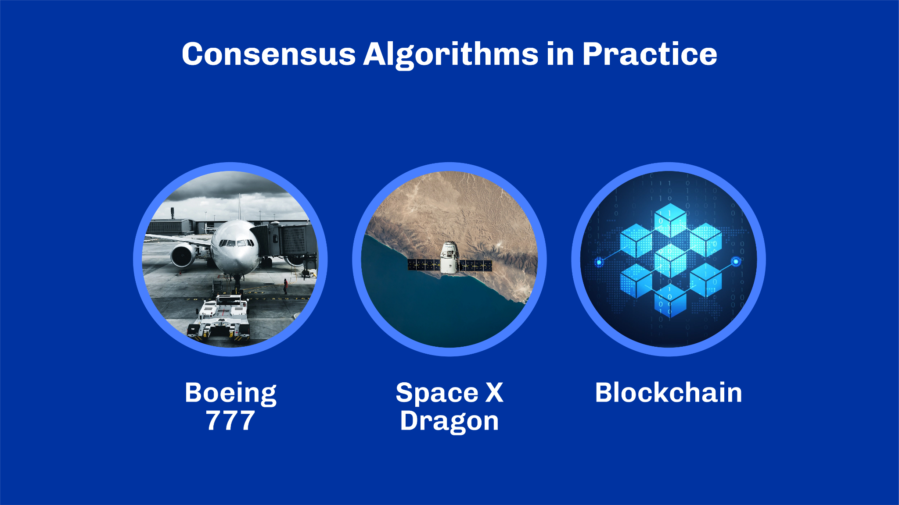
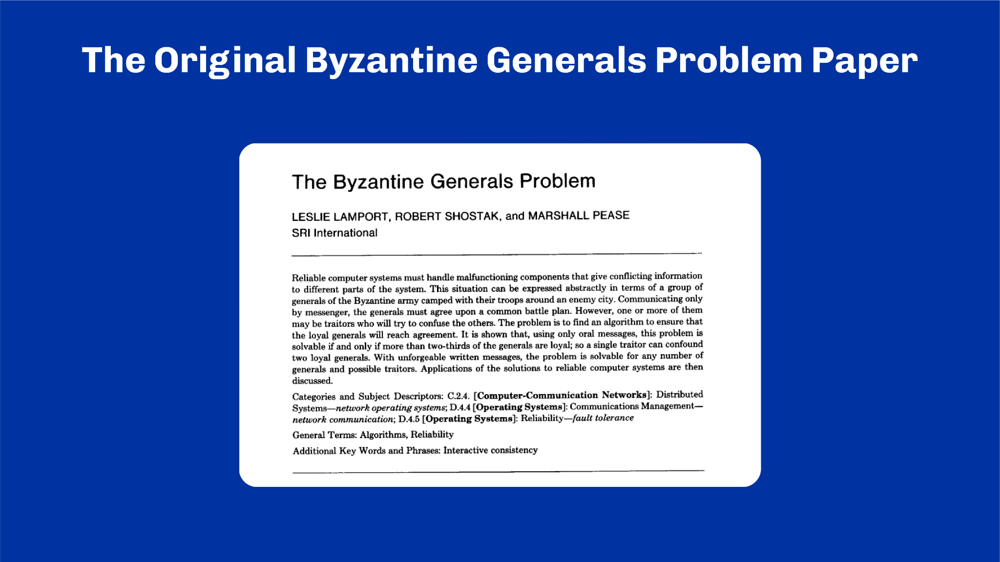
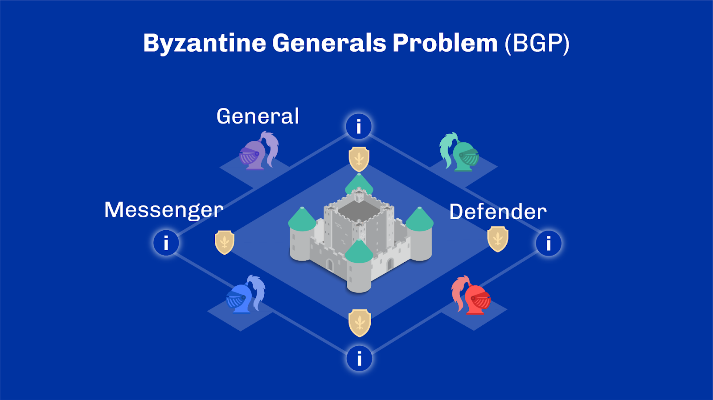
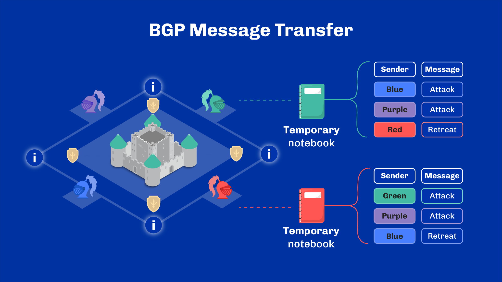
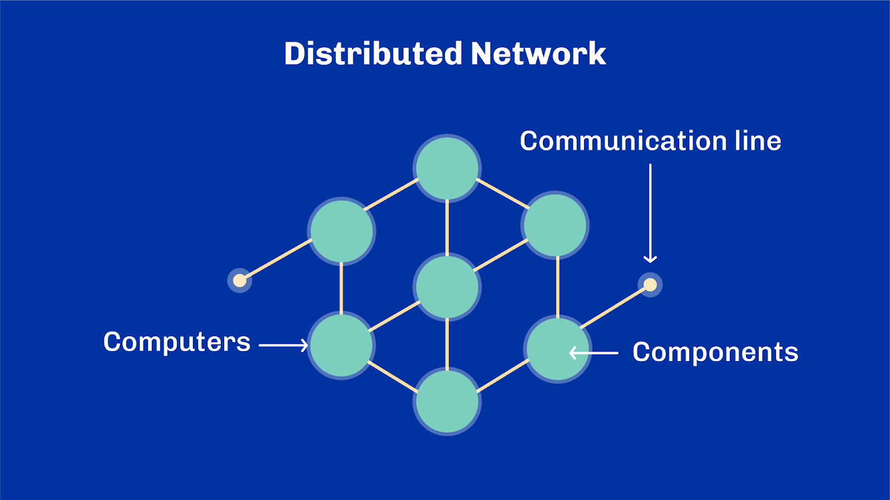
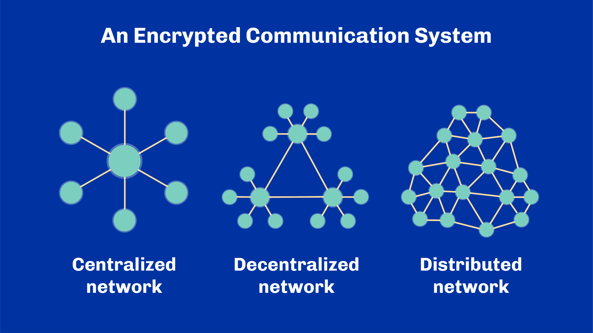
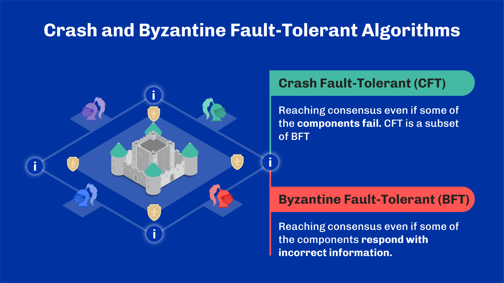
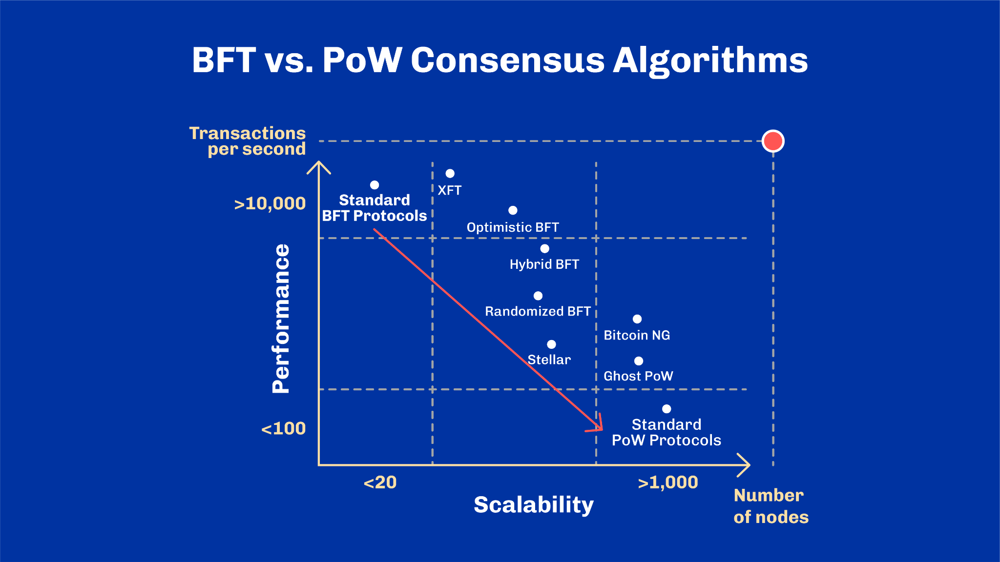

# 1 - General Introduction and Background

> [!NOTE]
>
> By the end of this unit, you should be able to:
>
> - [x] Describe decentralization and its importance
> - [x] Describe how consensus algorithms in a decentralized system provide a mechanism to reach agreement without a central authority
> - [x] Describe the decentralization challenges, such as scalability, throughput, and latency
> - [x] Summarize how Blockchain technology introduces a new consensus algorithm class contributing to the decentralization challenges.

## Introduction

Blockchain. A topic sparking interest, working its way into conversations with friends, social media, news media, and even public policy. But there’s also a lot of noise out there. Plenty of misinformation and misconception. Some people think blockchain is just about cryptocurrency or means the same thing as Bitcoin. Others believe it's slow, or implies a completely decentralized system. Blockchain goes far beyond finance and cryptocurrencies. It’s the technology for building decentralized applications – the foundation of the next Internet. And so, has the potential to help change the world for the better. By the end of this course, you’ll have gained a considerable understanding of what blockchain is, what it can do, and what better means. **Let’s get going**.

We will look at the current state of blockchain technology. We’ll get insight from the challenges that have been solved and insight from those ready to be solved. Subsequent modules will build upon your understanding from this unit. We’ll cover more complex topics, building your skill set, so that you can apply this new-found knowledge of blockchain technology.

Even if this is your first time encountering blockchain, some concepts will seem familiar, others will be new. It's important to keep in mind that technology is constantly evolving. Take your time, understand and absorb the fundamentals. Go back and review as needed. We'll be covering each topic step-by-step, with clear explanations and summaries at the end of each unit.

We’ll start with an introduction to consensus algorithms, the foundation for building decentralized applications.  . But first, let’s understand decentralization and consensus algorithms at a high level. Ready?

### Introduction to Decentralization

Fundamentally, blockchain is concerned with decentralization. It is an interconnected information system with no single entity as the central authority. For example, a financial  system without a central bank confirming transactions. Or a supply chain system where the network shares the supply and coordination activities - no central authority required.

Why is this important? Why do we need decentralized systems? Well, a central authority creates a single point of failure. If that entity crashes or misuses information, the whole system is compromised. Also, centralized systems are easy targets for hackers. An attacker understands that every centralized system has at least one weak point. Attackers can use that weakness to access an entire system or its most valuable components. For example, hacking the central servers of a bank can disrupt service for all its customers.

Decentralization distributes decision-making power across entities instead of a single authority. Consensus algorithms are the way those decisions are reached. Both  decentralization and consensus algorithms reduce the risk of a system being compromised while at the same time opening up a whole new set of use cases and possibilities.

## Table of Contents

Let’s look at consensus algorithms and the complex problems they try to solve. We will work through these through the lens of the Byzantine Generals Problem, or BGP, which examines the issues from different perspectives. We will also look at the challenges other network types face and discuss crash fault tolerance, Byzantine fault tolerance, and the concept of blockchain.

## Consensus Algorithms in Practice

The most critical element of blockchain technology is the consensus algorithm. Consensus algorithms provide a way for different components in a system to achieve agreement on a single data value without the need for a central authority.

Consensus algorithms come from the study of distributed systems in computer science and have a wide range of applications. They play a vital role in the complex flight control systems of Boeing 777. They are used in SpaceX Dragon spacecraft and, of course, in blockchain technology.

In a decentralized financial platform, say you deposit 20 euros in Germany. When you go on a trip to South Africa, you should be able to access that same 20 euros. Though these countries would have different servers and no central authority, they should agree that the 20 euros are available for withdrawal and that both servers have an identical copy of the data.

## The Original Byzantine General Problem Paper

But accomplishing this? Not so easy. Designing a consensus algorithm for a decentralized system is complex. Many different concerns must be addressed. In 1982, Lamport, Shostak, and Pease illuminated these concerns in a scientific paper called the Byzantine Generals Problem – also known as the BGP[^3].

## The Byzantine Generals Problem (BGP)

We are now in the time of the former Byzantine Empire, and a battle is raging. “Several divisions of the Byzantine army are camped outside the enemy city, each division commanded by its own general.” The generals plan to attack the city but lack a central command center to coordinate. They can only communicate with one another by messenger. To avoid complete failure, they must agree upon a concerted strategy: attack or retreat. If all generals attack simultaneously, they will win. However, if they attack at different times, they will lose.

## The Byzantine Generals Problem (BGP)

The generals need an algorithm they can follow to guarantee that all loyal generals decide upon the same plan of action. The agreement the generals reach is called consensus, and they reach it with a consensus algorithm.

However, some of the generals may be traitors working for the enemy. They may spread false information to prevent agreement on a common plan. Therefore, the loyal generals need an algorithm designed in such a way that consensus is achieved even if there are unreliable or traitorous generals.

Let’s imagine we’re on the battlefield with our generals. They have not yet planned a strategy nor agreed to attack or to retreat. They have, however, come up with a method by which they can reach consensus. Each general creates a ledger. Let’s call it a “temporary notebook”. The generals enter the details of their latest decisions. A messenger then relays these decisions to the other generals whenever a new decision is made. Also, whenever a general receives a new message from another general's messenger, they review the last few messages received immediately before the new one. The receiving general looks through the previous messages from all of the other generals, counting the number of attack and retreat decisions, and then updates his own “temporary notebook” with the majority decision based on their count.

The generals start making their individual decisions. Messengers run from camp to camp with updates. The generals use their “temporary notebooks” to keep track of the messengers and messages.

Multiple communication rounds have occurred and now each general has messages from all other generals. They each feel they have captured the latest decision of every other general in their notebooks. Looking back through their notebooks, they individually identify the majority decision. With this, consensus as to whether to attack or retreat has been reached, and therefore, a decision has been made. They then attack or retreat simultaneously. The generals then transfer this final decision to their own permanent ledger to serve as a historical record for the Byzantine Empire.

## Distributed Network

Consensus algorithms are a source of much discussion in the design of distributed and decentralized computer networks, especially in the blockchain domain. This diagram shows a distributed network containing components, computers, and communication channels. Components are located on different computers in a network and communicate by passing messages to one another via the communication channels. The objective of the communication is to achieve consensus or reach a common goal [^1] [^2].

The BGP is used in computer science to show the challenges in designing a distributed system. These include the need to maintain concurrency between network components which requires managing multiple computations simultaneously. Another challenge is synchronizing components and handling independent failures [^1]. Computers on distributed systems, called nodes, need to reach consensus despite the presence of dishonest or failed nodes. This challenge of synchronization and coordination has been driving research in consensus algorithms and helping to evolve blockchain. But what do we mean by network? And why does the distribution matter?

## Network Definition

A network is a system of linked nodes or computers that share resources such as storage, processing units, and communication channel bandwidth. These nodes can communicate with each other over digital interconnections to exchange files or messages using common communication protocols. The interconnections consist of cables, telephone lines, radio waves, satellites, or fiber optic cables. Each node can create, receive, or transmit information over a communication channel, or link, in the network.

## Network Types

Networks can be arranged in a number of ways. Generally, we can group the arrangement into three categories: centralized, decentralized, and distributed [^4]. These terms reference how a network is controlled and the allocation of resources across the network.

Note that network terms vary by context. In the blockchain industry, “centralized” and “decentralized” are commonly used to describe the social dynamics and relationships between entities. We will look at them in the academic sense.

Here, you can see how networks are arranged. There are nodes – which are computers – and communications channels between them. The nodes are distributed across the network and communicate with each other by passing messages through communications channels.

Let’s look at some properties of the different types of networks.

In centralized networks, one node controls all other nodes in the network. This central node controls the network resources and maintains full control over the entire network.

In a decentralized network, no single node controls the network. Each node can act as an independent server to form a single processing point.

While servers require some coordination, decentralized networks provide better tolerance to failures than centralized networks. Where different entities control entry points, they can even provide resilience in the decision-making process. This is because they prevent any single actor from making decisions on its own.

Most large video services, like YouTube or Netflix, are effectively decentralized networks, with servers in many regions having access to slightly different catalogs.

In a distributed network, nodes are all interconnected, with each node acting as both client and server. Together they form a gigantic computing grid. Adding new nodes increases the grid's resources, but there is no intrinsic difference between nodes; each is as capable as its neighbors in terms of computing resources and decision power.

Distributed networks are extremely resilient to faults but require much more complex coordination.

BitTorrent is a great example of a distributed protocol for file-sharing. Each node in the protocol can download pieces of data from peers and, at the same, serve as a source of information for other nodes.

A centralized network does not require consensus, as all nodes on the network follow the “orders” of the central node. Decentralized and distributed networks, however, require a consensus algorithm to maintain the integrity of the system. Now that we have a definition for a network let’s review the properties of a well-designed consensus algorithm.

## Liveness and Safety

Computer scientists have learned a lot from the Byzantine Generals Problem. They have developed many kinds of consensus algorithms as a result. We will review some of these in a later unit. For now, let’s just say that two important properties are key to designing a consensus algorithm. First, a consensus algorithm needs to continually make progress so that a decision can eventually be made.

Secondly, if, as in our BGP example, any two honest generals commit to a decision, they need to commit to the same decision. To put it in the network perspective, if two nodes in a distributed network commit to a decision, they both need to commit to the same decision. These two properties are called Liveness and Safety, respectively. Liveness refers to a decision that will eventually be made. And safety refers to the commitment to the same decision taken.

## Throughput, Latency, and Scalability

Let’s go back to our Byzantine generals. They have been considering using faster communication channels, such as smoke signals, to transfer messages. They want to reach a decision faster, increasing the rate at which decisions are made and even give messengers a well-earned break.

The decision rate, or transaction throughput, can be viewed as the rate at which a consensus algorithm delivers a decision. If the generals reach a decision within 10 minutes, the decision rate is one decision per ten minutes or 0.0016 decisions per second. Given that the generals share decisions on a mutual basis, we can also say they are transacting those decisions. As such, the decision rate is also the transaction throughput. In our example, the transaction throughput is then one transaction per ten minutes.

The idea of latency is related to throughput in a consensus algorithm. Using our BGP example, latency refers to the time spent from when a general first announces his strategy decision – called a proposal – to the time that a general makes the final decision. We will come back to this in a later unit.

The Byzantine emperor was impressed with how quickly the generals could reach a decision. In our example, the number of transactions per second, or TPS, was 0.0016 with four generals involved. The emperor decreed the Byzantine army to increase from four generals to forty. Could the same performance and TPS be maintained?

It could not. Using the same consensus algorithm and going from four to forty generals became unworkable. Why? Any communication channel has a limit, known as channel capacity. Imagine forty generals sending messages at the same time and a large number of messengers on the road. All this drives the channel to its full capacity leading to scalability issues.

## Crash Fault Tolerant and Byzantine Fault Tolerance

Now that we have introduced throughput and scalability concepts, let’s examine consensus algorithms from a fault-tolerant perspective. In our BGP example, the generals have identified new requirements for their algorithm. As competent as the generals may be, they are neither invincible nor infallible. The algorithm now needs to reach a decision while tolerating these two types of faults.

The first type assumes that even if a general is loyal, he is not always reliable. Perhaps his messengers get killed en route, or he is killed or incapacitated. Technically speaking, this is a crash. A consensus algorithm that can handle this type of scenario is called a Crash Fault-Tolerant consensus algorithm, or CFT.

The second type assumes that any general may betray loyal generals by disrupting communications. In this scenario, a traitorous general may want to retreat but sends a message of ‘attack’ instead. Doing so could result in the wrong agreement being reached. This is called a Byzantine failure. Technically then, when the nodes in a decentralized network fail to reach consensus, either due to an agreement not being reached or the wrong agreement being reached, it is a Byzantine failure. A consensus algorithm that can handle this type of scenario is known as a Byzantine Fault-Tolerant consensus algorithm, or BFT. Crash faults are a subset of Byzantine faults.

In real-world computer systems, the cause may not be so dramatic as a traitorous military leader. A bug or hardware malfunction can cause failure as much as a malicious attacker. Or really anything that prevents the nodes on the network from achieving consensus.

In any decentralized network, Byzantine failure is all but a certainty. Hardware does fail, there are bad actors, and things invariably go wrong. However, if and when this happens, it is not acceptable for the network to go down or stop working. The network must be resilient to these kinds of failures. A Byzantine Fault-Tolerant system can continue operating regardless of failure.

With that, it is time to travel from the Byzantine era to 2008, to the inception of blockchain.

## The Original Bitcoin Whitepaper

In October 2008, Satoshi Nakamoto published the original Bitcoin whitepaper: “Bitcoin: A Peer-to-Peer Electronic Cash System.” He proposed a solution for a decentralized currency system, resulting in a new class of protocols to address the BGP. These “proof-of-X” protocols – or PoX protocols – as they are known, began with the launch of the Bitcoin network in January 2009.

When the Bitcoin network launched, the world’s first public and permissionless blockchain went live. Permissionless means anybody can freely join or leave the network without any approval. It was not long before other PoX-based networks began to adopt, adapt, and build upon Bitcoin’s approach to the Byzantine Generals Problem, with other varieties of blockchain consensus protocols soon following.

## BFT vs. PoW Consensus Algorithm
Let’s look at the different consensus protocols on this chart, and give a small teaser to the challenges we’ll be discussing in a later unit.

On this chart, you can see a variety of consensus algorithms mapped out along the dimensions of performance and scalability. Performance is expressed in transactions per second, TPS, while scalability corresponds to the number of nodes.

As you can see, standard BFT or Byzantine Fault-Tolerant protocols provide very high throughput but work with only a small number of nodes [^5]. Conversely, the standard proof-of-work protocol used in the Bitcoin network can handle a large number of nodes, but throughput is low.

The holy grail is to increase the number on both dimensions, getting more nodes in the network as well as more transactions per second. We’ll be examining attempts to climb into the top right corner of this chart in the coming units. In particular, when we look into the evolution of blockchain from first to third generation along this core challenge of scalability. We will also discuss consensus algorithms in more detail in other units.

## Review

With that, we’ve come to the end of the first unit. Understanding these concepts gives a solid context for what comes next. Let’s quickly review what we have covered so far:

In this unit, we looked at the major differences between centralized, decentralized, and distributed networks. We also considered the Byzantine Generals Problem along with Byzantine Failures, Crash Fault Tolerance, and Byzantine Fault Tolerance. Finally, we have learned how Bitcoin and blockchain introduced a new class of consensus protocols, proof-of-X, or PoX, protocols, enabling consensus to be achieved at a larger scale in a decentralized network.

And with that, we will see you in the next unit!

## Questions

### Why is decentralization important in public permissionless ledgers?

1. It eliminates the need for consensus algorithms
1. It reduces the risk of system compromise
1. It limits the number of entities with decision-making power

See correct answer

2. It reduces the risk of system compromise

### Decentralization reduces risk in a system by...

1. Distributing decision-making power instead of having a single point of failure
1. Requiring a central authority to oversee decision-making
1. Eliminating the need for consensus algorithms and enabling faster decision-making

See correct answer

1. Distributing decision-making power instead of having a single point of failure

### What’s a common example used to illustrate challenges related to consensus algorithms?

1. Byzantine Generic Problem
1. Byzantine Generals Problem
1. Byzantine Army Problem
1. Byzantine Fault-Tolerant

See correct answer

2. Byzantine Generals Problem

### What is the role of consensus algorithms in blockchain technology?

1. They provide a way for different components to achieve agreement.
1. They encrypt information to ensure privacy of all users.
1. They eliminate the need for data replication across multiple servers.

See correct answer

2. They provide a way for different components to achieve agreement.

### In a typical blockchain:*

1. Decisions are made by an elected leading authority
1. Decisions are made at random
1. There’s no decision to be made
1. Decisions are reached through a consensus algorithm.

See correct answer

4. Decisions are reached through a consensus algorithm.

### Why is the distribution of components important in a distributed system?

1. Distribution ensures that all components operate at the same speed and efficiently.
1. Distribution ensures better resilience of the system to faults.
1. Distribution eliminates the need for synchronization and coordination among components.

See correct answer

2. Distribution ensures better resilience of the system to faults.

### A network is a system of interconnected nodes that share resources such as storage, processing units, and communication channel bandwidth.

1. True
1. False

See correct answer

1. True

### Generally, the arrangement of networks can be grouped into three categories. Please select all that apply:

- [ ] Centralized
- [ ] Communication channels
- [ ] Decentralized
- [ ] Distributed
- [ ] Components

See correct answer

- [x] Centralized
- [x] Decentralized
- [x] Distributed

### Select two correct statements about different network types.

1. Decentralized networks provide better tolerance to failures.
1. In centralized networks, no single node controls the network.
1. Distributed networks are the least resilient to faults.
1. A centralized network does not require consensus.

See correct answer

1. Decentralized networks provide better tolerance to failures.
4. A centralized network does not require consensus.

### A decentralized network does not require consensus, as all nodes on the network follow the directions of the central node.

1. True
1. False

See correct answer

2. False

### Select the correct statement about throughput, latency and scalability.

1. Scalability refers to maintaining less throughput as the number of nodes in a network increases.
1. Latency is the delay in a node coming online.
1. Throughput is the rate a consensus algorithm delivers a decision.

See correct answer

3. Throughput is the rate a consensus algorithm delivers a decision.

### Security is an important property when designing a consensus algorithm. It refers to a decision that will eventually be made.

1. True
1. False

See correct answer

2. False

### Select the two correct statements about Crash Fault Tolerant (CFT) and Byzantine Fault Tolerance (BFT).

- [ ] A CFT consensus algorithm can handle scenarios where a general is not always reliable.
- [ ] The term for when a loyal general communicates is called a Byzantine failure.
- [ ] A BFT consensus algorithm is designed to handle scenarios where any general may betray loyal generals by disrupting communications.
- [ ] A BFT system cannot continue operating after a failure.

See correct answer

- [x] A CFT consensus algorithm can handle scenarios where a general is not always reliable.
- [x] A BFT consensus algorithm is designed to handle scenarios where any general may betray loyal generals by disrupting communications.

### Which two of the following options demonstrate why Byzantine Fault-Tolerant consensus algorithms are important?

- [ ] They allow the network to continue operating even if some of the nodes fail.
- [ ] They allow the network to continue operating even if some of the nodes act maliciously.
- [ ] It allows the network to continue scaling even if there are no nodes online.
- [ ] It allows the creation of the network even if there are no nodes online.

See correct answer

- [x] They allow the network to continue operating even if some of the nodes fail.
- [x] They allow the network to continue operating even if some of the nodes act maliciously.

### What is the significance of the Bitcoin network's launch in January 2009?

1. It marked the first time a country had issued a digital currency
1. It established the first global network for sharing music files
1. It introduced the first online platform for stock trading
1. It established the first public and permissionless blockchain

See correct answer

4. It established the first public and permissionless blockchain

## References

[^1]: Van Steen, M. and Tanenbaum, A., “Distributed systems.” Leiden, The Netherlands: Maarten van Steen, 2017.
[^2]: Apt, Krzysztof R., Ernst-Rüdiger Olderog, and K. R. Apt., “Verification of sequential and concurrent programs.” Chapter 11: Distributed Programs, London: Springer, 2009.
[^3]: Lamport, L.; Shostak, R.; Pease, M., "The Byzantine Generals Problem." ACM Transactions on Programming Languages and Systems. 4 (3): 382–401. July 1982.
[^4]: Baran, P., "On Distributed Communications Networks." IEEE Transactions on Communications Systems, vol. 12, no. 1, pp. 1-9, March 1964.
[^5]: Vukolić, M. “The Quest for Scalable Blockchain Fabric: Proof-of-Work vs. BFT Replication.” International workshop on open problems in network security, pp. 112-125. Springer, Cham, 2015.
