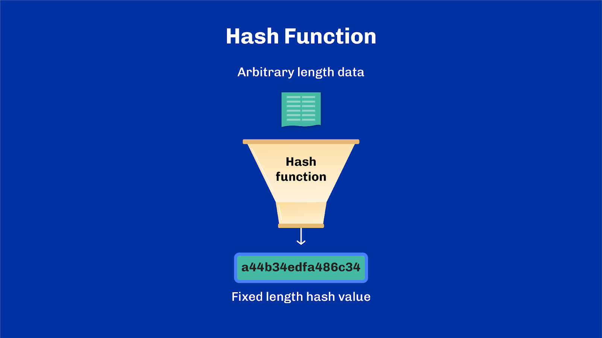
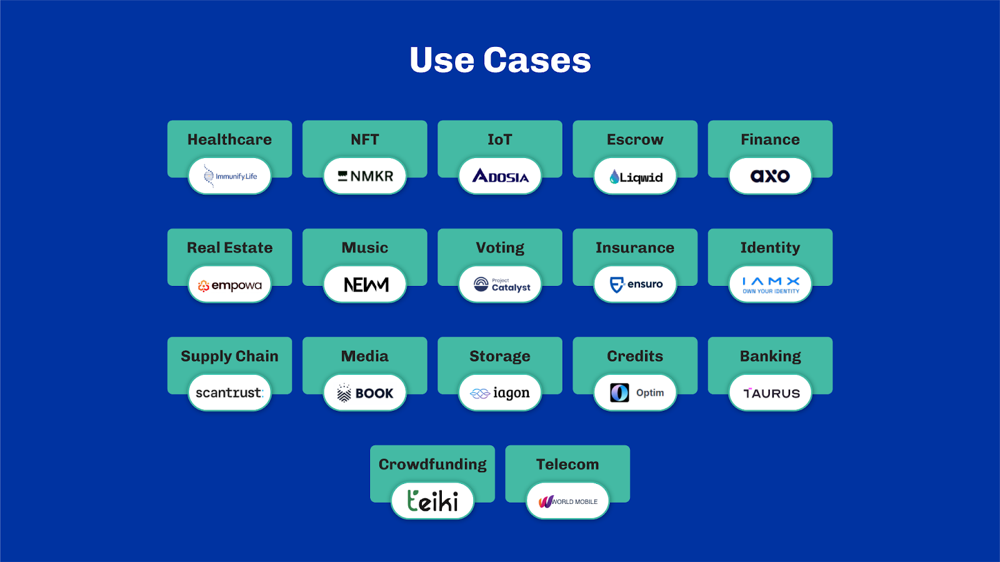
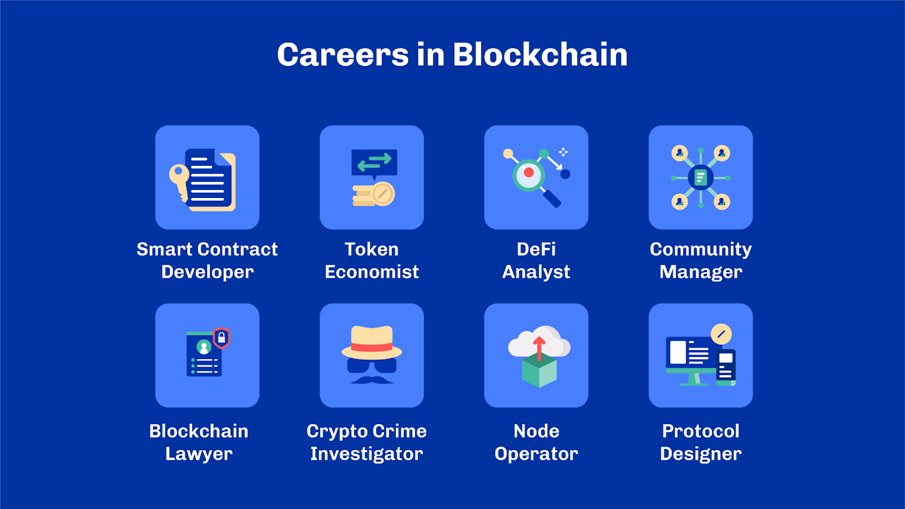

# 2 - What is Blockchain

> [!NOTE]
>
> By the end of this unit, you should be able to:
>
> - [x] Give a high-level definition of what blockchain is
> - [x] Understand the main components of a typical blockchain network
> - [x] Understand a simple blockchain data structure
> - [x] Learn the use cases of blockchain technology and how it helps different industries
> - [x] Learn about career opportunities in blockchain

## Introduction

Previously, we talked about consensus algorithms. These help distributed networks reach agreement without a central authority. Now we will learn about blockchain and who participates in it. We’ll also touch on some use cases. We have plenty to cover, so let’s get started!

## The First Message from Satoshi

In 2008, Satoshi Nakamoto introduced blockchain technology [^1]. The publication of the Bitcoin whitepaper describing a peer-to-peer electronic cash system kicked off a whole new era of blockchain technology and digital currencies. The key innovation was a new mechanism allowing users in a network to reach agreement on various decisions without a central manager or controlling entity. The way the agreement is reached is called a consensus algorithm. Bitcoin introduced the proof-of-work consensus algorithm.

Satoshi wasn’t the first to propose a digital currency by any means. In 1998, Nick Szabo proposed Bit Gold, but it was never implemented. Bitcoin was – in 2009. It became the first successful attempt to create a decentralized digital currency. It’s widely considered a true financial innovation.

Others quickly started building on the ideas introduced by Bitcoin. Blockchain technology provides an opportunity to decentralize many applications across industries like insurance, banking, logistics, supply chain management, agriculture, and more.

Some still associate blockchain with Bitcoin, but blockchain technology isn’t Bitcoin, and there have been many successful innovations, like Cardano and Ethereum.

## Main Components of a Blockchain

What exactly is a blockchain? It allows users to send and receive digital assets securely and transparently without needing a central authority or intermediary. It achieves this by having a copy of all transactions, or ledger, duplicated and distributed across a network of computer nodes. These nodes work to reach agreement, and keep in sync using a consensus mechanism. This set of interconnected nodes stores data or items of value in blocks, where each block is tied to the previous, resulting in a chain of blocks. That’s how we get the name blockchain.

Blockchain technology, also referred to as Distributed Ledger Technology, or DLT, provides a decentralized and accessible data structure for conducting many kinds of transactions, ranging from financial payments to information exchange, from commerce to Internet of Things. [^2].

As shown on the diagram, blockchain technology consists of several components. It generally includes network nodes, a peer-to-peer network, a consensus algorithm, and a chain of blocks that form the decentralized ledger.

In a blockchain network, nodes are users who submit transactions and block producers who create blocks for the chain. These transactions and blocks are transmitted through the peer-to-peer, or P2P, network.

A true P2P network has a distributed structure, meaning there is no central node. All nodes are equal, with no special privileges, and they communicate with each other to share and exchange information.

A consensus algorithm is necessary for the different block producers to reach agreement when creating a new block to add to the chain. The consensus algorithm used in the Bitcoin network is called proof of work. We’ll cover this in more detail in another unit.

## Data Structure of a Blockchain

Let’s dive into the different components of a blockchain, starting with blocks.
Blocks contain verified transactions linked to each other in a chain in chronological order. Transactions cannot be altered; they become permanently inscribed in the block. This is an important blockchain feature in that it stores records immutably, meaning they cannot be changed, forged, or even deleted, as this would break the chain of blocks.

Each block has a header and a body.

The block body contains transaction data. A transaction might be a financial payment sending a digital asset from one user to another, or a supply chain transaction of a product being shipped from one facility to another. Typically, a block contains multiple transactions.

The block header contains its time stamp and a hash–proof of everything contained in the block body as well as the hash of the previous block.

## Hash Function

Let’s start with that hash in the block header. What is it?

A hash function is used to obtain a compact representation of some piece of data – a block for example. It takes an input and returns a fixed-size output called a hash digest. It’s a one-way mathematical function. It can’t be reversed, meaning the original input can’t be derived from the hash. You can think of hashes as a way to ‘compress’ data.

Any changes to the original input will be reflected in a completely different hash output. We’ll explore hashing in greater depth in the following units.

## How Are Blocks Chained Together

Let's go back to our earlier diagram of the blockchain structure and see how those blocks are chained together. Any ideas?

If your answer was ‘the hash of the previous block’, you’re correct. Every block in the blockchain contains the hash value of the previous block. This hash then becomes a part of the hash of the next block, which becomes a part of the next block, and so on. It is this hashing of hashes that chains the blocks together.

If someone attempts to make a change to a block, its hash changes. Because that hash is in the next blocks, all subsequent blocks change too. If the hash changes, the network will reject the change.

And with that, we’ve reached the first milestone in your blockchain journey: getting a high-level understanding of what blocks are and how they’re chained together. Congratulations. If you need to review any of the concepts covered, just pause the video, go back, and continue whenever you’re ready.

**Shall we go on?**

## Use Cases

Let’s briefly discuss use cases.

Blockchain builds trust into network nodes through its consensus algorithm, empowering designers and innovators to rethink applications that no longer use a central authority.  Decentralized, distributed networks have the potential to change how we interact with existing societal organizations like banks, businesses, and the government.

There are use cases like enabling peer-to-peer currency transactions in finance, improving supply chain management and logistics tracking, managing identity, verifying and authenticating digital assets, and even facilitating eVoting and elections.

In finance, for instance, blockchain allows for true peer-to-peer currency to function without commercial banks involved. Removing intermediaries has profound implications for the future of money. The societal impact has the potential to change traditional power structures, leading to new forms of social and economic organization.

One organizational structure that can exist on a blockchain is called a DAO, or Decentralized Autonomous Organization. DAOs have the potential to change how we think of organizations like companies. And these are just a few examples of the numerous potential uses for blockchain.

## Careers in Blockchain

Blockchain technology has created, and will continue to create many jobs in the industry. Traditional roles in analysis, coding, economics and security can transfer to blockchain with upskilling. The titles may just change to smart contract developer, token economist, DeFi analyst, and so on. Technical and non-technical skills along with a burning curiosity can bring success in this rapidly evolving industry.

Blockchain is also driving research and development in many areas of science from cryptography to compliance. There has been significant progress in consensus algorithms, multi-party computation, and programming languages, for example.

## Review

So here we are, at the end of this unit, covering the basics of blockchain.
We looked at a blockchain's main components, block creation, and block data. We looked at the importance of the hash mechanism, and how this effectively allows to create ‘a chain of blocks’.

That’s it for now, and I will see you next time.

## Questions

### Blockchains need consensus algorithms. In a blockchain, consensus algorithms...

1. force all participants to agree.
1. allow participants to reach a decision without a central authority.
1. allow participants to reach a decision with the help of a central authority.
1. expel malicious or faulty participants.

See correct answer

2. allow participants to reach a decision without a central authority.

### In a typical blockchain...

1. decisions are made by an elected leading authority.
1. decisions are made at random.
1. there’s no decision to be made.
1. decisions are reached through a consensus algorithm.

See correct answer

4. decisions are reached through a consensus algorithm.

### Which of the following is not a fundamental component of blockchain technology?

1. Network nodes.
1. A peer-to-peer network.
1. A consensus algorithm.
1. A decentralized autonomous organization.
1. A chain of blocks that form the distributed ledger.

See correct answer

4. A decentralized autonomous organization (CORRECT ANSWER)**

### Which of the following better describes blockchain technology?

1. Internet of things (IoT).
1. Artificial intelligence (AI).
1. Distributed ledger technology (DLT).
1. Decentralized finance (DeFi).

See correct answer

3. Distributed ledger technology (DLT)

### A blockchain allows users to send and receive digital assets securely and without needing a central authority or intermediary.

1. True.
1. False.

See correct answer

1. True.

### Examine the image below and select the correct labels.

1.   | A                    | B                    | C               |
     | ---                  | ---                  | ---             |
     | Encryption Algorithm | Communicator         | Network Nodes   |
2.   | A                    | B                    | C               |
     | ---                  | ---                  | ---             |
     | Consensus Algorithm  | Block Producer       | Chain of Blocks |
3.   | A                    | B                    | C               |
     | ---                  | ---                  | ---             |
     | Block Producer       | Encryption Algorithm | Chain of Blocks |

See correct answer

2.   | A                   | B              | C               |
     | ---                 | ---            | ---             |
     | Consensus Algorithm | Block Producer | Chain of Blocks |

### In blockchain, each block has a header and a body. Generally speaking, what’s part of the header?

1. Time stamp and transaction data.
1. Hash of previous block and transaction data.
1. Hash of previous block and time stamp.
1. Hash of previous block, time stamp, transaction data.

See correct answer

3. Hash of previous block and time stamp.

### A block header contains complete transaction data.

1. True.
1. False.

See correct answer

1. False.

### A hash function produces a fingerprint of data, creating an output for a given input. Select the correct one.

1. A hash function creates a fixed-size output.
1. The size of the output depends on the input.
1. Each system decides if the length of the output is fixed or not.
1. The size of the output is dynamic.

See correct answer

1. A hash function creates a fixed-size output.

### What maintains the integrity of a blockchain?

1. Each block has a unique, independent identifier.
1. Each block contains the next block's hash.
1. Each block includes the previous block's hash.
1. Each change in a block only impacts that block's hash.

See correct answer

3. Each block includes the previous block's hash.

### Select the image that shows the correct data structure of a block.

| 1   | 2   | 3   |
| --- | --- | --- |
|  |  |  |

See correct answer

| 3                                                                                                                                      |
| ---                                                                                                                                    |
|  |

### What links blocks together?

1. The hash of the previous block.
1. The date when the new block was created.
1. The time stamp of all blocks.
1. The transaction data ID.

See correct answer

1. The hash of the previous block.

## References

[^1]: S. Nakamoto, “Bitcoin: A Peer-to-Peer Electronic Cash System”, 2008, Available: https://bitcoin.org/bitcoin.pdf, Accessed: 20 Aug 2022.
[^2]: “What is a blockchain?”, Available: https://docs.cardano.org/new-to-cardano/what-is-a-blockchain, Accessed: 20 Aug 2022.
