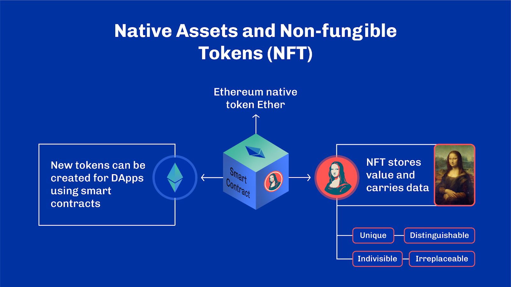
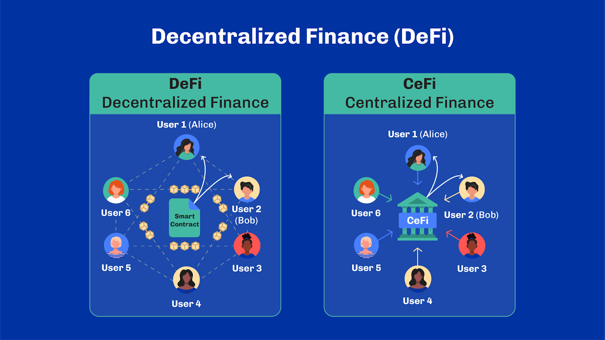
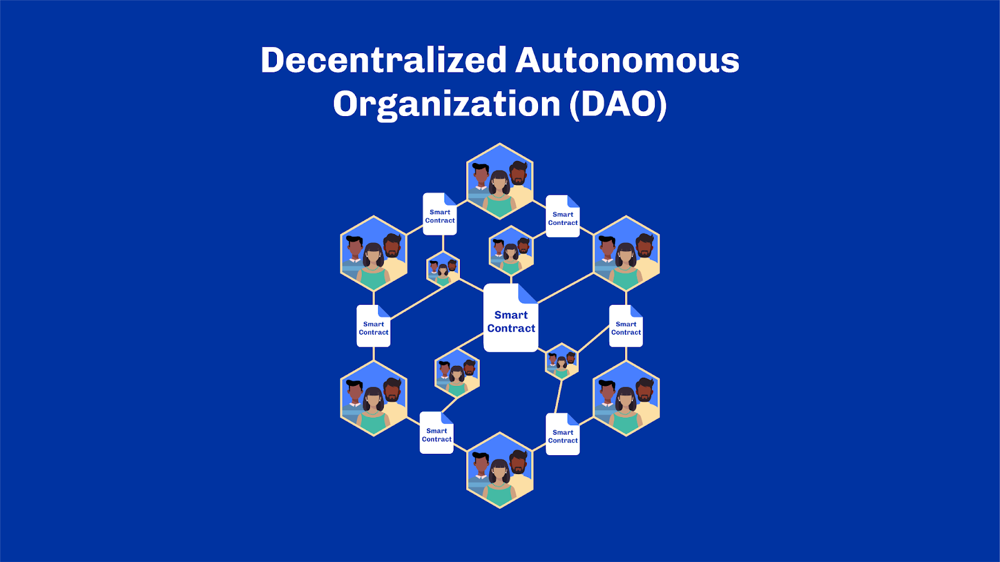
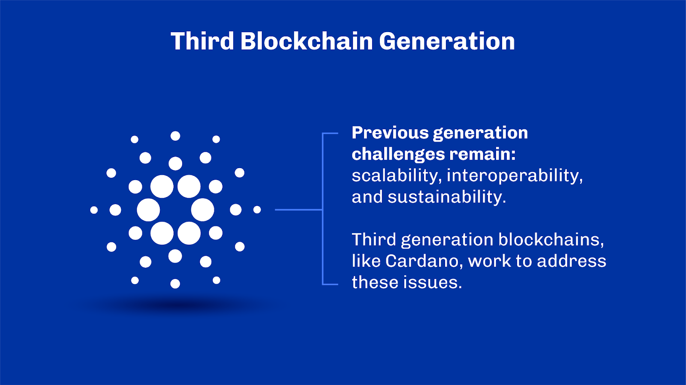
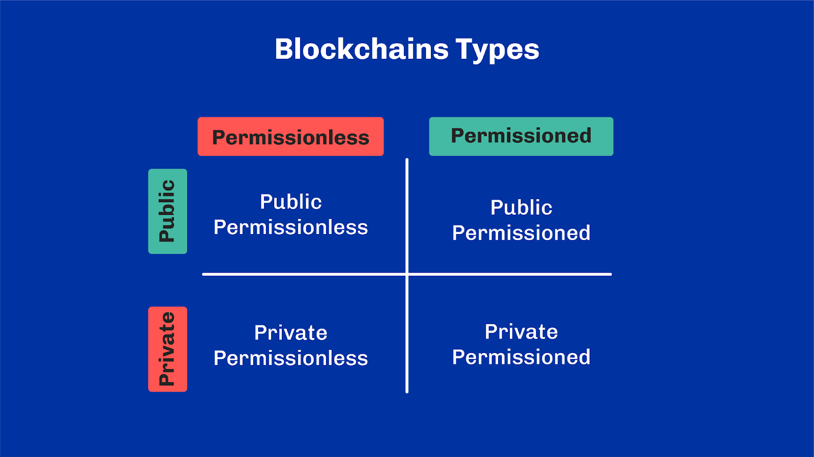
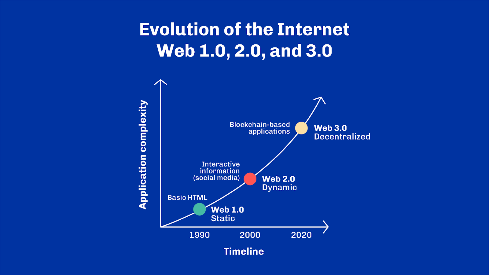

# 3 - Blockchain Generations

> [!NOTE]
>
> By the end of this unit, you should be able to:
>
> - [x] Describe and compare three blockchain generations
> - [x] Define and compare native assets and Non-fungible Tokens
> - [x] Summarize the blockchain trilemma and layer 1 and layer 2 scalability solutions

## Introduction

January 3, 2009. The first block of Bitcoin is mined by Satoshi Nakamoto at 6:15 pm. Since that genesis moment, much has changed. Three generations of blockchain have since evolved into networks like Cardano, influencing web technology and the future of the web.

In this unit, we explore the evolution of blockchain starting with Bitcoin, and then Ethereum with its innovations such as smart contracts. We’ll look at how third generation blockchains like Cardano address scalability challenges in the Blockchain Trilemma.

We have a lot to cover, so let’s get started!

## First Blockchain Generation

Before blockchain, to transfer assets between two people they needed to either trust each other or have a middleman, like a bank. But with the creation of Bitcoin, using blockchain technology, it became possible to move money quickly and easily without the need for that middleman. The removal of intermediaries represents a monumental change in how and who interacts with money.

The first-ever exchange of Bitcoin for physical goods was for pizza. In May 2010, a programmer from Florida in the USA, Laszlo Hanyecz, successfully traded 10,000 Bitcoins for two pizzas from Papa John’s. They were sold to him by a 19-year-old named Jeremy Sturdivant who, in exchange for the tokens, called in the order. This simple exchange would go down in history as the first-ever exchange of Bitcoin for physical goods, and probably the most expensive pizza in history.

Bitcoin demonstrated that anyone could send money, as bitcoin, through a decentralized network without intermediaries. However, its use was limited.

## Second Blockchain Generation;  Ethereum, the World Computer

Ethereum, launched in August 2014, marked the beginning of the second era in blockchain technology. The core idea? A global computer where applications could run securely with low risk of downtime, fraud, third-party interference, or failure. Additionally, Ethereum empowered developers to create new types of tokens and applications. Due to its blockchain design, the code in Ethereum is transparent and auditable. [^1]

## 6 Principles

Six principles guide the development and implementation of Ethereum. These are atomicity, synchrony, provenance, permanence, immortality, and immutability.

**Atomicity** means the application code will not run partially. Either an entire set of instructions is executed, or none at all. This guarantees the consistency of the system’s state. An atomic sequence of operations ensures that if a fault occurs anywhere in the sequence, the state of the system doesn’t change – as if no operations at all were even done in the first place. The only way to modify the state of the system is by performing the entire sequence.

**Synchrony** means that applications do not interfere with each other ensuring that all nodes in the network reach the same state simultaneously. In practice, this means that applications can rely on regular checkpoints that provide a view of the system which can be considered the same for all nodes of the system.

**Provenance** is the ability to inspect transactions submitted to the blockchain network to identify the originator. This ensures that digital assets have a clear chain of custody. From an application standpoint, it means that one can trace back any event that led to any state of the system and that every execution path is verifiable.

**Permanence** means data is permanently stored offline. So even in the case where there would be a power outage and the entire network would go down, the history is preserved and can be retrieved.

**Immortality** captures how a blockchain operates irrespective of any central supervision. Programs deployed on the Ethereum blockchain cannot be removed or shut down by an external system administrator making them resistant to censorship and ensuring the long-term viability of the network.

And finally, **immutability**, meaning the program code, or its outcomes, can never be changed or deleted [^2].

## Smart Contracts
A key innovation of Ethereum is the smart contract. A smart contract is a program stored on a blockchain. It has a set of rules and conditions that capture a procedure to execute when activated – without the need for intermediaries. Use cases like managing financial transactions, contracts between two parties, token exchanges, workflows, and decentralized applications abound. The code in a smart contract is publicly available and can be audited for security, providing an additional layer of trust and accountability. Deployed smart contracts cannot be deleted by default, and interactions with them are irreversible.

Nick Szabo conceptualized smart contracts in 1997, and Ethereum implemented the Solidity programming language to develop smart contracts within the blockchain domain.

A smart contract follows an “if this, then that” logic with the ‘this’ and the ‘that’ defined by the smart contract creator. Decentralized applications or DApps, can be created by combining smart contracts with a front-end user interface. There are many use cases and examples of DApps, like Compound for lending and borrowing or Filecoin for storage.

## Native Assets and Non-Fungible Tokens

In blockchain, tokens are digital assets that give the holder the right to perform certain actions. Each blockchain has its own native token, designed to work directly with the blockchain's functionality. For example, Cardano has "ada," Ethereum has "ether," and Bitcoin has the bitcoin token. These tokens serve multiple purposes. They can represent ownership of an asset or hold voting rights for example, as well as being a medium of exchange and store of value. In other words, a cryptocurrency – with monetary value and that can be traded or used in transactions.

Some blockchains, like Ethereum, allow for the creation of other tokens through smart contracts. These tokens, created for specific use within DApps, have value based on user demand. Unlike native tokens, they don't have real-world value and are not always interchangeable.

Another type of token in blockchain is the non-fungible token or NFT. An NFT is a digital asset that represents ownership of a unique item, like an artwork or collectable, which cannot be divided or exchanged for other tokens of the same type. Contrast with a one-dollar bill which is fungible so can be exchanged with any other dollar. NFTs carry data and value and are a verifiable digital representation of ownership for a specific item, with its value based on scarcity, uniqueness, and the data it holds, like recorded copyright.

The process for creating tokens varies by blockchain. This will be covered in more detail in a future module.

## Decentralized Finance (DeFi)

Ethereum provides a way to create decentralized finance applications, known as DeFI. DeFi are financial services that enable trading, lending, fundraising, and investing without traditional intermediaries like banks. DeFi transactions are conducted directly on the blockchain, making them faster and more accessible to people everywhere.

In conventional finance, banks and other intermediaries play a central role in moving money and processing transactions. This can make financial services slow, expensive, and inaccessible, particularly for people in some parts of the world. A loan approval process, for example, may take

several days. When traveling, customers may be charged higher fees or restricted from accessing a bank's services. In many countries, some may not have any access to banking at all.

DeFi aims to solve these problems by reducing the role of intermediaries and making financial services more accessible to anyone, anywhere. DeFi aims to replicate financial services in a more open and transparent way than traditional finance. Services are not managed by any central authority. Instead, parties use smart contracts to establish and execute financial agreements. By using different models than traditional organizations, it allows people to conduct financial transactions without needing trusted third parties, at a lower cost, and faster pace. DeFi challenges how we think about finance with new products and decentralized exchanges. For example, money could be borrowed from multiple parties in a peer-to-peer network, using smart contracts to agree on flexible terms and tokenizing real-world collateral. Using blockchain-based borrowing platforms can mean lower interest rates than traditional banks, as well as faster transaction times and a more transparent process.

## Decentralized Autonomous Organization (DAO)

Blockchain technology has the potential to revolutionize how we interact with organizations.

The idea of an entity where the rules and decisions are transparent and maintained on the blockchain opens up the possibility of new ways to manage important functions across society. The benefits can improve trust and engagement in governance, finance, education, and healthcare where there is full visibility of transactions, decisions, and history.

On blockchain, this is called a DAO or Decentralized Autonomous Organization. The idea of managing and running organizations where decision-making and rule-making are transparent, executed by code, and not controlled by any central authority came from Ethereum.

In traditional organizations, there is often a moral hazard where the self-interest of one entity, like a majority shareholder, can dominate decision-making at the expense of others. For example, prioritizing short-term gains over long-term stability for the purpose of improving stock value, or ignoring ethical considerations to reduce costs in pursuit of profit.  DAOs can mitigate this problem by using blockchain technology to maintain program rules and transaction records, thus improving transparency and accountability.

The concept began with the DAO project on Ethereum, which aimed to be the first venture capital fund based on smart contracts without conventional management structure. However, the DAO was hacked in 2016, resulting in the loss of a third of the fund. This brought to light the security risks involved in DAOs and kicked off significant improvements in security, regulatory clarity, smart contract auditing, best practices, and education. While not immune to security risks and vulnerabilities, the benefits of DAOs still stand.

Compared to traditional organizations, DAOs have the potential to be more efficient and require fewer management layers. This can save money and reduce the risk of human error and bias. Engagement can improve too with greater transparency and accountability. However, it is crucial for the code used in DAOs to be properly audited and secured. DAOs continue to be the governing bodies of many DeFi applications.

## Third Blockchain Generation

That sums up the second generation of blockchain technology and the great contributions made advancing blockchain. However, significant challenges remain: scalability, interoperability, and sustainability. Third-generation blockchains, like Cardano, work to address these issues. But how are they working to solve them? To answer this, let’s go back to the 1980s.

## The Blockchain Trilemma

Eric Brewer, a computer scientist, proposed a theory that in a distributed data network, you can only achieve two out of three properties at the same time: consistency, availability, or partition tolerance. He called this the CAP theorem.

Fast forward to today, Eric’s idea has evolved into the Blockchain Trilemma, a phrase coined by Ethereum Co-Founder Vitalik Buterin. It states that it is impossible to build and operate a blockchain protocol which is entirely decentralized, scalable, and secure. In other words, public blockchains must make trade-offs between security, decentralization, and scalability. It is a known challenge in the technology's adoption, but there is no scientific law that prohibits all three aspects from being achieved simultaneously. The goal of the third generation is to work to solve these issues so that the full promise of blockchain can be made available to all.

## Scalability, Decentralization, and Security

Let’s break down the blockchain trilemma:

On one side is scalability. This is the ability to consistently process transactions at a given rate even as the number of transactions increases.

On another is decentralization. Ensuring the blockchain is not reliant on any central point of control and that the distribution of network nodes keeps it decentralized.

Lastly, security: Operate as expected, defend from attacks, be resilient; to bugs, hardware failures – any unforeseen vulnerability.

## Cardano Native Token

Third-generation blockchains have looked to introduce ways of maintaining or increasing security without compromising scalability and decentralization. Cardano, for instance, does this in multiple ways. Let’s take a quick look at how Cardano addresses one aspect of security – inherited security in tokens, compared with Ethereum.

In Ethereum, new tokens can be created using smart contracts. The programmability feature of Ethereum tokens makes them very flexible. However, this approach is less secure than it should be because it operates as a program on top of the Ethereum protocol, not part of the core protocol.

Cardano takes a different approach. Cardano’s native token is ada and, like in Ethereum, users can create other kinds of tokens. But here’s where it differs. In Cardano,  developer-defined tokens inherit the same security properties as ada. This is built into the protocol. The security properties are not derived from a smart contract as in Ethereum. This could open up the possibility of security flaws. Cardano tokens, even if developer-derived, are called and treated as native tokens because they are built into the protocol itself.

Having native tokens also reduces computing resources that are needed to transact assets on the network. It is still possible to have smart contracts enforce some rules, but it is by no means a requirement. Many different types of assets can even be exchanged at once in a single transaction. All of this together adds efficiency, and also helps to scale the network down the line.

## Consensus Protocol Improvement

Now, in addition to security, scalability, and decentralization, third generation blockchains also require interoperability and sustainability. Interoperability is the ability to easily transfer value from one blockchain to another.

Sustainability refers to the ability of a blockchain to maintain itself and operate in an environmentally responsible manner. The energy consumption of blockchain technology has been a topic of debate, with different perspectives on its impact. Some third-generation blockchains, like Cardano, are dedicated to promoting sustainability and have incorporated it into their development strategy. One way this is being achieved is by using alternative consensus mechanisms like proof of stake.

Unlike proof of work, proof-of-stake mechanisms do not rely on computational effort to achieve consensus, and thus require less energy consumption. We will explore proof of work and proof of stake consensus algorithms in more detail in the coming units, along with other consensus mechanisms.

## Blockchain Layers

Blockchain architecture is generally divided into layers. Layer 1 is the blockchain itself - the base network. Layer 2 refers to the structures built upon the base layer. Layer 2 solutions are designed to improve scalability and efficiency. However, blockchain scalability solutions are being developed for both layer 1 and layer 2.

The key idea behind layer 2 solutions is that they do not need to rely on the underlying blockchain protocol when processing transactions. Lightning Network in Bitcoin, Arbitrum, Optimism or ZkSync projects in Ethereum, and Hydra in Cardano are all layer 2 solutions. We will dive into both layer 1 and layer 2 solutions in later units.

## Blockchain Types

As blockchain technology has evolved, so have the ledgers used in blockchains. Ledgers are systems for keeping records and have been used for centuries in important practices such as trading, accounting, legal, and governance.

There are two main types of ledgers: public and private. Public ledgers are open for anyone to view and can be used for references in various fields such as commodity prices, land registries, and company registries. Private ledgers, however, are only accessible by designated individuals and often contain sensitive data.

In blockchain technology, there are also public and private blockchains. Public blockchains are open to anyone, while private blockchains can only be accessed by authorized users of a particular entity.

There's also the distinction between permissionless and permissioned blockchains. In permissionless blockchains, users can participate without any credentials, but in permissioned blockchains, even if they are public, users must have credentials to participate and access is restricted.

So we can categorize blockchain types this way:

- Public, permissionless
- Public, permissioned
- Private, permissionless
- Private, permissioned

As shown in the diagram, a permissionless blockchain operates with anonymous participants, no central authority, and is trustless. Compare with a permissioned blockchain which is not anonymous, managed by a set of authorities, and provides trust to a limited extent through these authorities

|       | Permissionless | Permissioned     |
| :---        |    :----   |         :--- |
| Description      | Permission is not required to join the network and participate in the consensus algorithm. | Permission is required to join the network and participate in the consensus algorithm.   |
| Properties   | - Anonymous participants  - No central authority  - Trustless  | - No anonymous participants  - No single authority, but a group of authorities  - The authorities provides some level of trust     |
| Market type   | Consumer-to-Consumer   | Business-to-Consumer     |
| Advantages   | - Fully decentralized  - Accessible transactions   | - Energy efficient  - High transaction speed     |
| Disadvantages   | - Slow transaction speed  - Difficult to scale        | - Less decentralization  -Less transparency  - Risk of authorities changing the blockchain rules     |

Bitcoin and Cardano are not only public blockchains, but also permissionless. This means anyone can interact with the ledger. Transaction data can be viewed all the way back to the genesis block, or block zero. Any user of the system can take part in the consensus by setting up their own block producer. We’ll talk more about block producers in later units.

## Evolution of the Internet – Web 1.0, 2.0, and 3.0

The internet, and specifically web technology, has been evolving since the first website was created in 1991 by Tim Berners-Lee at CERN.

We can group the progression of the web into three phases.

The first phase, or Web 1.0, was from around 1991 to 2004. The majority of users were consumers of content. Personal web pages were common, consisting mainly of static pages hosted on Internet service providers’ web servers or free web hosting services.

The second phase, or Web 2.0, started in 2004 and is the current state of the internet. This is the web where we participate and collaborate with each other on social media, for example, and are the creators of content. It’s also the web hosted on centralized platforms with eighty percent of traffic on the sites of the top ten companies, like Meta, Google, and Amazon.

The next phase is Web 3.0, an open and decentralized ecosystem with data distributed and stored securely across many devices. Web 3.0 no longer relies on centralized servers or their organizations, blockchain technology is regarded as the foundation for Web 3.0.

## Review

In this module, we covered the first generation of blockchain technology represented by Bitcoin, and how it showed that value can be transferred anywhere in the world quickly and securely through a decentralized network. Next, we explored the second-generation blockchains represented by Ethereum, and how they added new features such as smart contracts, the creation of decentralized applications, and new kinds of tokens. We looked at how organizations can be represented by on-chain entities called DAOs and the wide range of decentralized financial use cases, or DeFi.

We then examined the third generation of blockchains, which aims to address the challenges of the Blockchain Trilemma, including interoperability and sustainability. We studied Layer 1 and Layer 2 solutions such as sharding, sidechains, and state channels. Finally, we discussed the different types of blockchain ledger systems and how the Internet is evolving.

That’s it for now, and until next time!

## Questions

### Select two correct statements about Ethereum.

- [ ] It established a central authority to oversee blockchain operations.
- [ ] The core idea was to create a global computer that could run applications in a distributed manner.
- [ ] It allowed developers to work without any rules/regulations.
- [ ] It provided a platform for developers to build new types of tokens.

See correct answer

- [x] The core idea was to create a global computer that could run applications in a distributed manner.
- [x] It provided a platform for developers to build new types of tokens.

### Select three correct statements about the six Ethereum principles.

- [ ] Immutability enables the program code to never be changed or deleted.
- [ ] Permanence stores data offline, making it retrievable.
- [ ] Atomicity allows for the entire state of the system to change if a fault occurs.
- [ ] Provenance prevents data from being deleted.
- [ ] Immortality gives resistance to censorship and external shutdown.

See correct answer

- [x] Immutability enables the program code to never be changed or deleted.
- [x] Permanence stores data offline, making it retrievable.
- [x] Immortality gives resistance to censorship and external shutdown.

### Select the two correct statements about provenance, one of Ethereum’s six principles.

1. It establishes a clear chain of custody for digital assets.
1. It automatically destroys the originator of failed transactions.
1. It provides the ability to trace back events leading to the system's states.
1. It allows for some execution paths to be verified.

See correct answer

- [x] It establishes a clear chain of custody for digital assets.
- [x] It provides the ability to trace back events leading to the system's states.

### Which blockchain introduced the concept of smart contracts?

1. Bitcoin.
1. Ethereum.
1. Cardano.
1. Algorand.

See correct answer

2. Ethereum.

### A token can...

- [ ] represent ownership of an asset.
- [ ] hold voting rights.
- [ ] serve as a medium of exchange.
- [ ] be used as a way to store value.
- [ ] act as a consensus algorithm.

See correct answer

- [x] represent ownership of an asset.
- [x] hold voting rights.
- [x] serve as a medium of exchange.
- [x] be used as a way to store value.

### DeFi are financial services that enable trading, lending, fundraising, and investing, without the need for traditional trusted intermediaries like banks.

1. True.
1. False.

See correct answer

1. True.

### Instead of managing services through a central authority, what does decentralized finance (DeFi) do?

1. Rely on traditional financial institutions and intermediaries.
1. Use smart contracts to establish and execute financial agreements.
1. Use physical contracts and paperwork for financial agreements.

See correct answer

2. Use smart contracts to establish and execute financial agreements.

### Take a look at the two images below and select the correct answer option that describes the process.

1.    | A                                     | B                     |
      | ---                                   | ---                   |
      | Decentralized Finance                 | Centralized Finance   |
1.    | A                                     | B                     |
      | ---                                   | ---                   |
      | Decentralized Autonomous Organization | Decentralized Finance |
1.    | A                                     | B                     |
      | ---                                   | ---                   |
      | Centralized Finance                   | Decentralized Finance |

See correct answer

1.   | A                     | B                   |
     | ---                   | ---                 |
     | Decentralized Finance | Centralized Finance |

### Select two correct statements about a Decentralized Autonomous Organization (DAO).

- [ ] It can be more efficient and require fewer management layers.
- [ ] In a DAO, decision-making and rule-making are transparent.
- [ ] It is immune to all security risks.
- [ ] DAOs prioritize short-term gains over long-term stability.

See correct answer

- [x] It can be more efficient and require fewer management layers.
- [x] In a DAO, decision-making and rule-making are transparent.

### The Blockchain Trilemma states it is impossible to build and operate a blockchain protocol that is simultaneously:

- [ ] Decentralized.
- [ ] Scalable.
- [ ] Centralized.
- [ ] Secure.
- [ ] Programmable.

See correct answer

- [x] Decentralized.
- [x] Scalable.
- [x] Secure.

### Cardano is a first-generation blockchain.

1. True.
1. False.

See correct answer

2. False.

### How does Cardano increase security of tokens without compromising scalability and decentralization?

1. Cardano introduces more intermediaries into the system as new tokens are created.
1. Cardano allows for new tokens to be created using smart contracts.
1. Cardano’s protocol ensures that developer-defined tokens inherit the same security properties as its native token.

See correct answer

3. Cardano’s protocol ensures that developer-defined tokens inherit the same security properties as its native token.

### Private blockchains do not exist. Blockchains are always public.

1. True.
1. False.

See correct answer

2. False.

### Select the correct statements about public and private ledgers and blockchains.

- [ ] Public ledgers often contain sensitive data.
- [ ] Ledgers are used for keeping records in both public and private blockchains.
- [ ] Private blockchains can only be accessed by authorized users.
- [ ] Private ledgers are open for anyone to view.

See correct answer

- [x] Ledgers are used for keeping records in both public and private blockchains.
- [x] Private blockchains can only be accessed by authorized users.

### Blockchain is related to Web 3.

1. True.
1. False.

See correct answer

1. True.

### Select two correct statements on the evolution of the Internet.

- [ ] Web 3.0 has data distributed and stored securely across many devices.
- [ ] Web 1.0 is an open and decentralized ecosystem.
- [ ] Web 2.0 is the current state of the Internet.

See correct answer

- [x] Web 3.0 has data distributed and stored securely across many devices.
- [x] Web 2.0 is the current state of the Internet.

### Take a look at the image below and select the correct option that describes the three web phases.

<!-- TODO: This illustration is incorrect. -->

1.  | A       | B             | C             |
    | ---     | ---           | ---           |
    | Dynamic | Decentralized | Static        |
1.  | A       | B             | C             |
    | ---     | ---           | ---           |
    | Static  | Dynamic       | Decentralized |
1.  | A       | B             | C             |
    | ---     | ---           | ---           |
    | Static  | Decentralized | Dynamic       |

See correct answer

1.  | A       | B             | C             |
    | ---     | ---           | ---           |
    | Static  | Dynamic       | Decentralized |

## References

[^1] Buterin, V. “Ethereum Paper”, 2014, Available: https://ethereum.org/en/whitepaper/, Accessed: 2 Dec 2022.
[^2] Wood, G., “DEVCON1: Ethereum for Dummies“, Available: https://www.youtube.com/watch?v=U_LK0t_qaPo, Accessed: 20 Dec 2022.
[^3] Szabo, N. "Formalizing and securing relationships on public networks." First Monday, 1997.
[^4] Brewer, E. "CAP twelve years later: How the "rules" have changed," in Computer, vol. 45, no. 2, pp. 23-29, Feb. 2012.
[^5] Eisenhardt, K.M., "Agency Theory: An Assessment and Review", The Academy of Management Review, 14 (1): 57–74, 1989.
[^6] Han, R., Yu, J., Lin, H., Chen, S., and Esteves-Veríssimo, P., "On the security and performance of blockchain sharding." Cryptology ePrint Archive, 2021.
