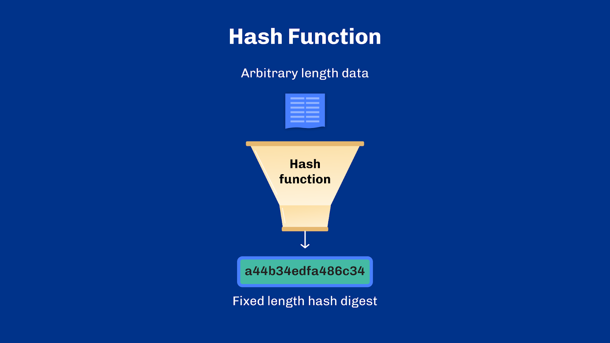
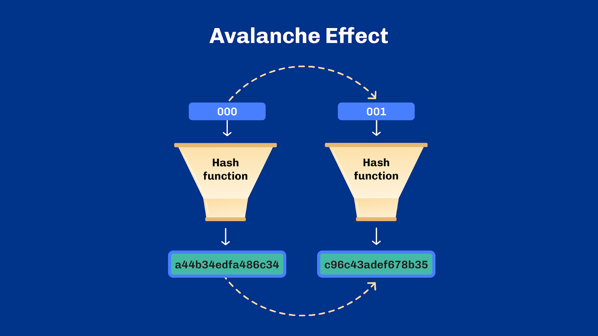
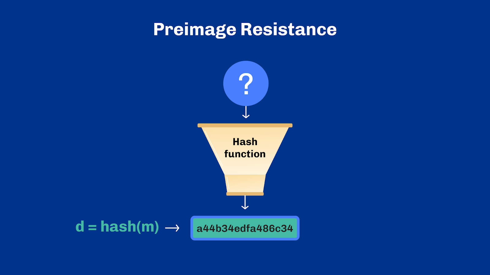
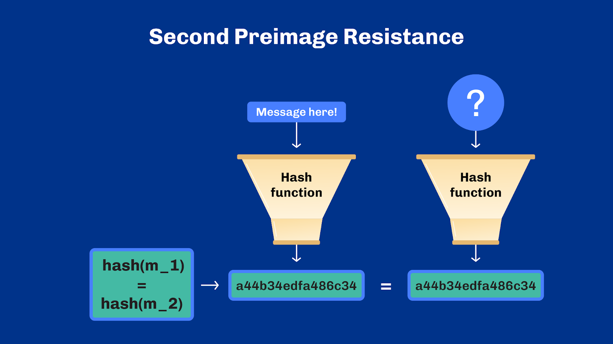
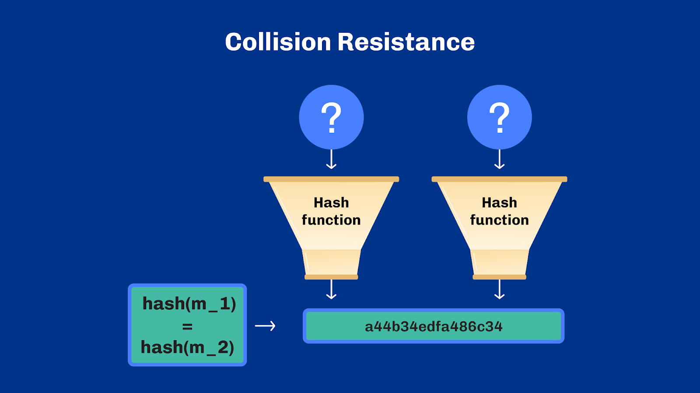

# Unit 5 - Hash Functions

## Learning Objectives
By the end of this unit, the learner should be able to:
Define hash functions and their properties
Compare different hash algorithms
Explain hash function applications

## Introduction
Hello everyone, and welcome. My name is [lecturer name], and many thanks for joining me today.

## Table of Contents
In the last unit, we looked at encryption as a way to ensure data confidentiality. In this unit, we will learn about hash functions and how they are used to ensure data integrity and authenticity. Hash functions are widely used in blockchain technology and other applications. We will explore how these functions work and why they are important for ensuring data security.

## Hash Function
Hash functions are used throughout blockchain. For example:

- Linking blocks in a chain by hashing each transaction with the previous block's hash.
- In mining, to solve a proof-of-work puzzle, validate transactions, and add them to the blockchain.
- They are used in digital signatures, which verify the authenticity and integrity of data.

A cryptographic hash function is a type of mathematical function that takes any kind of input and converts it into a fixed-length output known as a hash digest or message digest. This operation is one-way, meaning it can't be reversed, and the original input can't be reconstructed from the hash digest. The length of the hash digest, such as 256 bits, is set by the function. A bit is a binary value, 1 or 0, but hashes are usually represented as hexadecimal text strings. This means the text is composed of numbers from 0 to 9, with any digit higher than 9 represented by a letter from A to F. In a hexadecimal text string, each pair of letters also corresponds to a group of 8 bits. You can think of a hash digest as a digital fingerprint of the input. Keep in mind that for any given hash function, the same input will always produce the same output.

Remember, once an input is hashed, there is no way to reverse the hash digest back to the original input string. Here’s an analogy: every fruit can be turned into juice, but you can’t turn juice back into a fruit.

## Avalanche Effect
While it is true that the same input always produces the same hash output, a tiny change in the input results in a significant change in output. This is called the "avalanche effect", an important and desirable property of hash functions. If an adversary were to change a single bit in the input, the resulting output would be statistically indistinguishable from random data. This helps prevent attempting to predict an output, protecting the data from malicious tampering.

## Preimage Resistance
Hash functions need to be tamper-resistant. They need to make it hard to find two different messages that produce the same digest, and also make it infeasible to find the original message from just the hash digest.

Hash functions need to have these properties at all times. The properties are termed: Preimage Resistance, Second Preimage Resistance, and Collision Resistance. As we will see in a moment, collision resistance actually implies second preimage resistance.

Let’s take these one at a time.
Preimage resistance: If someone has a hash digest, it should be hard for them to find out what the original message was that created that hash digest. This is similar to the idea of the one-way function. Logically, we can represent this as: given a hash digest d, it should be difficult to find any message m such that d = hash(m). A hash function that makes reverting to the original value difficult is called preimage resistant.

## Second Preimage Resistance
Next: Second Pre-Image Resistance. With a given message, it should also be difficult for someone to find another message that produces the same hash value. This is important because it protects against attacks where someone tries to find a message that produces the same hash as another. If the hash digest for a password is ‘123456’, it should be difficult for someone to find another password that has the same hash digest, ‘123456’.

Logically we can represent this as follows: Given a fixed input m_1 it should be difficult to find a different input m_2 such that hash(m_1)=hash(m_2). That is, finding two different inputs that create the same hash output. This is also known as weak collision resistance.

We call it weak collision resistance because m_1 is fixed in this scenario. For example, it may be a pre-existing legitimate hash value for which an attacker may try to find another input, m_2, that will lead to the same hash. Many systems use hash digest as identifiers and therefore assume that they uniquely identify a given content. A hash function that lacks second preimage resistance would create vulnerability in systems relying on that assumption.

## Collision Resistance
Collision resistance is a property of a hash function that makes it difficult to find two different messages, or inputs, that result in the same hash digest.

Logically we can represent this as m_1 and m_2 such that hash(m_1)=hash(m_2). Collision resistance is the most challenging property for a hash function to maintain because of the size of the input and output space – and the asymmetry between them.

Let’s take a small step back. Hashing is about taking an input from an arbitrarily large set of possible values, and associating it to a relatively short fixed-size output. Consider a hash digest of 256 bits. It has ‘only’ 2^256 possible values. Although 2^256 is an extremely large number – there are actually less atoms in our galaxy than that – it still is a finite number. Because there’s an infinite amount of inputs to map to a finite number of outputs, collisions are theoretically possible. Yet, a hash function that provides collision resistance makes it so unlikely that we consider it infeasible in practice. It becomes incredibly challenging from a mathematical standpoint.

So, in an adversarial setting, we consider that the adversary has the freedom to choose m_1 and m_2, with the only requirement that m_1 and m_2 are different, not equal. If the hash digests are the same, it is a cryptographic hash collision.

The properties of second preimage resistance and collision resistance may seem similar. The difference is that for second preimage resistance, we consider that the attacker has a hash digest of an existing message to start with. This digest can be obtained from data that is publicly available – for example, transactions in a blockchain. For collision resistance, no message is given. The attacker attempts to find any two messages that yield the same digest. Because collision resistance is a stronger property to have, most cryptanalysis targets collision attacks. Having collision resistance is paramount for digital signatures.

## Types of Hash Functions
There is a wide range of hash functions, including Message Digestor or MD, Secure Hash Function or SHA, RIPEMD, Whirlpool, Blake, and Scrypt.

MD5 was once a popular choice with a 128-bit hash value. However, since it was proven to not be resistant to collisions in 2004, it is no longer recommended. [ref.4.2.1]

The SHA family is a popular group of hash functions, and it consists of four algorithms: SHA-0, SHA-1, SHA-2, and SHA-3.

SHA-0 was first published by the National Institute of Standards and Technology in 1993. It lasted until 2004, when a collision attack was discovered. SHA-1 suffered a similar fate in 2005. SHA-1 is still used, though no longer recommended.

SHA-2, the successor to these, uses a different algorithm and includes hash functions SHA-224, SHA-256, SHA-384, and SHA-512. To date, there have been no successful attacks reported on any of the SHA-2 hash functions. [ref.4.2.2]

Bitcoin uses SHA-256. Trillions of calculations are done with this hashing function every second by miners, yet there are no known collisions. This is because of the huge number of combinations - more than the number of atoms assumed to be in the galaxy.

SHA-3 produces a hash of 512 bits and uses an algorithm called Keccak. It is considered one of the most secure and was designed to be fast and efficient, with good attack resistance.

RIPEMD, developed by the open research community, has four functions: RIPEMD, RIPEMD-128, RIPEMD-160, and RIPEMD-256/320. The original version produced a 128-bit hash value but had security issues. To address these, RIPEMD 128-bit was created. The most widely used version, however, is RIPEMD-160, which Bitcoin uses for generating addresses.

## Hash Function Applications
There are many applications for hash functions, including password verification, data integrity checks, and digital signatures.

Instead of storing passwords in cleartext in a computer, most login systems store the hash values of the users’ passwords in a database. The database consists of a table of pairs which contains the user ID and the hash value of the password.

As the hash of the passwords is stored and not the passwords themselves, if an attacker gains access to the database, they won’t know the password. The attacker can only compare hash digests in the hope to find an identical digest. A digest reveals nothing about the original users’ passwords.

The data integrity check is the most popular application of hash functions. It is used to generate checksums for large documents. This application assures the user of data repudiation and detects any changes made to the original text. However, it does not provide any assurance pertaining to originality.

Hash digests can be found everywhere in blockchain technology. This is because they are used as a sort of “summary” for blocks and transactions. If I send the hash value of a transaction, anybody can easily verify whether I modified the transaction by checking its hash value. This is because any change in the input, no matter how small, will change the entire output. Thus hashing is an excellent tool to validate given information.

Keep in mind that hashing functions can be combined in numerous ways. The password exchange for Wi-Fi, for example, uses SHA256 multiple times in a row - so it hashes the hash of the hash and so on - which makes the process of brute forcing slower for attackers.

We will discuss hashing and digital signatures in more detail in the next unit.

## Review
Let’s recap what we have covered here.

In this unit, we looked at how hashing functions work and what they do. We looked at the properties needed for a hash function to be secure. And we also discussed the one-way directionality of hash functions and why that is important.

Let’s move on!

## References
[Ref.4.2.1]  Ciampa, M., “CompTIA Security+ 2008 in depth”. Course Technology PTR, 2009. 
[Ref.4.2.2] Penard, W., and Van Werkhoven, T. "On the secure hash algorithm family." Cryptography in context, pp. 1-18, 2008.  

## Questions

### A cryptographic hash function is a type of mathematical function that takes a data input of arbitrary size and converts it into a variable-length output.

1. True.
1. False.

See correct answer

2. False.

### A cryptographic hash function is reversible.

1. True.
1. False.

See correct answer

2. False.

### Select the correct statement about hash functions.

1. Hash functions can be reversed to reconstruct the original input.
1. The length of the hash digest is determined by the input.
1. Hash functions produce a fixed-length output.

See correct answer

3. Hash functions produce a fixed-length output.

### What does the "avalanche effect" refer to in hash functions?

1. A gradual decrease in the performance of a hash function over time.
1. The ability of a hash function to produce consistent outputs despite changes in inputs.
1. When a tiny change in the input results in a significant change in output.
1. An increase in the length of the hash digest to enhance the security of the hash function.

See correct answer

3. When a tiny change in the input results in a significant change in output.

### In a cryptographic hash function, the avalanche effect occurs when a tiny change in the input results in a significant change in the output.

1. True.
1. False.

See correct answer

1. True.

### Hash functions need to be tamper-resistant. For instance, it should be infeasible to find out the original message from the message’s hash value. How is this type of resistance typically referred to?

1. Primary resistance.
1. Preimage resistance.
1. Weak collision resistance.
1. Collision resistance.

See correct answer

2. Preimage resistance.

### What is the primary difference between second preimage resistance and collision resistance in hash functions?

> [!TIP]
> Select two of the following.

- [ ] Second preimage resistance requires a known hash digest of an existing message, while collision resistance does not.
- [ ] Second preimage resistance is necessary for digital signatures, while collision resistance is not.
- [ ] Second preimage resistance is easier to achieve compared to collision resistance.
- [ ] Second preimage resistance assumes that the attacker has a hash digest of an existing message, while collision resistance attempts to find any two messages that yield the same digest.

See correct answer

- [x] Second preimage resistance requires a known hash digest of an existing message, while collision resistance does not.
- [x] Second preimage resistance assumes that the attacker has a hash digest of an existing message, while collision resistance attempts to find any two messages that yield the same digest.

### Which property is considered a stronger requirement for a hash function: second preimage resistance or collision resistance?

1. Second Preimage Resistance.
1. Collision Resistance.
1. Both properties are equally strong.

See correct answer

2. Collision Resistance.

### Which hash function was proven to not be resistant to collisions in 2004 and is no longer recommended?

1. MD5.
1. SHA-0.
1. SHA-1.
1. SHA-2.

See correct answer

1. MD5

### What are the primary advantages of storing hash values of passwords instead of storing passwords in cleartext?

1. It ensures that the original passwords remain confidential even if the database is compromised.
1. It eliminates the need for users to remember their passwords.
1. It allows the passwords to be easily decrypted in case of forgotten passwords.

See correct answer

1. It ensures that the original passwords remain confidential even if the database is compromised.

### Select two correct statements about the use of hash functions in the context of data integrity checks.

- [ ] They detect any changes to an original text.
- [ ] They provide assurance about the originality of text.
- [ ] They can generate checksums for large documents.
- [ ] They are the least popular application of hash functions as it is difficult to action.

See correct answer

- [x] They detect any changes to an original text.
- [x] They can generate checksums for large documents.

