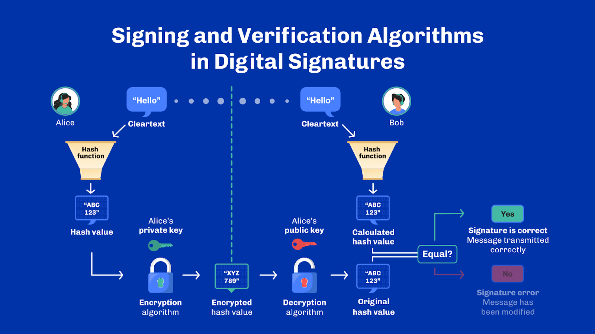
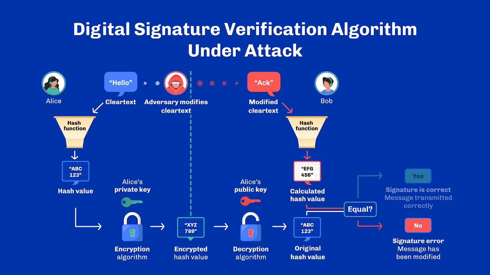
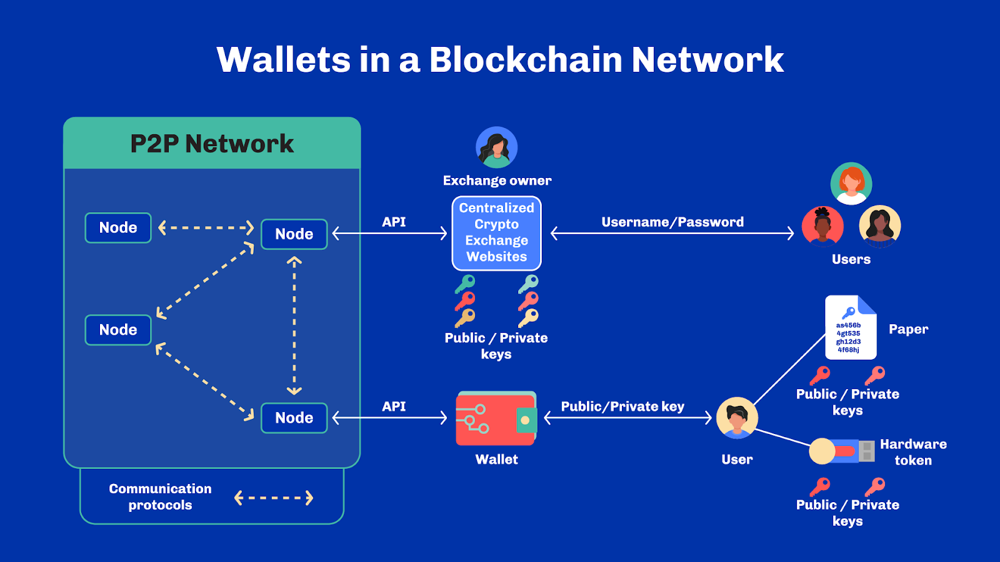
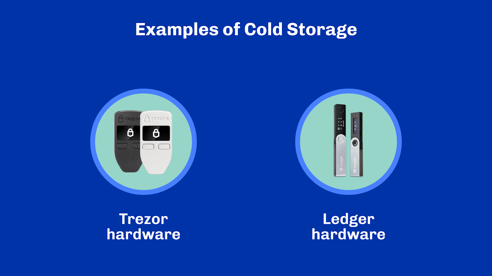
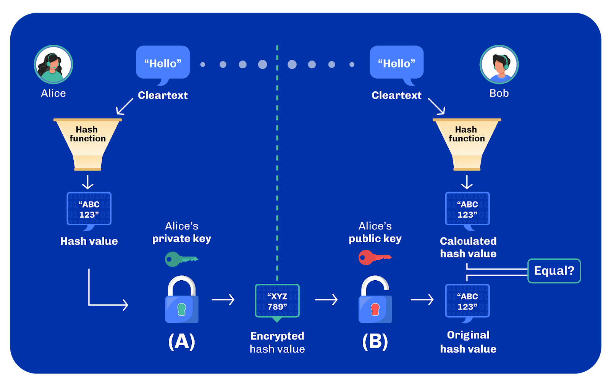

# 6 - Digital Signatures

> [!NOTE]
>
> By the end of this unit, you should be able to:
>
> - [x] Describe the problem digital signatures solve
> - [x] Compare digital signatures with hashing
> - [x] List three digital signature algorithms and name the one used in Cardano
> - [x] Wallets in a blockchain network

## Introduction

In this unit, we will discuss how secure and confidential communication can be attained with digital signatures. We’ll then close by looking at wallets and how they provide an interface to all the different cryptographic primitives we discussed throughout the lesson.

Let’s describe the problem and then look at how to solve it.

## Signing and verification algorithms in digital signatures

Alice is sending a message to Bob. She wants to assure him that the message came from her. Bob wants to be certain that at any point in time, he can prove the message came from Alice. She cannot deny sending the message. We call this property non-repudiation.

The next challenge. Bob wants to be certain that an adversary has not modified the message in the communication channel. We call this integrity.

How do Alice and Bob ensure the message has these two properties: non-repudiation and integrity?

The answer? Digital signatures.

Digital signatures can be used to authenticate the identity of the sender of a transaction and verify that a transaction has not been tampered with or altered in any way.

How does this work? The sender uses their own private key to sign the message, creating a unique digital signature. This signature can be verified by anyone with access to the sender's public key. Doing this proves that the message came from the sender and was not altered during transmission.

Two algorithms are needed in a digital signature scheme: the signing algorithm and the verifying algorithm.

The signing algorithm uses the sender’s private key and the original or cleartext message to create a signature, while the verifying algorithm uses the sender’s public key and the original message to verify the signature. Unlike encryption, digital signatures do not hide the original message. Anyone can inspect the original message and the signature that comes with it.

In the digital signature process, the sender, Alice, calculates a hash of the cleartext message and encrypts it using her private key. Together, the original message and the encrypted hash form the digital signature. They are then sent to the recipient, Bob.

Bob receives the cleartext message and calculates its hash value. In addition, Bob also decrypts the encrypted hash value using Alice’s public key. Now, Bob compares both the generated and decrypted hash values. If they are the same, the signature is valid. Note that only Alice’s private key could have produced the encrypted message – also called the signature. And because Alice keeps her private key secret, it ensures Bob that the message was indeed originated and signed by Alice.

## Digital signature verification algorithm under an attack

Now, assume an adversary has access to the communication channel and alters the cleartext message. Later, when Bob receives the message and calculates the hash values, the result does not match the original hash value calculated during the decryption process. This is because the adversary cannot produce a new digital signature of the message since this requires access to Alice’s private key.

Alice must keep the private key to herself and make the public key known to anyone. That means only Alice can use the signing algorithm because only she knows the private key. The verifying algorithm, however, can be used by anyone. If an adversary tries to modify the message, Bob will know.

## Digital Signature

There is a wide range of digital signature algorithms. Two popular algorithms are Rivest–Shamir–Adleman, or RSA, and Digital Signature Algorithm, or DSA.

The two rely on different cryptographic assumptions. RSA,  developed in 1977, relies on the assumption that factoring two large prime numbers is difficult.

DSA, developed in 1991, relies on the assumption that the discrete log problem is hard to solve.

Let’s explain the log problem in more detail. Let x, y, and z be integers such that x^y = z. If you are given z and x, it is difficult to find y, given that y is a large enough number [^1].

Bitcoin uses the Elliptic Curve Digital Signature Algorithm, or ECDSA, which is a modification of the DSA. Since ECDSA uses elliptic curve cryptography, it provides the same security as RSA but with smaller key sizes and faster operation. In 2022, Bitcoin transitioned to the Schnorr signature to improve its scalability, efficiency, and privacy [^2].

Edwards-curve Digital Signature Algorithm, or EdDSA, is a digital signature scheme using a variant of the Schnorr signature based on twisted Edwards curves. Harold Edwards proposed Edwards curves as a mathematical concept in 2007. The EdDSA is faster than existing digital signature schemes without sacrificing security.

EdDSA has adapted Curve25519 elliptic curves, which provide faster variable-base scalar multiplication than Edwards25519 elliptic curves, resulting in the Ed25519.

Cardano uses Ed25519. Ed25519 has several benefits, including very fast signing and verification, a high level of security, small signatures, and small keys [^3].

## Wallets in a Blockchain Network

Producing digital signatures and managing secret credentials can be tedious. Users therefore rely on a combination of software applications and hardware devices to make this process more manageable and secure.

The diagram shows two examples of applications interacting with blockchains: cryptocurrency exchanges and wallets. Both are used to manage user assets with different tradeoffs. Let's focus on each of them a bit.

## Cryptocurrency Exchanges / Custodial Wallets

A cryptocurrency exchange is a platform for buying, selling and trading blockchain tokens. Exchanges also provide their users with a wallet to manage assets and credentials. An exchange could be considered a custodian or thought of as a digital bank where people can store their cryptocurrency and access financial services.

In a custodial wallet, the user's credentials, and thus tokens, are in the possession of the custodian – in this case, the cryptocurrency exchange. The exchange uses a centralized authentication system, such as a username and password, to authenticate its users. Once authenticated, users can perform a variety of operations that are translated into commands to blockchain nodes managed by the exchange. While convenient, funds kept in a custodial wallet are effectively the property of the custodian, which can therefore restrict access to them or perform unauthorized operations as they see fit. This has led many users to prefer non-custodial solutions because they remain in total control of their assets – with all the responsibility that it entails.

## Non-Custodial Wallets

Non-custodial wallets mean the user has complete control of their keys, and therefore, tokens. Users hold onto credentials directly to authenticate operations through digital signatures. Credentials are made of two main parts: a private key and a public key. As we saw when discussing asymmetric cryptography, the private key, like a key to a safe deposit box, allows anyone with access to it to produce digital signatures and take control of the asset. It is critical to keep the private key safe and away from prying eyes.

As previously discussed, the public key, which is derived from the private key, allows users to receive funds and play a part in the signature verification procedure. This key is safe to share with whoever wants to send funds to it, a bit like a bank account number for receiving wire transfers.

Non-custodial wallets are generally plain desktop or web applications. In addition to holding credentials, they often enable users to interact with a blockchain network, and to view information about that blockchain. Said differently, they are like browsers on a blockchain that show useful information such as account balances and allow users to sign and submit transactions to a network.

## Hot and Cold Storage

We have just seen how wallets make use of a person’s secret credentials. It is crucial for wallets to store and handle those private keys securely. There are two main options for storing those keys: hot storage and cold storage.

With hot storage, an application or platform is connected to the blockchain network. The owner manages their token holdings through this platform or application. So any desktop, browser or web wallet qualifies as hot storage.

Cold storage, on the other hand, stores private keys offline. This adds an extra layer of security.

Hardware wallets are a type of cold storage. These are special devices used to store private keys offline. These wallets are typically made of physical components such as a USB drive, and contain specialized software and hardware that is used to manage the wallets and its keys. Usually they provide access to specific cryptographic functionality via bluetooth or USB. More importantly, the only way to use the private keys in a hardware wallet is through the operations permitted by the device itself.

Another example of cold storage is paper or steel wallets. They are basically physical objects with a user’s secret credentials engraved on them.

## Review

Alright, we are already at the end of this lecture. Let’s take a second to recap.

In this unit, we explored digital signatures and how they work. We looked at the different kinds of algorithms used in blockchain. We looked at the specific algorithms Cardano uses, and stressed how digital signatures are fundamental design elements in blockchains.

Then, we looked at custodial and non-custodial wallets as a way to manage secret credentials and produce digital signatures. And finally, we distinguished between hot and cold storage.

We will talk about digital signatures and wallets again in future units, in particular when discussing addresses.

Until next time!

## Questions

### Digital signatures can authenticate the identity of the sender of a transaction, plus verify that a transaction has not been tampered with or altered in any way.

1. True.
1. False.

See correct answer

1. True.

### What property ensures that a sender cannot deny sending a message at any point in time?

1. Confidentiality.
1. Integrity.
1. Non-repudiation.
1. Availability.

See correct answer

3. Non-repudiation.

### Which of the following is used to authenticate the identity of the sender of a transaction and verify that a transaction has not been tampered with?

1. Encryption.
1. Digital signature.
1. Symmetric key.

See correct answer

2. Digital signature.

### What does the signing algorithm in a digital signature scheme use to create a signature?

1. The sender’s public key and the original message.
1. The sender’s private key and the original message.
1. The receiver’s public key and the original message.
1. The receiver’s private key and the original.

See correct answer

2. The sender’s private key and the original message.

### A digital signature scheme requires which two algorithms?

- [ ] Signing algorithm.
- [ ] Consensus algorithm.
- [ ] Transaction algorithm.
- [ ] Verifying algorithm.

See correct answer

- [x] Signing algorithm.
- [x] Verifying algorithm.

### Study the image below and label A and B respectively. Select two correct options.

 

1.  | A                    | B                    |
    | ---                  | ---                  |
    | Encryption algorithm | Decryption algorithm |
1.  | A                    | B                    |
    | ---                  | ---                  |
    | Decryption algorithm | Encryption algorithm |

See correct answer

1.  | A                    | B                    |
    | ---                  | ---                  |
    | Encryption algorithm | Decryption algorithm |

### Alice calculates the hash of the cleartext message and encrypts it using her private key. Bob receives the message, calculates its hash, and decrypts the encrypted hash using Alice’s public key. What does it mean if the generated and decrypted hash values in the digital signature process are the same?

1. The signature is invalid.
1. The signature is valid.
1. The original message was tampered with during transmission.

See correct answer

2. The signature is valid.

### After receiving a message, what can you do to validate the digital signature?

1. Decrypt the received hash using the sender’s public key and compare it with the hash value you calculated for the received message.
1. Encrypt a new hash of the received message using your private key and compare it with the received encrypted hash.
1. Decrypt the received hash using the sender’s private key and compare it with the hash value you calculated for the received message.

See correct answer

1. Decrypt the received hash using the sender’s public key and compare it with the hash value you calculated for the received message.

### What happens if an adversary alters the cleartext message during transmission?

1. The original hash value and the hash value of the received message will match.
1. The hash value of the received message will not match the original hash value when decrypted.
1. The adversary will be able to produce a new valid digital signature.

See correct answer

2. The hash value of the received message will not match the original hash value when decrypted.

### Why can't an adversary create a new valid digital signature after modifying a message?

1. Because the adversary doesn't have the correct hashing algorithm.
1. Because creating a valid signature requires access to the sender’s public key.
1. Because creating a valid signature requires access to the sender’s private key.
1. Because the adversary cannot decrypt the received encrypted hash.

See correct answer

3. Because creating a valid signature requires access to the sender’s private key.

### Which cryptographic assumption does the RSA digital signature algorithm rely on?

1. The discrete log problem is hard to solve.
1. That factoring two large prime numbers is difficult.
1. That elliptic curve cryptography is secure.

See correct answer

2. That factoring two large prime numbers is difficult.

### Which cryptographic assumption does the DSA digital signature algorithm rely on?

1. The discrete log problem is hard to solve.
1. That factoring two large prime numbers is difficult.
1. That elliptic curve cryptography is secure.

See correct answer

1. The discrete log problem is hard to solve.

### What variant of the digital signature scheme does Cardano use?

1. RSA.
1. DSA.
1. Ed25519.
1. Schnorr signature.

See correct answer

3. Ed25519.

### What cryptographic algorithm did Bitcoin transition to in 2022 to improve its scalability, efficiency, and privacy?

1. RSA signature.
1. DSA signature.
1. ECDSA signature.
1. Schnorr signature.

See correct answer

1. Schnorr signature.

### In a custodial wallet, the user's credentials and tokens both remain in the possession of the user.

1. True.
1. False.

See correct answer

2. False.

### What does a custodial wallet refer to in the context of a cryptocurrency exchange?

1. A wallet where users maintain full control over their credentials and tokens.
1. A wallet where the exchange, acting as the custodian, is in possession of the user's credentials and tokens.
1. A wallet that provides multi-factor authentication.

See correct answer

2. A wallet where the exchange, acting as the custodian, is in possession of the user's credentials and tokens.

### How does a cryptocurrency exchange authenticate its users?

1. Using a centralized authentication system.
1. Using a blockchain-based authentication system.
1. Using a decentralized authentication system.

See correct answer

1. Using a centralized authentication system.

### What is a non-custodial wallet in the context of digital assets?

1. A wallet where the exchange has control over the user's keys and tokens.
1. A wallet where a third-party company controls the user's keys and tokens.
1. A wallet where the user has complete control over their keys and tokens.

See correct answer

3. A wallet where the user has complete control over their keys and tokens.

### In the context of non-custodial wallets, what role does the private key play? Select two CORRECT options.

- [ ] It allows anyone with access to it to produce digital signatures.
- [ ] It allows anyone with access to it to take control of the asset.
- [ ] It plays a part in the signature verification procedure.
- [ ] It allows users to receive funds.

See correct answer

- [x] It allows anyone with access to it to produce digital signatures.
- [x] It allows anyone with access to it to take control of the asset.

### In hot storage, an application or platform is connected to the blockchain network. The owner manages their token holdings through this platform or application

1. True.
1. False.

See correct answer

1. True.

### What type of storage is defined as an application or platform that is connected to the blockchain network?

1. Remote storage.
1. Cold storage.
1. Hot storage.
1. Offline storage.

See correct answer

3. Hot storage.

### What is a defining characteristic of cold storage?

1. It stores private keys online.
1. It stores private keys in an easily accessible location.
1. It stores private keys offline.
1. It stores private keys in a way that is connected to the blockchain network.

See correct answer

3. It stores private keys offline.

## References

[^1] Stanford crypto education, “Factoring and Discrete Logarithms”, Available: crypto.stanford.edu/pbc/notes/crypto/factoring.html, Accessed: Aug 29, 2022.
[^2] Bernstein D.J. “Multi-user Schnorr security, revisited”, Cryptology ePrint Archive, 2015.
[^3] Bernstein, D. J., Duif, N., Lange, T., Schwabe, P., & Yang, B. Y., "High-speed high-security signatures.", Journal of cryptographic engineering 2, no. 2, pp 77-89, 2012.

