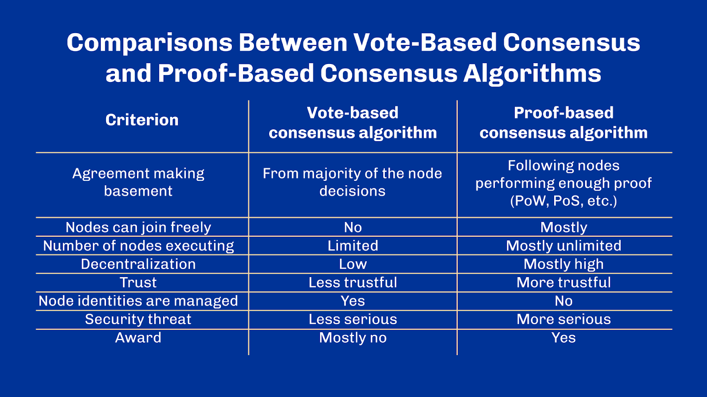

# 7 - Practical Byzantine Fault Tolerance

> [!NOTE]
>
> By the end of this unit, you should be able to:
>
> - [x] Understand what Byzantine fault-tolerant systems are
> - [x] Know the difference between synchronous and asynchronous systems
> - [x] Understand Practical Byzantine Fault Tolerant (PBFT) family of algorithms
> - [x] Understand the limitations of classic PBFT

## Introduction

Today, we'll talk about consensus in distributed systems. More specifically, we'll explore practical Byzantine fault tolerance. We will see how it is the basis for many other algorithms in the blockchain space. Ready?

## A Recap on Consensus and Blockchains

We covered consensus when we first introduced distributed systems such as blockchains a few units back. Let’s take a few minutes to recap what we covered.

A consensus algorithm is a mechanism whereby different actors can reach agreement on a value. In the case of distributed ledger, that value is the entire ledger; or said differently, it is the record of who owns what in the system.

There are many ways of achieving consensus, for example, through a central all-knowing authority which is tasked to resolve any possible conflict. The challenge comes when designing a consensus algorithm that must have certain desirable properties. For example, permissionless blockchains need the property that anyone should be able to take part in the consensus algorithm. Another property needed for consensus algorithms is fault tolerance in an adversarial environment.

## Fault Tolerance

Fault tolerance is the ability of a system to keep functioning even in the presence of arbitrary faults. Faults can be genuine defects of certain parts of the systems, or they can be of adversarial nature.

You probably remember the Byzantine Generals Problem, and how messengers can't be trusted as they might have been bribed or killed.

A system that is resilient to this kind of adversarial failures is said to be Byzantine Fault Tolerant -- or BFT in short. Most blockchain systems have this property, or tend towards it.

More specifically, a BFT consensus algorithm will ensure two fundamental properties: safety and liveness. We've covered this in unit 1: safety refers to the property of a distributed system to commit to the same value, whereas liveness indicates that the system can continuously commit to new values and make progress.

## Synchrony

Before we continue, we need to introduce one key concept in the study of distributed systems - synchrony. Distributed systems are typically classified into two main categories: synchronous systems and asynchronous systems. However, things aren't as binary in real life and there exists a whole range of hybrid situations in between.

A system is said to be synchronous if a defined time bound exists between the moment a request is sent and a response received. If there's no such upper bound, we say that the system is asynchronous.

The Internet is an example of an asynchronous distributed system. When requesting a particular website, there is no guarantee how long your browser will take to get a response. Indeed, the underlying communication protocols that make the Internet do not guarantee that servers respond under a known time limit. Most browsers, however, will not wait forever and therefore have to implement timeouts: they’ll stop waiting for a response after a certain delay. Yet, they can’t really tell the difference between a server that isn’t responding or a server that is simply taking a long time to respond.

On the other hand, many blockchain consensus protocols are synchronous. This is the case for Bitcoin or Ouroboros. Yet, synchrony is achieved in different ways for each. In the former, the chain difficulty is adjusted by the protocol to ensure that a block is mined within a defined time frame. This gives a probabilistic upper bound and an average block time that the system can use as points of synchronization. In Ouroboros, nodes are assumed to share a globally synchronized clock. As if each node operator had once met to adjust their watch precisely before starting.

Synchronizing clocks may sound trivial but it is not – in particular across a large distributed system. In computers, time is typically measured using quartz-based clocks, by looking at crystal oscillations when electrifying them. Because it is very much a physical phenomenon, there exist tiny differences that cause measures to skew over time and clocks to drift away from one another. The Network Time Protocol (NTP in short) is a well-known Internet protocol used to synchronize clocks of various machines across the planet. Have you ever noticed how your phone or laptop can automatically find the right time once connected to a network? Well, that's most likely thanks to NTP.

The Network Time Protocol is one of the oldest distributed networking protocols still in operation, operating without interruption since the early 80s. It works as a hierarchy of clocks. The higher in the hierarchy, the more precise are the clocks. At the highest level there are literal atomic clocks. Then comes primary time servers, connected to atomic clocks, then other servers, etc., down to your own devices. Each layer will periodically synchronize their clocks with the layer above and is equipped with a local clock that keeps track of time otherwise. In your computer or mobile device, that's the little quartz. Such manufactured quartz clocks in common retail devices are good enough to only drift by a few milliseconds each day, so they only need a little nudge once in a while. Servers from the layers above are equipped with more accurate clocks that drift less yet still synchronize from time to time with their above layer. And so forth up until the atomic clocks that are considered the most precise source of time we have.

Now that we understand clock synchronization, let’s go back and look at the fundamental role of synchrony in system designs, especially distributed systems. While synchronous systems are usually easier to reason about since they come with stronger assumptions and guarantees – for example, on the time it takes for a node to reply – they often fall short when it comes to reflecting the actual reality of our world. In the real world, systems are not perfect and suffer from faults and delays. Thus, protocols that require strong synchrony between nodes are usually not fit for use in practice.

Yet, asynchronous systems are terribly hard to reason about. So much that a group of researchers in the 80's even demonstrated the impossibility of distributed consensus in fully asynchronous systems. Fully is an important keyword here as we'll see later. Their research showed that it is impossible to find consensus in a distributed system that makes no synchrony assumption whatsoever. That is a single faulty node can prevent the system finding agreement.

So, designing distributed asynchronous systems is hard. But let's not lose all hope just yet. There have been different solutions highlighted by researchers and computer scientists over the past few years. One of the earliest was Paxos, designed by the very same crew that came up with the Byzantine Generals problem -- Lamport & al. Few years later, one angular stone of blockchain research was the work of Castro & Liskov: Practical Byzantine Fault Tolerance -- PBFT in short.

As of today, many blockchain systems such as Cosmos, Binance Smart Chain and Hyperledger Fabric are based on PBFT or some variant of it. Getting a good understanding of PBFT shall give you more insights regarding existing systems. We'll also cover the trade-offs that come with such an approach and why scientists have continued exploring other consensus methods such as Bitcoin or Ouroboros.

## Practical Byzantine Fault Tolerance

### Overview

Practical Byzantine Fault Tolerance is a consensus protocol that works in an asynchronous setting. Or, almost. As explained above, designing a distributed consensus protocol in a fully asynchronous setting has been proven not feasible.

So what's the trick? Well, Practical Byzantine Fault Tolerance makes a few assumptions. First, it assumes that at most 1/3 of the nodes in the system can be simultaneously faulty. This is a common assumption in the blockchain space where consensus protocols almost always assume a majority or supermajority of honest nodes.

Second, PBFT assumes fully Byzantine situations, where malicious actors of the system can delay messages and even coordinate communications between malicious nodes. However, it excludes adversaries from being able to delay communications indefinitely. This is also what researchers typically call a "weak synchrony". This assumption is useful to justify that the protocol ensures the liveness property, essential to any distributed consensus.

Finally, the algorithm makes use of various public-key cryptography techniques such as hashing and digital signatures and therefore, assumes relevant properties such as non-collision and preimage resistance that we've seen in previous units.

From there, the algorithm works as a state-machine replication. Each node of the system maintains a view of the system, replicated on each node. This can be, for example, a ledger. In order to adopt a new view, a transition must happen following a 3-step commit algorithm.

### Algorithm

Let’s look at the algorithm in more detail. One client makes a request to a node of the system. For example, a user tries to submit a transaction that modifies the ledger. The node must then forward the request to all other nodes of the system. Each node then replies to the original client with the outcome of executing the request.

To continue with our analogy, think about each node of the system sending back the result of applying the transaction to the ledger. Incidentally, in this type of algorithm, each message in the protocol is authenticated by digital signatures, very much like transactions on a blockchain. This allows nodes to prove the origin of messages and prevent malicious nodes from possibly tampering with them.

So, back to our nodes replying to the client. Once enough consistent results have been gathered, the original sender can safely assume it has gotten the right answer. How many results are enough? Well, since we assume that there are no more than one-third of faulty nodes in the systems, then one-third plus one is enough. Still following? Let's introduce some useful terminology before we move on to the next bits. The node that the user chooses originally and that broadcasts the request to all other nodes of the system is said to be the primary node and its role is quite crucial as you might have guessed. The other nodes are referred to as the replicas. In essence, replicas are merely voting on the result proposed by the primary node. The tally of the votes is done by the original sender who compares the results. So what happens when the user doesn't receive enough consistent results in a timely manner? It will start reaching out to replicas directly.

From there, there are two possible outcomes. Either replicas have already seen that request and replied to the user. In which case, they simply reply back with the same result. Or, they had never seen that request to begin with and they'll immediately forward it back to the primary node. Perhaps there was a miscommunication between the user and the primary node initially, or perhaps the message from the primary node to the replicas got lost in networking. Remember that, upon receiving a request, the primary node would automatically broadcast it back to all other nodes. So at this point in time, replicas are expecting to receive a request from the primary node. If they don't, then they'll assume the primary node is now faulty and request for a change of primary node from all other replicas. If enough replicas agree on this change, a new primary node is assigned (following a heuristic defined in advance).

This allows the process to eventually go through, even if the primary node turns out to be inoperative. Whatever the reason might be. This is what happens from a client perspective, although there are more subtleties happening in the background between the replicas. The consensus indeed happens over multiple steps and messages exchanged between the replicas; with different thresholds. Only at the end of this internal dance will replicas respond to the client and update their internal view of the system. This is because replicas can’t generally trust the primary node and must first gossip between themselves before committing to a final decision. I am sure this is sparking many questions in your head and I can only recommend to the more tech-savvy to read the original paper on practical Byzantine fault tolerance.

## Vote-Based Consensus

This type of consensus is sometimes called "vote-based consensus" to capture the idea of replicas actively confirming an outcome proposed by a primary node. As you can imagine, they are quite message-heavy since they require multiple rounds of communication between all nodes of the systems.

In a best-case scenario, they provide an almost instant finality, which is reached as soon as one-third plus one of the nodes have replied. When the number of nodes is small, this can be pretty quick.

This type of protocol has given birth to many similar frameworks. We can mention HyperLedger’s Sawtooth PBFT which has adapted the original methodology described here to blockchains by having primary nodes rotate more often.

Indeed, in the original paper, a change of the primary node is only truly necessary on defects, when the primary node becomes unresponsive. In blockchains, to ensure a good decentralization of the block producers, primary nodes – or simply, block producers – are changed more frequently.

Another example is Tendermint which is a modular PBFT consensus framework. It has been used in blockchains such as Cosmos, coupled with proof-of-stake to weigh the choice of the next primary node.

### Limitations

Vote-based consensus is relatively simple – mind you, comparatively to other proof-based approaches. It works well in private and consortium setups, in which the decentralization degree is lower than in public blockchains.

Indeed, vote-based consensus algorithms tend to be quite heavy on the communication side. Each change to the state of the system must be voted by numerous replicas of the systems. In the blockchain world, those replicas are often called ‘validators’. Even in the case of PBFT which is arguably much better than a naive broadcasting approach infeasible beyond a few nodes; a single request in a cluster of 4 nodes would require at least 24 messages to establish consensus. A cluster of 8 nodes 71 messages.13 nodes? 237 messages!

This poses some challenges in terms of network communication because each block production is followed by a much larger amount of votes to establish consensus. And while the networking bandwidth is used for consensus, it isn't used to transfer useful user data. Hence, this doesn’t scale well to even a hundred nodes.

Another limitation of such setup regards how nodes have to be aware of each other ahead of time. Messages are authenticated, and nodes are expected to know other nodes' public credentials. This makes the system quite rigid in practice, as adding new nodes to it is complicated and requires every existing node to acknowledge the change. Hence, in the basic setup, PBFT consensus is inherently federated.

A consequence of these two things means that PBFT consensus algorithms are more prone to Sybil attacks. Said differently, it is possible for a single actor to control more than one node relatively easily, unless something is done to mitigate it.
If you’ve been in the blockchain space for a while, you probably realize that these shortcomings can be a blocker for many projects aiming for greater decentralization and openness. For this reason, research has continued for many years to explore alternatives or to evolve the approach outlined by the practical byzantine fault tolerance consensus. Another significant milestone in this journey is the publication of the Bitcoin protocol, about ten years after which has paved the way for proof-based consensus algorithms.

## Review

In this unit we have covered consensus in distributed systems. We focused on Practical Byzantine Fault Tolerance and looked at the concept of synchrony in distributed systems. Finally, we explored vote-based consensus and its limitations.

## Glossary

- *Synchronous system*: A system is said to be synchronous if a defined time bound exists between the moment a request is sent and a response received. 
- *Asynchronous system*: A system is said to be asynchronous if a defined upper time bound does not exist between the moment a request is sent and a response received. 
- *Fault tolerance*: Fault tolerance is the ability of a system to keep functioning even in the presence of arbitrary faults. 
- *Network Time Protocol (NTP)*: The Network Time Protocol is a well-known Internet protocol used to synchronize clocks of various machines across the planet. 

## Questions

### What is the main goal of a consensus algorithm?

1. To resolve conflicts between individuals.
1. To reach agreement between actors on a certain value.
1. To enhance connectivity in a peer-to-peer network.
1. To synchronize clocks between machines.

See correct answer

2. To reach agreement between actors on a certain value.

### Select the correct statements about the Network Time Protocol (NTP).

- [ ] The NTP is one of the newest distributed networking protocols.
- [ ] Each layer of the NTP will regularly synchronize its clocks with the layer above.
- [ ] The higher the clocks are in the hierarchy, the more precise they are.
- [ ] The atomic clocks are considered the most inaccurate source of time.

See correct answer

- [x] Each layer of the NTP will regularly synchronize its clocks with the layer above.
- [x] The higher the clocks are in the hierarchy, the more precise they are.

### How do computers usually synchronize clocks around the world?

1. Clocks are calibrated once by the manufacturer with pre-configured timezones.
1. They rely on blockchain technology to reach consensus on the current universal time.
1. It’s a natural physical phenomenon that happens when electrifying quartz at a certain voltage.
1. They use a networking protocol called NTP to synchronize to the universal time.

See correct answer

4. They use a networking protocol called NTP to synchronize to the universal time.

### Why do many distributed systems prefer to use asynchronous protocols over synchronous protocols, despite the complexity of designing asynchronous systems?

1. Asynchronous protocols are used because they make consensus easy to achieve in distributed systems.
1. Asynchronous protocols accurately reflect the imperfections of real-world systems, such as faults and delays.
1. Asynchronous protocols are cheaper to implement and require less computational power.

See correct answer

2. Asynchronous protocols accurately reflect the imperfections of real-world systems, such as faults and delays.

### In a fully asynchronous networking system, responses to requests are always received before a certain known delay.

1. True.
1. False.

See correct answer

2. False.

### What is the difference between synchronous and asynchronous systems?

1. Synchronous systems require a globally synchronized clock, while asynchronous systems do not.
1. Synchronous systems rely on the chain difficulty being adjusted by the protocol, while asynchronous systems do not.
1. Synchronous systems have a defined time bound between sending a request and receiving a response, while asynchronous systems have no such upper bound.
1. Synchronous systems only operate in blockchain technology, while asynchronous systems are only found in Internet protocols.

See correct answer

3. Synchronous systems have a defined time bound between sending a request and receiving a response, while asynchronous systems have no such upper bound.

### Select the correct statements about the Network Time Protocol (NTP).

- [ ] The NTP is one of the newest distributed networking protocols.
- [ ] Each layer of the NTP will regularly synchronize its clocks with the layer above.
- [ ] The higher the clocks are in the hierarchy, the more precise they are.
- [ ] The atomic clocks are considered the most inaccurate source of time.

See correct answer

- [x] Each layer of the NTP will regularly synchronize its clocks with the layer above.
- [x] The higher the clocks are in the hierarchy, the more precise they are.

### How do computers usually synchronize clocks around the world?

1. Clocks are calibrated once by the manufacturer with pre-configured timezones.
1. They rely on blockchain technology to reach consensus on the current universal time.
1. It’s a natural physical phenomenon that happens when electrifying quartz at a certain voltage.
1. They use a networking protocol called NTP to synchronize to the universal time.

See correct answer

4. They use a networking protocol called NTP to synchronize to the universal time.

### Why do many distributed systems prefer to use asynchronous protocols over synchronous protocols, despite the complexity of designing asynchronous systems?

1. Asynchronous protocols are used because they make consensus easy to achieve in distributed systems.
1. Asynchronous protocols accurately reflect the imperfections of real-world systems, such as faults and delays.
1. Asynchronous protocols are cheaper to implement and require less computational power.

See correct answer

2. Asynchronous protocols accurately reflect the imperfections of real-world systems, such as faults and delays.

### In a fully asynchronous networking system, responses to requests are always received before a certain known delay.

1. True.
1. False.

See correct answer

2. False.

### What does ‘PBFT’ stand for?

1. Provably Better Fault Tolerance.
1. Pure Blazing Fast Transactions.
1. Practical Byzantine Fault Tolerance.
1. Pragmatic Byzantine Fault Tolerance.

See correct answer

3. Practical Byzantine Fault Tolerance.

### It is impossible to design a distributed consensus algorithm in a fully asynchronous setting.

1. True.
1. False.

See correct answer

1. True.

### What is the core assumption of PBFT’s security model?

1. At most one-third of the actors in the system are malicious.
1. At most half of the actors in the system are malicious.
1. At least one actor in the system is honest.
1. No actor in the system is malicious.

See correct answer

1. At most one-third of the actors in the system are malicious.

### In a PBFT algorithm, how many consistent results must be gathered by the original sender to safely assume it has gotten the right answer, and why?

1. One-third of the nodes, because no more than one-third of the nodes can be faulty.
1. One-third plus one of the nodes, because no more than one-third of the nodes can be faulty.
1. One-half of the nodes, because no more than half of the nodes can be faulty.
1. All of the nodes, because no nodes can be faulty.

See correct answer

2. One-third plus one of the nodes, because no more than one-third of the nodes can be faulty.

### In the PBFT algorithm, what happens if replicas do not receive the request from the primary node that they were expecting?

1. The replicas immediately send the result to the user.
1. The replicas ignore the lack of communication and continue waiting.
1. The replicas assume the primary node is faulty and elect a new primary node.
1. The replicas stop the process and fail the transaction.

See correct answer

3. The replicas assume the primary node is faulty and elect a new primary node.

### In PBFT, what’s the role of the primary node?

1. It gathers votes from replicas, tallies, and forwards the result back to the client.
1. It propagates client’s requests to replicas, thus initiating the consensus procedure.
1. It serves as a gatekeeper for new replicas wanting to join the network.
1. It is the one that authorizes state changes in the system.

See correct answer

2. It propagates client’s requests to replicas, thus initiating the consensus procedure.

### Vote-based consensus is a consensus method:

1. Where replicas actively confirm an outcome proposed by a primary node, involving multiple rounds of communication between all nodes.
1. That relies solely on the primary node, without the need for communication with replicas.
1. That changes primary nodes frequently, regardless of defects or unresponsiveness.
1. That minimizes communication between nodes and reaches finality with only one round of voting.

See correct answer

1. Where replicas actively confirm an outcome proposed by a primary node, involving multiple rounds of communication between all nodes.

### Select the correct statements regarding vote-based consensus.

- [ ] It requires minimal communication and easily scales to thousands of nodes.
- [ ] It creates challenges in communication because of many messages for consensus.
- [ ] It makes adding new nodes complex since existing nodes must approve the change.
- [ ] It only relies on the primary node to establish consensus without any need for validation by replicas.

See correct answer

- [x] It creates challenges in communication because of many messages for consensus.
- [x] It makes adding new nodes complex since existing nodes must approve the change.

### True or False. Vote-based consensus does not scale well to a high number of nodes.

1. True.
1. False.

See correct answer

1. True.

## References

- [Practical Byzantine Fault Tolerance](https://pmg.csail.mit.edu/papers/osdi99.pdf))
- [Impossibility of Distributed Consensus with One Faulty Process](https://dl.acm.org/doi/pdf/10.1145/3149.214121)
- [Ouroboros BFT - A Simple Byzantine Fault Tolerant Consensus Protocol](https://eprint.iacr.org/2018/1049.pdf)
- [Tendermint Documentation](https://docs.tendermint.com/v0.34/)
- [HyperLedger Sawtooth PBFT](https://www.hyperledger.org/blog/2019/02/13/introduction-to-sawtooth-pbft)
- [An introduction to PBFT consensus](https://medium.com/tronnetwork/an-introduction-to-pbft-consensus-algorithm-11cbd90aaec)
- [Internet Time Synchronization: the Network Time Protocol](https://www.rfc-editor.org/rfc/rfc1129.pdf)
