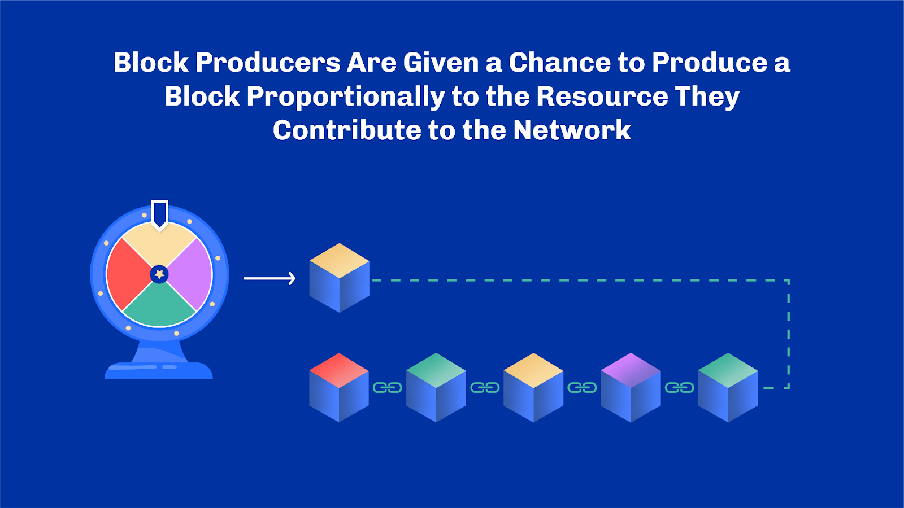
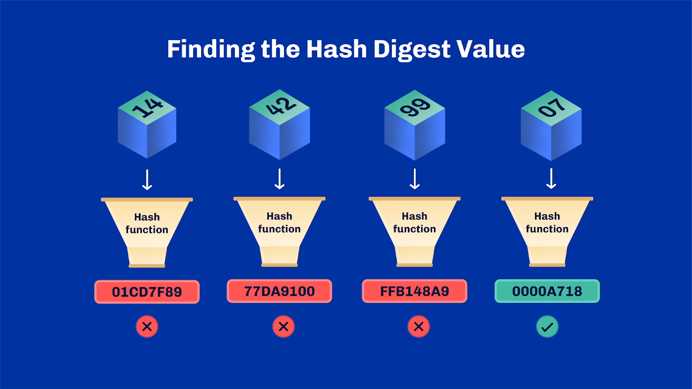
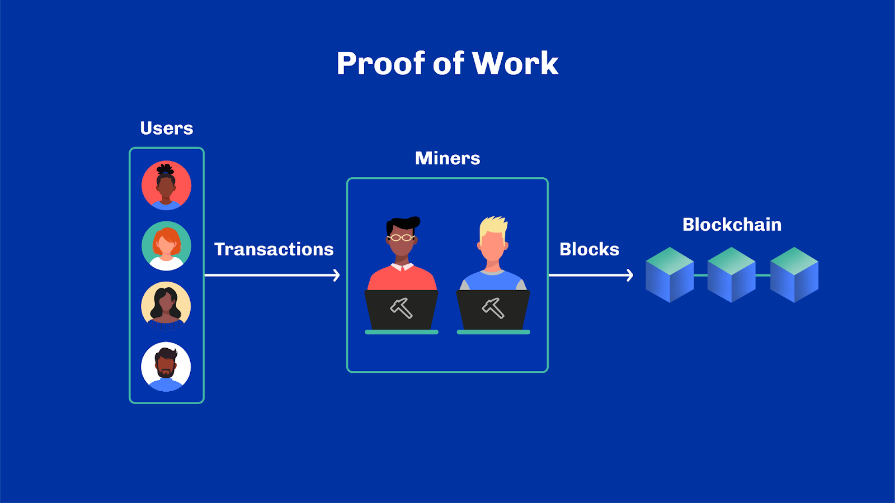
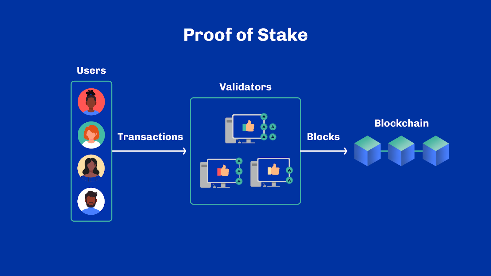
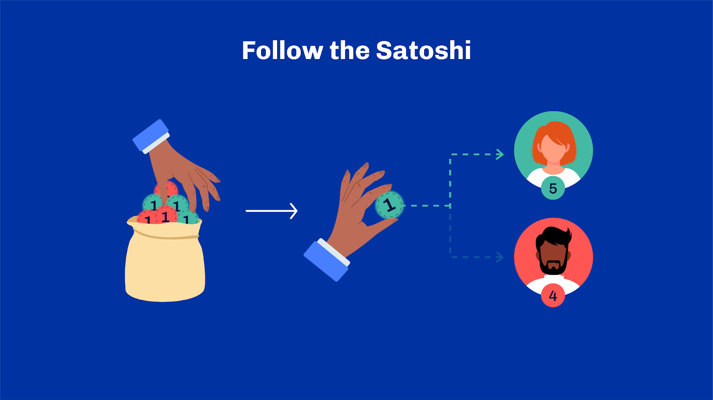
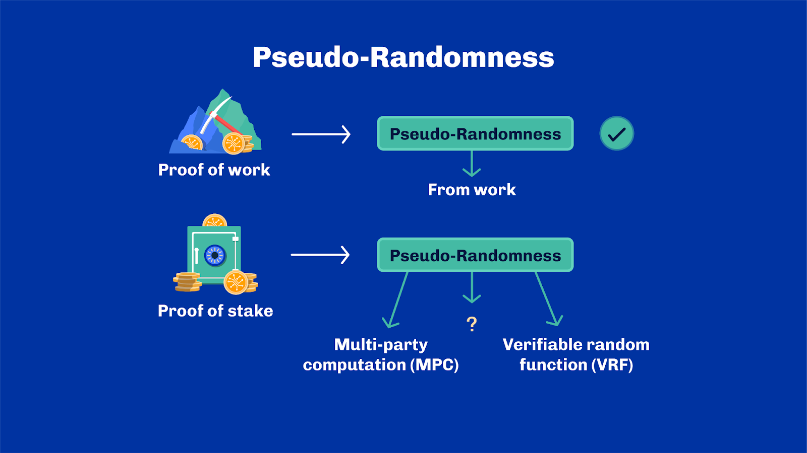
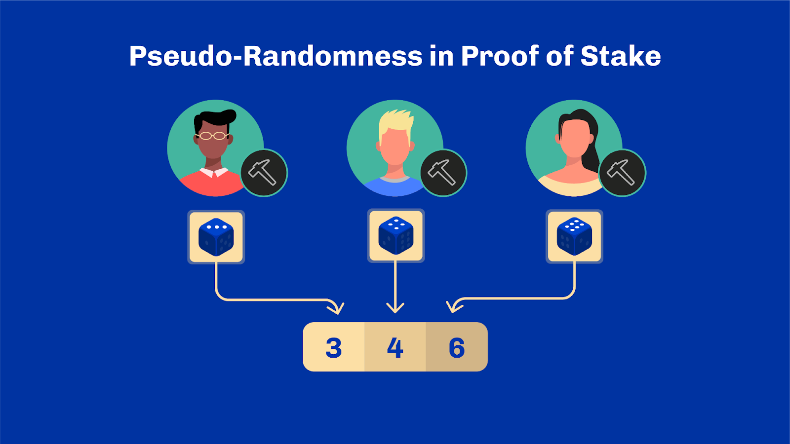
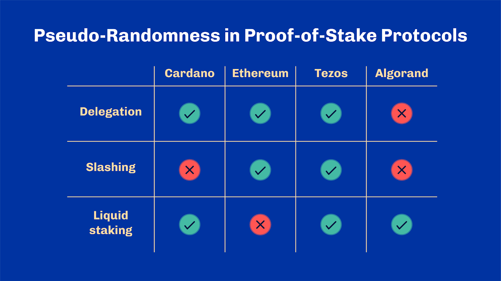
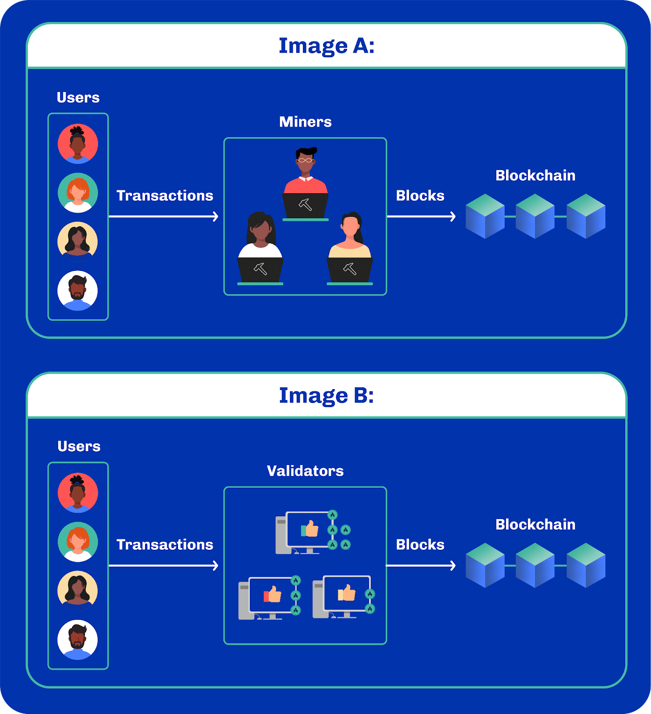

# Proof of Work & Proof of Stake

## Learning Objectives
By the end of this unit, the learner should be able to:
- Understand the key concepts behind proof of work including the limitations
- Understand the key concepts behind proof of stake including the limitations
- Compare proof of stake to proof of work
- Understand the differentiators of different proof-of-stake systems

## Introduction
Hello everyone, and welcome. My name is [lecturer name]

## Table of contents
In this unit, we explore two major consensus algorithms, proof of work (PoW) and proof of stake (PoS).  By the end of this unit, you will be able to differentiate between both, and understand their respective advantages and shortcomings. Let’s get started!

## Proof-Based Consensus
Proof-based consensus algorithms form the backbone of many blockchain networks, with proof of work and proof of stake being the most widely used.

Both proof of work and proof of stake add new blocks to a chain. In both cases, block producers contribute a resource to the network. In fact, block producers are given a chance to produce a block proportionally to the resource they contribute to the network. In proof of work, the resource is quantified in hashing power. In proof of stake, it is the underlying native currency of the network, also known as stake.

In proof of work, the higher the hashing power, the higher the chances for a node to be elected as a block producer. Note that in both cases – and in most proof-based consensus algorithms - assumptions are similar to those seen for Practical Byzantine Fault Tolerant (PBFT) which we covered in the previous unit. In particular, it is assumed that non-malicious actors are in control of a majority or supermajority of the system. So the key difference between the two consensus algorithms is the type of resource needed.

You may now wonder how we go from hashing power or stake to choosing a block producer. If that's the case, not to worry, we are about to dive in, starting with proof of work.

## Proof of Work
**Introduction** 

Block producers are called miners in proof of work. Their role is to solve mathematical puzzles based on the rules of the respective protocol. In particular, miners must find a suitable hash digest value for their block to be added to the chain. By ’suitable’ we mean the hash value must meet a specific criteria: Typically, we talk about a number of leading zeros when represented as a hexadecimal value.

As hashing functions are deterministic, miners must introduce a variable element to blocks, such as an arbitrary number. That number is called a nonce. Mining is, therefore, the process of repeatedly calculating hash digest values for many different nonce values until a suitable hash is found. Remember that hashing functions are one-way: finding a block from a given hash value is impossible. Indeed, miners cannot start from a suitable hash value and predict a block that would hash back to it. They have no other choice than to try again and again. This process of trying – and finding – is called work.

The number of leading zeros is chosen by the protocol. It is adjusted based on the available hashing power in the system such that, on average, a solution is found at regular intervals. This number of leading zero is also indirectly called the chain difficulty. When more hashing power is put into the system, the difficulty is increased to keep the block creation time relatively constant. This is important as work must have a crucial property: it must take time. We'll understand why shortly.

Once miners have done the work, they are entitled to produce a block. They can broadcast the block they have mined to the network. The block itself serves as proof. In fact, any other miner can easily and quickly calculate the hash digest value of that block. They can verify that it meets the requirements imposed by the protocol. There's no ambiguity about the results. It is also entirely safe for miners since no other node of the system can tamper with their block. If they attempted to, the hash value would change and there is virtually zero chance that the new hash would satisfy the chain difficulty. To alter a block, miners would have to redo the work. And this is why the work must take significantly longer than the proof verification.

## Proof of Work vs Bitcoin
Although proof of work is often synonymous with Bitcoin, it should be noted that there is a difference between the Bitcoin protocol and proof of work in principle. We just described a very Bitcoin-centric view involving miners, nonces, and hashing. However, what is truly fundamental to proof of work is this notion of asymmetry between a prover and a verifier. Work must be hard to produce, but easy to verify.

So even if proof of work is often described as the "Bitcoin consensus" or "original blockchain consensus", it is a consensus far older than Bitcoin itself. The term was formalized and defined for the first time by Markus Jakobsson and Ari Juels in their paper "Proofs of Work and Bread Pudding Protocols" in 1999, yet the concept even predates this. In their paper, Jakobsson and Juels describe that in proof of work, a "prover demonstrates to a verifier that she has performed a certain amount of computational work in a specified interval of time".

Fast forward to Bitcoin, Satoshi Nakamoto used proof of work as part of the overall Bitcoin consensus mechanism. He coupled this with a cryptocurrency to create the first public permissionless Byzantine fault-tolerant consensus algorithm. While Bitcoin uses proof of work at its core, it also adds elements, such as the longest chain rule and the notion of adjustable difficulty.

## Drawbacks
Proof of work, especially Bitcoin proof of work, is fantastic from an intellectual perspective because it solves a complex problem elegantly. Yet, one of the most commonly cited drawbacks is energy consumption. Indeed, the system's security directly depends on its total hashing power. The more hashing power, the less feasible it is for a malicious actor to suddenly acquire a large portion of it. Paradoxically, adding more power to the system doesn't make it perform better, as the difficulty is constantly adjusted. 10 years ago, Bitcoin produced one block every 10 minutes. Today it still produces one block every 10 minutes despite using about 5 million times more computing power. While the system isn't particularly more efficient and uses a lot of energy, it is significantly harder to falsify than 10 years ago.

However, this race to energy and dedicated hardware isn't sustainable for many. A large portion of the blockchain industry looked at ways to drastically reduce the energy requirements of proof-of-work consensus algorithms. Others explored the idea of creating "useful work" rather than merely computing a meaningless hash value. Ofelimos, for example, describes a protocol for solving optimization problems through work in a distributed fashion.

Some of these efforts led to new proof-based consensus algorithms. The most widely explored family, you guessed it, is proof of stake.

## Proof of Stake
**Virtual resources** 
Proof of stake borrows from the core idea behind proof of work: block producers are elected proportionally to their hashing power. Zooming out a bit, hashing power is a resource that participants to the consensus protocol commit to the system. What if another type of resource was used? Moreover, how do we ensure it doesn’t create any unintended consequences such as the energy consumption of proof of work? The answer proposed by Sunny King and Scott Nadal, the inventors of PeerCoin in 2012, was to use stake; a completely virtual resource.

This is the first fundamental difference between proof of work and proof of stake. The former relies on a physical resource that materializes as dedicated hardware: the mining rigs. The latter is entirely virtual and only exists -- at least initially -- within the system itself. In proof of stake, block producers will commit their own assets to the consensus protocol and are chosen proportionally to their commitment. It is called stake as it reflects how much "skin-in-the-game" each participant has in the system. And similarly to proof of work, security assumptions only hold provided that a majority or supermajority of the stake is owned by honest participants.

**Follow the Satoshi** 
So, we have the stake. But where is the proof? And how do we tie the two together? One core idea initially formulated by Bentov et al is an algorithm called "follow-the-satoshi". The idea is simple.

Imagine all the circulating supply of a network divided into its smallest possible unit. In the case of Bitcoin, the smallest unit is a Satoshi, where 100 million Satoshi equals 1 bitcoin. Billions and billions of coins of the smallest amount. Each of those coins would have an owner engraved on it. Now, put all these coins in a rather large bag and blindly pick one at random. The owner of the chosen coin becomes the designated block producer.

And this is it! Pick a coin from all available coins and follow it back to its owner. This simple approach ensures that the chances of being picked are proportional to the stake owned - provided the coin is picked randomly. We'll come back to this in a second.

Interestingly enough, this concept initially introduced for proof-of-stake consensus was later borrowed by Bitcoiners who not only looked at owners of ‘Satoshis’ but also defined a way to order them and assign them unique numbers. These are now called ‘Bitcoin ordinals’ and have become the basis for many other features of Bitcoin, such as NFTs. One can also derive features with different rarity levels by ordering satoshis with a unique rank. For example, the first Satoshi created in a block or the first satoshi of a halving cycle. Okay, enough digressing; let's come back to following the satoshis.

One question remains: how to pick a Satoshi at random?

**(Pseudo-) Randomness** 
Randomness is a challenging topic in computer science and mathematics. It is suitably complex, that it has become a source of philosophical debates about randomness and whether humans, or anything built by them, can produce random outcomes. Instead, scientists prefer to work with the notion of pseudo-randomness. A value is pseudo-random if it appears to be statistically random. Said differently, finding a pattern that could explain how values are produced is computationally infeasible. While it may sound easy, humans are generally terrible at producing even pseudo-random outputs. Repeatedly picking a number between 0 and 10 in your head would likely end up with regularities and noticeable patterns on a large enough sample. Thus, whenever someone, including in this course, refers to randomness in computer science, they actually mean pseudo-randomness.

In proof of work, block producers are chosen pseudo-randomly, due to the nature of the work. In the case of Bitcoin, it is due to the nature of hashing functions chosen for their uniformity. Every hash value is generated with a roughly equal probability across the entire range of possible outputs. It's like rolling a dice, though, with billions and billions of sides. This is very convenient as it acts as a relatively good source of pseudo-randomness. It is impossible to predict who will win the lottery. Effectively it leads to a random election of block producers -- also called leaders.

This is the second fundamental difference between proof-of-work and proof-of-stake systems. While proof-of-work consensus can usually rely on work as a source of randomness, proof-of-stake systems must introduce a new mechanism. A notable attempt to solve this problem is the original Ouroboros protocol by Kiayias et al, designed for Cardano. Ouroboros proposes a system based on a secure multi-party computation between the different participants to the consensus protocol in order to produce secure randomness.

In essence, each participant contributes to calculating the random value, taking into account the previous activity of the system. This makes it hard in practice for a single actor to influence the random outcome, especially when many participants are involved.

Later, advances in cryptography by Micali et al led to the elaboration of Verifiable Random Functions. These combine public-key cryptography and hashing into functions that can be used to generate pseudo-random values from an input, as well as proof that values are generated correctly without allowing verifiers to produce or alter values themselves. This has become a choice of randomness for various major proof-of-stake blockchains such as Cardano (through Ouroboros Praos), Polkadot, Algorand or Dfinity.

In any case, one of the primary goals for proof-of-stake systems is to rely on a source of randomness that does not demand performing heavy computations. Instead, they leverage complex cryptographic techniques to harness similar benefits for a fraction of the energy cost. We could coin this as our third fundamental difference. Proof-of-stake systems tend to be much more energy efficient and minimize the number of real resources they use. In contrast, proof-of-work systems encourage a continuous race using energy consumption.

**Drawbacks** 
Is proof of stake the silver bullet, then? As always, reality isn't binary. A significant issue of proof-of-stake systems is their plutocratic aspect: the rich get richer over time. The rights to produce blocks is proportional to the stake owned, and block producers are awarded for producing blocks. Thus participants that produce more blocks get awarded more. And consequently, they are increasingly more likely to produce future blocks.

In addition, using stake as a consensus resource may contradict a currency's very purpose. By spending their stake, users in the network arguably reduce their influence and ability to participate in consensus. Pushing this line of thought to the extreme, proof-of-stake consensus could completely paralyze a network. This would harm one of the key properties of distributed systems: liveness.

Third, there are many debates regarding the bootstrapping of proof-of-stake networks. In proof of work, tokens are issued through mining. On the other hand, in proof of stake, they usually result from an Initial Coin Offering (ICO) before the start of the network. Tokens would be sold beforehand to raise capital leading to few individuals controlling a large portion of the stake in the system very early on. The Cardano blockchain followed a hybrid approach whereby a portion of the total supply was allocated through vouchers that could be redeemed for tokens after the blockchain launch, while a significant part of the supply remained unallocated. Since 2020, a fraction of this unallocated supply has continuously been put into circulation through the creation of blocks as an incentive to participate in the consensus protocol early on, very much like block rewards on Bitcoin.

All-in-all, these are relevant concerns to remember when looking at proof-of-stake projects and how they are composed. Many projects introduce mechanisms to cope with these drawbacks and mitigate their impact.

## Proof of Stake vs Proof of Stake
We've covered the fundamentals behind proof of work, proof of stake, and their key differences. However, the proof-of-stake landscape is even more scattered and deserves more attention. So let's compare proof of stake with proof of stake.

**Delegation** 
The first differentiator relates to the ability of stakeholders to delegate their stake. This is common in the proof-of-stake landscape and for good reasons. Indeed, delegation can allow many small actors to unite and stand against more prominent actors. In a certain way, this is a mechanism to limit the plutocratic aspect of proof-of-stake systems. On a different note, it also copes with stakeholders' lack of desire (or capacity) to actively participate in the consensus protocol. Not everyone wants to run a node and keep an eye on a complex infrastructure stack. In fact only some people are equipped to do so.

As stake is ultimately the resource used for consensus, it is crucial for the security of proof-of-stake protocols that the largest possible amount of stake participates in the consensus. Remember that a majority of honest participants is required. The lower the active stake, the easier malicious actors can reach the critical threshold. Still, some protocols purposely decide to not introduce any form of delegation, while others, like Cardano, do.

In most delegated proof of stake, delegators are also rewarded for it. This is because delegating is indirect participation in the consensus. It helps to secure the network. As such, this behavior is generally incentivised through rewards.

**Slashing** 
Some protocols also implement slashing mechanisms to sanction adversarial behaviors in the system. Consequently, participants in the consensus protocol that do not follow the rules or misbehave forfeit a portion of their stake to the protocol. This might happen regardless of delegation but is mainly used in delegated settings. In such a scenario, it becomes a way for delegators to ensure that their chosen representative does their job correctly. For some, it is essential for the good functioning of proof-of-stake protocols. For others, it creates an unhealthy relationship between delegators and delegates.

**Liquid vs Frozen Stake** 
Finally, let's briefly talk about stake liquidity, another common differentiator of proof-of-stake systems. Many systems have opted to make stakes illiquid or frozen. This means that stake, while used to participate in the consensus, cannot be exchanged like a regular asset. It is locked for the duration of the consensus. This approach creates an artificial separation between the stake and the actual network currency, even though they are, in principle, coming from the same initial quantity.

On the other hand, some protocols, like Cardano, choose to keep the stake liquid. Indeed, while staked, Ada can still be exchanged on the network. This may spark the question: how can one ‘follow-the-Satoshi’ if it constantly moves? In the case of Cardano, this is achieved through regular snapshots. The time is divided into chunks, and the leader election is done using the stake distribution of previous chunks. We'll explain this in more detail in the subsequent units.

## Review
Oof! This probably felt like a lot. Indeed, we've covered many things. Please take a moment to pause, and let's do a final review of the key points. We've seen how proof of work is about creating a mathematical puzzle that is hard to solve but easy to verify. We've spoken about how Bitcoin uses proof of work at its core while introducing new concepts such as the longest chain rule and the adjustable chain difficulty. We've mentioned the energy waste that led scientists to look for alternative solutions to proof of work and how proof of stake came to be. We then discussed how to find a random leader by "following the satoshi" and highlighted the importance and difficulty of finding a good source of randomness. Finally, we discussed a few drawbacks attributed to proof of stake and essential differentiators between various proof-of-stake systems: delegation, slashing and liquid staking.

## References
Nguyen, Cong & Dinh Thai, Hoang & Nguyen, Diep & Niyato, Dusit & Nguyen, Huynh & Dutkiewicz, Eryk. (2019). Proof-of-stake Consensus Mechanisms for Future Blockchain Networks: Fundamentals, Applications and Opportunities. IEEE Access. PP. 1-1. 10.1109/ACCESS.2019.2925010.  
Jakobsson, Markus, and Ari Juels. "Proofs of work and bread pudding protocols." In Secure information networks, pp. 258-272. Springer, Boston, MA, 1999. 
Nakamoto, Satoshi. "Bitcoin whitepaper." URL: https://bitcoin. org/bitcoin. pdf-(: 17.07. 2019) (2008).
King, Sunny, and Scott Nadal. "Ppcoin: Peer-to-peer crypto-currency with proof of stake." self-published paper, August 19, no. 1 (2012). 
Giang-Truong Nguyen and Kyungbaek Kim (2018). A Survey about Consensus Algorithms Used in Blockchain. Journal of Information Processing Systems, 14(1), 101-128. DOI: 10.3745/JIPS.01.0024. 

## Glossary
- *Slashing*: This is when participants in the consensus protocol do not follow the rules or misbehave, and forfeit a portion of their stake in the protocol.
- *Liquid Stake* : When stake is used to participate in consensus, it can also be exchanged like a regular asset.
- *Frozen Stake*: When stake is used to participate in consensus, it cannot be exchanged like a regular asset. It is locked for the duration of the consensus.
- *Pseudo-randomness* : Reliable source of values that appear random such that it is computationally infeasible to distinguish them from truly random values.

## Questions

### Select the two correct statements about proof of work and proof of stake systems.

- [ ] Only proof of stake adds new blocks to a chain.
- [ ] In proof of stake, “stake” refers to the underlying native currency of the network.
- [ ] Block producers only contribute resources to the network in proof of work.
- [ ] In proof of work, the resource block producers contribute to the network is quantified in hashing power.

See correct answer

- [x] In proof of stake, “stake” refers to the underlying native currency of the network.
- [x] In proof of work, the resource block producers contribute to the network is quantified in hashing power.

### What is the key difference between proof of work and other proof-based consensus algorithms, such as proof of stake?

1. The assumption that non-malicious actors control the majority of the system.
1. The type of resource needed to achieve consensus.
1. The number of nodes required for consensus.
1. The use of digital signatures for authentication.

See correct answer

2. The type of resource needed to achieve consensus.

### What is crucial about the “work” in proof-of-work consensus?

1. It must use complex cryptographic functions.
1. It must be complex enough to take some time yet be feasible.
1. It must be as fast as possible to perform.
1. It can be made more efficient by adding more computing resources.

See correct answer

2. It must be complex enough to take some time yet be feasible.

### Proof of work was invented for Bitcoin.

1. True.
1. False.

See correct answer

2. False.

### What is one of the most common drawbacks of the proof-of-work consensus algorithm, especially in the context of Bitcoin?

1. It produces too many blocks over time.
1. It becomes easier to falsify over time.
1. It consumes a significant amount of energy.

See correct answer

3. It consumes a significant amount of energy.

### Select the correct statements about proof-of-stake consensus algorithms.

- [ ] In proof of stake, block producers are elected according to their hashing power.
- [ ] In proof of stake, block producers will commit their own assets to the consensus protocol and are chosen proportionally to their commitment.
- [ ] Proof of work relies on physical resources such as mining rigs, while proof of stake uses a completely virtual resource called stake.
- [ ] In proof of stake, block producers are elected based on their ownership of mining rigs.

See correct answer

- [x] In proof of stake, block producers will commit their own assets to the consensus protocol and are chosen proportionally to their commitment.
- [x] Proof of work relies on physical resources such as mining rigs, while proof of stake uses a completely virtual resource called stake.

### View the images below and select the one showcasing a proof-of-stake algorithm.

<!-- TODO: It would be better to split this image in two and have the question be about selecting the right one -->

1. Image A shows a proof-of-stake algorithm.
1. Image B shows a proof-of-stake algorithm.
1. Both images show a proof-of-stake algorithm.

See correct answer

2. Image B shows a proof-of-stake algorithm.

### What is the fundamental principle of the "Follow-the-Satoshi" algorithm?

1. The owner of the first Satoshi created in a block becomes the designated block producer.
1. The owner of a randomly picked Satoshi from all available coins becomes the designated block producer.
1. The owner of the last Satoshi created in a block becomes the designated block producer.

See correct answer

2. The owner of a randomly picked Satoshi from all available coins becomes the designated block producer.

### “Follow-the-Satoshi” is a methodology to create NFTs on Bitcoin.

1. True.
1. False.

See correct answer

2. False.

### Select the correct statement that best describes a significant concern that relates to proof-of-stake systems.

1. Proof-of-stake systems can lead to a plutocratic aspect where the rich get richer, as block production rights are proportional to the stake owned.
1. Proof of stake has never used Initial Coin Offerings (ICOs) for bootstrapping and always relies on mining for token issuance.
1. In proof-of-stake systems, block producers are chosen randomly without any regard to the amount of stake owned.

See correct answer

1. Proof-of-stake systems can lead to a plutocratic aspect where the rich get richer, as block production rights are proportional to the stake owned.

### What is NOT true about proof-of-stake consensus?

1. It requires a good source of randomness.
1. It utilizes a virtual resource to choose block producers.
1. It can cope with arbitrarily many adversaries in the system.
1. It is more energy-efficient than typical proof of work.

See correct answer

3. It can cope with arbitrarily many adversaries in the system.

### True or False: Proof of work and proof of stake both work like a lottery to elect a block producer.

1. True.
1. False.

See correct answer

1. True.

### Where does proof of work get its source of randomness for the leader election?

1. From the content of blocks, transactions and other data from users.
1. From the moment blocks are created.
1. From the determinism of hashing functions.
1. From the uniformity and collision resistance of hashing functions.

See correct answer

4. From the uniformity and collision resistance of hashing functions.

### What is the name of the cryptographic tool that several major proof-of-stake blockchains use to generate randomness?

1. PBFT.
1. VRF.
1. Follow-the-Satoshi.
1. Hashing.

See correct answer

2. VRF.

### What is always true about delegation in the context of proof of stake?

1. It enables more stakeholders to take part in the consensus.
1. It requires the custody of assets through a delegate.
1. It introduces a risk to forfeit assets when a malicious delegate misbehaves.
1. It prevents assets from being exchanged while delegated.

See correct answer

1. It enables more stakeholders to take part in the consensus.

### The more stake participates in the consensus, the more secure a proof-of-stake system?

1. True.
1. False.

See correct answer

1. True.

### Select two correct statements about slashing in proof-of-stake systems.

- [ ] It was designed to try and sanction adversarial behaviors within a system.
- [ ] It was designed as a way to reward participants by adding to their portion of the stake.
- [ ] It was designed to build stronger relationships between delegators and delegates.
- [ ] It causes any participants who misbehave to forfeit a portion of their stake.

See correct answer

- [x] It was designed to try and sanction adversarial behaviors within a system.
- [x] It causes any participants who misbehave to forfeit a portion of their stake.

### Select the correct statements about liquid and frozen stakes.

- [ ] Frozen stakes create a separation between the stake and the network currency.
- [ ] Cardano never chooses to keep its stakes liquid.
- [ ] The “follow-the-Satoshi” algorithm is impossible if the stakes are liquid.
- [ ] If frozen, stakes can't be exchanged like regular assets and are locked during consensus.

See correct answer

- [x] Frozen stakes create a separation between the stake and the network currency.
- [x] If frozen, stakes can't be exchanged like regular assets and are locked during consensus.

