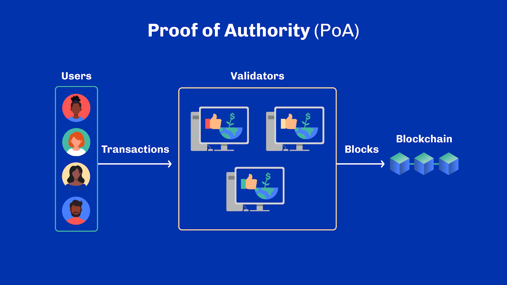

# Unit 9 - Other Approaches to Consensus

## Learning Objectives
By the end of this unit, the learner should be able to:
- Provide examples of different kinds of proof-based consensus models

## Introduction
Hello everyone, and welcome. My name is [lecturer name] and I'll be your lecturer for the next unit.

## Table of Contents
So far in this course, we have focused on the two main consensus models - proof of work (PoW) and proof of stake (PoS). There are many others - each with their own benefits and limitations. In this unit, we will look at several of them from Proof of Authority to Proof of History. Let’s get started!

## Beyond Proof-of-Work and Proof-of-Stake Consensus Algorithms
Beyond proof of work and proof of stake, there are many other consensus algorithms out there. To mitigate potential weaknesses associated with an individual algorithm, one can combine methods for achieving consensus to form Hybrid Algorithms. An example of this is Peercoin. Its authors have proposed a definition called the ‘coin age’ of each miner, which is calculated from the stake multiplied by the time that the miner has owned it. Hence Peercoin could be considered the first variant of proof of stake, but it still uses proof of work. And this is only one example.

Since the advent of Bitcoin, there has been an ever-increasing number of alternative proof-based consensus algorithms. Before we dive further into some more examples, there’s a noteworthy disclaimer to keep in mind. There are many consensus algorithms, but few have solid security proofs and models. Even when Bitcoin first came out, it lacked strong security arguments on some of its aspects. It’s only a few years later with more formalization and available frameworks to assess the security claims of Bitcoin.

As we go through different consensus algorithms, bear in mind for any given protocol, security claims are only as good as the adversarial model and hypothesis that are used. The better the model, the better the proof.

## Proof of Authority (PoA)
Proof of authority employs a reputation-based model to validate transactions and generate new blocks. Validators act as moderators within the blockchain system. They are typically institutional investors or strategic partners, selected and approved by other network participants. Their identities are disclosed to ensure full accountability.

Unlike proof-of-stake blockchains that require financial capital only, proof-of-authority blockchains also rely on social capital. Hence, validators must invest heavily in the network financially and put their reputation at stake too. This process filters out dubious actors while incentivizing honest nodes committed to the network's long-term success.

Proof of authority blockchains are often considered relatively centralized due to their validator selection process. However, the limited number of validators within these systems allows for high scalability. As a result, proof of authority consensus mechanisms are well-suited for private, permissioned blockchains or consortiums that publicly disclose their primary stakeholders.

Proof of authority is used by the VeChain, Xodex, and TomoChain projects.

## Proof of Activity (PoA)
Proof of activity (PoA) was proposed in 2014. It should not be confused with proof of authority as it uses the same abbreviation POA.

Proof of activity combines both proof of work and proof of stake, and introduces two types of nodes: miners and validators. Miners attempt to produce a block by finding a correct nonce that leads to a valid hash digest, akin to Proof-of-Work. Validators are then selected based on their stake as well as information in the blocks to validate and confirm the block. A block is considered added to the ledger only after these two steps. Transaction fees are split between miners and validators.

Proof of activity is used by the Decred and Espers blockchains.

## Proof of Importance (PoI)
Proof of importance (PoI) is a proof-of-stake-based method that tries to evaluate nodes' contributions rather than focusing solely on nodes’ stake for participation in consensus.

Proof of importance takes into account additional factors beyond stake when selecting a block producer. The exact scoring criteria used in proof of importance varies. Some proof of importance algorithms borrow from network clustering and page ranking methods. They use criteria such as the number of transfers a node has recently processed, as well as the level of connectivity with other nodes of the network.

The proof of importance consensus mechanism is used in the New Economy Movement (NEM) project.

## Proof of Burn (PoB)
In proof of burn, block producers have to virtually destroy their coins to get the right to produce a block.

Coins are effectively “burnt”, which means they are no longer part of the system and cannot be used by anyone else. The more tokens a miner burns, the higher the chance the miner will be selected as the next block producer. Miners within a proof-of-burn system are able to operate using far less energy than classic proof of work needs. And to prevent an unfair advantage of early adopters, algorithms often introduce a notion of decay of the burnt coins. This forces block producers to regularly have to burn coins to keep their rights in the system. A good analogy is to think of proof of burn as a way to virtually buy mining equipment. First, you pay for it, then you regularly pay for its maintenance in order to keep mining.

The proof of burn consensus mechanism is used by Counterparty, Slimcoin, and Factom blockchains.

## Proof of Capacity (PoC)/ Proof of Space (PoSpace)
In proof of capacity  (PoC), also known as proof of space (PoSpace), block producers have to invest their money on hard disks as storage.

This is much cheaper than computing devices for proof of work. Proof of space will generate many large datasets called plots on the hard disks. Datasets generally take a long time to generate, with cryptographic functions that require a large amount of memory. The more plots a block producer has, the more chance it will get to generate the next new block. Leader selection process is effectively proportional to the disk space of each participant.

Proof of space is used in Signum, SpaceMint, Storj, Permacoin, Areweave and Chia blockchains.

## Proof of Elapsed Time (PoET)
Proof of elapsed time (PoET), proposed by Intel, is executed in a special environment called the trusted execution environment (TEE).

It uses a special device of Intel known as Intel Software Guard Extensions (XGS). Each block producer will request a wait time from a trusted enclave at the same time. This is also known as a trusted function inside specific hardware. All the block producers will receive their wait time from the enclave, and together will wait until their received time elapses. When a block producer waits enough time, but has found no one has finished the waiting match, it gets a chance to generate a new block and broadcast it to the rest network.

Proof of elapsed time (PoET) is used in Sawtooth Lake blockchain.

## Proof of Contribution (PoCo)
Proof of contribution protocols monitor the contributions of active nodes in a network.

They award the right to generate the next block to nodes with the highest contribution value. In proof of contribution, users who wish to perform on-chain computations must stake a security deposit.

During each consensus round, eligible users propose results until a result meets the required confidence threshold. Each user's contribution level depends on their historical track record, staking amount, and the accuracy of their calculated results.

Nodes computing the validated result receive consensus rewards in the form of transaction fees and stake lost by users with erroneous results. Consensus rewards are split among users who provide the same accurate result.

Proof of contribution is used in the iExec project. Also, a modified version of proof of contribution, known as delegated proof of contribution (DPoCo) is used in ICON blockchain.

## Proof of History (PoH)
Proof of history (PoH) operates via a built-in historical record that proves the specific moment in time every on-chain event occurred.

Most other blockchains require multiple validators to collectively agree on when each transaction has taken place. In proof of history, each individual validator maintains its own internal clock. This is done by encoding the passage of time using a verifiable delay function (VDF) and sequential hashing.

Producing an output with a verifiable delay function takes several sequential steps – and thus some time, whereas verifying an output is fast. When used in systems that are precisely calibrated, the production of a VDF proof serves as a timestamp. Thus, time translates roughly to a number of hash calculations in the system and it is possible to figure out the right order of events based on what hash digest they refer to.

Each time validators communicate, a cryptographic proof of the relative order and time of each message is recorded onto the ledger. This allows the network to ignore local clocks and accommodate potential network delays on their own time. This provides efficient delivery and reassembly of all involved transaction data without needing to wait for sequential block confirmations across the entire network.

Proof of history is used in the Solana blockchain which combines traditional Practical Byzantine Fault Tolerance (PBFT) with proof of history to reduce message latency and overhead, with elements of proof of stake for the block producer selection.

## Review
In the world of decentralized networks, finding agreement on a single source of truth is crucial. As the blockchain sector evolves, consensus mechanisms play a vital role in determining a network's security, accessibility, and sustainability.

In this unit, we have explored notable proof-based blockchain consensus algorithms beyond proof of work and proof of stake. We have considered their strengths and weaknesses. It's important to note that blockchain engineers and researchers are constantly innovating, combining different aspects of consensus algorithms to create hybrid protocols. These unique algorithms may not always fit traditional classifications, but they contribute to the ongoing evolution of blockchain technology.

The dominance of proof of work and proof of stake-based consensus is substantiated by the security proofs and numerous research work conducted. While other approaches are promising explorations, it is still early to say anything truly conclusive about many of them.

That’s all for now. I hope you enjoyed going through it as much as I did. See you next time!

## References
Hu, Junjie, and Ke Liu. "Raft consensus mechanism and the applications." In Journal of physics: conference series, vol. 1544, no. 1, p. 012079. IOP Publishing, 2020. 
King, Sunny, and Scott Nadal. "Ppcoin: Peer-to-peer cryptocurrency with proof-of-stake." self-published paper, August 19, no. 1 (2012). 
Bentov, Iddo, Charles Lee, Alex Mizrahi, and Meni Rosenfeld. "Proof of activity: Extending bitcoin's proof of work via proof of stake [extended abstract] y." ACM SIGMETRICS Performance Evaluation Review 42, no. 3 (2014): 34-37. 
Kim, Sungmin, and Joongheon Kim. "POSTER: Mining with proof-of-probability in blockchain." In Proceedings of the 2018 on Asia Conference on Computer and Communications Security, pp. 841-843. 2018. 
Blockchain Consensus Encyclopedia - Tokens Economy Gitbook [Internet]. Tokens Economy. 2019. Available from:  https://tokens-economy.gitbook.io/consensus/blockchain-consensus-encyclopedia-infographic - Accessed: 29 August 2022 
J. Tromp, “Cuckoo cycle: a memory-hard proof-of-work system,”, Available: https://eprint. iacr.org/2014/059.pdf , 2015. 
S. King, “Primecoin: cryptocurrency with prime number proof-of-work,” Available: http://primecoin.io/bin/primecoin-paper.pdf , 2013. 
Z. Liu, S. Tang, S. S. M. Chow, Z. Liu, and Y. Long, “Forking-free hybrid consensus with generalized proof-of-activity,”, Available: https://eprint.iacr.org/2017/367.pdf , 2017. 
S. King and S. Nadal, “PPcoin: peer-to-peer crypto-currency with proof-of-stake,” 2012 [Online]. Available: https://decred.org/research/king2012.pdf.  
Federated Consensus [Online]. Available: https://chain.com/docs/1.2/protocol/papers/federated-consensus.
I. Bentov, C. Lee, A. Mizrahi, and M. Rosenfeld, “Proof of activity: extending bitcoin's proof of work via proof of stake,” ACM SIGMETRICS Performance Evaluation Review, vol. 42, no. 3, pp. 34-37, 2014.  
J. Blocki and H. S. Zhou, “Designing proof of human-work puzzles for cryptocurrency and beyond” 
https://www.investopedia.com/terms/p/proof-burn-cryptocurrency.asp 
https://www.investopedia.com/terms/p/proof-capacity-cryptocurrency.asp 
https://www.investopedia.com/terms/p/proof-activity-cryptocurrency.asp 
https://www.gemini.com/cryptopedia/blockchain-consensus-mechanism-types-of-algorithm#section-proof-of-storage-po-storage-proof-of-replication-po-rep-proof-of-spacetime-po-spacetime 

## Glossary
- *Proof of authority (PoA)*: Proof of authority consensus algorithm employs a reputation-based model to validate transactions and generate new blocks.
- *Proof of activity (PoA)* : Proof of activity consensus algorithm combines both proof of work and proof of stake, and introduces two types of nodes: miners and validators.
- *Proof of importance (PoI)*: Proof of importance consensus algorithm is a proof-of-stake-based method that tries to evaluate nodes' contributions rather than focusing solely on nodes’ stake for participation in consensus.
- *Proof of burn (PoB)* : In proof of burn consensus algorithm, block producers have to virtually destroy their coins to get the right to produce a block.
- *Proof of capacity (PoC), also known as Proof of space (PoSpace)*: In proof of capacity consensus algorithm, also known as proof of space, block producers have to invest their money on hard disks as storage.
- *Proof of elapsed time (PoET)*: Proof of elapsed time consensus algorithm was proposed by Intel. It is executed in a special environment called the trusted execution environment (TEE).
- *Proof of contribution (PoCo)*: Proof of contribution consensus algorithm monitors the contributions of active nodes in a network to a multi-party computation. They award the right to generate the next block to nodes proportionally to their contributions.
- *Proof of History (PoH)*: Proof of history consensus algorithm uses calibrated hash functions as a time substitute. Hash timestamps are used to prove the order of events on-chain.

## Questions

**Sub-Unit 1**

*Why are hybrid algorithms useful for achieving consensus?*
- They increase the complexity and resource requirements of individual algorithms, leading to a more exclusive network participation
- They solely rely on one type of consensus algorithm, decreasing any risks from outside algorithms
- **They reduce the potential weaknesses linked to individual algorithms (CORRECT ANSWER)**

*True or False. All proof-based protocols provide the same level of security and robustness.*
- True
- **False (CORRECT ANSWER)**

**Sub-Unit 2**

*What makes proof of authority (PoA) different from proof of stake when it comes to the requirements for validators?*
- PoA only relies on financial capital
- **PoA requires both financial investment and reputation at stake (CORRECT ANSWER)**
- PoA is entirely decentralized and doesn't require any investment

*What types of blockchain are proof of authority consensus mechanisms suitable for?*
- They are suitable for fully decentralized public blockchains that prioritize anonymity
- **They are suitable for private, permissioned blockchains or consortiums that require high scalability (CORRECT ANSWER)**
- They are suitable only for blockchains that solely rely on financial investment

**Sub- Unit 3**

*In proof of activity protocols, which of the following is true?*
- **Blocks are forged by miners following proof of work, and checked by validators using proof of stake (CORRECT ANSWER)**
- Block producers are selected based on how much traffic they have generated for the network in the past
- Block producers must hand over proofs of employment from a trusted list of companies to be entitled to mine blocks
- Miners cannot produce empty blocks. All blocks have to contain as many transactions as possible

**Sub-Unit 4**

*What distinguishes the proof of importance (PoI) consensus mechanism from traditional proof-of-stake methods?*
- PoI relies solely on nodes' financial stake for participation in consensus
- **PoI evaluates nodes' contributions by considering factors beyond just the financial stake (CORRECT ANSWER)**
- PoI prioritizes the oldest nodes in the network for block production
- PoI is exclusively used for decentralized finance (DeFi) projects

*Take a look at the two images below and select the proof of importance (PoI) image. (Image Question)*

- Image A: Proof of importance
- **Image B: Proof of importance (CORRECT ANSWER)**
- Both images are examples of PoI

**Sub-Unit 5**

*Select the INCORRECT statement regarding proof of burn (PoB).*
- Miners must destroy tokens to be granted rights to forge blocks
- Slimcoin is a project that uses PoB as its main consensus mechanism
- **Only early adopters can burn coins and participate in consensus as burning is only allowed for old coins (CORRECT ANSWER)**
- PoB still requires mining blocks using an approach similar to PoW, but with far less energy

**Sub-Unit 6**

*Select two correct statements about proof of capacity (PoC) / proof of space (PoSpace) consensus algorithms.*
- Datasets do not take a long time to generate since they don’t need large amounts of memory
- Hard disk storage is a much more expensive option than computing devices for proof of work
- **The more plots a block producer has, the more chance it will get to generate the next new block (CORRECT ANSWER)**
- “Plots” are large datasets on the hard disks generated by proof of space (CORRECT ANSWER)

*What is the main consensus resource used for choosing block producers in proof of capacity (PoC)?*
- Electric battery capacitance
- Water tank capacity
- Diplomas and official certifications
- **Disk storage space (CORRECT ANSWER)**

**Sub-Unit 7**

*How does the proof of elapsed time (PoET) method allow a block producer to generate a new block?*
- By using a voting mechanism among all the block producers
- **By requesting a wait-time from a trusted source, waiting for it to elapse, and if no one else finishes first, they get the chance to create a new block (CORRECT ANSWER)**
- By counting the number of transactions a block producer has processed before

*True or False. Proof of elapsed time requires specific hardware.*
- **True (CORRECT ANSWER)**
- False

**Sub-Unit 8**

*What factors influence a user's contribution level in a proof of contribution protocol?*
-**Staking amount, historical track record, and the accuracy of calculated results (CORRECT ANSWER)**
- Number of blocks generated, staking amount, and network speed
- Accuracy of calculated results, total stake lost, and transaction fees
- Historical track record, network connectivity, and total stake in the network

**Sub-Unit 9**

*This type of protocol uses calibrated hashing functions as a way to measure the passing of time. Which one is it?*
- Proof of time (PoT)
- Proof of hashing (PoH)
- **Proof of history (PoH) (CORRECT ANSWER)**
- Proof of delay (PoD)

*What type(s) of consensus does Solana use?*
- Proof of stake (PoS) and proof of elapsed time (PoET)
- **Proof of stake (PoS) and Proof of History (PoH) (CORRECT ANSWER)**
- Proof of work (PoW) and proof of history (PoH)
- Proof of restart (PoR)
