# Unit 1 - Transactions Models

## Learning Objectives

> [!NOTE]
>
> By the end of this unit, you should be able to:
>
> - [x] Define transaction models in the context of blockchain
> - [x] Be able to differentiate between the main types of transaction models
> - [x] Describe Extended UTxO (EUTxO)
> - [x] Describe different transaction types on blockchain
> - [x] Define a token and the life cycle of a transaction using a token

## Introduction
Hello everyone, and welcome. My name is [lecturer name].

## Table of Contents
In this unit, we will walk through how blockchain processes transactions. We will explore the different record-keeping models, including the accounting model, the Unspent Transaction Output or UTxO model, and Cardano's innovation - the Extended UTxO model. So, let’s get started.

## Tokens
To understand how transaction models work, it's essential to understand tokens first. Tokens play a central role in these systems and are crucial for their functioning.

A token is a type of digital asset or utility stored on the blockchain. Each public permissionless blockchain has its own unique token. In Cardano, the token is ada, named after mathematician Ada Lovelace, the world's first computer programmer. In Ethereum, it is ether; and in the Bitcoin blockchain, it is bitcoin.

Just like a dollar can be divided into cents, ada can be divided into smaller units called "Lovelace" with six decimal places. One ada is equal to one million Lovelace. In Bitcoin, one bitcoin equals one hundred million Satoshi; and in Ethereum, one ether equals ten to the power of eighteen wei, or ten to the power of nine gwei.

There are various kinds of tokens. Tokens tied to the underlying functional design of a blockchain are called native tokens and are one of the biggest innovations brought by Bitcoin. They serve as the primary means of exchanging value for transactions and incentivizing network participants. As they are integral to the blockchain's operation, their value creates a self-sustaining economy that supports the network and its interactions. In newer platforms, like Ethereum and Cardano, other kinds of tokens can be created for specific use cases.

**Addresses** 
Before we dive in, we need to rapidly introduce a concept that we’ll be referring to quite often: Addresses. There’s a lot to say about addresses and we’ve reserved an entire unit about them later, so we won’t go into detail yet. For now, it is sufficient to understand that an address is derived from a public key. They represent ownership and are commonly shared between users and applications. Addresses are said to “hold funds”, which means that they are associated with the underlying private key from which a signature is required in order to spend funds they carry.

**Browsing Tokens** 
You can browse the tokens associated with each address using blockchain explorers. Here are some examples: For Cardano, we have https://explorer.cardano.org/. For Bitcoin, there’s https://btcscan.org/, and for Ethereum, we can use https://ethscan.org/.

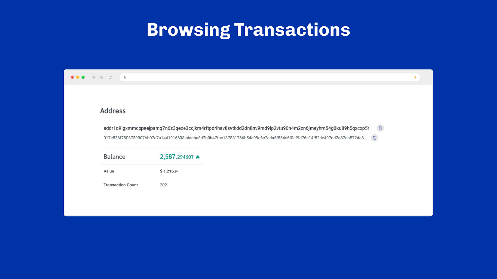

## Transactions
Now that we have a basic understanding of tokens, let’s look at the transaction lifecycle.

Transactions are atomic modifications to the blockchain ledger, meaning they either happen in full or don’t happen. In essence, transactions are data structures containing an order to transfer blockchain tokens between user addresses. The transfer takes place from a token source, called an input, to a destination, called an output.

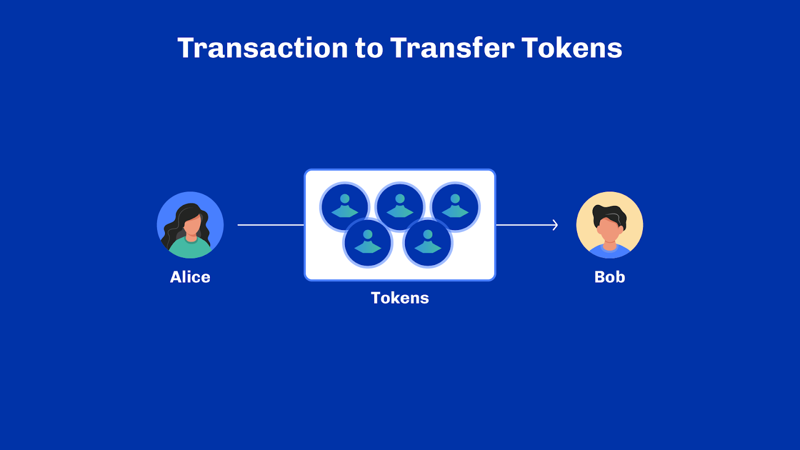

**Transaction Life Cycle** 
Blockchain technology is designed to guarantee the completion of transfers. The process of creating transactions, transmitting them across the network, getting verified, and then being included in a block is fundamental to the design.

The first step in the transaction lifecycle is to create it . A transaction contains inputs, outputs, and an amount. Inputs identify where the blockchain tokens come from. Outputs identify where the tokens are going to. Amount specifies how many tokens should be transferred from inputs to outputs.

Step 2: The transaction is signed. Once a transaction is created, it must be signed using a private key to authorize it. For example Alice, who owns the inputs, signs it using her private key. Only the holder of the private key can sign the transaction, though the creator of the transaction itself can be anyone. Once a transaction is digitally signed, it is sealed and cannot be altered. As a result, it can be sent through any network without fear of tampering.

Step 3: The transaction is submitted. Once a transaction is signed, it is submitted to any node on the blockchain network. This can be done by the user who signed the transaction or another entity. The user and the nodes do not need to know or trust each other.

Step 4: The transaction is validated. As soon as a transaction is sent to a block producer connected to the network, it is validated by that block producer. If the transaction is valid, the block producer will make it available to other block producers. The other block producers it is connected to will continue to propagate it across the network in a peer-to-peer fashion. If the transaction is invalid, however, block producers will reject it and will not propagate it.

Finally, step 5: The transaction is added to a block. Once validated and distributed across the network, the transaction will eventually be included in a block by a block producer. Other nodes add it to their own local chain. Finally, when the recipient, Bob, receives a copy of the transaction from his connected node, he will see the funds from Alice via his wallet.

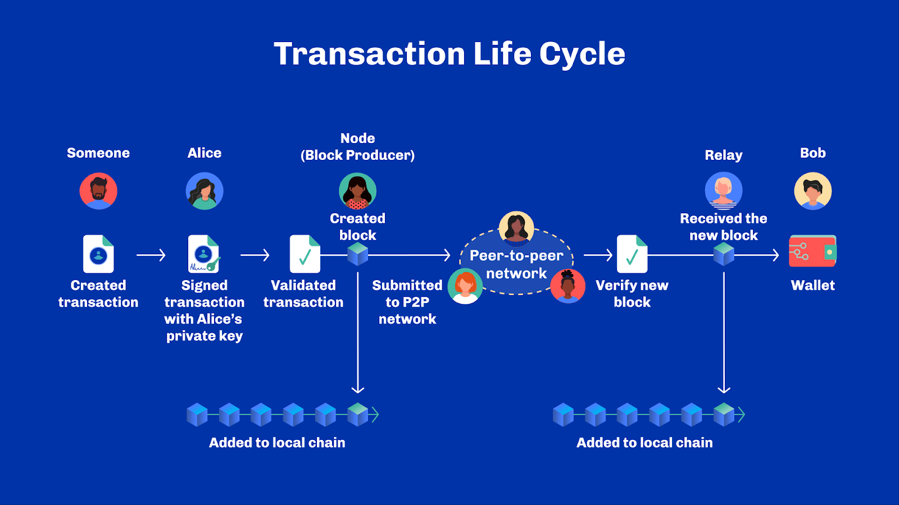

**Transaction Fees** 
Most transactions include fees that must be paid by the sender of the transaction. These transaction fees compensate the block producers for processing the transaction. This includes validating the transaction, inserting the transaction into a new block, and sending the new block to other nodes on the network. Transaction fees are an incentive mechanism for block producers to maintain the network and include transactions in the next block.

They also serve as a penalty mechanism to reduce spam transactions, or any kind of system abuse, because they impose a minimal cost on every transaction.

Although transaction fees are one of the most common protections against spamming attacks, they are not always mandatory in blockchains.

**Transaction Models** 
Now that we’ve covered the transaction cycle. Let’s look at what governs that cycle: transaction models. In the blockchain world, two major record-keeping models exist: UTxO-based and Account-based. UTxO, which stands for Unspent Transaction Output, was first introduced by Bitcoin. It serves as a way to track tokens that have been owned by one user and are now available to be spent by another user.

In a complex distributed computing environment, it's essential to have an effective way to keep track of records. That's where UTxOs come in. Tokens are locked in UTxOs. It’s where they are stored. When a transaction takes place, the tokens are moved from one set of UTxOs to another. The UTxOs that the tokens are being transferred from are called "inputs," and the new UTxOs created by the transaction are called "outputs."

Account-based blockchains work like traditional bank accounts. Each user has an account.  After processing a transaction, the balance on the account increases or decreases based on the transaction amount. Ethereum uses the account-based model, which allows for a smart contract to be associated with an account’s address. This facilitates complex logic to be associated with transactions, making the model more flexible than UTxO.

Cardano introduced EUTxO - an extended version of UTxO with extra features, including safer and more secure smart contract capabilities. More on this later in the unit.

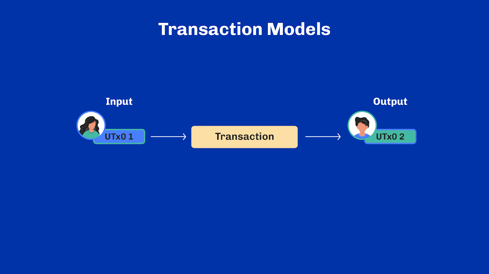

## UTxO Model
For now, let’s consider a simple off-chain example to understand how UTxO works. Alice orders a pizza for eight dollars, which Bob delivers. Alice hands over a twenty-dollar bill from her wallet and receives twelve dollars in change from Bob. So far, this is straightforward.

Let’s look at this in the blockchain domain. Alice has twenty tokens in the form of a single UTxO in her wallet to pay for her pizza. In blockchain, when using an UTxO as a transaction input for token transfers, the UTxO must be spent in its entirety.  This means that the UTxO, and all its tokens, must be spent in full. Similarly, one cannot tear a twenty-dollar bill into two ten-dollar bills. Instead, the twenty-dollar note is spent in its entirety and change is provided in return. The same with UTxOs. The UTxO cannot be divided and must be spent in full, but, of course, you do get your change. In our pizza example, Alice uses her entire UTxO of twenty  tokens as input and creates two new UTxOs as outputs. The outputs are one UTxO with a value of eight tokens sent to Bob for the pizza, and another UTxO of twelve tokens, the change, going back to Alice’s wallet.

A transaction is like a receipt that describes precisely this operation for anyone to inspect. In particular, it tells nodes to remove spent inputs from their ledger and to add the produced outputs instead.

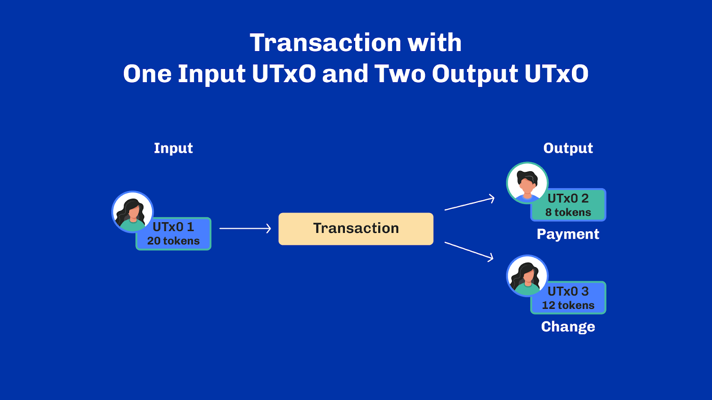

**Spending Multiple Input UTxOs** 
When Alice does not have a single bill in her wallet to pay for something, she will obviously combine several smaller bills instead. The same goes for blockchain transactions. If Alice doesn't have a single UTxO with enough tokens to complete a transaction, she can use multiple UTxOs to gather the required token amount for the transaction.

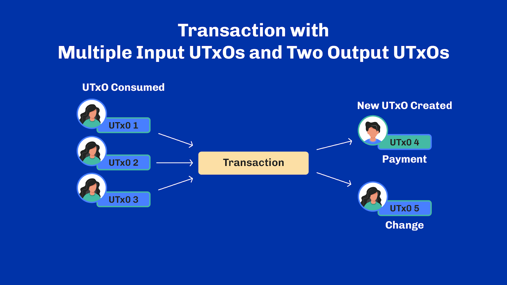

**A Transaction with Transaction Fees** 
Transaction fees enter the picture in the middle of all this. They are the difference between the sum of inputs and the sum of outputs. Any excess amount that remains after all outputs have been deducted from all inputs is considered a fee.

Alice wants to spend 8 tokens to buy coffee from Bob. To ensure this transaction is processed promptly, she includes a transaction fee of 0.5 tokens. This means the total value of the consumed transactions is 8.5 tokens. Her wallet must therefore source a UTxO set that adds up to 8.5 tokens or more and, if necessary, define the change amount.

Let’s assume Alice's wallet contains three UTxO entries with a total amount of 10 tokens. Therefore, Alice will need to use these three UTxO entries, creating one output to Bob’s café for 8 tokens and a second output amount of 1.5 tokens in change back to her own wallet. This leaves 0.5 tokens unallocated as an implicit fee for the transaction.

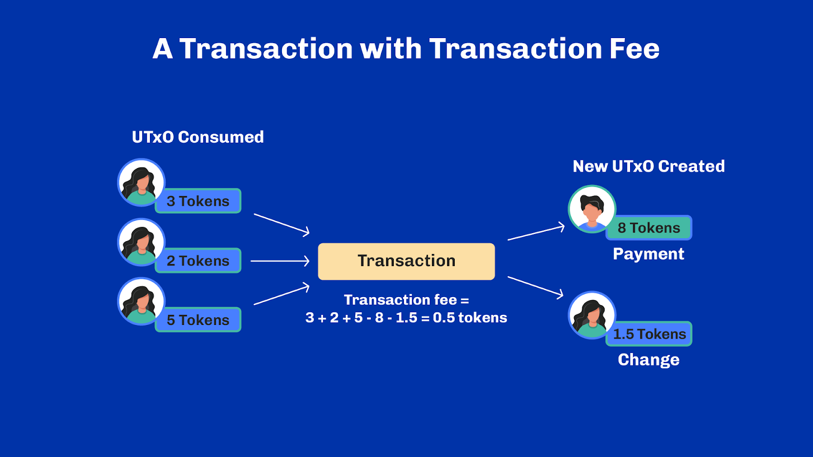

Users must be careful not to accidentally pay a high fee by not spending their inputs fully. For instance, if using a 20 token UTxO to pay for a 1 token transaction, a 19 token change output back to the user’s wallet must be included. Otherwise, the 19 unused tokens will be considered as a transaction fee by the block producer processing the transaction. Although the user will receive priority processing and make the block producer happy, this is probably not what was intended.

Note that on Cardano, fees are explicitly stated in the transaction, and the ledger verifies that the implicit difference between inputs and outputs matches the amount stated as fees. If they do not, it rejects the transaction. This is an additional mechanism to protect against errors.

**Spent and New UTxOs in a Blockchain** 
As we mentioned, the consumed UTxOs are called 'inputs', and the newly created UTxOs are called ‘outputs.’ Outputs of previous transactions, therefore, become inputs of future transactions. Over time, this forms a type of data structure called a Directed-Acyclic Graph (DAG), as shown in the diagram below.

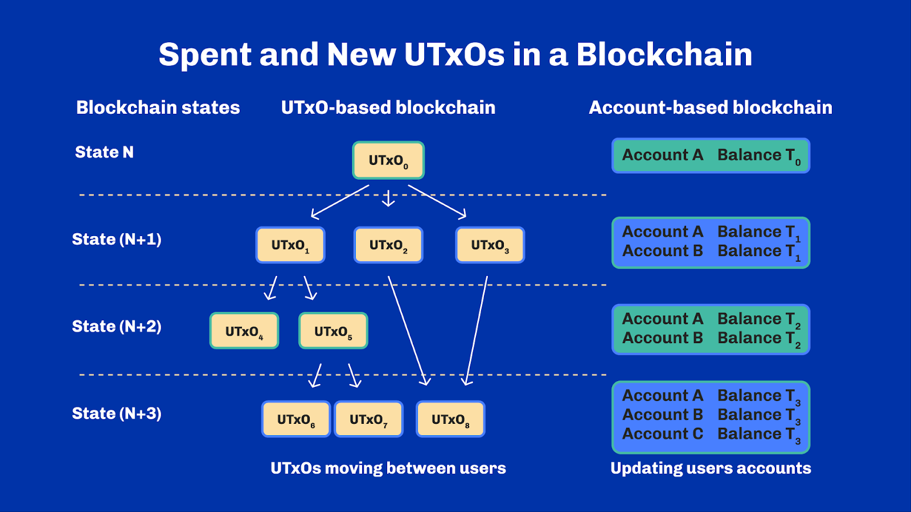

In the UTxO model, the user’s wallet software keeps track of all user’s UTxOs to show the user’s account balance. The balance is the sum of UTxOs controlled by one or more wallet addresses. From the diagram [Fig. 5.1.9.] we can see that each UTxO can be used as an input to a new transaction. Once a UTxO is used, it becomes "spent" and can not be used again. In a transaction, an address and value are specified to create a new output. That output can then be used in another transaction.

The right to use that UTxO in another transaction depends on the address specified as output in the previous transaction. Think of an address as a lock that can only be opened with the correct key, which is the signature produced by the matching private key.

**Wallets and UTxOs** 
In an account-based blockchain, a user's token balance is stored in an account that can be controlled by either a private key or a smart contract. It's important to note that the idea of change doesn't exist in this type of model.

A UTxO-based blockchain keeps track of all user’s UTxOs so that a user’s token balances can be determined by summing up the tokens in each UTxO.

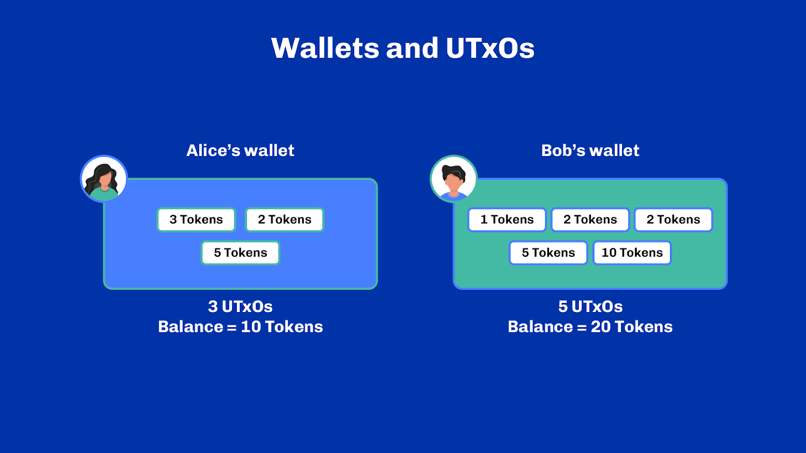

**Transactions Change the State in the Blockchain** 
Each node in a blockchain network continually keeps track of all UTxO entries. This is called the blockchain’s state and it is stored in each node's data directory. Transactions change the state of the system. So we can look at blockchains as replicated deterministic state machines. Let’s break that down.

A state machine is a computer science concept whereby a machine can have multiple states but only one at any time. A state describes the current representation of the system. Transactions change that state. Changes from a state to another are called transitions. The state machine is said to be deterministic because anyone can reproduce the entire sequence of transitions and always end up with the same result.

As you can see in the diagram, transactions, which are the actions performed on the network, cause changes in the current state of the system. The state is updated when a new block, with the most recent transactions, is included in the chain.

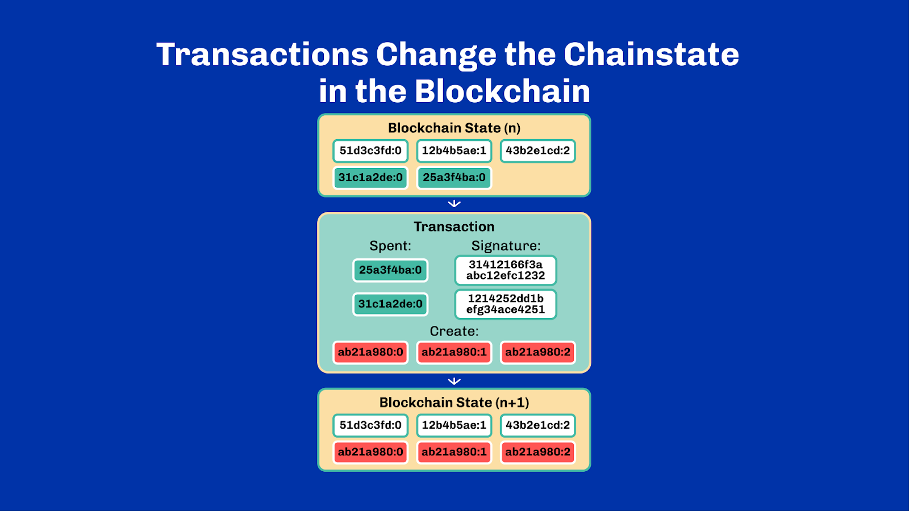

**Transaction ID and Output Index in UTxOs** 
So how are UTxOs referenced in the system?
As shown here, a UTxO entry is uniquely identified by two components:
- The hash digest of the transaction that originated it - the transaction id
- And the position of the output within that transaction - the output index.

Any valid UTxO entry in the system can be referenced using a transaction id and an output index.

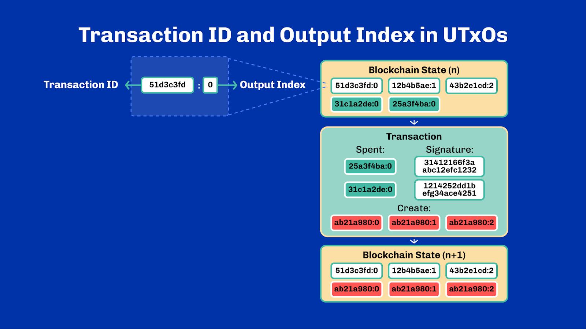

**Differences Between UTxO-Based and Account-Based Models** 
Let’s summarize the differences between UTxO-based and Account-based models.

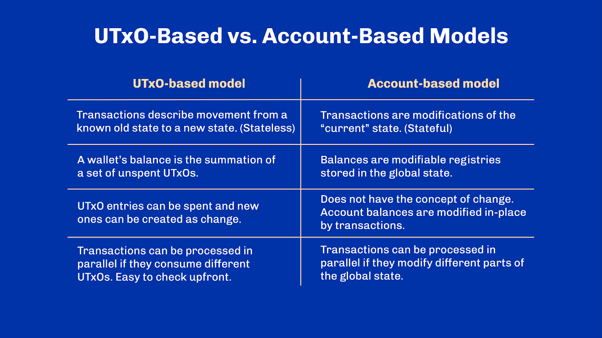

## Extended UTxO (EUTxO)
computer program or a transaction protocol that enforces the execution of actions according to the terms of a contract or an agreement.

However, Ethereum’s account-based model means contracts modify the global chain’s state all at the same time, concurrently. Running smart contracts modifies the ledger but only carries modifications and does not have any reference to the previous state. The problem is that a smart contract may not even be applicable by the time it reaches a block producer. This is not deterministic, so it makes the account-based model unpredictable in practice.

To address this challenge, Cardano introduced Extended UTxO - improving the UTxO model to support smart contracts while preserving determinism. EUTxO also introduced a kind of state machine suitable for program execution on a blockchain ledger.

A key difference between EUTxO and Ethereum-like contracts is the moment a smart contract’s logic is executed on the blockchain.

Ethereum contracts are activated when a transaction is sent to them. Cardano smart contracts, on the other hand, are executed when someone tries to spend from a UTxO that has a smart contract attached.

The material difference is that in Cardano, the contract's on-chain code checks if the conditions needed to spend the UTxO are met - specifically when an attempt is made to spend the UTxO. Whereas in Ethereum, the contract is a sequence of instructions that is waiting to be executed upon activation. It is activated by paying into it and may in turn, produce new transactions by itself and activate more smart contracts in a cascade.

In other words, an on-chain smart contract script in Cardano is a validator that verifies a transaction and either authorizes a spend or rejects it. It does not produce any side effects such as cascade activations like in Ethereum. An EUTxO-based application therefore requires an off-chain infrastructure to monitor on-chain activity and trigger actions accordingly. That being said, we usually call smart contracts the ensemble: the on-chain validation script and its supporting off-chain infrastructure.

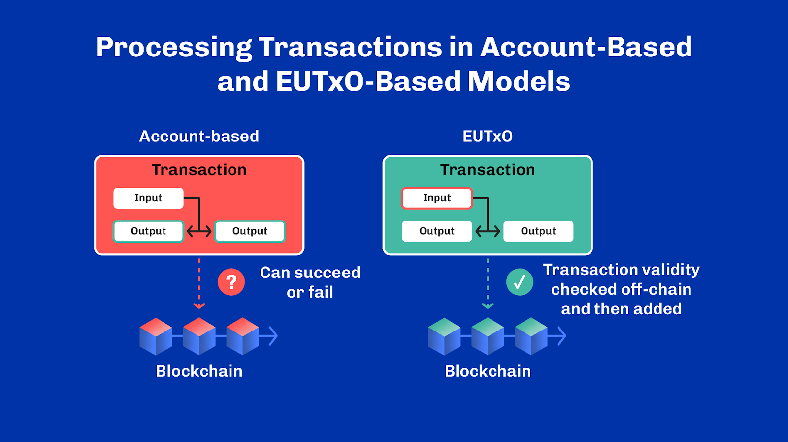

**Processing Transactions in Account-Based and EUxTO-Based Models** 
The EUTxO model offers unique advantages over the account-based model. The success or failure of transaction validation depends only on the transaction itself and its inputs. Transactions can be analyzed in isolation since they do not rely on any external factor that may vary, such as time or the global state. More specifically, transaction validations are split into two phases. The first phase is fast and performs structural checks on the transaction. Block producers also confirm the presence and validity of inputs. The second phase executes any scripts carried by the transaction, using the well-formed transaction as an execution context.

As a consequence, the validity of a transaction can be checked off-chain, before the transaction is sent to the blockchain network. This also means that the fees required for a valid transaction can be predicted precisely prior to submitting it. This contrasts with Ethereum, where transactions can fail mid-execution. In a typical account-based blockchain, contracts need to retrieve state from the chain, whereas in EUTxO that state is fully encapsulated in the transaction.

**UTxO vs. EUTxO** 
As shown in the diagram [Fig 5.1.16], the EUTxO model augments the traditional UTxO model with two new elements: datum and redeemer. Both are pieces of data provided at different moments. The datum is provided in the output when it is created, by the party who locks the funds. The redeemer, on the other hand, is supplied in the transaction that is spending the funds. Think of a guessing game where the datum is the secret word to find and the redeemer is the guess that one makes.

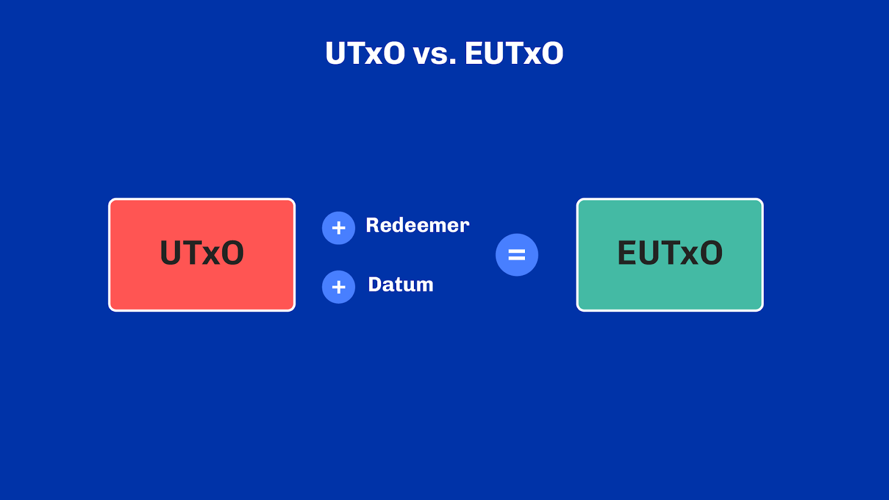

**Script, Datum, and Redeemer** 
We’ve said earlier that addresses in outputs referred to public keys. With EUTxO, addresses can also refer to scripts. Each script defines arbitrary unlocking logic that must be met in order for the unspent output to be spent.

This logic is called the validator script or, simply, the script. On execution, each script uses its datum, redeemer, and transaction elements to determine whether to unlock funds. Let’s look at this example to help us understand the relationship between a script, a datum, and a redeemer. The script can be thought of as a mathematical function returning a yes or no.

It is a function with parameters and arguments. The function parameters represent the datum, and the function argument represents the redeemer.

Funds are locked together with the specific function and its parameters, but the argument -  the information needed to unlock the funds -  is only provided when attempting to spend them.

So, conceptually, locking funds in an address is like choosing a function f and its parameters a and b. That function is expected to return “yes” or “no” for specific values of the argument x. Yet, the argument, or the redeemer x, is only provided when spending.

This is what makes the EUTxO model completely deterministic: the function and its parameters are known ahead of time. And given the same inputs, the outcome of the script is always predictable. Note that thanks to the datum, a validation script can be reused in other contexts and adapt to different situations. It makes the validator logic more flexible.

This extended programming capability sets Cardano apart from Bitcoin, as it considers the whole transaction context and allows developers to provide additional parameters  when determining whether an unspent output can be spent.

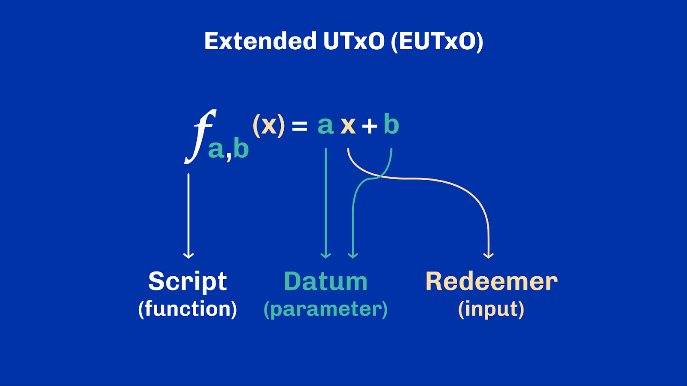

## Transactions and EUTxOs
How does a block producer run a script in a EUTxO model blockchain?

As you know, nodes keep track of a ledger, the record of all transactions executed by the platform. That ledger includes the EUTxO set created from all blocks. A EUTxO dependent on a script will have the hash value of the script in its address field and a datum.

The actual script and its redeemer are contained separately in the users’ transactions.
Now, when a node receives a script-based transaction to process, it generates the hash of the script in the transaction and compares it with the hash of the script in the EUTxO. If they match, the block producer will run the function represented by the script, using the datum from the EUTxO and the redeemer from the transaction. To be considered a valid transaction, all scripts involved in it must return a non-error value when executed – that is, they should all validate that their spending conditions are met by the transaction.

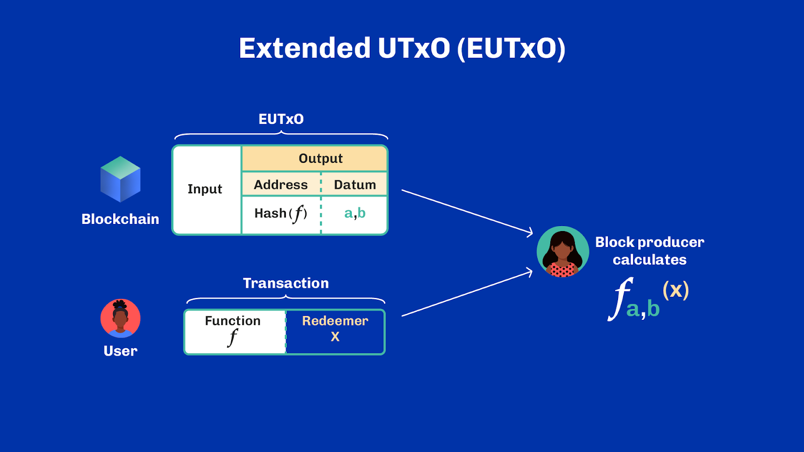

## Review
Let’s recap what we have learned in this lecture:

In this unit we looked at transaction models - specifically, the Extended UTxO record-keeping model in Cardano.

We started with a simple overview of tokens and why they matter in transactions and the blockchain ecosystem. We compared account-based and EUTxO transaction models then walked through the transaction life cycle. Finally, we looked at what EUTxO has to offer and how it makes developing applications safer and more scalable.

We hope you enjoyed it and I will see you in one of the next units.

## References
[Ref.5.1.1] Chakravarty, M. M., Chapman, J., MacKenzie, K., Melkonian, O., Peyton Jones, M., & Wadler, P. (2020, February). The extended EUTxO model. In International Conference on Financial Cryptography and Data Security, pp. 525-539, Sabah, Malaysia, Feb, 2020. 
[Ref.5.1.2] Brief introduction to Cardano's EUTxO accounting model,  Available: https://forum.cardano.org/t/brief-introduction-to-cardanos-eutxo-accounting-model/100893 ,  Accessed: Sep. 15, 2022. 
[Ref.5.1.3] Chard, F., & Fletcher-Smith, C. (2022). Blockchain scalability for smart contract systems using EUTxO model. arXiv preprint arXiv:2202.00561. 
[Ref.5.1.4] Sanchez F. “Cardano’s Extended EUTxO accounting model – built to support multi-assets and smart contracts”, Available: https://iohk.io/en/blog/posts/2021/03/11/cardanos-extended-utxo-accounting-model/ , Accessed: Sep. 15, 2022. 
[Ref.5.1.5] “EUTxO Handbook”, Available:
https://ucarecdn.com/e14c6f03-152d-4361-abaf-f1fee5eb2e4e/EUTxOhandbook3.pdf , Accessed: Sep. 15, 2022.x 
[Ref.5.1.6] Cardano fee structure, Available: https://docs.cardano.org/explore-cardano/fee-structure , Accessed: Jan 11, 2023. 

## Questions

### Select two correct statements about tokens.

1. Native tokens have nothing to do with the functional design of a blockchain
1. Each public permissionless blockchain has its own unique token 
1. The main method of exchanging value for transactions and motivating participants in the network is by using native tokens
1. It is not yet possible to create different types of tokens in newer platforms

See correct answer

2. Each public permissionless blockchain has its own unique token.
3. The main method of exchanging value for transactions and motivating participants in the network is by using native tokens

*What are blockchain explorers used for?*
- To alter or delete transaction records in the blockchain
- To generate new tokens or coins outside of the network's predefined rules
- **To browse the tokens associated with each address (CORRECT ANSWER)**

*A wallet address is derived from a public key and represents ownership. Addresses are commonly shared between users and applications.*
- **TRUE (CORRECT ANSWER)**
- FALSE

**Sub-Unit 2**

*What are transactions in blockchain?*
- Private contracts or agreements that occur off-chain, and are not recorded on the blockchain
- **Data structures containing orders to transfer blockchain tokens between user addresses (CORRECT ANSWER)**
- Software programs that can be executed in full or partially

*Transactions are atomic modifications to the blockchain ledger, meaning they can only be fully executed, never partially.*
- **TRUE  (CORRECT ANSWER)**
- FALSE

*Select two correct statements about the transaction lifecycle in a blockchain network.*
- A transaction is created by the owner of the inputs and it cannot be created by anyone else
- **The creator of a transaction and the signer can be two different individuals (CORRECT ANSWER)**
- A transaction is always only propagated by end users to other users in a peer-to-peer fashion
- **A transaction, once validated, is added to a block and distributed across the network in a peer-to-peer fashion (CORRECT ANSWER)**

*Analyze the image below and select the missing steps in the transaction life cycle*

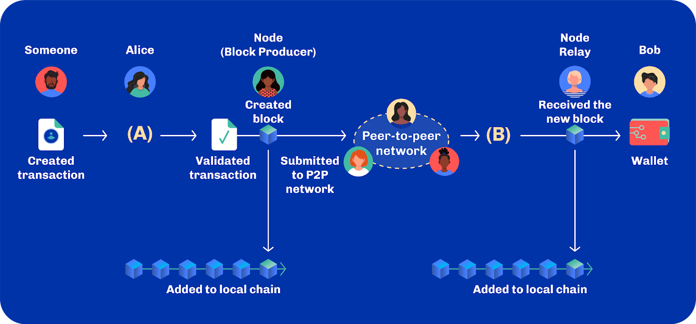

- **A: The transaction is signed; B: The transaction is verified (CORRECT ANSWER)**
- A: The transaction is verified; B: The transaction is signed
- A: The transaction is verified; B: The transaction is received

**Sub-Unit 3**

*Why do most blockchain transactions include a transaction fee?*
- The fee is a required payment that the recipient of the transaction has to pay as a reward to the sender
- **The fee is mainly there to pay block producers and prevent system resources abuses (CORRECT ANSWER)**
- The fee only exists to pay blockchain core developers

**Sub-Unit 4**

*Select the correct statements about UTxO-based and account-based transaction models.*
- UTxO stands for Unauthorized Transaction Output
- **When an account-based transaction takes place, the balance in a user’s account will either increase or decrease (CORRECT ANSWER)**
- Bitcoin uses account-based transaction models
- **Tokens are stored in UTxOs and are moved from one group to another when transactions happen (CORRECT ANSWER)**

*Some blockchains use an UTxO-based transaction model. In these, when a transaction takes place, the tokens locked in UTxOs are moved from one UTxO to another one or to multiple other ones. Each UTxO has to be spent in its entirety.*
**True (CORRECT ANSWER)**
False

*When using a UTxO as a transaction input for token transfers, the UTxO can be divided, so you only use what you need as input.*
True
**False (CORRECT ANSWER)**

*What can Alice do if she doesn’t have a single UTxO with enough tokens to complete a transaction?*
- She has no other option but to cancel the transaction as it cannot be completed
- **She can use multiple UTxOs to gather the needed amount (CORRECT ANSWER)**
- She can borrow additional tokens from other users

**Sub-Unit 5**

- *Select two correct statements about UTxO transaction fees.*
- **A ledger must confirm that the difference between the inputs and outputs equals the amount declared as fees or the UTxO transaction will be rejected (CORRECT ANSWER)**
- Transaction fees are 2% of the sum of all inputs
- Users will pay a lower transaction fee if they spend their inputs fully
- **On Cardano, fees can be explicitly stated in the transaction (CORRECT ANSWER)**

*Select two correct statements about spent and new UTxOs in a blockchain.*
- **Each UTxO can be used as an input to a new transaction (CORRECT ANSWER)**
- When a UTxO becomes “spent” after being used, it can still be used again
- **Once a UTxO is used, it can’t be used again (CORRECT ANSWER)**
- Newly created UTxOs are known as ‘fees’

*How do full-node wallets calculate a user’s token balance?*
- By consulting with a central server that maintains the blockchain ledger
- By relying on a user's private key to calculate their token balance based on their account status
- **By keeping track of all UTxOs and summing up the tokens in each UTxO (CORRECT ANSWER)**

*Which two components uniquely identify an UTxO entry?*
- Block header
- Address
- **Transaction id (CORRECT ANSWER)**
- **Output index (CORRECT ANSWER)**
- Private key

*Select the answer option that correctly labels the highlighted areas on the image below. (Image Question)*

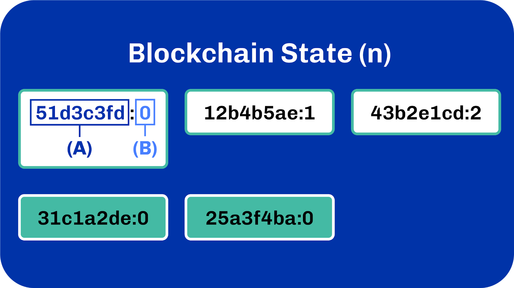

- **A = Transaction id, B = output index (CORRECT ANSWER)**
- A = Output index, B = blockchain state
- A = Transaction id, B = private key
- A = Private key, B = output index

*Match the correct statements to the correct models: UTxO or Account-based*

*Statement A: Balances are modifiable registries stored in the global state*
*Statement B: Entries can be spent and new ones can be created as change*
*Statement C: A previous state and a new state is fully captured within the transaction*
- **A: Account-based, B: UTxO-based, C: UTxO-based (CORRECT ANSWER)**
- A: UTxO-based, B: UTxO-based, C: Account-based
- A: UTxO-based, B: Account-based, C: Account-based

**Sub-Unit 6**

*Cardano introduced the EUTxO. What does the acronym stand for?*
- External unspent transaction output
- **Extended unspent transaction output (CORRECT ANSWER)**
- Exponential unspent transaction output
- Exceptional unspent transaction output

*Cardano smart contracts are executed when a transaction is sent to them, not when someone tries to spend from an UTxO that has a smart contract attached.*
- TRUE
- **FALSE (CORRECT ANSWER)**

*What is a unique advantage of the EUTxO model over the Account-based model?*
- Transactions in the EUTxO model rely on external factors like time or the global state, while Account-based model transactions do not
- In the EUTxO model, the success or failure of transaction validation depends on external block producers' decisions
- **The validity of a transaction in the EUTxO model only depends on elements specified in the transaction (CORRECT ANSWER)**

**Sub-Unit 7**

*What makes the EUTxO model completely deterministic?*
- **The script and datum are known ahead of time and given the same inputs, the outcome of the script is always predictable (CORRECT ANSWER)**
- The outcome of the script varies unpredictably with each transaction
- It allows for unlimited transactions without any prior knowledge of the script or datum

*In the context of the EUTxO model, what is the role of the redeemer?*
- It provides information needed to lock the funds in a script
- **It provides the information needed to unlock the funds when attempting to spend them (CORRECT ANSWER)**
- It functions as the script itself, defining the arbitrary unlocking logic for the unspent output

*Select the image that refers to the correct order of a script, datum and redeemer. (Image Question)*

- Same image - Datum, Script, Redeemer 
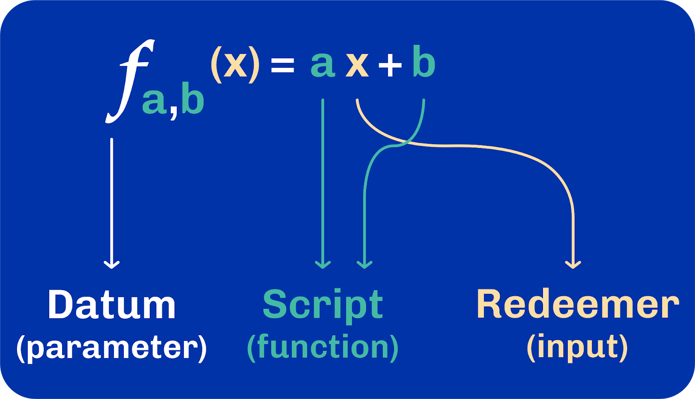

-Same image - Redeemer, Datum, Script 
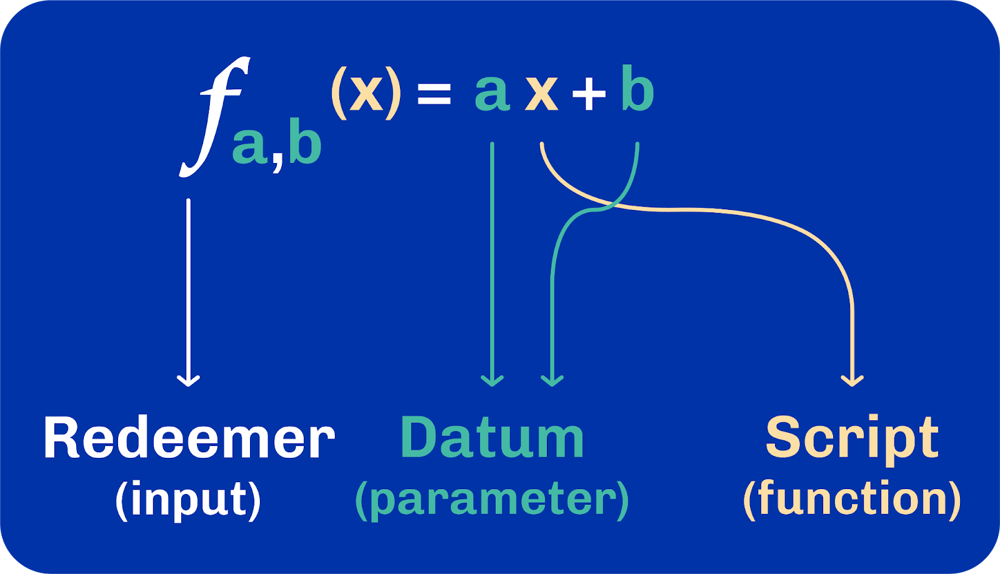

- **CORRECT - Script, Datum, Redeemer (CORRECT ANSWER)** 
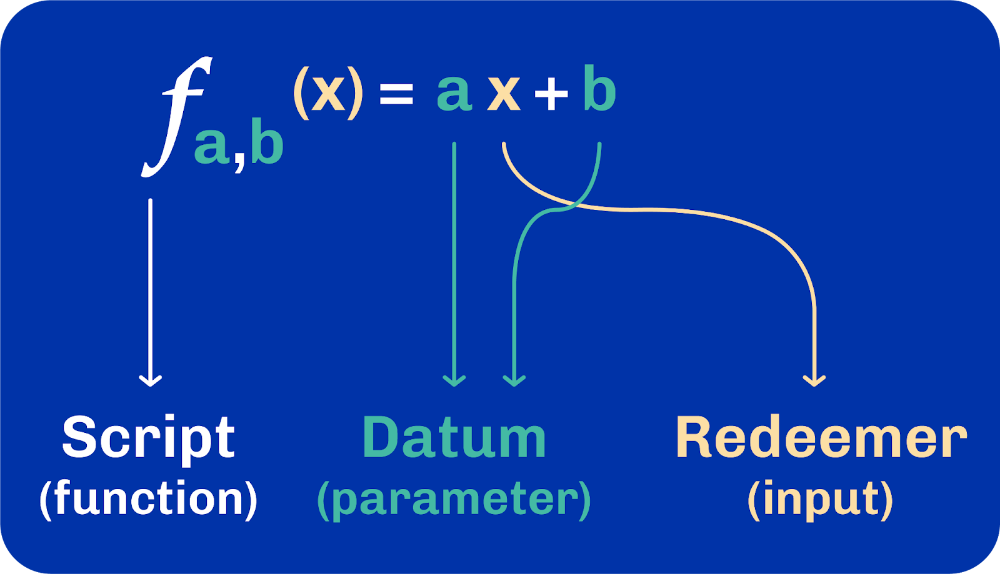

*What needs to happen for a EUTxO transaction to be considered valid?*
- At least half of the scripts involved need to return a non-error value when executed
- No scripts involved in the transaction should return when executed
- **All scripts involved must return a non-error value when executed (CORRECT ANSWER)**

