# Unit 5.2 - Chain Features
## Learning Objectives
By the end of this unit the learner should be able to:
- Explain how a block producer joins a blockchain and explain the longest chain rule in PoW and PoS
- Describe transaction confirmation, block height, block time, block size, and chain depth.
- Describe block header and block body format and contents
- Explain the meaning and use of the common prefix

## Introduction
Hello everyone, and welcome. My name is [lecturer name].

## Table of Contents
In this unit, we review the basics of block structure. We then explore how blocks form a chain, and we’ll look at some potential trade-offs when designing a blockchain. We’ll also get into new concepts like chain depth, quality, and growth. Some of this content will be familiar to you, so use this as an opportunity to test your understanding as we lay some more foundations to build upon later. Let’s begin.

## Creating Transactions on a Blockchain
As covered earlier, blockchain users create transactions and send them to the network to be processed by block producers. In this session, we will examine the process from the moment a transaction is submitted to the network to when the block producer creates a new block that includes that transaction.

A blockchain is a series of blocks. These blocks are used to store information related to transactions that take place on a blockchain network.  Before we dive into the details of how a block producer creates new blocks, let’s examine how a block producer actually joins a blockchain network and prepares for block production.

## Block Producer Joining a Network - Steps
The first step for a block producer is to join the blockchain network. We know from Unit 3  that any node can freely join a public permissionless network.

Step two: The block-producing node begins by sending a request to find other nodes on the network. Whoever replies to its requests will be added to its neighboring nodes list. There is no need for any authentication process or to establish any trust relationship between nodes.

Step three: The block producer submits a request to its neighboring nodes for a copy of the blockchain data. Each node sends a copy, but each copy received may differ. To determine which copy of the blockchain is the correct one, the block producer generally uses the longest chain rule.

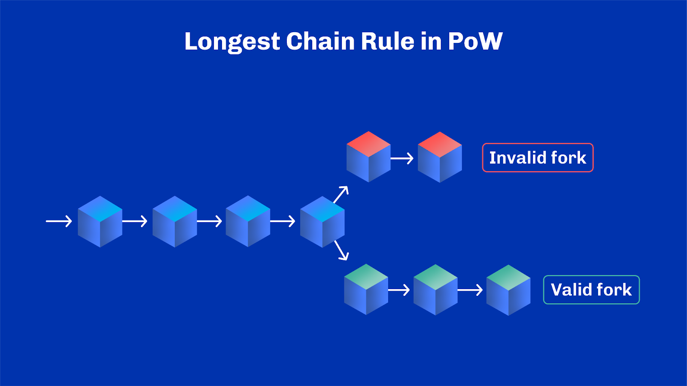

Here’s how it works. The block producer compares the blocks in the chains and identifies the commonalities between them. As you can see in the diagram, the blocks in the chains differ and form a fork. The blockchain with a longer branch is taken as the valid blockchain. The block producer then disregards the shorter branches. This process, known as the longest chain rule, ensures that the block producer works with the blockchain's most commonly agreed-upon version. Both Cardano and Bitcoin use the longest chain rule.

## Genesis Block
In order for a new block-producing node to join a network, it needs an initial configuration detailing the genesis block, which will in turn allow it to synchronize the blockchain. The genesis configuration should be provided from a trusted or well-known source. Once the new block producer has the genesis configuration, they can use the longest chain rule, as previously explained, to receive subsequent blocks from any other block producers. This rule is sufficient for the proof-of-work algorithm used in Bitcoin, as producing a long chain of blocks requires significant computing resources.

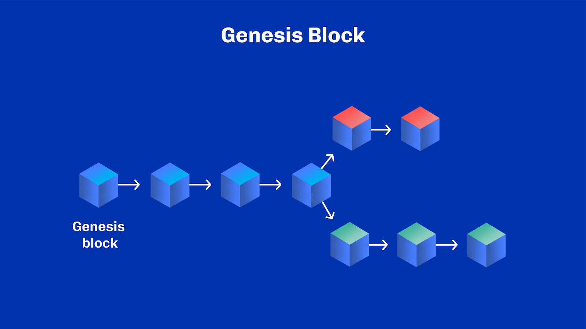

## Longest Chain Rule in PoS
However, as Cardano uses a proof-of-stake algorithm, it applies a different version of the longest chain algorithm.

- Step 1: A new node synchronizes with existing nodes.
- Step 2: The node then identifies similarities and differences (forks) between the received copies.
- Step 3: It determines the correct chain by selecting the one closer to other branches and, therefore, closest to what all blockchain nodes agreed on.

Let’s define what closest technically means. Closest is defined by a common prefix parameter called k. This parameter k represents the maximum length of a fork, or if you prefer, the longest divergence in the chain from a common ancestor or what’s called an ‘intersection point’.

In the diagram, let’s make k=2. A node already has chain A and sees chain B. Both chains have a common prefix that respects k=2 because if we remove two blocks from chain A we end up with a sub-chain, or prefix, that is included in chain B. Because chain B represents a valid fork longer than chain A, it’ll be adopted by the node.

We’ll discuss the common prefix k later in this unit.

## Block Producers’ Mempool
After obtaining a valid copy of the blockchain, a block-producing node is able to receive and process transactions so that it can forge new blocks. These transactions are sent by users via their wallet applications and are broadcasted through relay nodes on the network, eventually reaching each and every block-producing node, including this newly connected one.

The transactions are collected into a ‘mempool’ of unconfirmed transactions for each block producer. A mempool is a collection of transactions that have not yet been added to a block and are waiting to be processed. Block-producing nodes verify transactions forwarded to them, and when valid, add them to their own local mempool and broadcast them to other peers on the network. It is important to note that each block-producing node maintains their own separate mempool, and there is no global shared mempool. Also, because mempools are usually capped in size, different nodes of the network may have, at times, different transactions in their mempools.

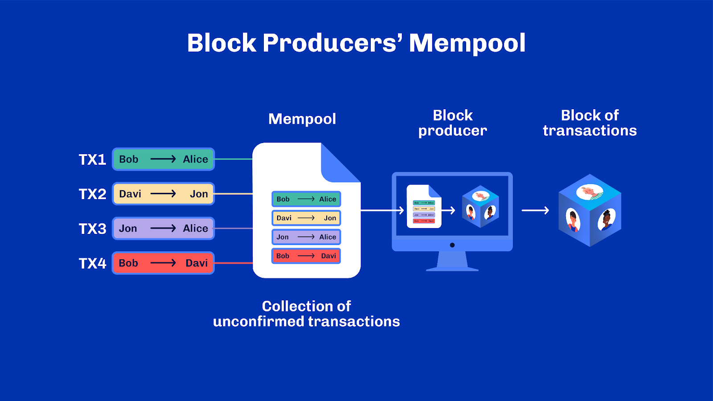

## Block Generation
When a block-producing node receives new transactions, it will forward them to other nodes, replicating transactions across the network. This allows all the nodes on the network to have a copy of the latest transactions. Then, the block-producing node can start the block-generation process.

The process of creating new blocks may be triggered by different events depending on the type of consensus algorithm used.

In proof of work, the process can be started at any time, and the block producer competes with other block producers to generate the next block. The chances of a block producer winning the competition and being able to create the next block depends on the amount of processing power it has. Generally, the more processing power a block producer has, the higher its chances of winning the race and producing the next block.

In proof of stake, the block producer completes an internal calculation once to determine whether it is a candidate to start the next block production process.

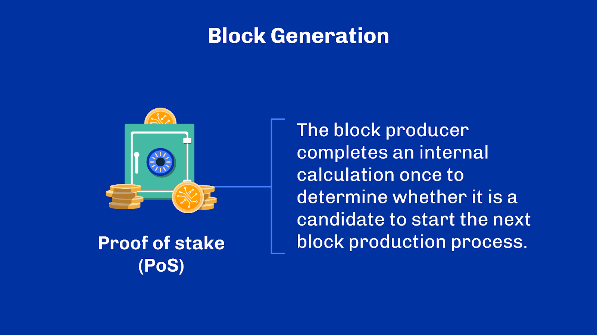

We will discuss the block producer selection process in more detail in future units. For now, the main thing to remember is the overview of block generation. It goes like this: Whenever the block producer starts the process for creating a block, it first selects a set of transactions from its mempool and forges them into a block. Every block producer constructs their own block of transactions depending on the transactions they’ve seen and their own version of the chain. It is possible that multiple block producers may select the same transactions to be included in their block. The consensus algorithm ensures that they eventually reach an agreement on one common set of blocks that only includes the same transaction once.

## Difficulty Level in Bitcoin
In the Bitcoin proof-of-work consensus algorithm, block producers, also known as miners, must solve a mathematical problem, repeatedly attempting different solutions until it is solved. The correct solution is a block of data whose hash value has a  minimum number of leading zeroes.

The mathematical problem is hard to solve. How hard it is to find a valid block hash that meets the required number of leading zeros is called the Difficulty Level. The difficulty level adjusts so that, on average, a suitable hash is found at regular intervals, such as every 10 minutes. The more computing resources available in the entire network, the more the Bitcoin consensus algorithm increases the difficulty level. If the processing power of nodes increases, the proof-of-work consensus algorithm automatically adjusts the difficulty parameter. In our example, this guarantees that miners will not find a minimal number of bits for a block in less than 10 minutes on average. This adjustment is accomplished by increasing or decreasing the number of required leading zeros in a block hash value. In Bitcoin, the difficulty level is recalculated every 2016 blocks.

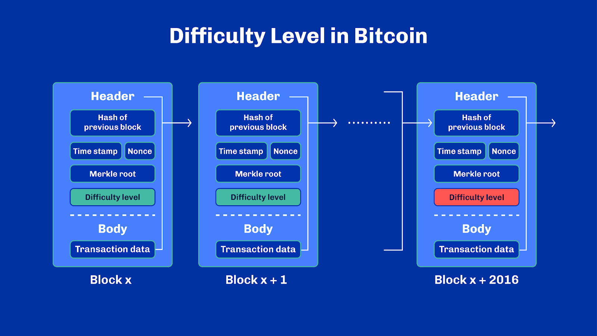

## Nonces
How does a miner solve the mathematical problem for block generation in Bitcoin? Remember, the miner must produce a valid hash with the right number of leading zeros from the block.

To produce the hash, they add a random number called a ‘nonce’, combining it with other data. This typically includes the previous block's hash, timestamp, difficulty level, and transaction data as shown in the diagram. Then, the miner runs this combined data through a hashing algorithm. Because hashing is one-way and it’s impossible to predict the input message, miners must repeatedly hash blocks with random nonces. Changing the nonce changes the block hash output. They repeat this until they find a nonce that creates a hash value with the right number of leading zero bits. This process is called work.

Once a nonce has been identified that solves the problem, miners can propagate the block with its nonce to the rest of the network. Other miners can easily verify that the nonce is correct by simply hashing the block themselves. The work is difficult to do but easy to verify; this is why this process is called proof of work.

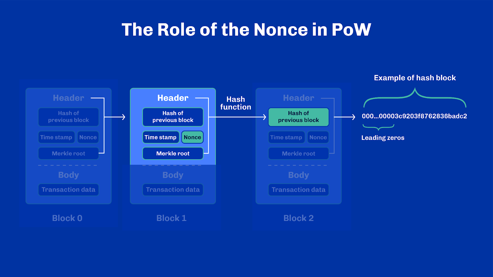

## Cardano’s Proof of Stake
In proof of work, several block producers race to find suitable nonces in parallel, competing with other block producers to find it as fast as possible.

In contrast, Cardano’s proof of stake has no active and resource-intensive competition between block producers. Instead, every block producer determines whether it is responsible for block creation at a specific future time slot using what’s called Verifiable Random Function, or VRF. VRF is a cryptographic mechanism and a key feature of Cardano’s proof of stake. In Cardano, each block producer uses a calculation applying VRF to determine whether it’s responsible to create the next block or not. If the block producer is responsible, then it will create a block, add it to its own local blockchain ledger, and broadcast the block to other nodes.  We will learn more about VRFs in later units as we deep dive into Cardano’s proof of stake. For now, suffice it to say that VRF provides a cryptographically secure form of randomness as a more efficient alternative to the mining process.

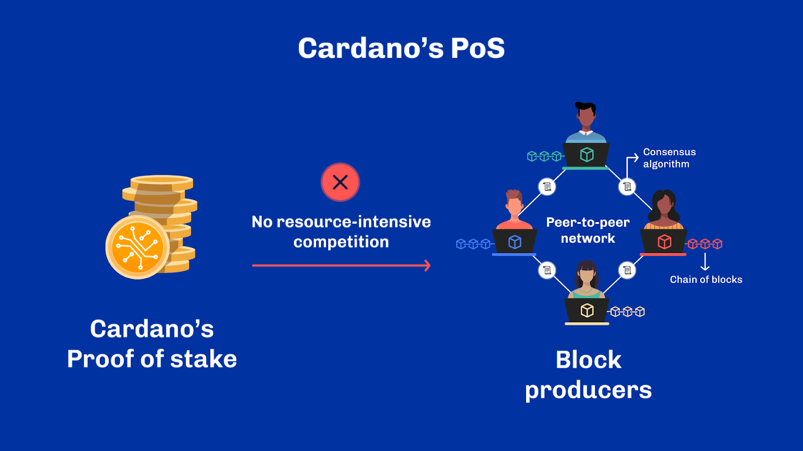

Fundamentally, both proof of work and proof of stake are like a lottery. In the case of proof of work, the chances of winning the lottery are roughly proportional to the computing power that a block producer has. In proof of stake, it is roughly proportional to the amount of tokens that a block producer controls. Having more computing power in proof of work or more tokens in proof of stake is like having more lottery tickets, thus a better chance of winning.

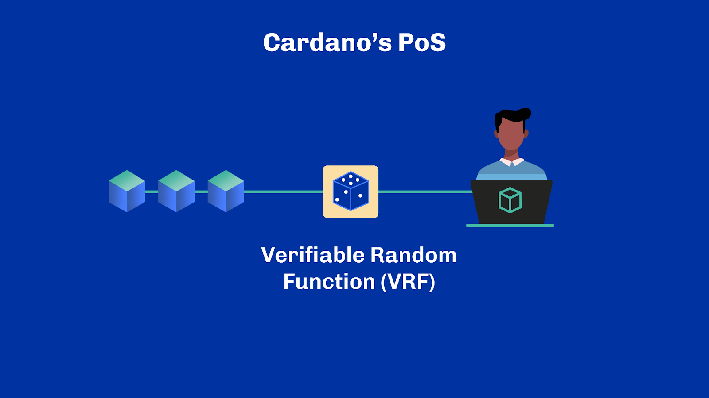

Note also that in proof of stake systems, producing a block is called "minting", and block producers are called validators. In proof of work, miners are the block producers, and the process of creating blocks is called ‘mining’.

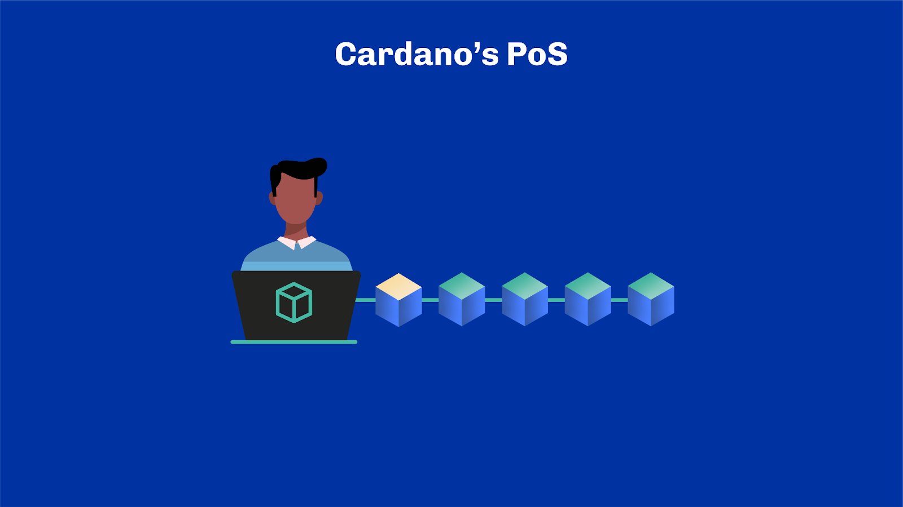

Once a block is propagated across a blockchain network, other nodes on the network verify its validity. The block is then added to their local blockchain, and distributed to all other nodes on the network. All the nodes receive the new block and can see the included transactions. If any of these confirmed transactions are stored in the node’s own mempool, they will remove them.

## Transaction Confirmation, Chain Depth and Block Height
After a block has been added to the chain, every subsequent block added on top of it counts as a ‘confirmation’ for that block. For example, if a transaction is included in block 990, and the blockchain is 1000 blocks long, it means the transactions in block 990 have ten confirmation blocks, 1000-990=10. This number is also called chain depth.

If a transaction has a chain depth of ten, the blockchain has reached consensus on it ten times. The deeper a transaction is in the blockchain, the more confirmations it has, making it harder for adversaries to change it. Having more confirmations is considered to be a stronger guarantee of the security and permanence of a transaction.

After a new block is added to the blockchain, all block producers need to start over again, forming a new block of transactions. The latest block added to the blockchain is called the tip, and the number of blocks from a block to the genesis block or block zero is the block height.

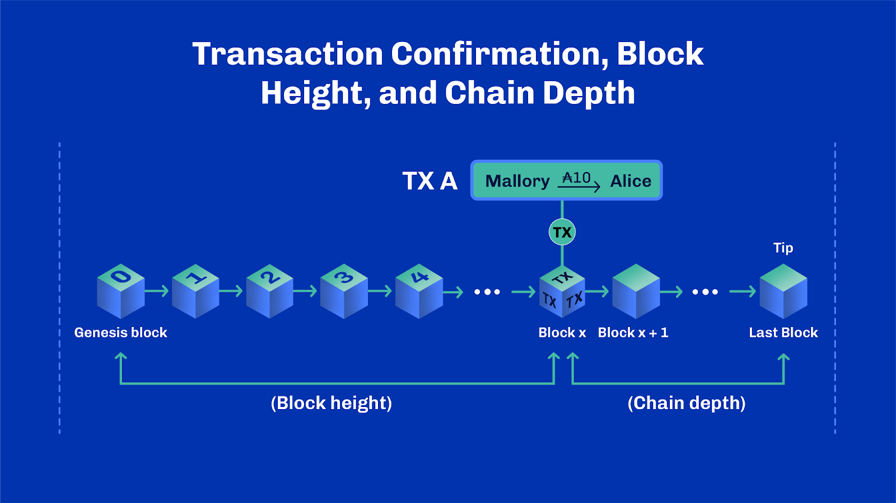

## Block Header and Block Body
Blocks are generally divided into two parts: a block header and a block body. The block header contains metadata about the block, while the body contains a list of transactions.

A block header is like a short business card that identifies the block and who produced it, as well as proof that the block producer was indeed entitled to produce that block. In the case of proof of work, that means providing a nonce and other elements that proves that “work” was done. In the case of proof of stake protocols like Cardano, it means proving one’s identity through a digital signature.

Either way, when a node receives a block, it will first look at the block header and verify that it is valid. In the case of proof of work, that means at least calculating the block header hash and checking it has the right number of leading zeros. In the case of proof of stake, that means checking the schedule to confirm the block producer is entitled to produce that specific block.

The diagram below shows some elements from the header of a Cardano block. In Cardano, a block consists of several pieces of information, such as an identifier of the block producer and the current version of the protocol.

The block also includes a block body hash, which acts as an integrity mechanism. By including this block body hash in the header and including the hash of the previous header, blocks effectively form a chain.

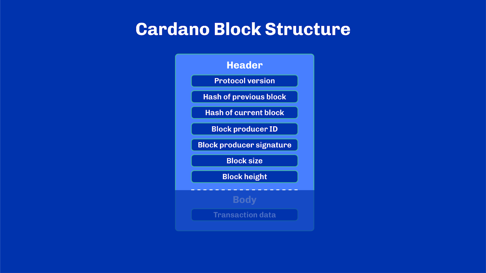

## Block Size and Block Time
Every blockchain has different constraints for maximum block size and average block time. Average block time refers to the average production time between two consecutive blocks. The maximum allowable block size is determined based on the Internet propagation delay, the block time, and other blockchain parameters. In Bitcoin, the maximum block size is one megabyte, and the average block time is ten minutes. Therefore, block producers or miners can choose any number of transactions as long as their size adds up to a maximum of one megabyte. Also, the proof of work parameters adjust to guarantee that miners are able to find a valid nonce for block generation purposes approximately every ten minutes.

Currently, Ethereum block size is limited by gas – an execution unit for transactions. On average, this oscillates between 80 and 120 Kilobytes. The block time for Ethereum is twelve seconds.

On Cardano, a new block is added every twenty seconds on average with a maximum block size of 88 kilobytes.

## Fundamental Properties
Those various blockchain parameters can be tuned and adjusted to make sure that the blockchain protocol has three fundamental properties: Common Prefix, Chain Quality, and Chain Growth. A protocol with these three properties is guaranteed to also achieve safety and liveness – two essential goals of any distributed ledger technology. Therefore, scientists often focus on proving that a system possesses these three fundamental properties in order to prove that it achieves safety and liveness.  [Ref.5.2.4].

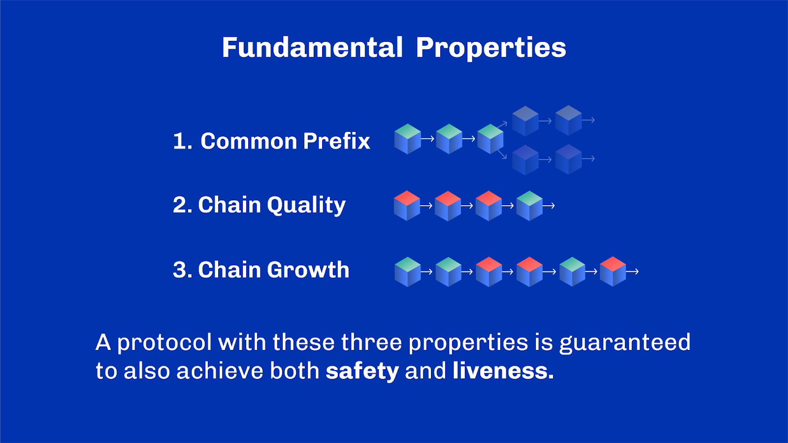

Let’s briefly go through those three fundamental properties.

**Chain Quality** 
We will start with Chain Quality. As we learned with the Byzantine Generals Problem, dishonest nodes and Byzantine Failures are important considerations in blockchain. As such, Chain Quality is the proportion of honest blocks in the chain of an honest node. More specifically, the chain quality property tells us that there exists a number i such that at least one block in the last i blocks was produced by an honest node. The smaller the i, the better the chain quality.

**Common Prefix** 
The next property is the common prefix. The common prefix property shows the part of the chain in an honest node’s local chain that can be trusted. Consider two honest nodes, Alice and Bob; each owns a copy of the chain. Alice's chain is longer than Bob’s. Now, if Alice cuts off k blocks from her local chain, the remaining chain is a subset of Bob’s chain. This is shown in the diagram below. The minimum possible value of k is called the common prefix.

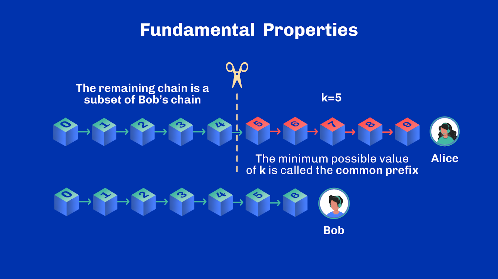

**Chain Growth** 
Earlier we said that liveness is an important quality in blockchain: transactions have to be made. The chain growth property is closely related to this. It measures how quickly the honest parties’ chain grows. This is defined by the number of blocks that are added to the chain in a given time period.

With that, we have reached the end of this unit. Let’s review what we covered.

## Review
First, we reviewed the components of a blockchain and the basic structure of a blockchain. We then recapped the purpose of blockchain and considered what needs to happen with chain validation and chain comparison before consensus is reached. Then, we looked at block headers in more depth and how they are validated by nodes of the network. Finally, we talked about the three fundamental properties expected of any distributed ledger technology: chain quality, the common prefix, chain growth.

## References
[Ref.5.2.1] Merkle, Ralph C. Method of providing digital signatures, issued 1979. 
[Ref.5.2.2] Antonopoulos, Andreas M. “Mastering Bitcoin: unlocking digital cryptocurrencies.“ O'Reilly Media, Inc., 2014. 
[Ref.5.2.3] Kiayias, A., & Panagiotakos, G., Speed-security tradeoffs in blockchain protocols. Cryptology ePrint Archive, 2015. 
[Ref.5.2.4] Garay, J., Kiayias, A., & Leonardos, N., The bitcoin backbone protocol: Analysis and applications. In Annual international conference on the theory and applications of cryptographic techniques, pp. 281-310, Springer, Berlin, Heidelberg, April 2015. 

## Questions

**Sub-Unit 1**

*Select the step NOT involved in block generation.*
- The block producer first selects a set of transactions from their mempool
- The block producer creates a block of these transactions
- **The block producer ensures that at least two other block producers have included the same transactions as them (CORRECT ANSWER)**
- The block producer adds a proof to the block to show they are entitled to produce it

*A block producer joins a public permissionless blockchain network. Then, he sends a request to other nodes to locate them and adds whoever responds to his neighboring nodes list. After that, he receives copies of the blockchain data from his neighboring nodes. He is now faced with multiple versions of the blockchain and can’t determine which version is the correct one. What step has the block producer likely missed in the process of joining the blockchain network?*
- He didn't establish a trust relationship with the nodes that responded to his request
- **He didn't apply the longest chain rule to determine the correct version of the blockchain (CORRECT ANSWER)**
- He didn't request authentication before adding nodes to his neighboring nodes list
- He didn't ask for permission before joining the public network

**Sub-Unit 2**

*What are the important steps and resources a new block-producing node requires to successfully join a network? Select two answers.*
- **The new block producer should have the correct genesis configuration provided by a trusted source (CORRECT ANSWER)**
- The new block producer must gain approval from all existing nodes in the network before they can join
- **The new block producer must apply the longest chain rule when receiving subsequent blocks from other block producers (CORRECT ANSWER)**
- The new block producer needs to generate the genesis block independently before starting to synchronize the blockchain

*Only proof-of-work blockchains like Bitcoin apply the longest chain rule.*
- TRUE
- **FALSE (CORRECT ANSWER)**

**Sub-Unit 3**

*SHow is the correct chain determined in a proof-of-stake algorithm like Cardano's, using the longest chain rule?*
- **A new node must synchronize with existing nodes (CORRECT ANSWER)**
- **The node must identify similarities and differences between received copies of the blockchain (CORRECT ANSWER)**
- The node must select the chain that is farthest from the other branches
- **The node must determine the correct chain by selecting the one that is closest to other branches (CORRECT ANSWER)**
- The node must generate a new chain independently, which then gets adopted if it's longer than the current chain

*Node X has Chain A and encounters Chain B, which is longer than Chain A. They both have a common prefix respecting k=3. What will Node X do according to the longest chain principle? (Image Question)*

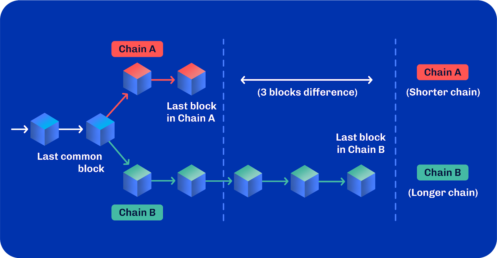

*Node X will:*
- Discard both Chain A and Chain B and start a new chain
- Continue with Chain A as it was the original chain it had
- Remove three blocks from Chain A to match Chain B, and then continue with Chain A
- **Adopt Chain B as it represents a valid fork longer than Chain A (CORRECT ANSWER)**

**Sub-Unit 4**

*A mempool collects:*
- Smart contracts that have already been executed
- A user’s full collection of memes and NFTs
- **Transactions that are waiting to be processed and added to a block (CORRECT ANSWER)**
- The records of past transactions

*When a user sends a transaction via their wallet application, the transaction, along with other transactions, is collected into a "mempool" of unconfirmed transactions for each block producer.*
- **TRUE  (CORRECT ANSWER)**
- FALSE

*Select two correct statements about mempools.*
- There is a global shared mempool for all block producers to use
- Mempools are uncapped in terms of size
- **Each block-producing node maintains its own mempool (CORRECT ANSWER)**
- **Different nodes of a network may have different transactions in their mempools (CORRECT ANSWER)**

*What might affect a block producer's chances of generating the next block in a proof of work consensus algorithm?*
- The number of transactions it has handled before
- **The amount of processing power it possesses (CORRECT ANSWER)**
- The age of the node in the network
- The distance from the central server

**Sub-Unit 5**

*In the context of the Bitcoin proof-of-work consensus algorithms, what does 'Difficulty Level' refer to?*

*Difficulty Level:*
- Signifies the number of block producers or miners participating in the blockchain network
- **Is the measure of how challenging it is to find a valid block hash with a required minimum number of leading zeros (CORRECT ANSWER)**
- Refers to the total number of attempts a miner can make to solve the mathematical problem for block generation

*Select the correct option to complete the sentence. In the context of a proof-of-work consensus algorithm, a ‘nonce’ _____ .*
- Refers to the timestamp included in the block data
- **Is a random number that miners add to the block data (CORRECT ANSWER)**
- Represents the number of leading zeros required in a valid hash
- Is the previous block's hash that is combined with other data to produce a valid hash

*In order to produce a valid hash, a miner must:*
- **Combine a 'nonce' with other data like the previous block's hash, timestamp, difficulty level, and transaction data and run this through a hashing algorithm (CORRECT ANSWER)**
- Accurately predict an input message and running it through a hashing algorithm
- Run the block data through a decryption algorithm to find the correct nonce for generating the hash

*In order to produce a block, Bitcoin miners need to find a nonce that solves a mathematical problem.*
- **True (CORRECT ANSWER)**
- False

**Sub-Unit 6**

*How does the process of block production differ in proof-of-work and proof-of-stake consensus algorithms?*
- In proof of work, block producers or miners create blocks through a process called 'minting', while in proof of stake, validators create blocks through a process called 'mining'
- **In proof of work, the chances of producing a block are roughly proportional to a block producer's computing power, while in proof of stake, it is roughly proportional to the number of tokens a block producer controls (CORRECT ANSWER)**
- Both proof of work and proof of stake require block producers to solve complex mathematical problems to validate blocks

*In the context of Cardano’s proof-of-stake consensus algorithm, what is the role of the Verifiable Random Function (VRF)?*

*The VRF is:*
- Used by block producers to compete with each other in finding suitable nonces
- **A cryptographic mechanism each block producer uses to determine whether it's responsible for creating the next block (CORRECT ANSWER)**
- A mathematical problem that all miners must solve in order to produce a valid block
- The number of tokens a block producer must control in order to participate in block creation

*In proof of stake, a block producer competes with other block producers to generate the next block. The chances of a block producer winning the competition and being able to create the next block depend on the amount of processing power the block producer has.*
- TRUE
- **FALSE (CORRECT ANSWER)**

*Once a new block is propagated across a blockchain network, what happens to the confirmed transactions in a node's mempool?*
- The node adds the confirmed transactions to its mempool
- **Nothing (CORRECT ANSWER)**
- The node sends the confirmed transactions back to the block producer for further validation
- The node ignores the confirmed transactions in its mempool

**Sub-Unit 7**

*Select two correct statements about chain depth. Chain depth:*
- Refers to the total number of blocks in a blockchain
- Is the number of transactions included in a single block
- **Is the difference between the total length of the blockchain and the block number where a transaction is included (CORRECT ANSWER)**
- **Represents the number of confirmation blocks for a particular transaction (CORRECT ANSWER)**

**Sub-Unit 8**

What distinguishes a block header from a block body in the structure of a blockchain block?
- The block header contains a list of transactions, while the block body contains metadata about the block
- **The block header acts as a short identifier of the block and its producer and provides proof of entitlement to produce the block, while the block body contains a list of transactions (CORRECT ANSWER)**
- The block header includes the hash of the previous header to form a chain, while the block body contains an identifier of the block producer and the current version of the protocol

*When a node receives a block in a blockchain network, what validation process does it perform depending on the consensus protocol?*
- In a proof-of-work protocol, the node checks the block body to verify the block producer's identity, while in a proof-of-stake protocol, it verifies the block header hash
- **In a proof-of-work protocol, the node calculates the block header hash and checks if it has the right number of leading zeros, while in a proof-of-stake protocol, it checks the schedule to confirm the block producer's entitlement to produce that specific block (CORRECT ANSWER)**
- In both proof-of-work and proof-of-stake protocols, the node verifies the validity of the block by checking the block body hash

*Which of the following would you find in the block body?*
- **Transaction data (CORRECT ANSWER)**
- Block producer signature
- The hash of the previous block
- The protocol version

**Sub-Unit 9**

*Maximum block size and average block time can be tuned and adjusted to make sure that the blockchain protocol has three fundamental properties:*
- Chain hash
- **Common prefix (CORRECT ANSWER)**
- **Chain quality (CORRECT ANSWER)**
- Determinism
- **Chain growth (CORRECT ANSWER)**

*Which of the following statements accurately describes Chain Growth, Common Prefix, and Chain Quality in the context of blockchain?*
- Chain Growth - the number of dishonest blocks in a chain, Common Prefix - the proportion of honest blocks, Chain Quality - how quickly the chain grows
- **Chain Growth - the speed at which new blocks are added to the chain, Common Prefix - the part of the chain that can be trusted in an honest node's local chain, Chain Quality - the proportion of honest blocks in an honest node's chain (CORRECT ANSWER)**
- Chain Growth - the proportion of honest blocks in the chain, Common Prefix - how quickly new blocks are added to the chain, Chain Quality - the common blocks between two different nodes' chains

*What does the chain growth refer to in a blockchain network? Chain growth measures:*
- The minimum number of blocks that two chains from honest nodes have in common
- **How quickly the honest parties’ chain grows, defined by the number of blocks added to the chain in a given time period (CORRECT ANSWER)**
- The complexity of the mathematical problem a block producer needs to solve in order to create a new block

*What does the common prefix signify in a blockchain network? It signifies ________ .*
- The proportion of honest blocks in the chain
- **The part of the chain that can be trusted in an honest node's local chain (CORRECT ANSWER)**
- The proportion of blocks produced by dishonest nodes

*What does the term chain quality refer to in the context of blockchain?*
- **The proportion of honest blocks in the chain of an honest node (CORRECT ANSWER)**
- The number of blocks that can be cut off from a node's local chain to match another node's chain
- The minimum number of leading zeros required in a block's hash value

*What does the term chain quality refer to in the context of blockchain?*
- **The proportion of honest blocks in the chain of an honest node (CORRECT ANSWER)**
- The number of blocks that can be cut off from a node's local chain to match another node's chain
- The minimum number of leading zeros required in a block's hash value
