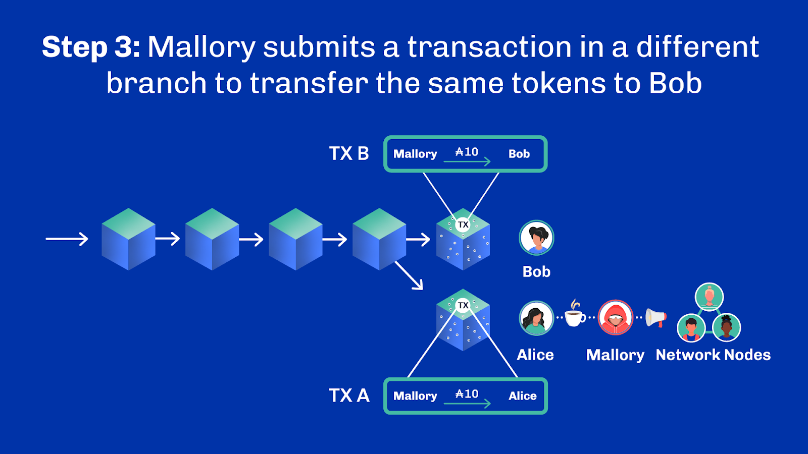

# Unit 3 - Double-spending Attack

## Learning Objectives

> [!NOTE]
>
> By the end of this unit, you should be able to:
>
> - [x] Describe how double-spending works, citing examples
> - [x] Explain how the risk of double-spending is mitigated
> - [x] Describe and compare a soft fork, and hard fork

## Introduction
Hello everyone, and welcome. My name is [lecturer name].

## Table of Contents
In this unit, we look at double-spending and why it is such an important topic. Solving the double-spending problem is viewed as one of the major breakthroughs of Bitcoin. In fact, the third sentence of the Bitcoin white paper states: “​​We propose a solution to the double-spending problem using a peer-to-peer network.” It is fundamental to digital currencies.

So, what is double-spending?

## Double-Spending
If you have a dollar bill and you give it to someone, you don't have that dollar bill anymore, so you can't give it to someone else. You had it; it’s gone. In the digital world of distributed systems, this simple principle is harder to achieve and leaves systems vulnerable to attack.

A double-spending attack works like this; an attacker engages in a transaction with an honest user in exchange for goods or services. The honest user receives the payment and provides the goods or services to the attacker. Later, the attacker transfers the same spent tokens to another user and spends those tokens for a second time. This is because most blockchains provide only eventual consensus. Eventual is the keyword here. It means that an agreement only becomes immutable over time. The longer the time, the stronger the agreement. Fresh agreements may be reverted under some specific conditions which an attacker may try to exploit.

Let’s look at an example.

**Example: Double-Spending Step 1** 
Alice is selling Mallory, the attacker, a cup of coffee for ten tokens. Mallory intends to run a double-spend attack on Alice. This requires Mallory to convince Alice that she has paid for the coffee and that the transaction has been confirmed through the blockchain mechanism. Mallory submits a transaction to the network transferring the ten tokens to Alice, and waits for the transaction to appear in a block. Alice sees the transactions in a block of the blockchain.

**Example: Double-Spending Step 2** 
Once Alice has received ten tokens in her wallet from Mallory, she is convinced that the transaction has been settled correctly and provides the coffee to Mallory.

**Example: Double-Spending Step 3** 
But now Mallory is going to double-spend. After receiving the coffee, Mallory creates another transaction that conflicts with the first one. She plans to buy some bread from Bob. She now transfers the same ten tokens she gave Alice, to Bob, in an attempt to spend the same tokens twice. She submits the second transaction to dishonest block producers to create a new block. However, the new block cannot be placed in the same branch containing the original transaction to Alice. This second transaction to Bob needs to be placed in a different branch, as shown in the diagram below.

**Example: Double-Spending Step 4** 
So how does Mallory get away with double-spending her tokens? Based on the longest chain rule, which we covered in unit 5.2, we know that if the length of the second branch becomes longer than the first branch, nodes will accept all blocks within the longest branch and drop the blocks in the first branch. The chances of these dishonest nodes getting their alternative chain accepted by all nodes increase with their hashing power. Indeed, the dishonest nodes will race against the rest of the network to create a longer chain by forging more blocks faster.

**Example: Double-Spending Step 5** 
If other nodes on the network accept Mallory's second transaction to Bob and include it in the blockchain, it means that Mallory has convinced them that the second transaction is valid, and the first one to Alice is not. The first transaction is then valid for a short period of time only. But during that period, Alice may have provided a service to Mallory without, in the end, receiving any payment.

## Understanding Block Generation Power
In the example, we saw how Mallory succeeded in double-spending. Mallory purchased coffee from Alice. Alice believed she was paid when she viewed the transaction and provided the coffee. In fact, it was Bob who eventually received the tokens.

So, what can Alice do to avoid being a victim of a double-spending attack? Let’s first understand block generation power.

In the case of proof of work, this block generation power is computing power – typically measured in hash rate. In the case of proof of stake, this power is the blockchain tokens under the control of each block producer. Block producers have a higher chance of being selected based on the proportion of their block generation power to the network block generation power.

For example, Bitcoin block producer Antpool currently has the computing power to generate more than forty thousand PetaHash values per second. A home-based Bitcoin mining system maxed out at 13 TeraHash per second is insignificant in comparison. Antpool has more than three million times more processing power to calculate a hash value and a higher probability of finding a valid nonce faster. In summary, the processing power in Bitcoin is measured by the hash rate of block producers, and the higher the hash rate, the more likely a miner is to find the next block.

In proof of stake, block producers do not compete with each other to validate a block by trying different hash values. Instead, block producers are selected quasi-randomly to generate new blocks, but the probability of being selected is based on the stake size or the amount of tokens a block producer holds among all the tokens of block producers.

Block producers with a larger stake have a higher probability of being selected than those with a smaller stake. For example, if a block producer has 1,000 ada tokens in Cardano, the chance to be selected as a block producer is higher than another block producer with 200 ada tokens. We will discuss this mechanism in detail in later units.

Note that, whether it is stake size in proof of stake or hash rate in proof of work, we refer to both as the block producers' block generation power.

## Mitigating Double-Spending
Now, let’s go back to our question about how Alice can avoid being a victim of a double-spending attack. The simple answer is that Alice needs to wait for a certain amount of time, or a certain number of blocks, after receiving a transaction before accepting it as valid. When she sees a transaction in, let's say, Block A, showing that Mallory has sent her tokens, she needs to wait for a given time or a number of blocks after Block A. Waiting assures Alice that a fork will not appear in the blockchain and that the tokens are hers.  Once this number of blocks or time has passed, Alice can give Mallory her coffee.

But how long should Alice wait? How many blocks after Block A should Alice wait before giving Mallory her coffee? This is determined by the percentage of the network's block generation power that is controlled by malicious block producers who may attempt a double-spending attack. As per Satoshi Nakamoto's analysis in the Bitcoin white paper, if 10% of the network's processing power is controlled by malicious actors, Alice should wait for five blocks. After five blocks, their chance of success in a double-spending attack is less than one in a thousand. After ten blocks, this probability is only one in a million. The probability of success for the malicious actors decreases exponentially with the number of blocks added afterwards.

In relation to PoW, there is always a probability of a successful double-spending attack. Because of this, it is said that the finality of transactions on a blockchain network is probabilistic. Nakamoto demonstrated that to reduce the likelihood of a successful double-spending attack to a negligible level, the number of blocks that Alice should wait for before considering a transaction final will vary depending on the percentage of the block generation power that is controlled by an attacker.

As shown in the table below, when the attacker’s hash rate increases, the number of blocks that Alice should wait for confirmation will also increase.

## Transaction Finality
Nakamoto's analysis of double-spending attacks was straightforward but not entirely precise. Since then, other researchers have provided more detailed and precise analyses. These studies have shown that the number of blocks that should be waited for confirmation is greater than what was initially suggested by Satoshi.

Although Satoshi and other scientists recommend waiting for a few hundred blocks to ensure the security of payment, in practice, some wallet software makes funds available to users after just 10-20 blocks. The reason is that they assume controlling even a large portion of the block generation power is very expensive. Therefore, they consider it safe enough for transactions of small amounts to wait for a relatively small number of blocks, such as ten to twenty.

## 51% double-spending attack
As we saw previously, the chances of success for an attacker depends on how much of the network consensus resource is under their control. As soon as attackers control a significant portion of the block generation power they can attempt to manipulate the network. They are able to do this by trying to create blocks faster than anyone else in order to double-spend. This probability of success increases and reaches 100% if they own 50% or more of the network resources. This is usually abbreviated as “51% attacks”. Here, the blockchain security scheme fails, which can lead to loss of trust in the network and its currency. The same applies to Cardano's proof-of-stake consensus algorithm with regards to stake.

This finding highlights an important principle in blockchain technology: to ensure the proper functioning of a blockchain and prevent double-spending attacks, a minimum fraction of the total block generation power of the network must be held by honest block producers who do not wish to participate in such attacks.

This is fundamental and explains why blockchains work under the assumption that no malicious actors own more than a certain proportion of the consensus resources. For Bitcoin and Cardano, that threshold is at 50%. For some other protocols, it can be lower – 33%, for example – as they’re based on a different set of assumptions.

In the case of Bitcoin, it’s important to keep in mind that the 51% is based on security assumptions that Satoshi and other researchers have in their calculation and analysis. By changing the security assumption and applying the game theory concepts in their attack scenario, researchers have shown that this number can be reduced to 26%. We will talk about this in Module 3.

## Soft Fork and Hard Fork
Forks are created in a double-spending attack as a result of the competition between honest and dishonest block producers. It is best to avoid having forks in a blockchain. However, occasionally blockchain designers and communities intentionally create forks for valid reasons.

There are two types of forks: hard forks and soft forks. When a blockchain platform's existing code is changed, an old version still remains on the blockchain network while the new version is created. A soft fork can be used to improve features and functions of a blockchain system. It is a change to the blockchain protocol that may typically introduce restrictions that make a certain type of transaction invalid, or that introduces features in a way that doesn’t require every node to upgrade. Block producers, which still use the previous blockchain protocol, will recognize any new blocks as valid. Soft forks are therefore said to be backward compatible.

Block producers still running a previous version may attempt to broadcast a now-invalid block and create temporary forks amongst those who also haven’t yet updated. Eventually – as soon as the majority of the network runs the newest version – those soft forks will end up being rejected. This follows the principle of the longest chain rule which will always be endorsed by the majority.

**Hard Fork** 
A hard fork is a radical change to a blockchain protocol. Nodes that do not upgrade will be unable to continue following the chain. When they encounter a block created by an upgraded block producer, they will not be able to process that block.
A hard fork requires all nodes or clients to upgrade to the latest protocol version. If they do not, the network will effectively be split between the upgraded block producers and the block producers using the previous protocol. In a hard fork, block producers must choose which blockchain to continue verifying.

On the 1st of August 2017, the Bitcoin blockchain was forked which led to the creation of Bitcoin Cash. This hard fork split Bitcoin into two parallel chains, each with a different network protocol. A number of users remained with the first chain, while others upgraded their software and became part of the fork.

## Cardano Blockchain Forks
Cardano has also upgraded its blockchain network through hard forks. For example, the Vasil upgrade in September 2022 was a hard fork that added innovative features to Cardano, including improved performance. Yet in Cardano, the entire network has always endorsed each and every hard fork, leading to a single final chain.

## Review
And with that, we are at the end of another unit. Let’s quickly recap.

We started this lecture with an overview of what a double-spending attack is and how this can be caused. We then looked at a solution to double-spending that required waiting for blocks to be added to the chain. Finally, we looked at the 51% attack as another potential threat to a network. There is a wide range of possible attacks on blockchain. We will review more in the future.

And with that. Thank you, and see you next time.

## References
[Ref.5.1.1] G. Ramezan and C. Leung, "Analysis of Proof-of-Work-Based Blockchains Under an Adaptive Double-Spend Attack,” IEEE Transactions on Industrial Informatics, vol. 16, no. 11, pp. 7035-7045, Nov. 2020. 
[Ref.5.1.2] Kaur, A., Nayyar, A. and Singh, P., “Blockchain: A path to the future”. Cryptocurrencies and Blockchain technology applications, pp.25-42, 2020. 
[Ref.5.1.3] Karame, G.O., Androulaki, E., Roeschlin, M., Gervais, A. and Čapkun, S., “Misbehaviour in bitcoin: A study of double-spending and accountability”. ACM Transactions on Information and System Security (TISSEC), 18(1), pp.1-32, 2015. 
[Ref.5.1.4] 51% Attacks - MIT Media Lab, Digital Currency Initiative. Available: https://dci.mit.edu/51-attacks , Accessed: Dec. 20, 2022. 
[Ref.5.1.5] Eyal, I., & Sirer, E. G., “Majority is not enough: Bitcoin mining is vulnerable”, Communications of the ACM, 61(7), 95-102, 2018. 

## Questions

### What does it mean if a blockchain provides eventual consensus?
1. Every transaction on the blockchain is agreed upon instantly, eliminating any chances of double-spending attacks
1. Transactions become final and unchangeable immediately after they are completed
1. The final agreement on transactions solidifies over time - the longer the time, the more definite the agreement becomes 

See correct answer

3. The final agreement on transactions solidifies over time - the longer the time, the more definite the agreement becomes

### A double-spending attack happens when a malicious actor engages in a transaction with an honest user in exchange for goods or services. The honest user provides the goods or services to the attacker and receives payment. The attacker transfers the same spent tokens to another user and spends those tokens for a second time.
1. TRUE 
1. FALSE

See correct answer

1. TRUE

### What is Mallory, the attacker’s, first step in a double-spending attack against Alice?
1. To convince Alice that the transaction has failed and she has to transfer tokens again
1. To convince Alice to give her the product without having to pay yet
1. To convince Alice that the transaction has been confirmed through the blockchain mechanism

See correct answer

3. To convince Alice that the transaction has been confirmed through the blockchain mechanism

### Based on the image below, what two steps need to happen in order for Mallory to successfully double-spend the same tokens? (Image Question)

1. Mallory needs to create another transaction that conflicts with the first one 
1. The second transaction needs to be placed in a different branch
1. Mallory needs to wait for the first transaction to clear before creating the second one
1. The second transaction needs to be placed in the same branch

See correct answer

1. Mallory needs to create another transaction that conflicts with the first one.
2. The second transaction needs to be placed in a different branch.

### When it comes to double-spending attacks, how do the dishonest nodes get their alternative chain to be accepted by all nodes?
1. By enforcing the shortest chain rule and adding more blocks to the first branch while keeping the second branch short
1. By breaking down the first branch’s chain and adding it to the second branch’s chain
1. By following the longest chain rule and racing to create a longer chain by forging more blocks faster

See correct answer

3. By following the longest chain rule and racing to create a longer chain by forging more blocks faster

### Select the statements that best describe the concept of block generation power in the context of proof-of-work and proof-of-stake mechanisms.
1. In proof of work, it refers to the number of blockchain tokens controlled by each block producer
1. In proof of stake, it refers to the computing power, typically measured in hash rate
1. In proof of work, it refers to the computing power, typically measured in hash rate 
1. In proof of stake, it refers to the number of blockchain tokens controlled by each block producer 

See correct answer

3. In proof of work, it refers to the computing power, typically measured in hash rate
4. In proof of stake, it refers to the number of blockchain tokens controlled by each block producer 

### Which of the following is accurate for proof-of-stake blockchains?
1. They use energy consumption as an incentive
1. The number of tokens assigned to each participant influences who produces blocks
1. Nodes compete to produce blocks via physical hashing power
1. To vote on-chain participants have to prove how much stake they hold

See correct answer

2. The number of tokens assigned to each participant influences who produces blocks

### Select two correct statements about how to avoid double-spending attacks.
1. If malicious actors control 5% of a network's power, the user should wait for five blocks new before confirming a transaction
1. The number of blocks the user needs to wait for will be the same for all transactions
1. Waiting before confirming a transaction assures the user that a fork will not appear in the blockchain and that the tokens are indeed theirs
1. The number of blocks the user should wait for before accepting a transaction depends on the block generation power held by potential attackers 

See correct answer

3. Waiting before confirming a transaction assures the user that a fork will not appear in the blockchain and that the tokens are indeed theirs.
4. The number of blocks the user should wait for before accepting a transaction depends on the block generation power held by potential attacker

### To mitigate against a double spending attack, the honest user must wait for a certain amount of time, or a certain number of blocks, after receiving a transaction before accepting it as valid. This time depends on the transaction amount.
1. TRUE
1. FALSE 

See correct answer

2. FALSE

### How can 51% of attacks be prevented?*
1. A minimum of 51% of the total block generation power must be held by honest block producers 
1. A maximum of 51% of the total block generation power must be held by honest block producers
1. All block generation power must be held by honest block producers

See correct answer

1. A minimum of 51% of the total block generation power must be held by honest block producers

### To conduct a successful double-spending attack, attackers must own at least 51% of the block-producing resources, irrespective of any consensus algorithm
1. TRUE
1. FALSE

See correct answer

2. FALSE

### Select the correct statements about soft forks in a blockchain protocol.
1. A soft fork requires all nodes to upgrade to the latest protocol version
1. A soft fork introduces changes in a way that doesn’t require every node to upgrade (CORRECT ANSWER)
1. After a soft fork, block producers using the previous protocol will not recognize new blocks as valid
Soft forks are backward compatible

See correct answer

3. After a soft fork, block producers using the previous protocol will not recognize new blocks as valid
Soft forks are backward compatible

### A blockchain updated its code. Nodes that have not updated their client software can still follow and validate the chain. They may nevertheless not be able to produce new blocks. What type of update does this describe?
1. Transitional fork
1. Muted fork
1. Hard fork
1. Soft fork

See correct answer

4. Soft fork 

### Which of the following statements are true about forks?*
1. A double-spending attack creates a fork as a result of the competition between honest and dishonest block producers
1. Blockchains generate forks at regular intervals to maintain the technology
1. There are two types of forks: soft and hard 
1. Hard forks allow for backward compatibility
1. A hard fork reduces the block generation power of the network

See correct answer

1. A double-spending attack creates a fork as a result of the competition between honest and dishonest block producers 
3. There are two types of forks: soft and hard

### What happens during a hard fork in a blockchain protocol?*
1. A hard fork allows nodes that don't upgrade to continue following the chain without any issues
1. A hard fork requires all nodes to upgrade to the latest protocol version otherwise the network could split between those using the new and old protocols 
1. During a hard fork update, block producers do not have to choose which version of the blockchain to continue verifying

See correct answer

2. A hard fork requires all nodes to upgrade to the latest protocol version otherwise the network could split between those using the new and old protocols 

### The Bitcoin blockchain forked on 1 August 2017, leading to the creation of two parallel blockchains: Bitcoin and Bitcoin Cash.
1. TRUE 
1. FALSE

See correct answer

1. TRUE

### Cardano’s Vasil upgrade in September 2022 was a soft fork that added innovative features to Cardano, including improved performance.*
1. TRUE
1. FALSE 

See correct answer

2. FALSE

