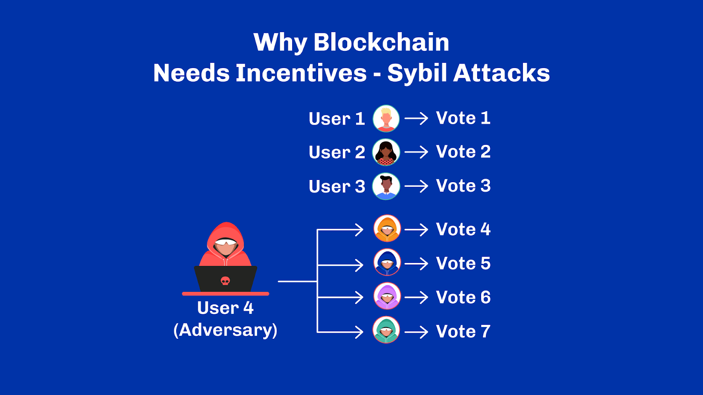
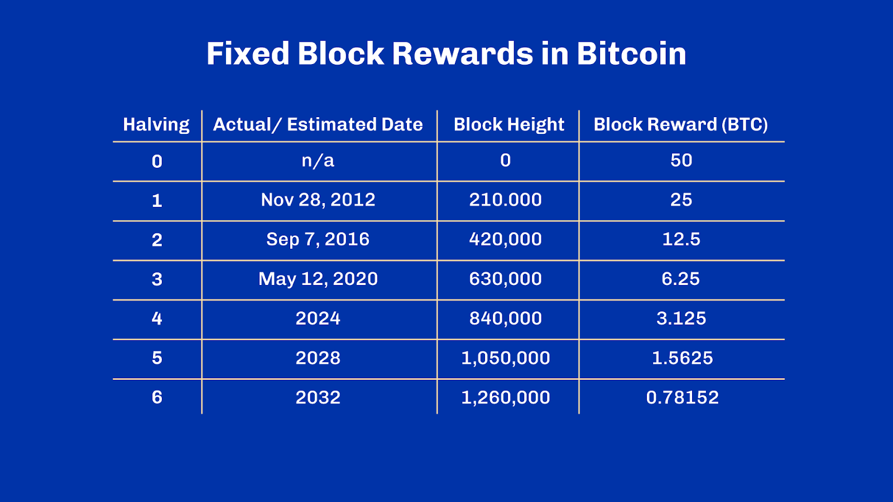
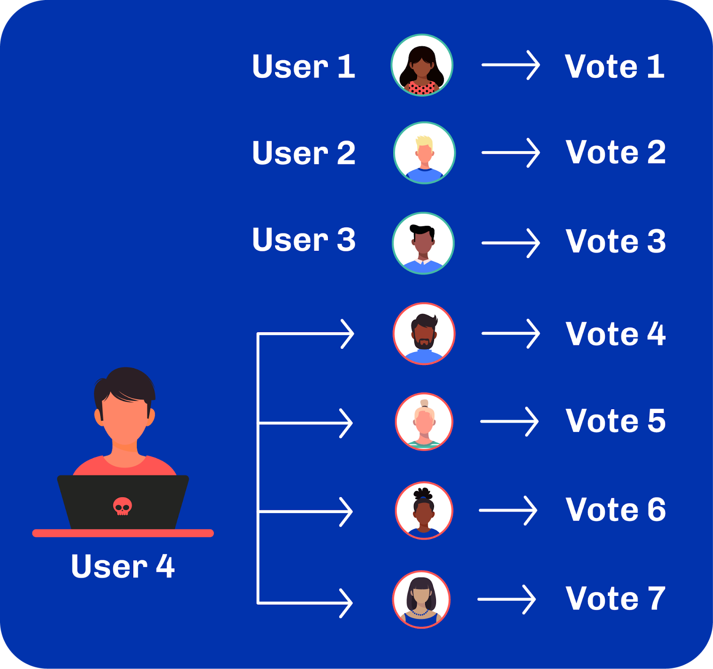

# Unit 4 - Block Reward and Transaction Fee

## Learning Objectives

> [!NOTE]
>
> By the end of this unit, you should be able to:
>
> - [x] Explain why incentives are necessary in blockchain
> - [x] Describe Sybil attacks and how incentives might mitigate them
> - [x] Describe the different types of incentives
> - [x] Explain and compare incentive mechanisms in Bitcoin and Cardano

## Introduction
Hello everyone, and welcome. My name is [lecturer name].

## Table of Contents
In this unit, we will introduce the concept of incentives in blockchains and why they are necessary. We will explore block rewards and transaction fees and find out why blockchain networks use them. As always, we have a lot to cover, so let’s get started!

## Why Blockchain Needs Incentives - Sybil Attacks
Why are incentives necessary? Let’s start by looking at what can go wrong when you don’t have compelling incentives.

In public permissionless blockchains, any node can freely join or leave the network. The consensus algorithm's role in these dynamic networks is to ensure that the majority of existing nodes agree on a final result - a confirmed block. However, malicious nodes can join the network under multiple fake identities in an attempt to create the illusion of a majority and thus influence the consensus result. This method is known as a Sybil attack, where a single malicious node operates multiple fake identities, or Sybil identities, in an attempt to gain a majority of influence in the network.

## Consensus Algorithm and Sybil Attacks
Social norms are a construction. They create informal rules that set expectations for group and social behavior. But many times expectations and actual behavior are different things. Here, incentives become a way to nudge people's actions and guide them toward a desired behavior. For example in some countries, returnable plastic bottles have an added cost in the form of a deposit, but that same deposit is a reward when the bottle is returned. By using incentives, self-interest can be aligned with the greater good. However, incentives must be attractive so that following the rules is better than breaking them.

In blockchain, incentives make attacks impractical and strongly discourage them. Bitcoin makes attacks incredibly expensive, for example. The blockchain applies a specific set of rules for the generation of new blocks. One of the rules is that the ability to create a block must be proportional to the total processing power of the network. That means that miners have to own enough hashing power to create a new block, which is costly for an attacker. Cardano has a similar approach with the proof of stake consensus algorithm, leveraging blockchain tokens instead of energy or hashing power. Cardano block producers have to control enough tokens to be selected to create a new block.

Since we cannot prevent all classes of Sibyl attacks, the practical solution is to incentivize desired behavior and disincentivize undesirable behavior. An example of undesirable behavior is attacking the blockchain by creating fake votes and identities in a consensus algorithm. But how do we incentivize good behavior?

## Nakamoto Coefficient
Blockchain economic and incentive models are embedded in the network consensus algorithms. These models affect social behavior and directly impact decentralization and security - the key features of blockchain.

The effectiveness of blockchain incentive mechanisms in preventing Sybil attacks can be  measured using the Nakamoto Coefficient. This coefficient measures decentralization and can be used to deduce the minimum number of entities that need to collude to disrupt a blockchain network. The higher the Nakamoto Coefficient, the more decentralized the network is.

## Rewards in Proof of Work Protocols
Incentive mechanisms exist in blockchain to discourage adversarial behavior and encourage participation. These mechanisms promote securing the network versus attacking it, and ensure that the requirements of the blockchain network can be met.

In Bitcoin, there are two main incentive mechanisms: block rewards and transaction fees.

**Coinbase Transaction** 
To fully understand the incentive mechanisms, we first need to introduce another concept: coinbase transaction.

In Bitcoin and many other proof-of-work blockchains, there is a special type of transaction called a coinbase transaction. This is the first transaction of each block and is placed there by the block producer who created the block. The coinbase transaction creates brand-new tokens payable to that block producer as a reward for block creation. It has no inputs, and its amount is pre-determined by rules fixed by the protocol. This is how new tokens are put in circulation during the block generation process in most proof-of-work protocols.

Now, back to incentives.

In Bitcoin, the miner producing the block searches for a suitable hash for any given block.  When that hash is found, the block is mined, including the coinbase, and is propagated to the network. The coinbase transaction is a token creation transaction, and the miner chooses an address belonging to itself as the recipient address of this transaction.

This reward acts as an incentive for the miners to process the transactions in the network. It is important to know that only one miner in typical proof-of-work type blockchains will be rewarded. All other miners receive nothing for their work, as they are all in competition with each other.

This race encourages miners in the network to invest in infrastructure to increase their chances of winning. This helps the network become more resilient because it increases the total computing power of the network. Hence, running a successful 51% double-spending attack will be more expensive for attackers. This computing power is costly. Costly in hardware but much more so in energy. We have touched upon it before. Cheap energy sources attract miners since they can improve their chances of mining a block at a lower cost, making it more profitable. Bitcoin mining now requires a large investment to purchase high computing power, and the chances of mining a block by a small miner are close to zero.

**Fixed Block Reward in Bitcoin** 
Block rewards, in the case of Bitcoin, are known in advance and are consistent. However, the reward amount halves every 210,000 blocks, approximately every four years, or when the block height increases by 210,000. Halving the block reward reduces a miner's profits and encourages energy efficiency amongst miners to remain profitable. [ref.5.2.1]

As you can see from this table, bitcoin rewards have already been reduced from 50 BTC per block at block height zero to 6.25 BTC per block as of May 12th, 2020. At current mining rates, the block rewards are projected to reduce by 50% in 2024, then in 2028, and again in 2032.

You might be wondering what the incentive is for miners to support the Bitcoin network when block rewards drop below a certain amount. This is where our second incentive mechanism comes into play.

**Transactions Fees** 
The second incentive mechanism in blockchain are transaction fees. When a user submits a transaction to a blockchain network, they generally have to pay a fee for that transaction to be processed. Transaction fees are important, and they serve a dual purpose.

First, they are an incentive for block producers to include a given transaction in a block. They are paid to include it. A blockchain may also have a fee market where block producers can be incentivized to treat some transactions with more priority than others. Users pay to prioritize their transactions so that they are more likely to be processed first.
Fees for a given block generally go to the miner who mines the block, along with the block rewards covered in the previous section.

The second purpose of transaction fees is to minimize the amount of “network spam”.  Validating and propagating transactions across the network requires resources. If there is no transaction fee, malicious actors could drain all those resources from the network at almost no cost. This ‘denial of service attack’ could render the network unusable for other participants.

By having to pay transaction fees, an attacker would have to pay for each transaction they submit. At scale, this makes spamming attacks economically infeasible for an attacker.

## Review

Congratulations, you’ve made it to the end! Let’s recap what we learned. In this unit, we discussed rewards incentives and why they are necessary. We examined transaction fees and how they prevent network spam and help the overall integrity of the network both in the context of proof of work.

## References
[Ref.5.4.1] Schär, F., April. “Understanding the Bitcoin Halving”, Crypto Finance Conference, 2020. 
[Ref.5.4.2] Brünjes, L., Kiayias, A., Koutsoupias, E., Stouka, A. P., Reward sharing schemes for stake pools. In 2020 IEEE European Symposium on Security and Privacy (EuroS&P), pp. 256-275, IEEE, Sep. 2020. 
[Ref.5.4.3] Eyal, I. and Sirer, E.G., “Majority is not enough: Bitcoin mining is vulnerable”, Communications of the ACM, 61(7), pp.95-102, 2018. 
[Ref.5.4.4] Roughgard T., “Columbia Incentives in Computer Science Course”,  Available: http://www.cs.columbia.edu/~tr/s20/s20.html, Accessed: 29 Aug 2022. 

## Questions

### In a Sybil attack, a single malicious node operates multiple fake identities, or Sybil identities, in an attempt to gain a majority of influence in the network.
1. TRUE
1. FALSE

See correct answer

1. TRUE

### What in the image below tells us that a Sybil attack may be occurring? (Image Question)

1. There is an uneven number of votes
1. User 4 is casting multiple votes
1. Users 1 - 3 are only casting one vote each

See correct answer

2. User 4 is casting multiple votes

### Incentives help to increase blockchain security by:
- [ ] Making attacks costly for attackers
- [ ] Preventing certain groups of people from working on blockchains
- [ ] Making rule-following more beneficial than rule-breaking
- [ ] Making it easier for block producers to use multiple identities

See correct answer

- [x] Making attacks costly for attackers
- [x] Making rule-following more beneficial than rule-breaking

2. User 4 is casting multiple votes

### The Nakamoto Coefficient measures decentralization. The higher the Nakamoto Coefficient, the more decentralized the network is.

1. TRUE
1. FALSE

See correct answer

1. TRUE

### Select two correct statements about a coinbase transaction.
- [ ] It is the last transaction of each block
- [ ] It creates brand-new tokens 
- [ ] It rewards the block producer with new tokens for creating a block 
- [ ] It removes new tokens during the block generation process

See correct answer

- [x] It creates brand-new tokens
- [x] It rewards the block producer with new tokens for creating a block 

### In a typical proof-of-work blockchain, block producers receive mining rewards from a special transaction type. What’s the name of this special transaction type?
1. Kucoin transaction
1. Binance transaction
1. Coinbase transaction

See correct answer

3. Coinbase transaction

### What role does the coinbase transaction play in Bitcoin's network and why does it encourage miners to invest in infrastructure?
1. The coinbase transaction acts as a penalty for miners, forcing them to invest in infrastructure to avoid it
1. The coinbase transaction is a reward for miners, encouraging them to invest in infrastructure to increase their chances of receiving it
1. The coinbase transaction reduces the cost of infrastructure, making investment more affordable

See correct answer

2. The coinbase transaction is a reward for miners, encouraging them to invest in infrastructure to increase their chances of receiving it

### Select the correct statements about block rewards.
- [ ] Block rewards are consistent and known in advance 
- [ ] Block reward amounts will never change
- [ ] The halving of a block reward can encourage energy efficiency among miners to remain profitable 
- [ ] Block rewards are expected to increase by 50% in 2032

See correct answer

- [x] Block rewards are consistent and known in advance 
- [x] The halving of a block reward can encourage energy efficiency among miners to remain profitable 

### Which of the following is NOT true of Transaction fees?
1. An incentive for block producers to include a given transaction in a block
1. A way for users to increase the likelihood of their transactions being processed first
1. Given to the miner who mines the block containing the transaction and its fees
1. A way to minimize the amount of network spam
1. Fixed and calculated in the same way for all blockchains 

See correct answer

5. Fixed and calculated in the same way for all blockchains

