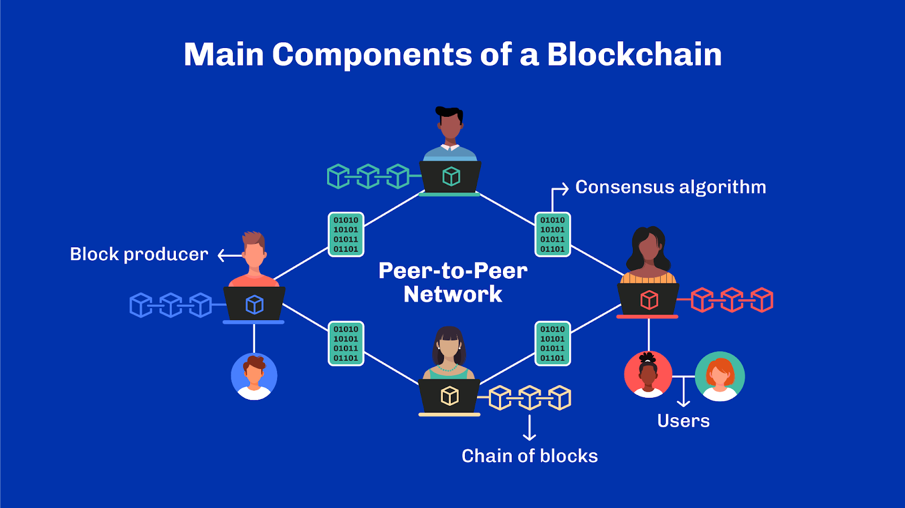
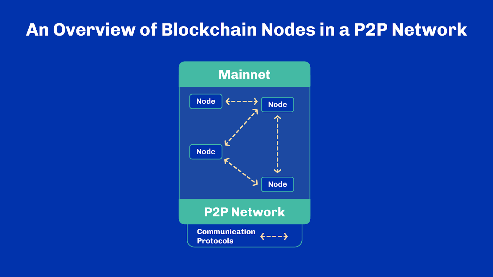
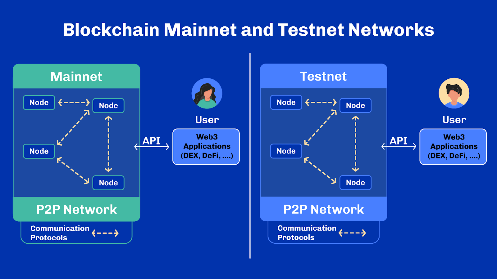
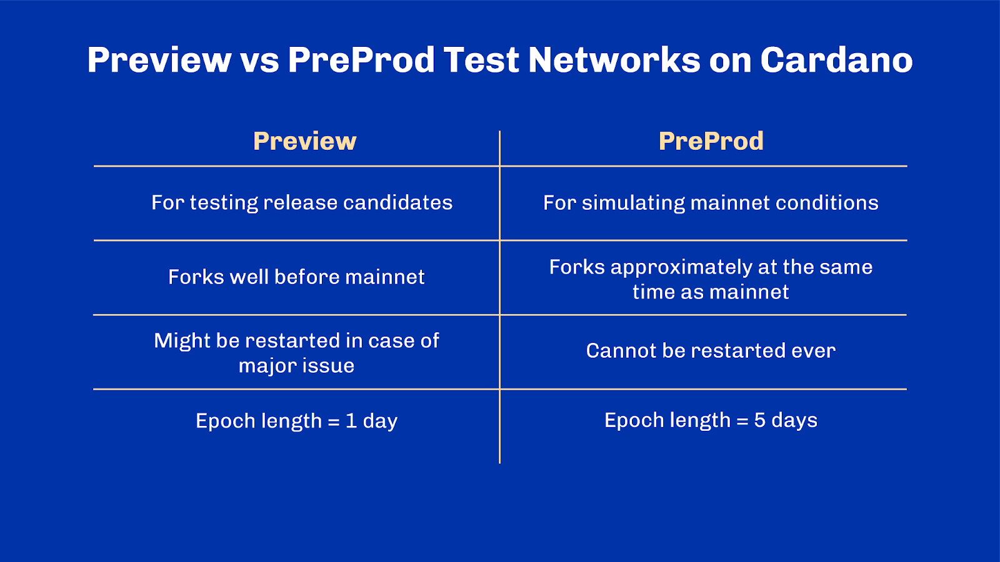
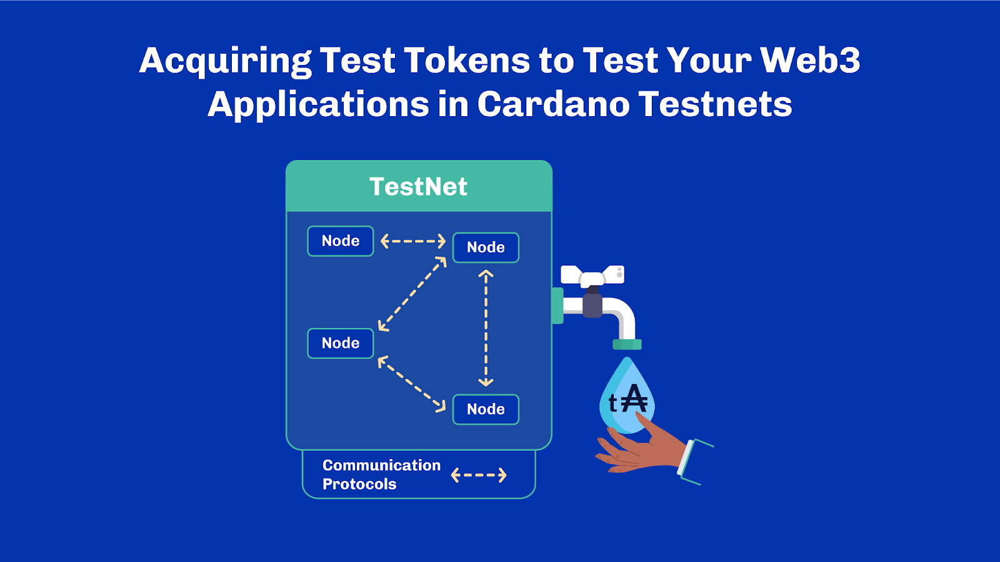
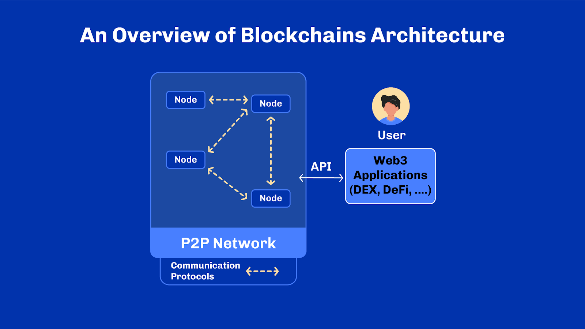
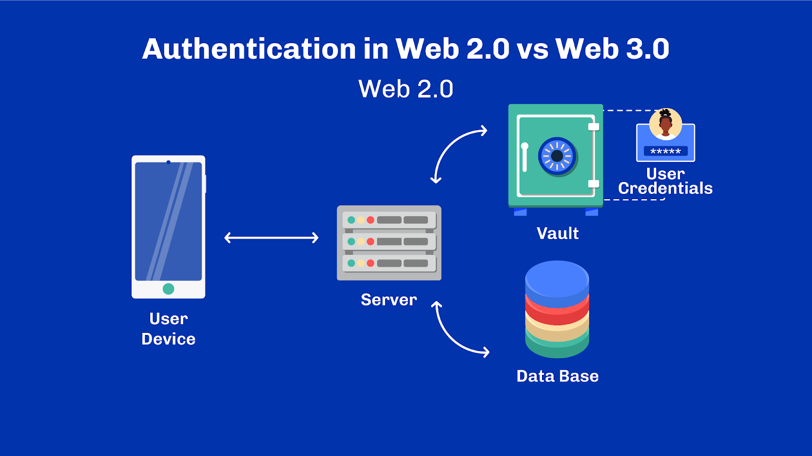
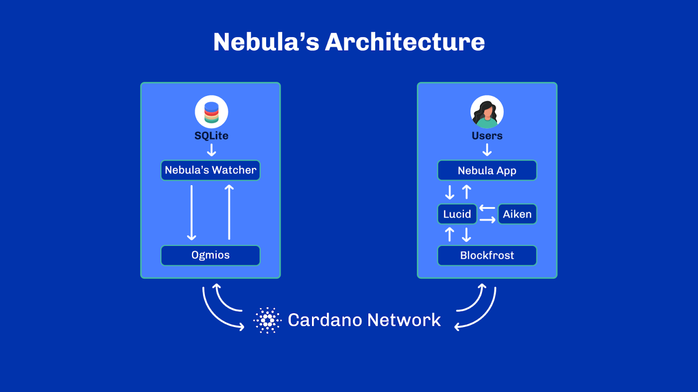

# Unit 5 - Web3 Architecture

## Learning Objectives

> [!NOTE]
>
> By the end of this unit, you should be able to:
>
> - [x] Describe and compare blockchain mainnet and testnets
> - [x] Explain the purpose of a faucet and its use on test networks
> - [x] Describe the operation of blockchain architecture components
> - [x] Describe the Cardano communication protocols
> - [x] Explain decentralized applications (dApp) and Web3 applications

## Introduction
Hello everyone, and welcome. My name is [lecturer name], and many thanks for joining us today.

## Table of Contents
What goes on behind the scenes in blockchain? In this unit, we’ll explore blockchain components and communication protocols from the perspective of a Web3 application. Let’s go.

## High-Level Overview of Components
In this unit, we’ll showcase an open-source app, [Nebula](https://github.com/spacebudz/nebula/), as an end-to-end example of a simple NFT marketplace on Cardano. It exemplifies the entire process of building a decentralized application; from the on-chain code to the off-chain infrastructure and the user interface. In this marketplace, a single NFT represents a digital work of art, for example, and can be auctioned and bid on with tokens. You can find Nebula on GitHub. Let’s use this app to illustrate some of the concepts discussed here.

First, let’s go back to basics: Blockchains are distributed networks of software and hardware components. These components are called nodes. All nodes have the same capabilities, though some just relay transactions while others create blocks. Following a set of shared ledger rules, nodes agree on which transactions are included in a block and a consensus algorithm enables nodes to agree on what blocks are to be added onto the blockchain.

A block thus contains confirmed transactions. It is connected to the previous blocks to form an immutable chain, meaning, once confirmed, both transactions and blocks can’t be tampered with.

In the Nebula marketplace, it is that concept of immutability and the unique quality of NFTs that enables a single token tied to a piece of art to carry value, and thus be auctioned. Just like in the real world: one item, one auction. The monetary value of the NFT is based on perception or its utility. Without the properties of immutability and uniqueness, it would be much more difficult to represent a single NFT as something that can be bought and sold. Why? Because it could be easily copied or the transaction modified. It is digital. Trust in the ownership and transfer of an NFT, along with the built-in security of the protocol, is critical to the functioning of an NFT economy.

The Nebula app includes a node to connect to the Cardano blockchain. Why does it need its own node? Trust. We’ll come to that later. But how does it join the network?

Nodes join the network by seeking out other nodes on the network, called peers, via a communication protocol. Connection to a few peers is usually enough, as nodes can verify information independently – remember that each node is as capable as its neighbor so they only truly differ from the information they have access to. Note that in a public permissionless network, the entire process is unauthenticated. Nodes can receive requests from any peer. They are also free to reach out and maintain their own set of peers. The joining process follows what we described earlier when we discussed the longest-chain rule.

## Mainnet vs. Testnet
Now, let’s say developers enhance the Nebula app. Maybe they add new features. They will need to test it. In blockchain, projects have separate networks for this purpose. Typically, there are at least two networks, the main network – also known as mainnet – and the test network, or testnet. A mainnet is a live network where tokens have value and process real transactions. A testnet, as you can imagine, is for testing – tokens do not have any real value.

Testnets help developers build blockchain applications and test specific capabilities without investing real tokens. These tokens can usually be created at will. While both networks have the same functionality, nothing can be transferred from a testnet to a mainnet, and a node can only be connected to one network at a time. Web3 applications, such as wallets or the Nebula app, can typically be configured to work on a variety of networks. They will start a testnet before launching on mainnet once they gain enough confidence about their quality and robustness.

Bitcoin, Ethereum, and Cardano all have two or more testnets, each with a slightly different configuration. This makes it easier to test specific scenarios. For example, in Bitcoin, there is testnet and regtest. In Ethereum, Sepolia and Goerli and in Cardano, there is Preview and Preprod. Keep in mind that testnets can change as the blockchain evolves, but the mainnets, which hold real assets and history, never expire.

Let’s briefly examine the differences between Preview and Preprod. The Preview network is where new software is deployed and battle-tested first. It is a less stable network compared to  Preprod. It is for those who like living on the edge and aren’t afraid of discovering a potentially catastrophic bug. Preview has also slightly different network parameters that facilitate the discovery of bugs. In particular, epochs are shorter so that we can observe more epoch transitions and the various kinds of events associated with them. Its main purpose is to test the core components such as the cardano-node itself deployed in conditions close to mainnet. On the other hand, the Preprod network is meant to simulate mainnet conditions for dApps and builders alike. It runs alongside mainnet and closely follows mainnet upgrades.

## Acquiring Tokens in Mainnet and Testnet

**Faucet** 
To purchase an NFT, tokens are required. So, when developers test Nebula, they’ll need tokens. But mainnet uses real assets. Users acquire tokens from an exchange or other users. These tokens can then be used on the mainnet. But we don’t want to use tokens with real value in our testing – it would be expensive and put funds at risk should a bug be discovered. So, how do developers get tokens to test the app? They can’t get them on an exchange – because they have no value. Instead, test tokens can be created at will with a tool called a faucet.

In every testnet, users can freely request tokens to be sent to their address. It is a bit like a friend who has an infinite supply of tokens and can provide them to you on demand. This is why tokens have no real value on test networks. Note that on Cardano, it is possible to request native assets other than test ADA directly from the faucet.

Developers use test tokens to experiment with an application without risking valuable funds. When completed, they either return the test tokens or leave them locked in an address. To distinguish from real assets, we usually prefix test tokens with a lowercase `t`. For example, while Cardano’s mainnet uses ada, Cardano’s testnets use tAda.

Additionally, to protect the real assets on mainnet, it is not possible to send real tokens to the testnet and vice versa. This is accomplished through the mechanism of a network discriminant, which makes addresses valid only on a specific network. We will learn more about that when we deep dive on Cardano addresses in a later unit.

## API and Nodes Communication Protocol
**Communication Between Nodes** 
How will our app communicate with the blockchain? What are the rules for communication?

As we said, blockchain is a collection of nodes forming a network, exchanging messages with one another. The Nebula application needs to connect to one of these nodes. Before discussing how it connects, let’s review how nodes speak to each other.

The system determining how nodes exchange information is a communication protocol. A communication protocol designates the rules and structure for how and what messages are sent and received in specific circumstances. It’s like a kitchen recipe, but for network exchange between computers.

Protocols also have goals as part of their design. A good communication protocol will handle these challenges and protect against dishonest nodes. Remember the Byzantine Generals' problem? Not all generals can be trusted. Similarly, in a network, not all participants can be trusted; any of them may be propagating false information or blocking messages.

Hence, one key goal, which is particularly true of proof-of-stake consensus, is good protection from adversarial peers. We said earlier that in a typical public network, communication lines between nodes were unauthenticated. This implies that nodes are responsible for ensuring that their peers can’t make them behave in uncontrolled ways – for example, by requesting too many resources from them.

Another important goal in a distributed network is to reach a majority of nodes in a short amount of time. This ensures agreement can be reached as quickly as possible. The protocol must also ensure neighboring nodes can communicate directly with each other, as well as relay and route messages from other peers across the network. This is required for a blockchain to function correctly.

The rate at which nodes can exchange information depends on the protocol design and data propagation delays in the network. The delay arises from various factors such as the distance between nodes, the speed of data transmission, the number of intermediate nodes, or the processing time of each node.

So how do we measure how well a protocol achieves its goal of reaching a majority of nodes in a short amount of time? Measuring performance depends not only on the communication protocols, but the nature of the consensus algorithm, as well the size of the network measured by the number of nodes.

One key primary indicator for performance can be throughput. This is usually defined as how much data can be transferred and stored in a block, on average, in one second. We use transactions per second, or TPS, for network throughput, as the method of storing data on a blockchain is usually through transactions. It can be difficult to compare unrelated blockchains with TPS as transactions differ between protocols. Yet it is an interesting measure to look at from within the context of a single protocol – for example to see if the protocol is improving between two upgrades.

**Communication Between Nodes and Client Applications** 
For our app to communicate with the blockchain network, it needs to interact with a node. This is usually accomplished with an Application Programming Interface, or API.

Developers use these APIs to access the blockchain network through a node and perform specific actions. For example, our application will want to retrieve information about NFTs. Other uses include fetching a particular transaction by its reference or inspecting the balance available at a given address.

An application that interacts with a blockchain, is called a Web3 application. Web3 applications that are decentralized are called DApps, or Decentralized Applications.

As you can see in this figure, a Web3 application must connect to at least one trusted node in the blockchain network to function. This node can be managed by a trusted third party, or the development team can deploy and run their own node.

That’s why the Nebula app includes a node as part of the application. Through the node, it can receive information directly from the network, and monitor transactions interacting with the Nebula smart contract.

**Authentication** 
To use a traditional web application, a user typically logs in with a username and password. It is the server that authenticates the user and explicitly grants or denies access to its services.

However, in Web3, the user is the only one who can authenticate operations. Authentication occurs through cryptographic signatures. The credentials used to create these signatures are stored by the user in a secure wallet and not stored on or controlled by a server.

This is a paradigm shift from the traditional web model. There still exist services hosted on servers, yet servers are more like windows to the blockchain. They can only act with explicit approval from the client. Unlike in Web2, they are stripped of some of their power. This also means that client applications are, in theory, not limited to one specific service. Anyone can access a public, permissionless ledger and provide a different interface to any existing Web3 service.

From the client's perspective, there is no vendor lock-in, and users remain in control as long as they keep their secret credentials safe.

For the Nebula application, then, developers are free to write their own user interfaces on top of the application. Nebula provides the core logic, or protocol, that makes it work. It doesn’t, however, define a single application. Different businesses may use it as a
foundation for their products, apply their branding and customize it as they see fit. A bit like a white-label solution.

## Nebula’s Architecture
Now that you understand the overall context a bit more, let’s dissect Nebula as a prime example of a Web3 application. Nebula has two main components: an on-chain validator and an off-chain watcher for recording historical data and reacting to certain events. On-chain means it runs on the blockchain, while off-chain means off the blockchain, running as a local client application on users’ devices or in some hosted server infrastructure.

The Nebula validator defines the rules for operating the marketplace, like listing assets, auctioning, and managing royalties. It is written in Aiken, which is one of the popular alternatives to Haskell on the Cardano ecosystem.

The watcher runs off-chain. It connects to a Cardano node through a tool called Ogmios acting as a bridge to the node. Ogmios sits between a local node and the watcher to synchronize blocks from the node. It helps to leverage the somewhat complex communication protocols of the node through familiar web technologies: JSON and WebSockets. Said differently, it reduces the entry barrier and often provides a slightly easier interface to the node than the low-level machinery mini-protocols.

When the Nebula watcher synchronizes blocks from the node through Ogmios, it strips away any data that is deemed irrelevant – that is, any transaction that isn’t locking funds into the contract or taking funds out of the contract.

When it comes time to submit transactions on the blockchain, Ogmios helps here too. Transactions, of course, are crucial to the operation of blockchain, and Cardano has 19 different fields that must be populated correctly. Ensuring proper creation and submission using the mini-protocols can be a burden for new developers. So, Ogmios helps check, monitor, and send transactions to the network, making the development experience smoother and more manageable.

For crafting these transactions, Nebula uses a software development kit or SDK called Lucid. This is used to create any transaction that is involved in the Nebula protocol. For example, to list new assets or place an auction bid. Tools like Lucid or, similarly, Mesh are open source, supported by a growing community, and provide integration with the rest of the ecosystem stack.

While the Nebula watcher runs its own infrastructure, client-side applications that interact with Nebula would typically use a combination of Lucid and an API query layer such as Blockfrost that hosts an infrastructure to access the Cardano network. This way, applications that run in the browser or on mobile can submit transactions to the marketplace without having to manage their own infrastructure.

As you can see, when developing an app, tools, APIs, and SDKs are often combined to streamline integration and reduce complexity. While all these options help developers build, they come with the usual risks and trade-offs of relying on a third-party or additional layer – even if the code is open source.

Whatever the project, developers can choose any combination of high-level or low-level tools to build their Web3 application.

## Review
In this unit, we have covered blockchain components, communication protocols, and different blockchain networks, including testnets and mainnets.

We looked at an example of DApp infrastructure through Nebula, as well as a number of tools and we  showed how they are articulated into a Web3 application.

I hope you enjoyed this as much as I did and as always, see you next time.

## References
Nebula app: https://github.com/spacebudz/nebula 
Developer-tools: https://www.essentialcardano.io/article/a-list-of-community-built-developer-tools-on-cardano  

## Glossary

- *Aiken*: Aiken is a functional high-level language for creating smart contracts on Cardano designed for ease of use.
- *Blockfrost*: Blockfrost is an API query layer as a service for Cardano.
- *Communication protocol*: A communication protocol is a system determining how nodes exchange information. It designates the rules and structure for how and what messages are sent and received in specific circumstances
- *Faucet*: A faucet is a tool used to create test tokens to be used on a testnet.
- *Lucid*: A TypeScript Software Development Kit (SDK) for Cardano.
- *Mainnet*: A mainnet is a live network where tokens have value and process real transactions.
- *Ogmios*: A lightweight JSON/WebSocket bridge interface for cardano-nodes.
- *Testnet*: A testnet is a network for testing. It helps developers build blockchain applications and test specific capabilities. Tokens on a testnet do not have any real value.

## Questions

### How do nodes in a network typically connect and verify information?
1. By receiving authentication from a central authority
1. By seeking out other nodes/peers and verifying information independently
1. By relying solely on the longest-chain rule for all interactions
1. By accessing a central database for peer information

See correct answer

2. By seeking out other nodes/peers and verifying information independently

### What is the main difference between a mainnet and a testnet in blockchain?
1. A mainnet holds real assets and history, while a testnet allows for the creation of tokens at will for testing purposes 
1. A blockchain can have multiple mainnets but only one testnet.
1. A mainnet is only used for testing, while a testnet processes real transactions
1. A mainnet is for testing where tokens do not have any real value, while a testnet is a live network where tokens have value

See correct answer

1. A mainnet holds real assets and history, while a testnet allows for the creation of tokens at will for testing purposes

### Select the correct statement about testnets and mainnets.
1. Mainnets can change as the blockchain evolves, but testnets remain static
1. A node can simultaneously be connected to both a mainnet and a testnet
1. Web3 applications can typically be configured to work on a variety of networks

See correct answer

3. Web3 applications can typically be configured to work on a variety of networks

### How do we typically refer to the main blockchain network of a given protocol?
1. Skynet
1. Mainnet
1. Masternet
1. Magnet

See correct answer

2. Mainnet

### Select the correct statements about Preview and Preprod.
- [ ] Preprod is a less stable network compared to Preview
- [ ] The Preprod network is meant to simulate mainnet conditions for dApps 
- [ ] Preprod networks run alongside testnet
- [ ] The Preview network is where new software is deployed 

See correct answer

- [x] The Preprod network is meant to simulate mainnet conditions for dApps 
- [x] The Preview network is where new software is deployed 

### Which network forks well before mainnet?
1. Preprod
1. Plutus Playground
1. Preview 
1. None of above

See correct answer

3. Preview

### How do users get tokens on a testnet?
1. They earn them through mining
1. They request them from a tool known as a faucet
1. They get them through complex cryptographic challenges

See correct answer

2. They request them from a tool known as a faucet

### Why are test tokens used when testing a DApp instead of tokens from the mainnet?
1. Test tokens have more features compared to mainnet tokens
1. Test tokens can be easily exchanged for real-world currency
1. Using mainnet tokens for testing would risk valuable funds if bugs are found
1. Developers prefer using tokens that can be bought from exchanges

See correct answer

3. Using mainnet tokens for testing would risk valuable funds if bugs are found

### How are tokens on Cardano's testnets distinguished from those on its mainnet?
1. Test tokens are encrypted differently
1. Test tokens are prefixed with a lowercase “t”
1. Test tokens are twice the size of mainnet tokens
1. Test tokens have an expiration date

See correct answer

2. Test tokens are prefixed with a lowercase “t”

### TPS (Transaction Per Second) is an accurate measure to compare different blockchain networks and protocols?
1. TRUE
1. FALSE

See correct answer

2. FALSE

### What is the main purpose of an Application Programming Interface (API) in blockchain?
1. To code the smart contracts on the blockchain
1. To control the consensus algorithm of the blockchain
1. To access the blockchain network through a node and perform actions
1. To protect the blockchain from potential threats

See correct answer

3. To access the blockchain network through a node and perform actions

### Why does a DApp usually include a node as part of its application?
- [ ] To serve as backup storage for the blockchain
- [ ] To receive information directly from the network 
- [ ] To monitor transactions related to its smart contracts 
- [ ] To authenticate users for security purposes

See correct answer

- [x] To receive information directly from the network 
- [x] To monitor transactions related to its smart contracts 

### In a permissionless distributed network, nodes have to register and authenticate to join the network.
1. TRUE
1. FALSE

See correct answer

2. FALSE

### The main distinguishing feature between Web2 applications and Web3 applications is…
1. Web3 applications are usually faster because they leverage distributed peer-to-peer networks.
1. Web3 applications rely on a blockchain to provide data and do arbitration
1. Web3 applications are simpler to develop because they do not require any backend
1. Web3 applications are always free to use and open source

See correct answer

2. Web3 applications rely on a blockchain to provide data and do arbitration

### In a distributed Web3 application, users' credentials are typically stored:
1. On a server, in a user account protected by an email and a passphrase
1. In the application itself, and they are never sent to the server
1. In a secure hardware or software wallet, used by the application on demand
1. On the blockchain, kept secure by the ledger and all network validators

See correct answer

3. In a secure hardware or software wallet, used by the application on demand

### What are the primary functions of Ogmios in the Nebula app?
- [ ] Defining the rules for operating the marketplace
- [ ] Synchronizing blocks from the node 
- [ ] Simplifying communication protocols 
- [ ] Assisting in transaction operations 
- [ ] Creating transactions involved in the Nebula protocol

See correct answer

- [x] Synchronizing blocks from the node 
- [x] Simplifying communication protocols
- [x] Assisting in transaction operations

### Which software development kit (SDK) does Nebula utilize for creating transactions?
1. Blockfrost
1. Ogmios
1. Lucid
1. Mesh

See correct answer

3. Lucid

