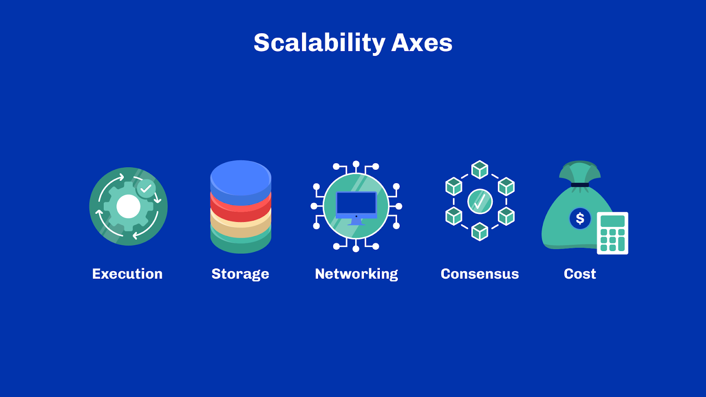

# Unit 6 - Scalability: Layer 1 Solutions

## Learning Objectives

> [!NOTE]
>
> By the end of this unit, you should be able to:
>
> - [x] Explain what is a ‘scalable system’
> - [x] Tell the difference between vertical and horizontal scalability
> - [x] Be critical of the interplay between key dimensions of blockchain systems
> - [x] Explain why TPS alone is a poor metric for comparing blockchains systems
> - [x] Enumerate few well-known order of magnitudes related to the blockchain industry
> - [x] Explain in laym- an terms the big-O notation and integrate that quadratic = bad, linear = good, logarithmic = better
> - [x] Articulate the difference between parallelism and concurrency
> - [x] Enumerate a few scalability techniques on layer one blockchain systems

## Introduction
Welcome everyone, I am [lecturer name], and I’ll walk you through scalability and layer one solutions.

## Table of Contents
If you have been in the blockchain space for long enough, you will no doubt have noticed a recurring  topic of discussion: scalability. You might have seen it mentioned in the now-infamous “blockchain trilemma”, which states that blockchain systems are constrained by three key attributes: scalability, security and decentralization. In this unit, we’ll focus on scalability.

## Scalability
**Definition** 
Broadly speaking, scalability refers to the capacity of a system to accommodate increasing demand in usage. The term is used in business, economy or engineering to describe slightly different things, but it essentially boils down to this definition. In the blockchain industry, scalability is often used to discuss system scalability and how a blockchain system can process an ever-increasing number of transactions.

In system engineering, we also speak about elasticity or auto-scaling to describe a system's ability to adapt by automatically increasing and decreasing its resources. When more capacity is needed, extra resources are added to respond to the demand. Those resources are freed later when no longer needed. An elastic system can grow and shrink to the demand to ensure that it only uses the right resources at all times.

Scalability is generally divided along two axes: vertical scaling and horizontal scaling. Vertical scaling refers to improvements to the components of the system themselves. Usually, this means using better hardware or software solutions. It is called vertical in reference to how it applies to a system stack and usually benefits all components of the stack. It makes sense if you picture a system as a literal stack of layered boxes.

On the other hand, horizontal scaling covers everything else. Usually, it refers to adding extra components to a system next to existing components that can perform similar tasks but in parallel.

Let’s look at a simple analogy and assume you want to cultivate and provide apples to supermarkets. An example of vertical scaling here would be to hire or train the staff picking the apples to be faster at the task. Vertical scaling also includes anything regarding equipment you’d provide them so that each individual would work faster.

Horizontal scaling here could mean adding more people to the field or simply adding more fields.

**Layer 1** 
Now we have a broad definition of scalability. But what does that mean in the context of layer one blockchain systems? As a quick reminder, layer one refers to a blockchain platform with its consensus mechanism. Bitcoin, Ethereum, Cardano and Algorand are examples of layer-one solutions. In each system, numerous resources are utilized to achieve various tasks. These resources are not only limited, but they pose different scalability challenges.

Scalability in blockchain systems typically happens along one of 5 key dimensions: execution, storage, networking, consensus and cost.

*Execution*: Encompasses all system computations, from transaction validations to smart-contracts evaluations.
*Storage*:Refers to the persistence of information the system needs to function, and the user-defined data. 
Storage is usually split into two sub-dimensions: the ledger state and the historical data. 
*Networking*: Distributed systems such as blockchains rely on intensive network communication between nodes to achieve consensus and carry information. 
*Consensus*: This includes anything that has an impact on the decision-making capacity of the system. How long does it take for information to become true? How much work is needed to find an agreement? What threshold of an honest majority is required for the system to be secure? Etc. 
*Cost*: This includes the initial and operational costs related to those operating the system (a.k.a the block producers) and the cost for end users participating on the network.  

As you can imagine, solutions that improve all dimensions at once are rare. In fact, scalability is seldom free. If you improve one dimension, you probably have increased the resources needed in one or more other dimensions. Scalability is all about what trade-offs you are willing to accept. Which dimensions matter the most depend on the use cases.

And similarly, it is hard to develop a single performance indicator that captures all dimensions simultaneously. Transaction per second, or TPS in short, is often used as a substitute for an all-in-one scalability metric, but the reality is much more subtle.

To grasp why, imagine a hypothetical system performing 1000 TPS.

- How many steps can be taken by each smart-contract execution in that system?
- How long would it take for a 1TB hard drive to be full with that throughput?
- How far are the nodes in the system, and what is their expected bandwidth?
- How long does it take for each transaction to be confirmed, and what are the confirmation guarantees?
- What’s the cost of operating a single node of that system?

As you can see,  a single metric hardly captures the various dimensions of a system, let alone the subtleties across different systems. In addition, the term “transaction” is often too vague. Consider a highway and the number of vehicles using it per second. If you’re transporting supplies, there's a big difference if the vehicle you’re driving is a large truck, car or scooter. A truck can carry much more supplies compared to a scooter, even though they are both vehicles using the highway per second.

Having said that, TPS can be a useful key primary indicator when used correctly. All else being equal, a higher TPS does mean a better system. Yet, used out of context, it can be a misleading metric.

## Fundamentals
**Order of Magnitudes** 
An order of magnitude is used to make approximate comparisons between two values of the same dimension against a base reference value. When two quantities have the same order of magnitude, they can be seen as equivalent, at least from an engineering standpoint.

In general, differences in the order of magnitudes are measured in multiples of ten and compared to a reference value of 0. Hence, if a quantity is ten times bigger than another, we say that there’s one order of magnitude between those two quantities. If it's a hundred times bigger, that’s two orders of magnitude. If it’s 300 times bigger, it still is only two orders of magnitude as the next threshold is crossed at 1000. For example, if we compare weight between living species, there’s one order of magnitude between humans and horses. And there’s also one between horses and elephants. If you’re dimensioning a bridge that can support an elephant, then as an approximation, you might say that it might also support 10 horses.

Orders of magnitude are often used in physics and engineering to compare dimensions of physical phenomena or systems. When considering the limits of a system, we often look at orders of magnitude instead of precise values. Indeed, measuring something with high precision is usually tricky. Therefore, approximations are used everywhere, and looking at precise values can be deceptive. Problems typically arise when crossing one or more orders of magnitudes, so it’s useful to grasp the scale of a particular dimension.

**Well-Known Dimensions** 
Knowing the order of magnitude of a couple of things in life can prove to be helpful. In fact  everyone has references of various dimensions from their day-to-day experiences. For example, If I tell you that my car goes at a speed of 1300 km/h, you might think I am a little crazy. That is because you know that cars' maximum speed is around 200-300 km/h. It’s likely you may believe a speed of anything ranging from 100 to 500 km/h. It’s within the same order of magnitude. But 500 or more, and you might be reluctant to believe that, as we’re approaching the next order of magnitude. And the closer we get to 1000, the less you will accept that possibility.

Having some points of reference can thus be a valuable tool to be more critical of the information you hear and read. Be skeptical of any claim that reduces or increases by several orders of magnitude a known reference. So let me walk you through some well-known orders of magnitude. Before we dive in, note that when dimensions have a known universal unit, the units themselves are often substituted to the orders of magnitude. For example, we may say that a value is in the range of “milliseconds” to talk about an order of magnitude -3 since the second is a universal unit – and thus correspond to the order 0.

Let’s see if you guess those right!

 

 

 

 

**Order of Approximation** 
Okay, enough order of magnitudes for now. Though I hope this was and will be useful to put information in perspective. Another tool at our disposal to think about scalability and performance is called orders of approximation. In particular, one family of orders is appreciated by computer scientists and mathematicians: “the big-O notation”. It is a mathematical notation which describes how rapidly a quantity grows in terms of another quantity. Fundamentally, we say growth is a big O of some other mathematical function if that function can approximate it. Big-O notations are often used to classify algorithms according to their time or space requirements in the function of a growing number of inputs.

Let’s make it concrete and consider the space you need to store books on a shelf. You’ll agree that the space needed is proportional to the number of books. In mathematics, that space is said to grow linearly with the number of books. Or in big-O notation, it is an O(n). Because, for n books, you need roughly n times the space of one book.

One more example. Imagine you are at a party and wish to count the number of handshakes if everyone shook hands with everyone else exactly once. If it’s a 2-person party, that’s one handshake. If there are three people, that’s three handshakes. With ten people, that’s 45 handshakes. For 100 people, 4950! As you can see, this doesn’t grow linearly. In fact, for n people, you need n*(n -1) / 2 handshakes. In big-O notation, that’s a O(n2) – because we only consider the most significant term for that notation. Counting handshakes is a prime example of a quadratic phenomenon.

The Big-O notation is particularly interesting when thinking about software and algorithms because most algorithms will have performances that fall in one of four categories:

- O(1) which refers to growth that remains constant, regardless of the number or size of the inputs involved. For example, switching the light on in a room takes the same amount of time regardless of the size of the room;
- O(log(n)) which refers to phenomenons that have a sub-linear – or more specifically logarithmic – growth. For example, the time needed to find a book in an alphabetically sorted library in terms of the number of books.
- O(n) which refers to any phenomenon that grows linearly with the number of inputs, like the space needed for books on the bookshelf.
- O(n2)for phenomenons that have a quadratic growth and rapidly get out of hand, like the handshake example!

 

 

 

 

Engineers usually try to avoid quadratic phenomena as they scale poorly. Increasing one order of magnitude in a dimension increases another by two orders of magnitude: 10 times more people and 100 times more handshakes! If you recall, a few units back, we saw an example of a quadratic consensus system: Practical Byzantine Fault Tolerance (pBFT)! In Practical Byzantine Fault Tolerance, the number of network messages needed for a single consensus decision grows quadratically with the number of nodes in the network. This is why pBFT can only truly work in a federated setup. If the number of nodes isn’t limited, the system eventually explodes as the network requirements become too demanding.

So why are we talking about all this? Well, these are important notions to consider when discussing scalability. Rather than looking at numbers which may be gamed and manipulated in various ways, ask yourself: is that approach constant? Linear? Quadratic? What’s the effect of increasing one quantity over another?

For example,  if an approach reduces transaction finality but causes the network load to grow quadratically with the number of transactions, is that a desired outcome? It isn’t always easy to figure out the order of approximation of a particular phenomenon, but that is certainly something to look for!

Understanding orders of approximation is mathematical, so take some time to think about it. As you walk away from this unit, one thing to remember is that quadratic is generally bad, linear is good and logarithmic is better. Constant time is the ideal but hard to achieve in many situations.

**Concurrency and Parallelism** 
Before we get to layer-one scalability solutions, there is one more fundamental notion to discuss. It is the idea of concurrency and parallelism. Parallelism often makes its way into discussions about performances:

“Just make it parallel!” is often said. If only it were that simple. Additionally, when people say parallelism, they often mean concurrency. Parallelism is the simultaneous execution of several tasks at the same time. Concurrency is the ability to split a task into smaller independent tasks that can be executed in any order without affecting the outcome.

One implication of parallelism is that there are enough workers to carry those multiple tasks simultaneously. In software systems, workers are usually synonymous with cores of a central processing unit (CPU). There is no parallelism on a single-core CPU. At a point in time, a machine with a single core can only ever do one thing. How do computers, even old ones, display information on a screen, move the mouse and accept input on the keyboard then? That is because computers give you the illusion that everything happens in parallel through multi-threading. That is, your computer is simply multi-tasking a bit on every task in turn. Within a second, it only takes a few microseconds to move the mouse cursor and acknowledge your keyboard inputs, so the rest of the time can be used to show something on the screen. And when a task takes too long, it freezes. Computers are machines built for concurrency.

Let’s consider a famous example that Rob Pike gave for explaining concurrency in the Go language. In this example, there is a stockpile of books and they need to be taken to the incinerator. Parallelism means there are more workers working simultaneously, taking books from the pile to the incinerator. Parallelism does require synchronization. Additionally, it can create bottlenecks at the stockpile and incinerator.

Concurrency entails independent, non-overlapping tasks, so a worker drives a cart with books, another worker takes the cart to the incinerator and then a final worker unloads the cart. Each task can be parallelised with more workers. Concurrency means the process still works when there is only one worker doing tasks, one after another.

Furthermore, highly concurrent tasks may be executed in parallel. So concurrency is almost always a prerequisite to parallelism. It is much easier to execute independent tasks in parallel than to try executing tasks that depend on one another all at once. That is a recipe for chaos.  Parallelism is only truly effective when there are a lot of concurrent tasks to perform.

Yet sometimes, tasks cannot be compressed and trying to do more in parallel does not improve the performance of a single task. Imagine you’re baking a cake, you’ve made the batter and the oven is ready and you put the cake in the oven and set the timer for 30 minutes. It is not possible to parallelise the process to make the cake bake faster. At best, you could bake multiple cakes in the same 30 minutes, but you couldn’t bake it in less time.

 

 

 

Therefore, highly concurrent systems tend to scale better, in particular horizontally. If there are a lot of small independent tasks, then it is easy to spread the workload across many workers that can execute them in parallel. For example, transaction validation isn’t inherently concurrent because transactions might depend on one another. So the validation of two transactions cannot necessarily be done by two distinct workers, and certainly not in parallel. However, if you can ensure that transactions are truly independent, then this becomes possible. And here, we have one of the biggest strengths of the UTxO transaction model.

## Scalability Techniques
Now that we’ve covered the fundamentals, we can look at some techniques used to scale layer one systems! Try to keep in mind everything we’ve seen so far to assess each technique. Think about orders of magnitude and orders of approximation.

**Better Hardware** 
The first technique isn’t much of a technique but cannot be omitted from the list. As obvious as it may sound, better hardware often does help get improved performance out of a system. Yet, it isn’t a magical solution either. Better hardware often comes at a higher cost. The energy required to power a simple Raspberry Pi at home is nothing compared to a high-end server farm. Blockchain systems like Cardano try to strike the right balance between hardware performance and accessibility. When decentralization is at the core of a project’s value, increasing the hardware cost isn’t always an option.

Plus, software systems are typically stacks with multiple layers. If one particular component is a bottleneck, giving other components more resources may not help. For example, if you can download data from a server at a speed of 1GB/s, but your hard drive can only absorb 100MB/s, then you’ll only ever be able to retrieve data at 100MB/s. Increasing your network bandwidth won’t improve overall performance at all.

Thus improving hardware must benefit the entire stack in all relevant aspects.

**Better Algorithms** 
Another obvious technique is simply to use better algorithms! This includes, of course, the consensus algorithms. In many cases, algorithms and data structure are the main bottlenecks in a software system. An algorithm that performs a task in a linear complexity will always be better than a quadratic one. Remember the orders of approximation and the Big-O notation - quadratic doesn’t scale well. While you could partially compensate for the cost of an algorithm with better hardware, there’s always a practical limit where, at scale, the cost becomes unbearable.

**Compression** 
What if we could take data and simply make it smaller? That is what compression is all about.  There are many common examples of compression. Have you ever sent or received an email with a ZIP archive as an attachment? That’s compression, and it may sound like magic until you understand how it works.

Compression algorithms typically rely on finding similar patterns in data and replacing them with similar but smaller patterns. For example, if we take the script of this unit on scalability, there are likely a lot of repeated words, such as ‘blockchain’, ‘scalability’, ‘consensus’. If instead of those words, we store a number in its place. Then should we include a translation table at the beginning which tells us that 1 is ‘blockchain’, 2 is for ‘scalability’ etc., we would save a lot of space in the document!

Fundamentally, this is how lossless compression works. Lossless means the original data can be fully retrieved after decompression.

On the other end of the spectrum are lossy compression techniques, where we remove data deemed less important instead of finding patterns to replace.

Taking the example of this unit’s video script again, we could easily remove a lot of connection words that make sentences nicer but don’t alter the meaning of the content. For example, we could remove ‘for example’, ‘beside’ and ‘therefore’. However, this technique makes recovering the original data impossible, which may be acceptable in some situations. For example, the JPEG image format is a lossy compression algorithm specifically designed for images. It removes information from the picture, like nuances in colors or small details, to reduce the overall size of an image without altering too much the visual aspect of what our eye can see.

Blockchains are difficult systems to compress because they are essentially full of arbitrary data. Remember that hash algorithms are designed to produce outputs that are hard to guess and as arbitrary as possible. And blockchains are full of hash digests and signatures, making finding common patterns within the data difficult. Lossy techniques are also quite problematic, given the fundamental design goals of a blockchain when it comes to immutability. Yet to some extent, a hash digest can be seen as a lossy compression technique if you think about it. More and more solutions are now thinking about how to better represent data on-chain, but in ways that reduce its size at the expense of some later decompression. On the far edge of these techniques is zero-knowledge cryptography, which is becoming a recurring topic in the blockchain industry.

**Batching** 
Batching is an easy technique that is commonly used for a variety of tasks. It means grouping many similar actions to do them all in one go. Batching can lead to a significant speed-up when actions present common steps that can be done once for an entire group.

If you’ve been following this course from the start, you shouldn't have to think too hard to find a good example of batching: blocks! A block is nothing more than a batch of transactions! And there's an excellent reason for it. The production of a block follows the election of a leader. This takes time and would be completely unmanageable if it had to happen for every single transaction. Hence, by grouping multiple transactions, the system can process more than if it were done fully sequentially.

What if you want more performance? Could you just make the blocks bigger? As always, it isn’t that simple since bigger blocks also means more propagation and validation time in the system, and possibly an increased latency in the consensus. So batching only improves performance up to a certain level. Too large a batch, and the system may even become slower overall.

**Pipelining** 
Can we do better than batching, then? Sure we can! Pipelining is commonly used in systems with many short tasks that have a lot of idle time in between tasks. Pipelining is a technique which implies not waiting for the end of a job to start a new task. It is extremely efficient in scenarios where one actor is waiting for another. Instead of waiting around, you might as well do something else, and when the original task is ready, you carry on with it. As you can imagine, pipelining works great with concurrent tasks!

For example, imagine a car assembly line. A non-pipelined assembly line would build one car at a time. The car would first get its frame; then the engine would be assembled, then the transmission, then the body with the doors, then the paint and so on. As the car goes through the second step, where the engine is assembled, the first workbench which does frames, would be idle as it needs to wait for the entire car to be built before starting on a new frame.

By creating a pipeline, each workstation can work on a car but at different stages. Designing a pipeline can be complicated as you typically want each step to take roughly the same time. Yet, this can be efficient if you’ve got many cars to make! Cars… or blocks, it’s the same principle!

 

 

**Sharding** 
Another popular technique in the blockchain and database space is sharding. A shard is a small unit that performs a small chunk of work from a larger component. If you put the work of the many smaller shards together, it is identical to that of a single large shard. Think of a shard as a way to split a large workload into many smaller workloads of the same nature with a way to combine the results back into one at the end.

For example, imagine a presidential election. Usually, elections are split into counties and even cities so that each city hall gathers votes from many citizens. Cities' votes are combined and counted for the whole country. You can think of each city as a shard. They all perform the same task, counting and combining votes, but on different data. At the end, the results from each city, or each shard is combined into one.

Sharding works well with use cases similar to the voting example, but can be quite challenging to set up. Not everything is suitable for sharding, and the complexity introduced with sharding can sometimes overshadow the benefits. Since sharding is fundamentally about replicating the same system at a smaller scale, it might also weaken the overall system. For example, think about consensus algorithms, which often require a minimum proportion of honest participants for the system to work. Gathering 50% of the consensus resources on a shard hundred times or even ten times smaller than an original system is much easier, thus making it more prone to attacks.

**Amortization** 
Let's consider another technique, a little bit more advanced though I have no doubt you’ll grasp the idea. Many systems make trade-offs with data reliability because they can tolerate occasional failures just fine. Often enough, a probabilistic answer is sufficient.

This probably sounds a bit abstract, so let’s use an example to illustrate this.  Imagine you have a bookstore with a large storage warehouse area in the back for books. The storage area is so large that it takes significant time to find a book. When a customer requests a  book not available in your store, you must somehow locate it in your storage if you have it. However, you’d prefer not to spend ages in the back. The inventory system is a little unusual for a bookstore. On your counter is a tiny device which tells you instantly whether any given book is in the storage area but with 99% accuracy, which is great! But occasionally, the device can make you needlessly look for a book that isn’t actually there. This only happens 1% of the time. Thus on average, the time needed to process a customer request remains fairly small using the device. Occasionally the request takes longer but that is acceptable.

This example is a relatively accurate depiction of how cache systems work in practice. In computer science, this notion is referred to as ‘amortised performance’. Instead of looking at a system's worst or best-case performances, you look at its average performance over many cases. Some algorithms, for example, are known to have sub-linear amortised performance. But, in rare cases, a particular execution may be linear and thus take a little longer.

Algorithms with good amortized performances are great in many situations. Of course, there are scenarios when they can be problematic. Imagine, for example, the electronic system that manages the braking system of your car. It would simply not be acceptable that sometimes the brake system responds with a delay of several seconds instead of milliseconds. Yet, this can be an effective strategy in scenarios where the system can tolerate requests being a little longer some of the times!

**Eventual Consistency** 
One last technique to look at would be eventual consistency. In many situations, it is perfectly acceptable that action only happens later, provided there’s some guarantee that they eventually will.

Usually, this means delaying a certain costly action now, only to perform it at a more suitable time for the system. This technique is used pervasively in databases where data often live in a transient state, before being written on disk when the operating system is ready. One immediate trade-off coming with this type of technique is the risk of data loss if something goes wrong before the data is synced. In most cases, it simply means that the work will have to be done again, assuming that it is possible to redo the same work on demand. Yet it may also mean that data could become corrupt in case of an outage and that manual intervention may be required to restart the system.

This technique is called ‘eventual consistency’ to hint at the idea that the system will only settle later, and there is a period where the data is in a transient state. Most permissionless blockchains are systems which only provide eventual consistency and eventual immutability. Nothing is true in the system until after a certain delay. And this enables the system first to keep optimistically making progress on different tasks. And second, to better arrange tasks to make sure they happen at an optimal moment.

## Review
And with that, we have reached the end of this unit. I hope that you’ve learned a lot today and that you now feel better equipped to understand what blockchain scalability is all about. We covered a lot, so let’s quickly recap what we learned.

We gave a broad definition of vertical and horizontal scalability, as well as elasticity. We saw some of the key scalable dimensions of layer one blockchain systems and that scalability is all about trade-offs. We discussed orders of magnitude with a few useful reference points and covered orders of approximations including the big O notation. Then we clarified the notion of parallelism and how it relates to concurrency. Then, we explored various scalability techniques for layer one. These included compression, batching, pipelining, sharding, amortization and eventual consistency.

Next time, we’ll discuss achieving scalability through modularity and off-chain executions via layer two protocols. This is exciting, so see you soon.

## References
- https://vitalik.ca/general/2021/04/07/sharding.html
- https://vitalik.ca/general/2021/05/23/scaling.html
- https://en.wikipedia.org/wiki/Protocol_pipelining
- https://en.wikipedia.org/wiki/Elasticity_(system_resource)
- https://en.wikipedia.org/wiki/Order_of_magnitude
- https://chain.link/education-hub/blockchain-scalability
- https://www.essentialcardano.io/article/layer-1-and-layer-2-all-you-need-to-know
- https://go.dev/talks/2012/waza.slide
- https://www.blake2.net/blake2.pdf
- https://www.youtube.com/watch?v=gpSnyCn2s9U

## Glossary

- *Elasticity*: A system's ability to adapt by automatically increasing and decreasing its resources.
- *Auto-scaling*: A system's ability to adapt by automatically increasing and decreasing its resources.
- *Scalability*: The capacity of a system to accommodate increasing demand in usage.
- *Vertical scaling*: Refers to improvements to the components of the system themselves.
- *Horizontal scaling*: Refers to adding extra components to a system next to existing components that can perform similar tasks, but in parallel.
- *Order of magnitude*: This is used to make approximate comparisons between two values of the same dimension against a base reference value.
- *The big-O notation*: It is a mathematical notation which describes how rapidly a quantity grows in terms of another quantity. Fundamentally, we say growth is a big O of some other mathematical function if that function can approximate it. Big-O notations are often used to classify algorithms according to their time or space requirements in the function of a growing number of inputs.
- *Parallelism*:  Parallelism is the simultaneous execution of several tasks at the same time.
- *Concurrency*: Concurrency is the ability to split a task into smaller independent tasks that can be executed in any order without affecting the outcome.
- *Lossless compression*: In compression, lossless means the original data can be fully retrieved after decompression.

## Questions

### Select two correct statements about vertical scaling and horizontal scaling.
1. Vertical scaling improves a system by adding extra components next to existing ones
1. Horizontal scaling typically involves using better hardware or software solutions to upgrade a system
1. Vertical scaling improves the system's components, which benefits every layer of the system (CORRECT ANSWER)
1. Horizontal scaling refers to increasing a system's capacity by performing tasks in parallel using additional similar components

See correct answer

4. Horizontal scaling refers to increasing a system's capacity by performing tasks in parallel using additional similar components

### True or False: Scalability is a property of a system to handle a growing workload.
1. True
1. False

See correct answer

1. True

### What do we call a system that grows and shrinks its resources automatically based on its workload?
1. Adaptable
1. Elastic
1. Bouncing
1. Adjustable

See correct answer

2. Elastic

### Select three correct statements about the 5 key dimensions of scalability in blockchain systems.
- [ ] The two sub-dimensions of storage are: the ledger state and the historical data
- [ ] Minimum network communication between nodes is needed to achieve consensus
- [ ] Costs only relate to the end users participating on the network
- [ ] Consensus includes anything that has an impact on the decision-making capacity of the system 
- [ ] Execution encompasses all system computations (

See correct answer

- [x] The two sub-dimensions of storage are: the ledger state and the historical data 
- [x] Consensus includes anything that has an impact on the decision-making capacity of the system 
- [x] Execution encompasses all system computations 

### What does "layer one" refer to in the context of blockchain systems?
1. The physical hardware on which a blockchain runs
1. A blockchain platform with its consensus mechanism
1. The first version of any blockchain

See correct answer

2. A blockchain platform with its consensus mechanism

### What is the primary challenge when trying to improve scalability in blockchain systems?
1. It always costs more money
1. Improving one dimension may increase the resources needed in other dimensions
1. Blockchain systems are too new for scalability improvements

See correct answer

2. Improving one dimension may increase the resources needed in other dimensions

### What is the main purpose of using an order of magnitude?
1. To provide exact measurements for calculations
1. To make approximate comparisons between two values of the same dimension
1. To measure the precise value of any physical phenomena

See correct answer

2. To make approximate comparisons between two values of the same dimension

### Why do engineers and physicists often use orders of magnitude?
- [ ] Because precise values can be deceptive
- [ ] Because it's easier to calculate than using real numbers
- [ ] Because approximations are often more practical
- [ ] Because it’s a more recent method of measurement

See correct answer

- [x] Because precise values can be deceptive
- [x] Because approximations are often more practical

### Select the correct statements about orders of magnitude.
- [ ] Differences are compared to a reference value of 10
- [ ] Differences are measured in multiples of 10
- [ ] Differences are measured in multiples of 100
- [ ] Differences are compared to a reference value of 0

See correct answer

- [x] Differences are measured in multiples of 10
- [x] Differences are compared to a reference value of 0

### What does the "big-O notation" help in describing?
1. The physical size of a quantity
1. The rate of growth of a quantity relative to another
1. The direction of growth of a quantity

See correct answer

2. The rate of growth of a quantity relative to another

### Match the correct common orders of approximation.

1. A: Quadratic growth; B: Logarithmic growth; C: Linear growth; D: Constant growth
1. A: Constant growth; B: Quadratic growth; C: Constant growth; D: Logarithmic growth
1. A: Linear growth; B: Logarithmic growth; C: Quadratic growth; D: Constant growth

See correct answer

3. A: Linear growth; B: Logarithmic growth; C: Quadratic growth; D: Constant growth

### Select the correct statement about parallelism and concurrency.
- [ ] Parallelism allows for the simultaneous execution of multiple tasks at the same time
- [ ] Parallelism is the act of managing several tasks at intervals
- [ ] Concurrency splits a task into smaller independent tasks
- [ ] Concurrency is the art of deleting some tasks to speed things up

See correct answer

- [x] Parallelism allows for the simultaneous execution of multiple tasks at the same time
- [x] Concurrency splits a task into smaller independent tasks

### Why is the UTxO transaction model highlighted as a strength in the context of concurrency? Select 1
1. It ensures that transactions are executed in order
1. It supports multi-threading capabilities
1. It guarantees that transactions are truly independent, allowing for parallel processing
1. It requires fewer resources for transaction validation

See correct answer

3. It guarantees that transactions are truly independent, allowing for parallel processing

### What is a core reason concurrency is important for parallelism? Select 1
1. It makes parallelism more effective since it links all tasks together, making it impossible to execute the one without the other
1. It allows for independent tasks to be executed, making parallelism more effective
1. Parallelism does not need concurrency to run successfully

See correct answer

2. It allows for independent tasks to be executed, making parallelism more effective

### Better hardware always results in better performances.
1. True
1. False

See correct answer

2. False

### Algorithms with quadratic complexity never work in practice.
1. True
1. False

See correct answer

2. False

### Select two correct statements about compression.
- [ ] Blockchains are the easiest systems to compress
- [ ] Compression algorithms find and replace similar data patterns with smaller ones
- [ ] Lossy compression removes less important data instead of replacing patterns
- [ ] Lossless compression means that the original data can’t be retrieved after decompression

See correct answer

- [x] Compression algorithms find and replace similar data patterns with smaller ones
- [x] Lossy compression removes less important data instead of replacing patterns

### There exist two main families of compression algorithms. What are they called?
1. Fast and slow compressions
1. Eventual and immediate compressions
1. Lossy and lossless compressions
1. Efficient and poor compressions

See correct answer

3. Lossy and lossless compressions

### The computation of a hash digest is roughly the same order of magnitude as the verification of a digital signature?
1. True
1. False

See correct answer

2. False

### What does batching as a scalability technique refer to? Select 1
1. Grouping many similar actions to execute them all at once
1. Increasing the size of a system's memory
1. Separating tasks into individual units for easier management

See correct answer

1. Grouping many similar actions to execute them all at once

### Up to what extent can batching improve performance? Select 1
1. It always improves performance regardless of the batch size
1. Only until a certain level, beyond that, it might slow down the system
1. Performance decreases linearly with batching
1. Batching has no effect on performance

See correct answer

2. Only until a certain level, beyond that, it might slow down the system

### In which scenario is pipelining most efficient? Select 1
1. When each task is extremely long and requires focused attention
1. When there is a significant idle time between tasks and one actor waits for another 
1. When tasks cannot be broken down into smaller steps

See correct answer

2. When there is a significant idle time between tasks and one actor waits for another

### What do we call an approach that makes use of the idle time between tasks to start new tasks? Select 1
1. Batching
1. Pipelining
1. Sharding
1. Amortizing

See correct answer

2. Pipelining

### What’s generally true about sharding?
1. There can be an infinite number of shards
1. Sharding often reduces the complexity of a system
1. Shards can work fully independently of one another without supervision
1. All shards perform a similar task with different data

See correct answer

4. All shards perform a similar task with different data

### Which of the following statements best describes the results of sharding? Select 1
1. When combined, the work of multiple smaller shards is different from a single large shard
1. When combined, the work of multiple smaller shards matches that of a single large shard
1. When combined, the work of multiple smaller shards is more than that of a single large shard

See correct answer

2. When combined, the work of multiple smaller shards matches that of a single large shard

### Why could sharding weaken a system, especially in the context of consensus algorithms? Select 1
1. Gathering consensus resources on a much smaller shard is harder
1. Gathering consensus on smaller shards is easier, which increases vulnerability to attacks
1. Sharding always reduces the efficiency of the original system

See correct answer

2. Gathering consensus on smaller shards is easier, which increases vulnerability to attacks

### What does 'amortized performance' in computer science refer to? Select 1
1. Looking at a system's worst-case performance
1. Analyzing a system's best-case performance
1. Evaluating a system's average performance over many cases

See correct answer

3. Evaluating a system's average performance over many cases

### What does the technique of 'eventual consistency' imply? Select 1
1. It implies immediate synchronization
1. It implies that the system will settle immediately
1. It implies that the system will settle at a future point
1. It implies that data is always consistent

See correct answer

3. It implies that the system will settle at a future point

### In the context of the eventual consistency technique, what does a ‘transient state’ refer to? Select 1
1. A state where data is immediately consistent
1. A temporary state before data is written to disk
1. A state where data is lost forever

See correct answer

2. A temporary state before data is written to disk

### What is one risk associated with the 'eventual consistency' technique?
1. Slowing down the system
1. Too many actions being executed at once
1. The risk of data loss before data is synced

See correct answer

3. The risk of data loss before data is synced

