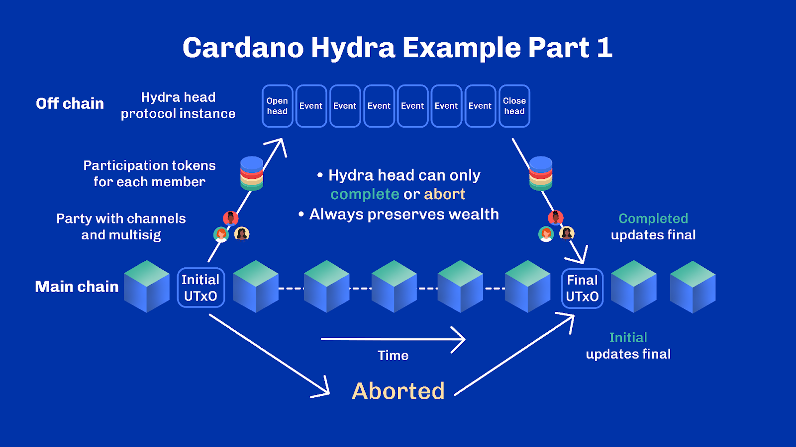
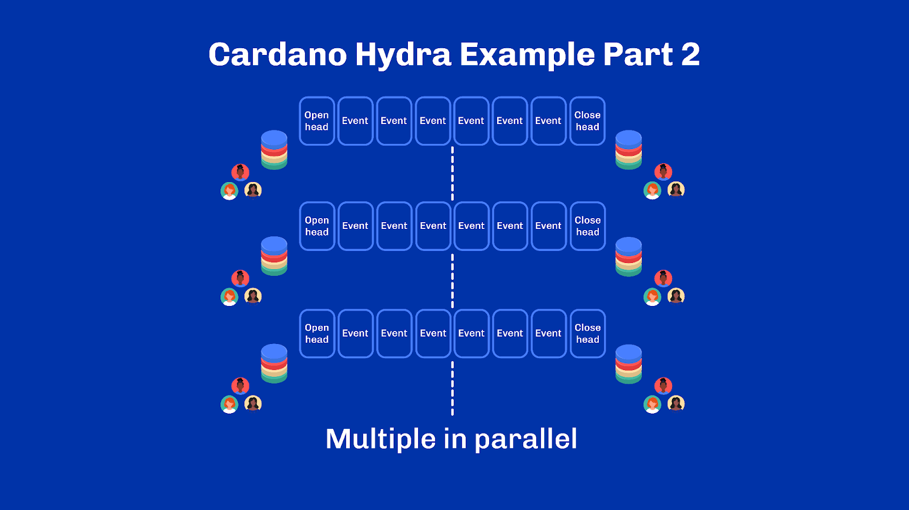
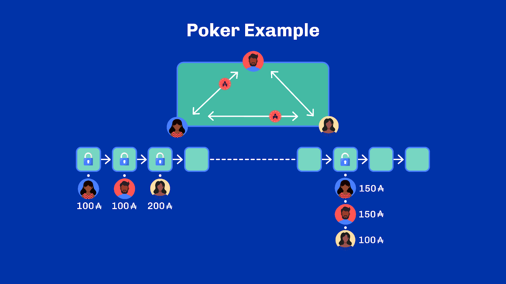
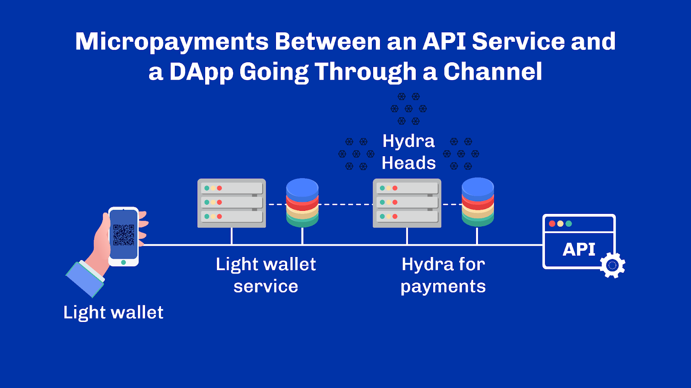
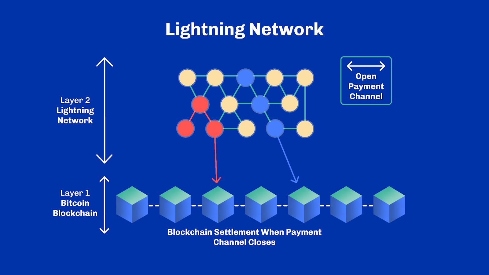
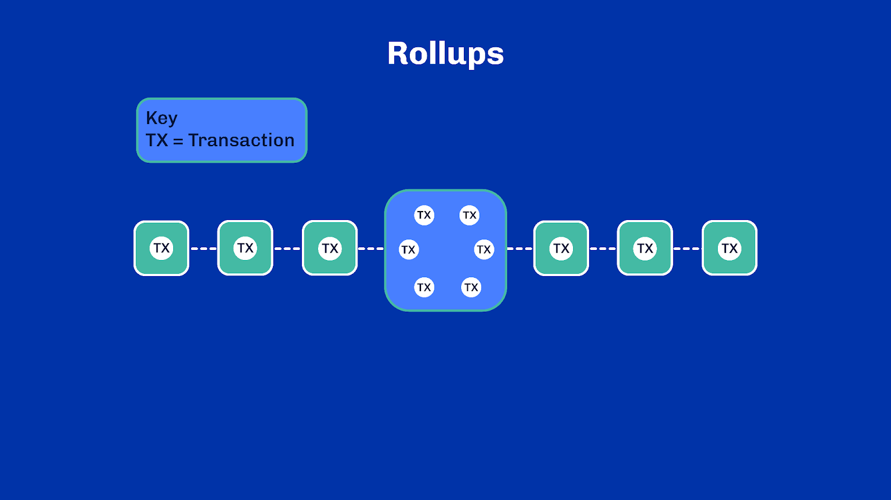
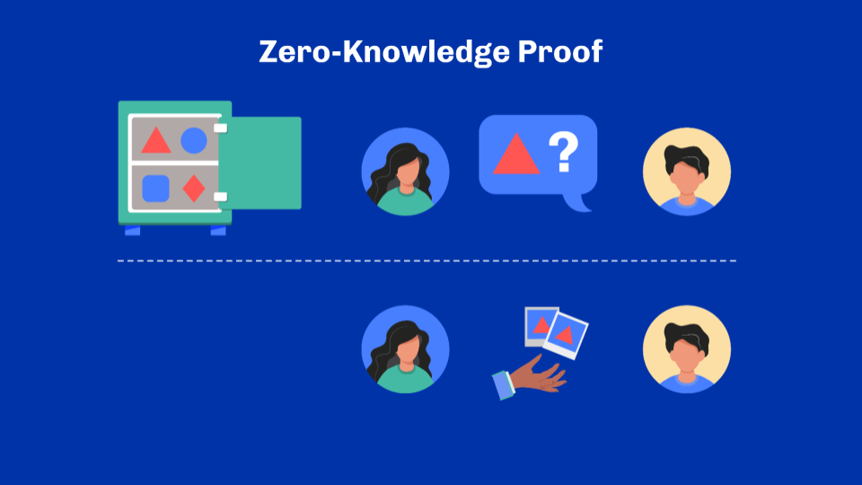

# Unit 7 - Scalability: Layer 2 Solutions

## Learning Objectives

> [!NOTE]
>
> By the end of this unit, you should be able to:
>
> - [x] Understand  the fundamental properties of all layer 2 solutions
> - [x] Explain how layer 2 solutions work at a high level
> - [x] Explain briefly what state channels and rollups are, their use cases and limitations
> - [x] Know what side chains and validiums are and what distinguishes them from state channels and rollups

## Introduction
Welcome everyone, I am [lecturer name], and I’ll walk you through scalability and layer one solutions.

## Table of Contents
In this unit, we will understand the fundamental properties of layer two solutions and how they work at a high level. We will look at some examples including state channels, rollups, side chains and validiums. Let’s get started!

## Layer 2 Solutions
### Definition
In the previous unit, we primarily focused on techniques to scale the blockchain itself, called layer 1, it is also known as the base layer. We saw that scaling systems almost always come with trade-offs. And sometimes, those trade-offs aren't better or worse; they are simply insufficient to scale enough for the growing demand of that base layer. When scaling the base layer isn't enough or possible, building another layer geared towards scalability may be a solution.

Such a solution is usually referred to as a layer 2 solution. More specifically, a layer 2 solution is a system that overlays an existing protocol to provide either additional functionality or performance improvements to the underlying protocol. Notably, a layer 2 solution must inherit the security of the protocol it builds atop. That is, any output of the layer 2 solution must eventually be verified through the same rules that govern its layer 1. ‘Eventually’ is an important keyword here. We'll see why in a minute.

Layer 2 solutions aren't necessarily scaling solutions. A system may introduce a layer 2 to provide new functionality that would otherwise be cumbersome to implement on the base layer. Privacy, for example, is sometimes introduced via layer 2 solutions since this isn't always a desirable property of a layer 1. This could be for audit and regulation purposes.

### Common principles
Are there any common principles of layer 2 solutions? Yes indeed! As we just saw, layer 2 solutions must inherit the security of layer 1. A direct implication of this requires layer 2 solutions to rely entirely on capabilities provided by base layers for final verification. In a layer 2 solution, the final approval cannot be given by a separate and independent group of validators, but instead must come from the core consensus nodes.

Engaging with a layer 2 solution almost always starts with locking funds in a smart contract. And it ends with unlocking those funds in exchange for proof verifiable by that smart contract. The contract acts as a mediator to resolve any dispute and ensure the rightful execution of the protocol. That notion of proof is essential to the functioning and security of layer 2 solutions. A proof can be anything but usually relies on cryptographic primitives such as digital signatures or zero-knowledge, which we will cover shortly. The stronger the proof, the more secure, the layer 2 solution.

Incidentally, you may often hear about "on-chain" and "off-chain" to describe concepts overlapping with layer 1 and layer 2.  Let’s dispel any possible confusion about those terms now. Let’s start with “on-chain”. Something that is ultimately executed by the consensus nodes – like a smart contract validation logic or a digital signature verification – is said to happen "on-chain". Similarly, any metadata stored directly in transaction payloads ends up "on-chain". In contrast, when an execution happens outside of the base network or when data is stored on external servers off the blockchain, we talk about "off-chain" constructs.

Scalability layer 2 solutions are therefore systems that move expensive computations off-chain, only to commit compressed results back on-chain. Doing so reduces the resource needed in one or more of the key dimensions we've seen in the previous unit: execution, storage, networking, consensus or cost.

Let's walk through a few examples to anchor those concepts in our minds.

## State-Channels

### Definition
Despite the variety of layer 2 solutions that have been developed, they usually fall into one of two categories - state channels or rollups. We will start with the first one: state channels. They were the first kind of layer 2 solutions to appear, initially in the form of ‘payment channels’ and later generalized to state channels.

Generally speaking, a channel is a bi-directional communication link between two or more participants. Applied to blockchains, it means an instrument that allows two or more parties to exchange transactions other than by broadcasting them onto the main network. In this context, a state channel offers a way of constructing small networks that operate parallel to a main network. While payment channels only support the transfer of assets, state channels allow the execution of scripts as well as more elaborate transactions, including metadata, multi-assets UTxO, and so on.

A channel is said to be “opened” by participants, typically by locking funds in an on-chain smart contract driving the channel lifecycle. Each participant deposits funds in the contract they intend to use in that channel. When participants are done, they close the channel and redistribute the funds according to the state-agreed off-chain.

You can picture a state channel as a game of poker. To start off, a group of participants buy chips at a casino and move to a private table. From there, they play the game and exchange the chips according to rules they’ve agreed upon in advance. Once the game is over, participants leave the table and exchange any chips they have left back for real money. In this situation, the chips serve as proof to the casino of who owns what. In the end, the casino itself has no detailed record of all exchanges that happened at the table. It only records who owns what at the end of the game. Incidentally, there’s also no money created or lost during the process, the original amount has simply been redistributed.

 
 

Bitcoin’s Lightning Network is a prime example of a layer 2 solution based on payment channels to facilitate faster transactions. Raiden and Perun are examples of state channels on Ethereum with similar properties. And of course, Hydra is Cardano’s version based on extended UTxO. All work in a similar fashion with participants opening up a channel by locking funds for a period of time and splitting them back to participants once closed. They differ mainly in the way they agree to exchange assets off-chain, as well as in the way they settle the result and resolve disputes on-chain.

### Use-cases
State channels are particularly well-suited when a limited number of participants need to interact at a fast pace and low cost. Think, for example, about micropayments or in-app purchases. Indeed, because participants communicate off the base network, they can get rid of fees, latency and can even use different consensus algorithms between themselves. Hydra, for example, requires full consensus: all participants must sign off on everything. This is unsuitable for a large number of participants but completely reasonable within a small group.

Another use case would be privacy. Off-chain communication channels are established through rules and methods fixed by the participants. This is a good opportunity to introduce privacy elements to a protocol that isn't necessarily private to begin with. So while the establishment of a channel remains public and is visible on layer 1. What happens in the channel is only known to its participants.

State channels also come in handy to circumvent the limitations of a base layer. For a concrete example, imagine huge transactions that wouldn't fit in a block because of protocol limits. Splitting a large transaction into smaller chunks would break a transaction's crucial atomicity property. Thus, there would be no guarantee anymore that all parts of the transaction would be executed. A channel offers a way to recover that atomicity. It does this by performing all transactions in the channel, or none at all, provided that opening and closing a channel are seen as two atomic operations from layer 1 – which is usually the case.

## Drawbacks
### Scalability
One apparent drawback stems from those use cases: state channels do not scale well. Again, remember that scalability is about trade-offs. The low-cost, low-storage and low-latency, high-computation benefits obtained from channels come at the expense of a less efficient consensus.

Besides, participants in a state channel are also fixed. They must be known when the channel is started and it isn't generally possible to add new participants to an open channel. So contrary to an open, permissionless network, a channel only expands up to its initial participants. This is both a feature and a limitation.

Some systems, such as the Lightning Network in Bitcoin, have brilliantly responded to this by composing channels together to create a network of interconnected channels with elaborate routing. A single channel doesn't scale, but what about millions of channels?

### Liveness
Another aspect we haven't alluded to yet regards the liveness of data on a channel. As  channel details are usually not stored – or at the very least, aren't stored on any layer 1, they rely on channel participants to keep a record of what's happening at all times. Hence, channels are usually not resilient to network outages. They also require users to be online to monitor every single operation happening off-chain.

### Data Availability
Similarly, data availability can be challenging with state channels. Data availability refers to a user's ability to access the latest state of the system. In a state channel, data is only truly available to those inside the channel. Without additional mechanisms, someone not in the channel cannot know what is happening inside it without trusting one of the participants. As you know, trust is a big deal in the blockchain industry.

## Rollups
### Definition
Moving on to our second grand family of layer 2 scalability techniques: rollups. Different kinds of rollups exist depending on how conflicts are resolved and how the proof needed for layer 1 is constructed and verified. Yet, they all have one thing in common: a rollup moves some off-chain computations outside of the base layer, only to then post a compressed version of those computations alongside their results back to layer 1. A rollup is essentially a bundle of transactions that have been processed off-chain and published on-chain as if they were one big transaction. If transactions carry metadata, they are all carried on-chain with the rollup. Said differently, rollups make layer 2 data available to layer 1, unlike typical state-channel solutions. They save the overhead of declaring, posting and executing multiple transactions.

This approach implies the existence of a rollup network operated by third parties in charge of aggregating off-chain transactions, compressing them and publishing their data and results on-chain. To enter the rollup network, users must deposit and lock funds in an on-chain smart contract that bridges layer 1 and the rollup network. As with state-channels, locking is necessary to make funds available on layer 2 because it ensures that funds cannot move on the base layer while being used as liquidity on layer 2.

The rollup contract has, therefore three prominent roles:

- It manages deposits from users who want to participate in the rollup
- It manages withdrawals from users who want to exit the rollup
- It verifies the validity of the data and results posted on-chain by the rollup

So one may ask under what security model do rollups operate then? And this is where we usually distinguish between two categories of rollups: optimistic and zero-knowledge.

### Optimistic Rollups
An optimistic rollup is a type of rollup where no proof whatsoever is posted on-chain. Instead, rollup operators will optimistically post a result on-chain that can be disputed for a time. This approach thus requires two types of nodes: aggregators and validators. Validators are crucial to ensure the security of the rollup as they discourage aggregators from posting false or invalid results.

Dispute resolution happens on-chain and is driven by a smart contract. When a dispute starts, aggregators must prove that whatever is being disputed happened the way they claimed. If they cannot prove it – by providing the actual authorized source transaction, they are slashed from an amount of funds locked for that very purpose. If they are correct, then it’s the validator, who initiated the pointless dispute, that is punished instead.

Hence, proofs are only ever submitted when required. The verification is done on-demand and under the assumption that most transactions are undisputed. Indeed, if parties end up disputing every transaction, an optimistic rollup provides no particular efficiency over standard transactions. It even makes things worse because disputes come with an extra ceremony. However, this assumption usually holds thanks to the negative financial incentives that come from slashing.

Optimism and Arbitrarum are two examples of optimistic rollup solutions on Ethereum. Tezos also introduces a concept of ‘smart optimistic rollups’ as a layer 2 scaling solution.

### Zero-Knowledge Rollups
In contrast, zero-knowledge rollups will always post a succinct proof to the chain using advanced cryptographic techniques known as zero-knowledge. We won’t go into the details of zero-knowledge, as that would require its own module or possibly more! For now, it is sufficient to understand that a zero-knowledge proof is a mechanism that can be used to prove a statement without revealing anything other than what’s being proven. I bet it sounds a bit abstract, so let’s apply that to rollups.

We have seen in previous units that transactions are nothing more than operations that modify a blockchain state. Put simply they move assets around. In a rollup, the ledger on the base layer knows in what state the rollup started. It corresponds to all the locked assets when the rollup was initiated. When a rollup aggregator posts a new state on-chain, the ledger on the base layer attempts to verify whether this new state is a valid transition. And it needs to do that without re-executing all the transactions itself – otherwise, the rollup would be pointless.
This is where the zero-knowledge proof comes into play. The proof is a guarantee that the proposed state is indeed the result of the execution of the transaction sequence. Importantly, verifying the proof is much faster and more efficient than re-executing all transactions. And unlike optimistic rollups that require external validators to verify and possibly dispute rollups, the rollup contract can entirely verify a zero-knowledge proof on-chain.

Aztec, ZkSync, StarkWare and Loopring are examples of zero-knowledge rollups on Ethereum. ZCash and Mina both use zk-SNARKs at the core of their protocol. Syscoin, zkSync and Miden are additional examples of zero-knowledge rollups.

### Use-Cases
Rollups are particularly well-suited for low-priority transactions, when an immediate finality isn’t required. They allow entire chunks of traffic to be moved out of a layer 1, without compromising on security or data availability.

## Drawbacks
### Centralization
If this sounds too good to be true, this is because we haven’t considered the drawbacks yet. A rollup solution introduces points of centralization in the system. Indeed, rollups are usually managed by single operators who provide the rollup service in exchange for a fee. While this doesn’t compromise security in the system, thanks to proofs or validators, they can easily censor any traffic going through them. Also, rollup aggregators usually have complete control over how they order independent transactions, which may favor one user over another.

### Cost
Cost is another factor to consider when operating a zero-knowledge rollup, as it requires high-end hardware. A zero-knowledge proof takes time and considerable resources to generate. This makes zero-knowledge solutions impractical to run on your own from a desktop machine. It forces reliance on a third-party service. Also, zero-knowledge techniques require smart contracts to be written in a specific way. Many zero-knowledge solutions require programs to be expressed as arithmetic circuits – a programming paradigm well suited for cryptographic operations. More recent approaches, such as zk-STARK, attempt to work from assembly languages and more classic Turing-machines. Yet overall, zero-knowledge usually requires re-writing smart contracts initially written for a layer 1.

### Security and Validators
The case of optimistic rollups is also interesting as it exposes a paradox. In order to remain secure, optimistic rollup aggregators must be monitored by a set of validator nodes (typically distinct from the layer 1 consensus nodes). Upon successful dispute, validators are rewarded for their efforts. However, when aggregators operate in good faith, there’s little to dispute. And thus, minimal financial incentives to run such a validator. Yet, optimistic rollups are fundamentally compromised without validators since aggregators are free to push arbitrary states to the chain.

### Settlement Delay
Either way, rollups generally introduce a settlement delay. In the case of zero-knowledge, this is due to the time needed to compute proofs. In the case of optimistic rollups, it stems from the dispute period that follows a state change. One can only truly consider data settled after the dispute period has ended.

## Other Scaling Solutions
We’re almost at the end of this unit, but before we finish, we need to discuss the case of side-chains and validiums. You may have heard those terms and wondered why they were not covered earlier.  The reason is that side-chains and validiums do not usually qualify as layer 2 solutions. Let’s see why that is.

## Side-Chains
A side chain is, first and foremost, a different chain. It has its own consensus nodes, distinct from the ones forming the layer 1. It has blocks and a data layer of its own. Yet, the side chain only exists to serve its main chain. Usually, this means that side chains are tailored to specific use cases or are spun up to cover the needs of well-known applications.

There are also no particular rules regarding how they bridge to the base layer. Usually, bridging is done through a smart contract, but the deposit and withdrawal rules are flexible. For example, a basic bridge could simply require a multi-signature from a handful of side-chain validators. In this scenario, the protocol's security depends entirely on the trustworthiness of the validators. And because side chains are usually less decentralized than layer 1 blockchains, they are often seen as less secure.

This is unlike state channels and rollups, where both will try to convince the layer 1 that transactions were executed off-chain in conformance with the on-chain rules. However, side-chains can also leverage rollups to regularly post proofs to layer 1, getting the best of both worlds: a powerful proof mechanism and an efficient parallel network and data layer that can easily be audited.

### Validiums
Finally, a quick word about validiums. These solutions are very close to zero-knowledge rollups that we saw earlier, except that a validium doesn’t publish any transaction data back on-chain. A validium only publishes proof and makes transaction data available through a side network. This non-availability of data from the base layer implies that the full validation of a validium proof requires the side network to be available and trusted. Should the data stored on that network get lost or tampered with, then published proofs would become unverifiable and thus invalid.

Similarly, users wanting to withdraw their funds from a validium, must request data from the validium’s data layer, which may be offline or rejected.

## Review
With that, we’ve come to the end of this unit on layer 2 solutions. We saw that a layer 2 solution overlays a layer 1 to provide enhanced functionality or performance. We looked at the two main types of layer 2 solutions - state channels and rollups. We looked at how state channels worked, their use cases and limitations. Then we examined the two types of rollups - optimistic and zero-knowledge, how they work and their limitations. Finally, we briefly touched on side chains and validiums, which are not quite layer 2 solutions. This brings us to the end of this module.

## References
- https://perun.network/
- https://chain.link/education-hub/what-is-layer-2
- https://cardanofoundation.org/en/news/hydra-head-protocol-an-open-source-solution-for-scalability/
- https://hydra.family/head-protocol/core-concepts/layer-two
- https://en.wikipedia.org/wiki/Zero-knowledge_proof
- https://lightning.network/lightning-network-paper.pdf
- https://eprint.iacr.org/2018/320
- https://ethereum.org/en/developers/docs/scaling/state-channels/
- https://vitalik.ca/general/2021/01/05/rollup.html

## Glossary

- *Layer two solution*: This is a system that overlays an existing protocol, a base layer, to provide either additional functionality or performance improvements to the underlying protocol.
- *State Channel*: This is a bi-directional communication link between two or more participants. It is an instrument that allows two or more parties to exchange transactions other than by broadcasting them onto the main network.
- *Roll-ups*: A rollup is a layer solution, which moves off-chain computations outside of the base chain and posts a compressed version of those computations alongside their results back to the base layer 1.
- *Optimistic roll up*: An optimistic rollup is a layer 2 solution,  where no proof is posted on-chain.
- *Zero-knowledge rollups*: Zero-knowledge roll-ups are a layer 2 solution, that always post a succinct proof to the chain using advanced cryptographic techniques known as zero-knowledge.
- *Side-chains*: A side chain is a different chain, with its own consensus nodes, blocks and data layer. Its purpose is to serve its main layer 1 chain. They are usually tailored to specific use cases.

## Questions

**Sub-Unit 1**

*Select the statement that best describes a layer 2 solution.*
- A solution that entirely replaces its base layer
- **A system that overlays an existing protocol to provide additional functionality or performance improvements (CORRECT ANSWER)**
- A solution where, at its core, is just a scaling solution
- A layer that operates independently without inheriting the security of its base layer

*For a layer 2 solution, what is essential regarding the security of the protocol it builds on?*
- It must completely change the security measures of layer 1
- **It should inherit the security of the protocol of its layer 1 (CORRECT ANSWER)**
- It should weaken the security of the base layer to increase functionality

*How do layer 2 solutions help in improving scalability for a blockchain?*
- They move all data off-chain
- **They move expensive computations off-chain and commit compressed results back on-chain (CORRECT ANSWER)**
- They always replace layer 1 solutions
- They operate without any linkage to layer 1

*When data is stored on external servers off the blockchain, it is referred to as:*
- On-chain data
- **Off-chain constructs (CORRECT ANSWER)**
- Base layer data
- Layer 2 data

**Sub-Unit 2**

*Select the correct statements about state channels. Select 2*
- They only support the transfer of assets
- **They offer a way of constructing small networks that operate parallel to a main network (CORRECT ANSWER)**
- They restrict transactions to stay between no more than two parties
- **They allow the execution of scripts and more elaborate transactions (CORRECT ANSWER)**

*How is a channel typically "opened" by participants?*
- By executing a script on the main network
- By broadcasting a transaction onto the main network
- **By locking funds in an on-chain smart contract (CORRECT ANSWER)**

*Which of the following choices isn’t a state-channel solution?*
- Hydra: head protocol
- **Arbitrum (CORRECT ANSWER)**
- Raiden

*True or False: A state channel can be established between more than two participants.*
- **True (CORRECT ANSWER)**
- False

**Sub-Unit 3**

*How can state channels be used? Select 3*
- **To overcome the base layer’s limitations (CORRECT ANSWER)**
- **To introduce privacy elements (CORRECT ANSWER)**
- To increase transaction fees on the base layer
- To make all off-chain communications publicly accessible
- **For fast, low-cost interactions among a limited number of participants (CORRECT ANSWER)**

*In the context of the state channels, why would participants communicate off the base network?*
- To increase transaction fees
- To enhance latency and communication delays
- **To eliminate fees, reduce latency, and potentially use different consensus algorithms (CORRECT ANSWER)**
- To always make use of the same consensus algorithm as the base network

*How do state channels address the issue of large transactions that don't fit within block limits?*
- By guaranteeing that all parts of the transaction would be executed without any conditions
- **By performing all or none of the transactions in the channel to maintain atomicity (CORRECT ANSWER)**
- By requesting the base layer to expand its block size

**Sub-Unit 4**

*Which statement best describes participants in a state channel?*
- Participants can join or leave an open channel anytime they want
- Participants are flexible and can be changed midway in the channel
- **Participants must be set at the channel's start and can't be added later (CORRECT ANSWER)**
- Participants are randomly selected when a channel is opened

*How does the Lightning Network in Bitcoin address the limitation of state channels?*
- By making all channels private
- By creating a singular, large channel for all transactions
- **By composing channels together to form a network of interconnected channels (CORRECT ANSWER)**

*What is crucial for the maintenance of data in a channel?*
- Storing all channel details on layer 1
- **Channel participants keeping records of all activities (CORRECT ANSWER)**
- Channels backing up data in a cloud storage
- Channels being open to the public for scrutiny

*What does "data availability" refer to? Select 1*
- The storage capacity of a channel
- The encryption level of data inside a channel
- **A user's ability to access the latest state of the system (CORRECT ANSWER)**
- The backup mechanism of a channel

**Sub-Unit 5**

*Select 2 correct statements on rollups as a layer 2 scalability solution.*
- **All rollups process computations off-chain and post a compressed version to layer 1 (CORRECT ANSWER)**
- They ensure that funds move on the base layer while being used as liquidity on layer 2
- Rollups can be described as an on-chain transaction with no off-chain components
- **It's a bundle of off-chain transactions published on-chain as one transaction (CORRECT ANSWER)**

*What are the three prominent roles of rollup contracts?*
- **To manage deposits from users who want to participate in the rollup (CORRECT ANSWER)**
- **To manage withdrawals from users who want to exit the rollup (CORRECT ANSWER)**
- To process transactions within the rollup network
- To verify the users who want to participate in the rollup
- **To verify the validity of the data and results posted on-chain by the rollup (CORRECT ANSWER)**

*Why are funds locked when entering the rollup network?*
- To compress the transactions of those who participate in the rollup
- **To make funds available on layer 2 while ensuring they can't move on the base layer (CORRECT ANSWER)**
- To verify the validity of the data used in the rollup network

*Why are optimistic rollups called 'optimistic'? Select 1*
- **Because state changes are optimistically posted on-chain without proofs, but may be disputed (CORRECT ANSWER)**
- Because they immediately provide proofs about the finality of transactions.
- Because transactions can never fail on an optimistic rollup
- Because they gave hope to people when everyone thought that scalability of blockchains was a dead-end

*Which of the following statements is true about the efficiency of optimistic rollups?*
- They are always more efficient than standard transactions
- **They become inefficient if all transactions are disputed (CORRECT ANSWER)**
- They are mainly efficient due to on-chain proofs

*Which of the following is NOT a node type associated with optimistic rollups?*
- Validators
- Aggregators
- **Miners (CORRECT ANSWER)**
- Disputants

*What is the main function of a zero-knowledge proof in rollups?*
- To reveal all transaction details
- **To prove a statement without revealing any extra information (CORRECT ANSWER)**
- To initiate rollup aggregators
- To dispute posted results on the chain

*In the context of rollups, why are zero-knowledge proofs beneficial?*
- They require re-execution of all transactions that take place
- They are slower to verify than standard methods
- **They confirm the transaction sequence without redoing all transactions (CORRECT ANSWER)**
- They make on-chain disputes more complex

*How do zero-knowledge rollups differ from optimistic rollups in terms of verification?*
- Zero-knowledge rollups require more external validators
- **Zero-knowledge rollups can be entirely verified on-chain without external validators (CORRECT ANSWER)**
- Zero-knowledge proofs are disputed more often
- Both types always require external validators for verification

**Sub-Unit 6**

*Why can operating a zero-knowledge rollup be costly?*
- It requires a desktop machine
- **It requires high-end hardware due to the resources needed to generate a proof (CORRECT ANSWER)**
- It simplifies the process of writing smart contracts

*What’s the main drawback of zero-knowledge rollups?*
- **They only work on the Ethereum Virtual Machine (EVM)**
- They are too slow
- They are permissioned
- **They require smart contracts to be rewritten (CORRECT ANSWER)**

*What is the main role of validator nodes in optimistic rollups?*
- To push arbitrary states to the chain
- To operate as layer 1 consensus nodes
- **To oversee and challenge optimistic rollup aggregators when needed (CORRECT ANSWER)**
- To provide financial incentives to aggregators

**Sub-Unit 7**

*Why are side chains often perceived as less secure?*
- Because they have too many consensus nodes
- Because they rely on state channels for security
- **Because they are less decentralized than layer 1 blockchains (CORRECT ANSWER)**
- Because they lack a proper proof mechanism

*What advantage can side chains have by leveraging rollups?*
- They can create a new consensus algorithm
- They can replace the main chain
- **They can have a powerful proof mechanism and an efficient parallel network (CORRECT ANSWER)**
- They can make their consensus nodes more decentralized

*Select the correct statements about validiums. Select 2*
- If a user wants to withdraw funds from a validium, they must get approval from all participants
- **A validium doesn’t publish any transaction data back on-chain (CORRECT ANSWER)**
- For the full validation of a validium proof, a third-party validator has to approve it
- Published proofs would become unverifiable and invalid if tampered with
