# Unit 1 - Cardano Genesis

## Learning Objectives
By the end of this unit, the learner should be able to:
- Describe the mission and principles of Cardano
- Explain what is peer-review science and formal methods
- Describe Cardano’s genesis and genesis entities
- Have a high-level understanding of the roadmap

## Introduction
Hello everyone, and welcome. My name is (lecturer name) and I’ll walk you through the Cardano project and how it came to be.

## Table of Contents
In this unit, we will explore Cardano’s mission to create a more inclusive and fair global financial system. Let's delve into the visionary principles and unique approach that drive Cardano's development.

## Cardano's Mission and Principles
Cardano's mission is to enable everyone to access financial services and participate in the global economy on equal terms. As Charles Hoskinson, the founder of Input Output, the leading software company behind Cardano, said:

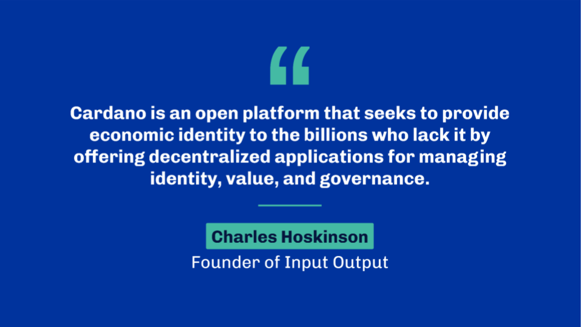

To expand its impact from millions to billions, Cardano recognizes the importance of solving the challenges of scale, interoperability, and sustainability for real-world economies. These three core design principles guide Cardano's development.

The project began in 2015 with a focus on engineering best practices and exploration, rather than a traditional white paper or detailed roadmap. Cardano's core belief is rooted in evidence-based science and rigorous development to create a robust global financial and social platform.

Key among these principles are:

1. Rigorous peer-reviewed research: Cardano ensures thorough testing and vetting through scientific approaches before implementing changes to the platform.
2. Formal methods: Mathematical specifications, property-based tests, and executable proofs provide guarantees on the functional correctness of core components.

Cardano follows a first principles approach. Rather than delivering isolated solutions from a mountaintop, it presents problems to be solved and fosters a community-driven search for answers. Collaboration and decentralized problem-solving involve multiple actors and experts coming together to address complex challenges.

Now, let's see how Cardano translates these principles into practice to build a more inclusive financial system for the future.

### Peer Review
While it’s been around for a few years, the Blockchain industry is still in its infancy. Research is ongoing, and many projects are experimenting with new concepts. It is pervasive to see projects leverage previous blockchain generations as a foundation for a new blockchain.

It has also been clear from the start that Cardano would not solve all problems immediately. Indeed, and this is especially true in the software industry, one cannot predict what the future holds. Hence it is paramount to define a proper research framework to ensure the durability and sustainability of a project of this magnitude.

In fact, most of the work on Cardano begins with research through world-leading academic institutions,  such as the University of Edinburgh, the University of Athens, the University of Connecticut, the University of Oxford and the Tokyo Institute of Technology, to cite a few. Academics explore topics as diverse as computer science, philosophy, sociology, behavior science, and game theory.

The research is typically done in a peer-reviewed fashion. That means research work is not only published by an academic body but is also reviewed and analyzed by experts in the field to ensure its legitimacy. Often, peer review is done in an anonymous setting to avoid bias. Anyone can publish a so-called “white paper”, but not anyone can publish in a prestigious research journal or at an academic crypto conference. To be accepted, papers must demonstrate a certain level of quality and scientific evidence for any claims they put forward. This approach provides credibility and ensures that the work is reliable and well-designed.

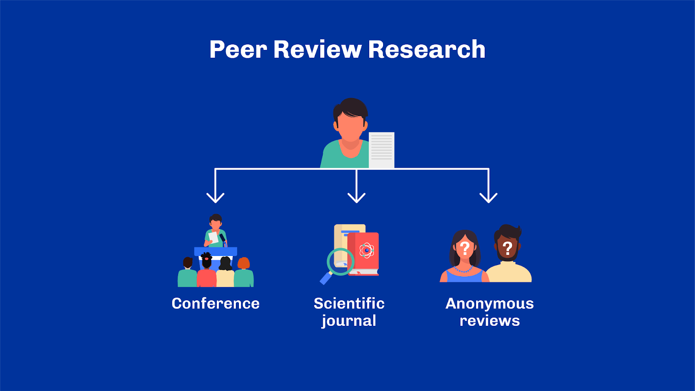

In addition, none of the research on Cardano is patented. It is accessible to anyone to use and build upon. For example, papers like “Ouroboros: A Provably Secure Proof-of-Stake Blockchain Protocol” by Kiayias et al. have been cited more than 1600 times in other research work! And today, blockchain projects such as Polkadot or Mina also use Ouroboros as their consensus algorithm.

### Formal Methods
Another key trait of Cardano is its development methodology and how it finds its root in formal and semi-formal methods.

In computer sciences, formal methods describe techniques used to ensure the rigorous specification, analysis and verification of software programs.

Semi-formal methods also refer to mathematically-inclined techniques but leave some elements open to human interpretation. In particular, we usually speak about semi-formal methods when specifications and results aren’t machine-checkable yet still attempt to model a problem using rigorous semantics – unlike natural human language which is often too imprecise.

Either way, these methods often make heavy use of mathematics and theoretical computer science. They are valuable techniques for thinking about a design space or assessing a software's correctness. And they range from a large number of techniques.

For example, expressive type systems from programming languages such as Haskell allow developers to capture pre-conditions and desired properties of a program as types. Put simply, a type is a collection of possible states in which a particular thing can be. Any programming language comes with a type-system that is more or less expressive. Often, programming languages allow developers to design their own types to model their application's domain. Incidentally, Haskell is amongst the most expressive and capable type-systems to be found in the industry.

Another example of formalism comes in the form of binary specifications. A binary specification is a vocabulary and a grammar that defines how programming data objects should be represented when transferred over the wire or stored on the file system. Having separate specifications for cases like this enables interoperability and may limit possible mistakes. By conforming to a specification, one can validate that an implementation was indeed done correctly.

Pushed to another level, this can even be applied to entire chunks of logic. For example, the Cardano ledger uses a "small steps semantic" framework to define rules that the ledger must apply for block validation and other events occurring on-chain. This framework allows defining states and transitions between them in a relatively high-level mathematical way. From there, proof assistant tools such as Isabelle or MetiTarski are used to prove theorems satisfied by the transitions. For example, it is paramount to prove the preservation of value across the system: every asset in the system must be accounted for, regardless of the step that's taken.

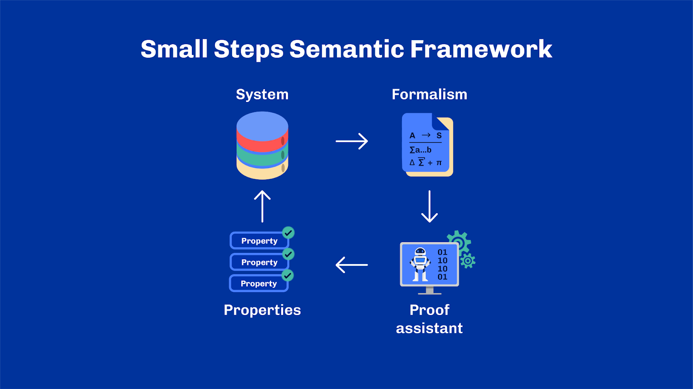

Formal methods are quite atypical across the overall software industry. Because they are usually complex and costly to set up, engineers only resort to them for critical systems such as those found in the aerospace or medical industries. Arguably, a global financial system seems like a perfect fit too.

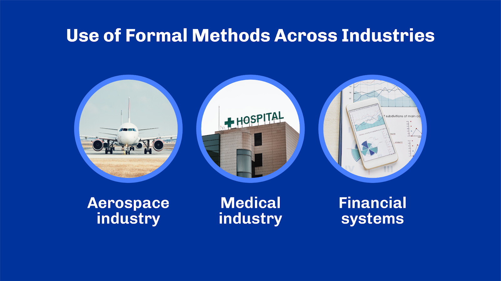

## Cardano Genesis
### Genesis Entities
Cardano is designed by a global team of experts in disciplines ranging from distributed systems to programming languages and game theory. Initially, Cardano was supported by three core entities: the Cardano Foundation, Input Output Global and EMURGO. Let's introduce them all briefly.

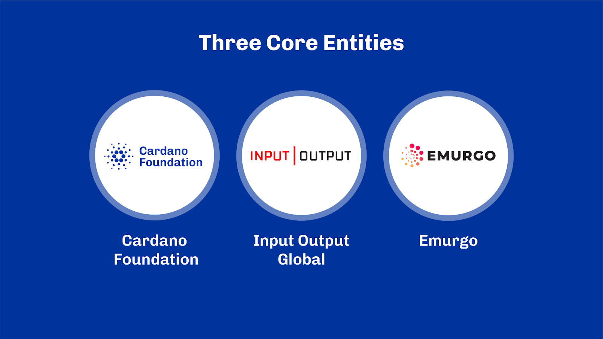

The Cardano Foundation is an independent standards body based in Switzerland. Its core responsibilities are overseeing and supervising the development of Cardano and its ecosystem. The Cardano Foundation focuses on three core areas: operational resilience, education and adoption. If you are taking this course today, you are at the intersection of these three missions.

Input Output Global, or IOG, is the technology and engineering company charged with the task of designing and building the initial Cardano platform. Originally founded by Charles Hoskinson and Jeremy Wood as Input Output Hong Kong, or IOHK, IOG is committed to innovation through rigorous scientific peer review and the highest quality assurance standards in software development. IOG has several partnerships with leading universities to ensure high academic standards and to commit to a positive impact on the broader scientific community.

Finally, EMURGO was tasked to develop, support, and incubate commercial opportunities for Cardano. It helps integrate businesses into Cardano and essentially embodies Cardano's for-profit arm. EMURGO endeavors to advance the platform and drive adoption through commercial ventures.

These three entities started the journey. And now, along with the wider Cardano community, they form the engine that drives the Cardano blockchain forward. These entities, combined with the unique approach to development, make Cardano quite different to other blockchains.

### ADA Token Voucher Sale
Before we move on to the roadmap and the various development tracks of Cardano, let’s briefly discuss the original ADA distribution and the genesis block allocation that bootstrapped the system in 2017.

The initial distribution of ADA happened in Japan. It was a token voucher sale that introduced pioneering practices to the cryptocurrency industry. It implemented Know Your Customer (KYC) guidelines and underwent a thorough audit to ensure transparency and accountability – an unprecedented event in the blockchain and crypto industry.

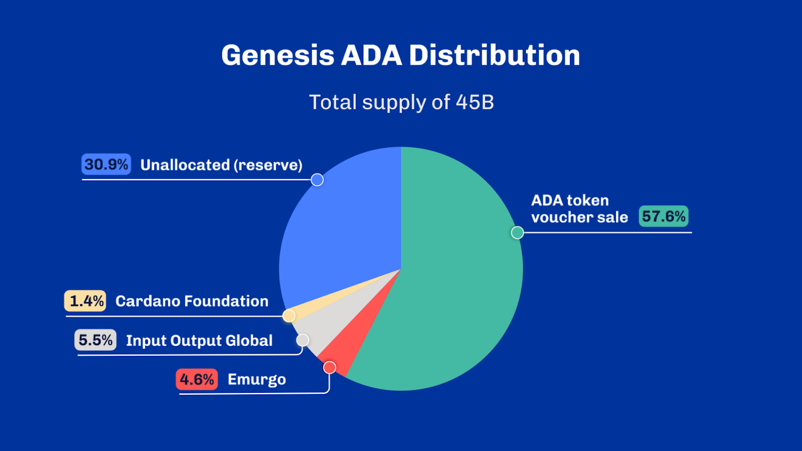

In addition to the token voucher sale, 11.5% of all the ADA supply – About 5.1B – was distributed to the three genesis entities: the Cardano Foundation, Input-Output and Emurgo. The Cardano Foundation received 12.5% of that allocation and thus a total of 648,176,761 ADA. Input Output was allocated 47.5% –  2,463,071,701 ADA. And Emurgo received the remaining 40% totalling 2,074,165,644 ADA.

The token voucher sale accounted for 25,927,070,538 ADA. This means that the total amount of ADA available at the launch was slightly more than 31.1B ADA out of a total supply of 45B. The unallocated ADA is called the ADA reserve, and we’ll see how it is gradually injected into the network through rewards and incentives in a later unit.

The meticulous ADA distribution and the allocation of ADA during Genesis played pivotal roles in shaping the Cardano ecosystem. These initial steps laid the foundation for a secure and decentralized blockchain network.

## Cardano Roadmap
The Cardano mainnet officially started on Saturday, September 23, 2017, at 9:44:51 PM (UTC), precisely as inscribed in the initial genesis configuration. This event kicked off a roadmap with the long-term goal of solving the key issues of scale, interoperability, and sustainability.

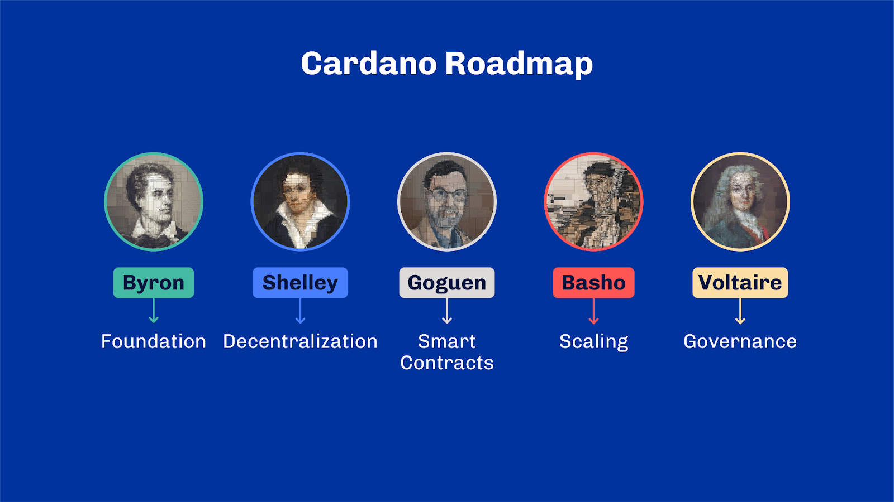

The roadmap comprises five phases: Byron, Shelley, Goguen, Basho, and Voltaire. Each has a specific focus and goal, progressively leading to a more powerful blockchain with greater community ownership. Despite calling it a roadmap, phases are not linear. While it started with Byron, Shelley and Goguen, have been in work concomitantly. Basho and Voltaire are also pursued together while improvements to Goguen are still made today.

Byron was the first development phase and delivered the initial release of Cardano in 2017. Lord Byron was the father of Ada Lovelace, the first computer programmer known in human history. The main goal of the Byron era was to build a strong foundation on top of which the rest of the Cardano roadmap could be delivered. Byron was, without doubt, the most experimental phase of Cardano. Reconciling academic research, formal methods, and agile software delivery is tough, and the road has been bumpy. While it’s been working well for several years after launch, the initial version of Byron was deemed too fragile to absorb all the future changes. So, in parallel to the development of the Shelley phase, another stream of work known as “Byron Reboot” happened and was officially launched at the end of March 2020. This marked an important milestone in the Cardano journey as this update introduced the now-famous Cardano “hard fork combinator”: a way to combine multiple blockchain protocols into one continuous chain. While this little maneuver did cause a significant delay in the development of Cardano, it would pave a sound way for future updates.

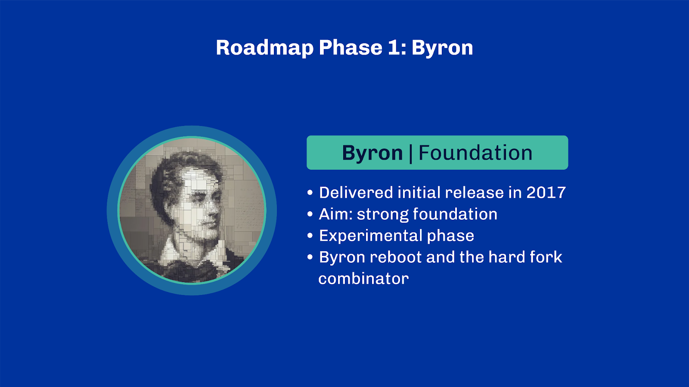

The second phase, Shelley, aims to tackle decentralization by switching from Ouroboros-BFT – a federated PoS consensus protocol – to a transitional version of the Ouroboros Praos protocol – a delegated PoS consensus. Shelley is also known for the advent of stake pools and a reward system to incentivise the community to build and delegate to pools. The transition from a federated network to a fully decentralized network happened gradually to the point where since March 2021, one year after the Byron reboot, every block of the Cardano blockchain has been produced by stake pools.

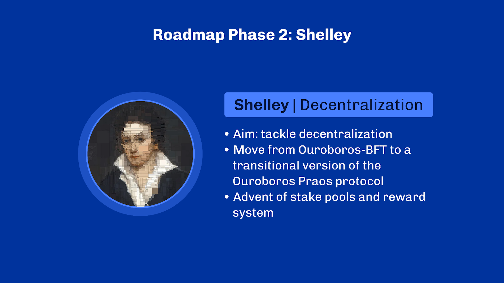

Let’s continue with the Goguen phase, focused on programmability or smart contracts, as the industry calls it. Goguen encompasses anything that regards the development and execution of programmable on-chain scripts. In the case of Cardano, it’s been nurturing the Plutus project, which aims to be a secure and reliable smart contract platform also backed by peer-reviewed science.

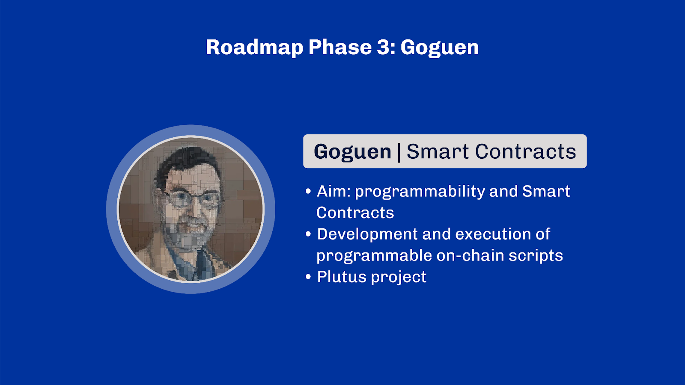

After three phases of features and functionality, the Basho phase focuses on scalability and how to improve Cardano’s performance. One of the main focuses of this phase is designing layer 2 solutions and sidechains, as well as new versions of the Ouroboros consensus to enable higher throughput. We’ll explore sidechains and layer 2 solutions in a later unit.

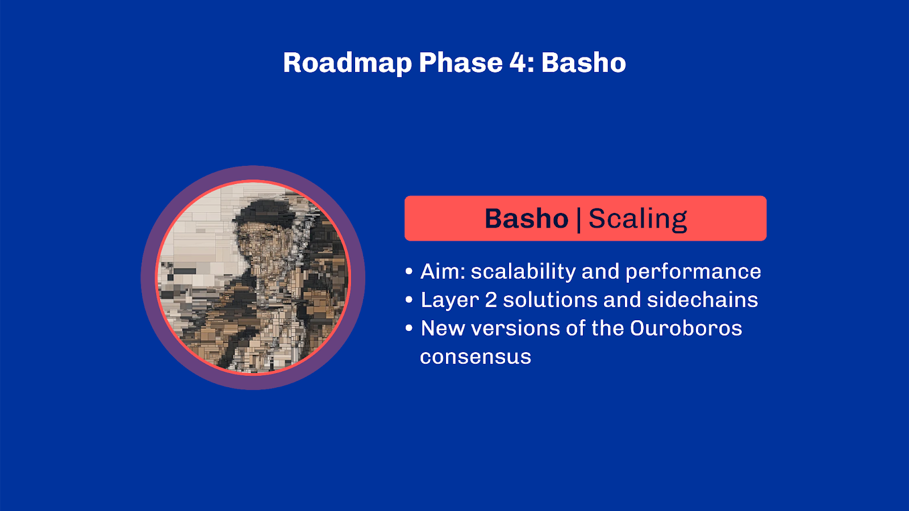

Finally, Voltaire will introduce the last components needed to make Cardano fully decentralized and community-owned. By the time the Voltaire phase concludes, Cardano’s development will no longer be solely overseen by IOG but sustain itself through its own governance system and treasury. This in turn, will enable the community to decide the right developments to fund for the future of the Cardano ecosystem.

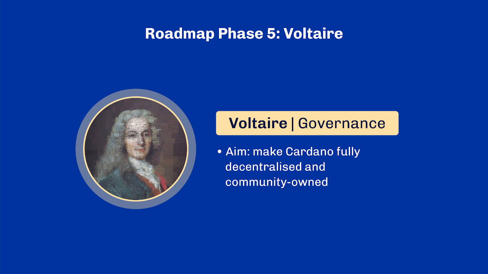

## Review
With that, we have reached the end of the topic of this unit, and you should now have a better understanding of Cardano, its purpose and objectives, and the organizations that initiated the project. The Cardano approach to research and development is a marked departure from the standard practices of the software – and in particular, the blockchain – industry. See you in the next class!

## References
[Ref.8.1.1] Discover Cardano, Cardano.org. Available at: https://cardano.org,  Accessed: 31 August 2022 
[Ref.8.1.2] Lex Friedman Podcast #192: Charles Hoskinson, Available at: https://www.youtube.com/watch?v=FKh8hjJNhWc, Accessed: 31 August 2022 
[Ref.8.1.3] IOHK Research, IOHK.io, Available at: https://iohk.io/en/research/, Accessed: 31 August 2022] 
[Ref.8.1.5] Cardano Roadmap, Cardano.org, Available at: https://roadmap.cardano.org/, Accessed: 31 August 2022 

## Glossary

- *Formal methods*: Formal methods describe techniques used to ensure the rigorous specification, analysis and verification of software programs
- *Semi-formal methods*: Semi-formal methods refer to mathematically-inclined techniques (like formal methods) but leave some elements open to human interpretation.

## Questions

**Sub-Unit 1**

*What better reflects Cardano’s development approach?*
- “Move fast and break things”
- **“Evidence-based science and rigorous software development” (CORRECT ANSWER)**
- “Do the best you can with what you have”
- “Bug-free software”

*Which of the following is NOT listed as one of the core design principles guiding Cardano's development?*
- Scale
- **Connectivity (CORRECT ANSWER)**
- Interoperability

*Select the correct statements about peer reviews.*
- When going through a peer review, the research is reviewed by amateurs only
- **The process of peer review ensures credibility, reliability and well-designed research (CORRECT ANSWER)**
- When wanting to publish in a prestigious research journal, peer reviews are optional
- **Peer reviews are done anonymously to avoid bias (CORRECT ANSWER)**

*What is the best way to ensure the durability and sustainability of a project such as Cardano?*
- By only relying on past blockchain generations for development
- By publishing as many white papers as possible without peer review
- **By defining a proper research framework (CORRECT ANSWER)**

*True or False: peer review science means that academic papers have multiple authors.*
- True
- **False (CORRECT ANSWER)**

**Sub-Unit 2**

*Why are formal methods used in the software industry?*
- They are common practices because they are easy and cheap to set up
- **They are primarily used for critical systems due to their complexity and cost (CORRECT ANSWER)**
- They ensure that programming languages avoid using an expressive type-system

*True or False: thanks to formal methods, it’s impossible to introduce bugs in software.*
- True
- **False (CORRECT ANSWER)**

**Sub-Unit 3**

*What are the three focus areas of the Cardano Foundation’s strategy?*
- Partnerships, Education, Governance
- Operational resilience, Innovation, Adoption
- Education, Marketing, Regulation
- **Operational resilience, Education, Adoption (CORRECT ANSWER)**

**Sub-Unit 4**

*How was ADA initially distributed to ensure transparency and accountability in its initial launch in Japan?*
- Through a randomized selection of participants
- **By implementing Know Your Customer (KYC) guidelines and undergoing a thorough audit (CORRECT ANSWER)**
- By equally distributing it to all crypto exchanges

*What portion of the total ADA supply remained unallocated after pre-sale and genesis allocation?*
- 11%
- **31% (CORRECT ANSWER)**
- 51%
- 71%

**Sub-Unit 5**

*What was the main objective of the Byron phase in Cardano's development?*
- To switch from a federated network to a fully decentralized network using stake pools
- **To build a strong foundation for future phases of the Cardano roadmap (CORRECT ANSWER)**
- To introduce smart contracts on Cardano
- To finalize and perfect the Cardano blockchain without any need for further updates

*What was a significant change introduced during the Shelley phase of Cardano's development?*
- The introduction of the "hard fork combinator" to combine multiple blockchain protocols
- **The transition from a federated PoS consensus protocol, to a delegated PoS consensus (CORRECT ANSWER)**
- The first release, Version 1.0, of the Cardano

*True or False: Cardano started as a federated network, where block production was handed over to the three genesis entities.*
- **True (CORRECT ANSWER)**
- False

*True or False: The Cardano network stopped for several days during March 2020 due to an issue and had to be restarted. This is now referred to as “the Byron reboot”.*
- True
- **False (CORRECT ANSWER)**

*What is the main objective of the Basho phase in Cardano's development?*
- To introduce the last components needed to make Cardano fully decentralized and community-owned
- **To focus on scalability and design layer 2 solutions and side chains for higher throughput (CORRECT ANSWER)**
- To fund future developments for the Cardano ecosystem through the community

*What are the primary goals of Cardano's Voltaire phase?*
- To focus on layer 2 solutions and side chains for scalability
- **To empower the community to decide on future developments (CORRECT ANSWER)**
- To redesign the Ouroboros consensus mechanism
- **To make Cardano fully decentralized (CORRECT ANSWER)**

*What Cardano phase focuses on programmability?*
- Plutus
- **Goguen (CORRECT ANSWER)**
- Basho
- Voltaire

