# Unit 2 - Cardano Architecture

## Learning Objectives
By the end of this unit, the learner should be able to:
- Name the 4 main layers of the Cardano node and describe their roles.
- Describe each Cardano era and the features they brought to the network

## Introduction
Hello everyone, and welcome. My name is (lecturer name)

## Table of Contents
In this unit we will be getting into the architectural specifics of Cardano. By the end of this topic you will understand the defining features of the Cardano blockchain throughout its various eras.

## The Cardano Node
The Cardano blockchain is powered by a flock of interconnected nodes. The Cardano-node is the software capable of running as a core block producer, relay, or local entry point to the network. The node itself is made out of several inter-connected component parts:

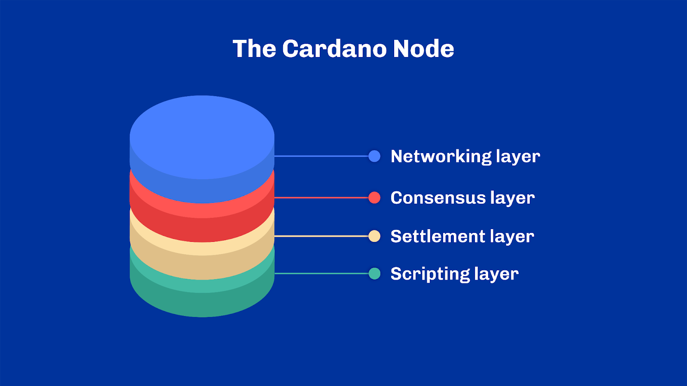

[The networking layer](https://github.com/input-output-hk/ouroboros-network/#ouroboros-network) is a peer-to-peer networking stack geared towards Proof-of-Stake systems. This includes a framework for writing typed protocols. Said differently, protocols can be written in a high-level language and checked by automated tools for their correctness without the need for being actually executed. On top of that, the networking stack supports pipelining, multiplexing and various protections against adversarial peers.

The [consensus layer](https://github.com/input-output-hk/ouroboros-network/tree/master/ouroboros-consensus#consensus) is an implementation of the Ouroboros family of consensus protocols. If you've heard about "The Hard-Fork Combinator", you can find it here.

The [settlement layer](https://github.com/input-output-hk/cardano-ledger-specs#cardano-ledger) is a financial distributed ledger derived from formal specifications. This is where the core Cardano objects and the rules for using them are defined. It is the bedrock on top of which all other components are built upon.

The [scripting layer](https://github.com/input-output-hk/plutus#plutus-core), also known as Plutus, is a scripting language embedded in the Cardano ledger to provide smart-contract capabilities to the network. At its core, it is a typed Lambda-Calculus that acts as low-level interpreted assembly code. We have introduced a lot of terminology here without going into detail. We will explore these in a later unit, for now, it is sufficient to be aware of them.

In practice, all those layers are bundled into one atomic component: the Cardano node, but they are developed mostly independently. Moreover, everything in Cardano revolves around the concept of transactions. Unlike some blockchains, the only possible operations on the Cardano chain are transactions, and only one kind of transaction exists. Yet, transactions are themselves very capable and offer a wide range of features, most of which are optional and abide by specific rules – the so-called ledger rules. New features to transactions are continuously added through protocol upgrades, widening, even more, the realm of use cases as time goes by.

## Consensus, Ledger and Eras
One peculiar trait of Cardano is that it isn't one protocol but a collection of sub-protocols executed in sequence and tied together by some transition mechanism – also known as the "hard-fork combinator". These sub-protocols are commonly referred to as "eras" and named after prominent figures of our history. Each era is also dedicated to introducing specific features to the platform and acts as a long-term roadmap for the project.

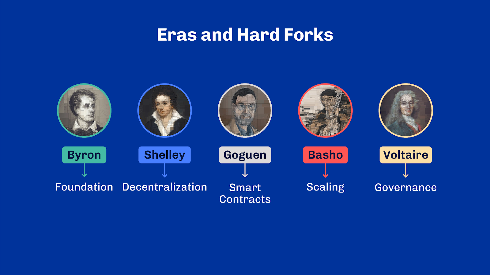

The role of the consensus layer is precisely to figure out the current era of the chain. With each era comes a specific set of rules that dictate what is a valid block. Said differently, the consensus layer dictates the protocol used by all nodes to find agreement. Conceptually, Cardano has not one but multiple ledgers and the consensus switches between them.

What’s remarkable about Cardano and the hard-fork combinator is how everything has been modeled through the type-system to make the code era-dependent. Thus, when the software is compiled, there’s a variety of checks that the compiler can perform to prevent a whole class of mistakes. It is, for example, impossible to use a feature introduced later in an earlier era – as it could sometimes happen when moving code around inadvertently. The software won’t even compile. This approach echoes the semi-formal methods we mentioned in earlier units.

Thus, it is interesting to look at Cardano from an era perspective and see how each era has transformed the protocol from a – relatively simple – peer-to-peer payment system to a fully distributed multi-asset programmable ledger.

You'll notice how initial eras also correspond to phases, while later eras started using different names as they often bundled features coming from multiple phases. Note also that era and hard forks are two different things. While eras are introduced through unilateral hard forks, there have been moments where hard forks also happened between two eras -- often as patches to address technical issues. In this situation, we speak about intra-era hard forks

Having said that, let's begin our Cardano journey, era by era.

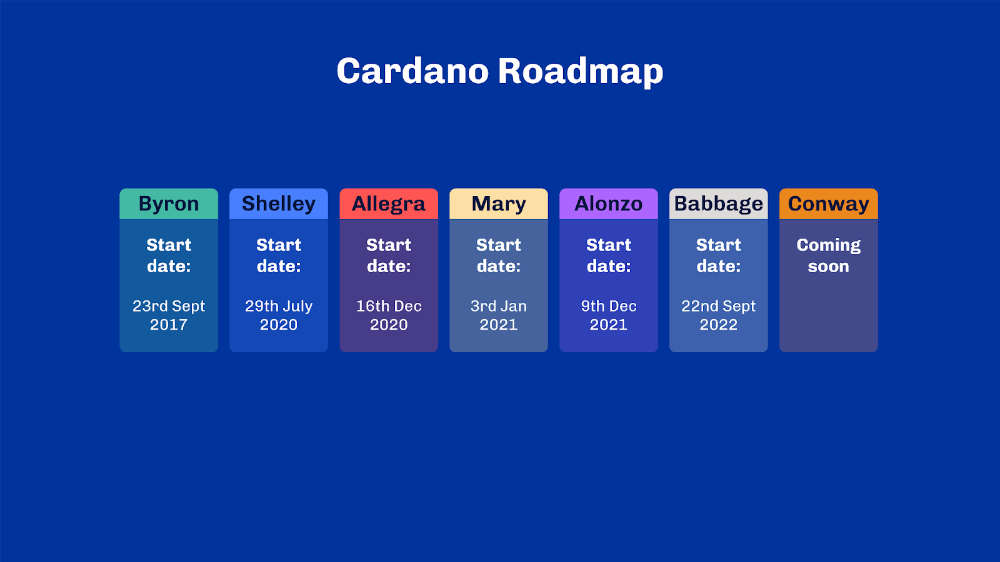

### Byron (23rd Sept 2017 → 29th Jul 2020)
The very first era of Cardano is Byron. In this era, Cardano was a federated network where block producers were under the control of the genesis entities (The Cardano Foundation, Input Output & Emurgo). It allowed users to transact with one another in the network's native currency (ADA) using a UTxO accounting model very similar to Bitcoin. In Byron, the set of features were minimal to lay a stable foundation for the future.

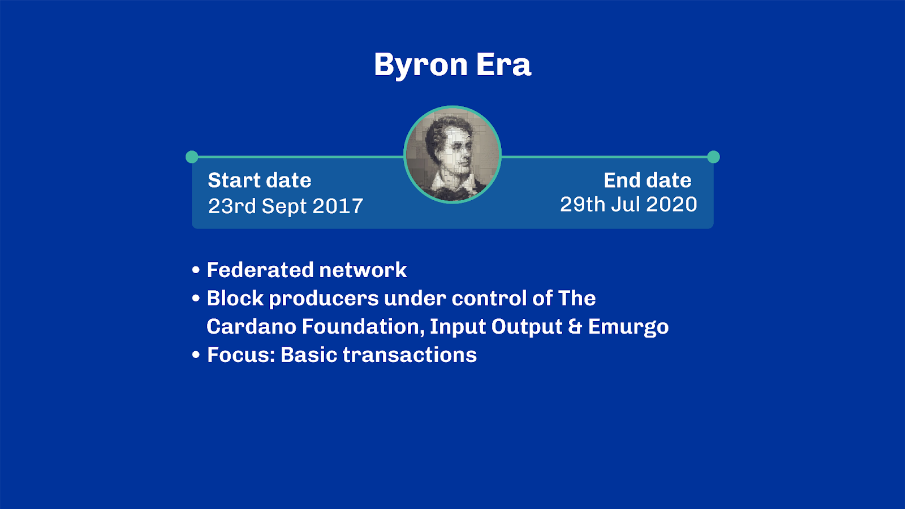

### Shelley (29th Jul 2020 → 16th Dec 2020)
The Byron era continued as the next era, Shelley, was being developed: The goal was twofold with Shelley.

Firstly, it introduced a massive overhaul of the Cardano internals with multiple layers of abstractions.  This later allowed the introduction of even more eras in a more systematic way. Secondly,  Shelley is the era when Cardano started to decentralize block production progressively.

Shelley added a whole set of new components to Cardano transactions. In particular, it introduced the concept of "certificates", which can be added to transactions to declare or revoke certain relationships between user credentials. Certificates have enabled the registration of stake pools and the delegation of funds to registered pools. Stake pools are then randomly selected proportionally to their stake -- pledged and delegated -- to produce blocks. Both pools and delegators are then rewarded according to rules depending, amongst other things, on parameters declared during the pool registration.

Shelley also extended transactions with auxiliary data to allow users to embed arbitrary information with their transactions.

Finally, Shelley introduced a new type of address to the Cardano blockchain capable of locking funds not only under a public/private key pair, but also under a native script. This is also referred to as phase-1 monetary scripts. Conceptually, a native script is a restricted set of primitives that allows representing ways of combining requirements on public/private key pairs. For example, using a native script, it is possible to express a "multi-sig", where multiple signatures are needed for spending funds at an address instead of one.
This was the premise of blockchain programmability as it then became possible to persist information or events on-chain in an immutable fashion and express more complex funds locking patterns.

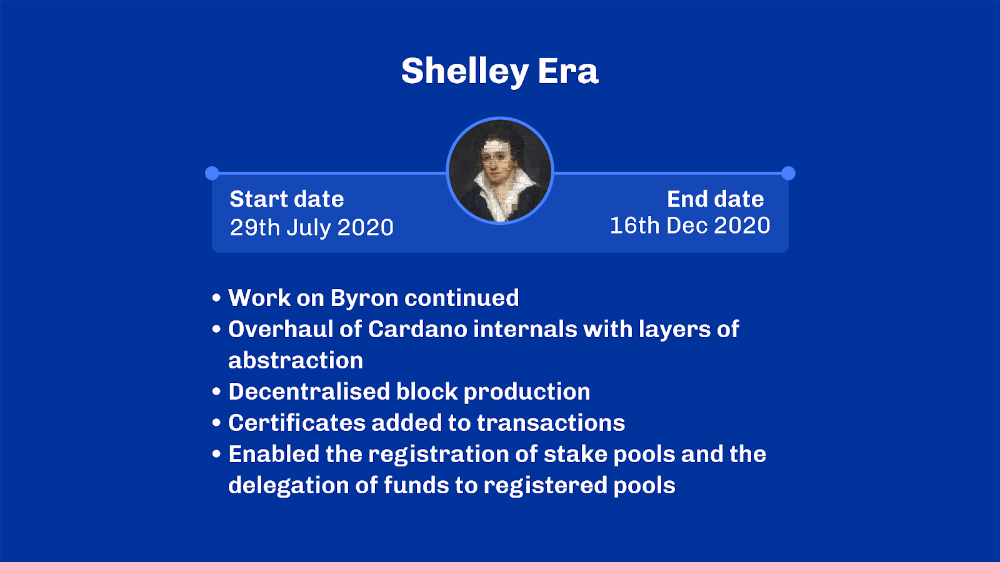 

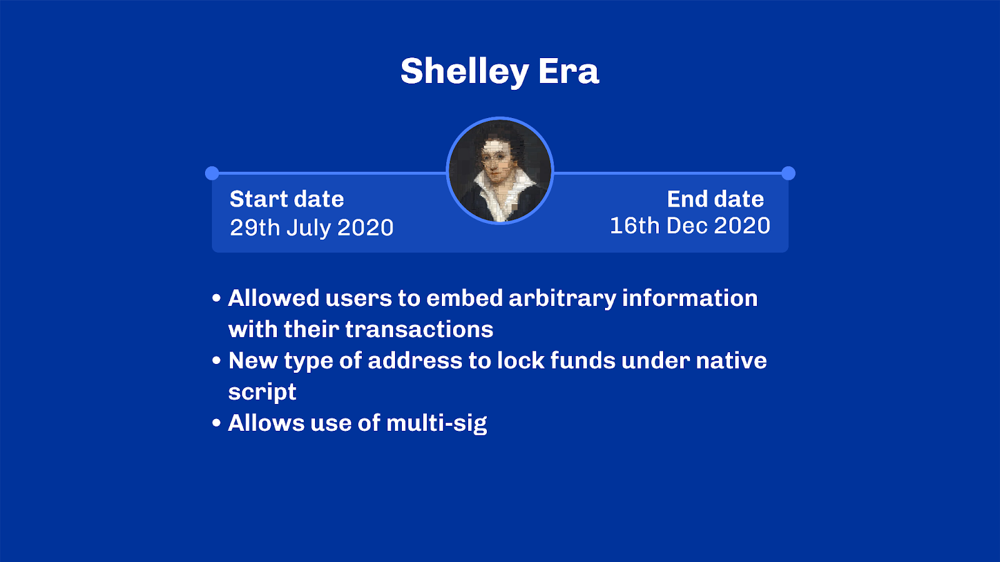  

### Allegra (16th Dec 2020 → 3rd Jan 2021)
Allegra -- named after one Lord Byron's daughter -- was a small increment working towards the introduction of smart contracts to the Cardano chain.

Historically, Cardano was meant to introduce its scripting capabilities in an era called Goguen, thus matching the corresponding phase. Yet, given the size of what such an update would have been, the era was split into three smaller chunks: Allegra, Mary and Alonzo.

Allegra introduced a new capability to transactions' native scripts: it added two new primitives enabling users to specify validity periods for funds spent from an address.

While this may sound anecdotal, it is far from trivial in a system which wants to keep the execution of its transactions fully deterministic: that is when the execution depends solely on the transaction itself, rather than external factors. To achieve this, Allegra also added a notion of validity interval to transactions. Combined with native script validity bounds, Allegra allowed the expression of complex time-related execution logic.

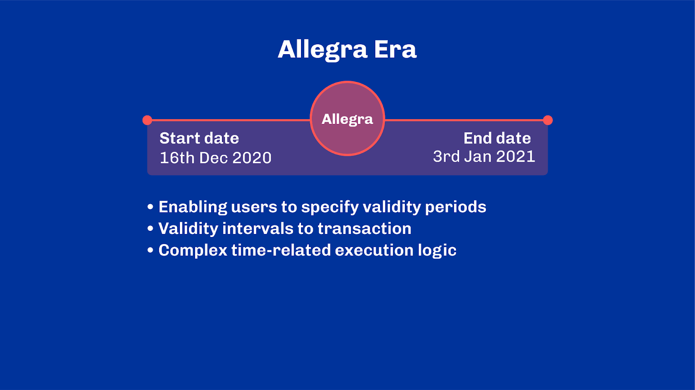  

### Mary (3rd Jan 2021 → 9th Dec 2021)
The Mary era was named after Mary Shelley, an English writer from the 19th century married to Percy Shelley. It came rapidly after Allegra to introduce a significant upgrade turning Cardano into a multi-asset ledger.

Mary extended the capabilities of transactions to allow outputs to carry both ADA and user-minted assets. Consequently, it also introduced two extra functionalities in transactions to mint and burn assets according to a policy. At this stage, the policy can only be a native script. However, with the introduction of time-related primitives from Allegra, it became possible to create simple NFTs on Cardano by defining a fixed date from which it is programmatically no longer possible to mint new tokens.

As Mary enabled anyone to create new tokens at will, it opened the doors to new attacks. Users could now mint an arbitrarily large amount of worthless tokens to occupy the network resources needlessly. Mary introduced an extra security mechanism to force any UTxO output to carry ADA to circumvent this. Unlike any user-defined asset, ADA tokens have an intrinsic value as the protocol's native currency. The amount of ADA depends on the number (size) of assets stored under a particular address and acts as a deposit that can be reclaimed when the corresponding UTxO is spent.

A little anecdote regarding Allegra and Mary: as they were introduced almost together (only a couple of months apart) and they are both complementary updates, they are often referred to together as "Mary-Allegra" or simply "MA" for short. One can also read "MA" as "Multi-Asset", the main feature introduced by these two upgrades.

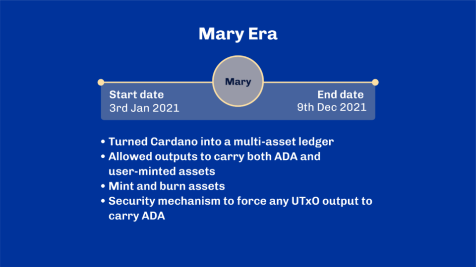  

### Alonzo (9th Dec 2021 → 22nd Sep 2022)
Probably the most awaited upgrade of Cardano, Alonzo was another increment dedicated to Cardano programmability. Alonzo – named after Alonzo Church, a computer scientist pioneer in the field of lambda calculus and functional programming languages – introduced a new, more elaborate scripting language to Cardano: Plutus.

Fundamentally, Plutus is a low-level scripting language that the ledger interprets when validating transactions. It allows users to express arbitrary logic on top of the existing ledger rules. To be fully capable, Plutus also extended the concept of UTXO and added two new elements to the picture: datums and redeemers. We covered this back in an earlier unit on UTxO and extended UTxO models.

Interestingly, Alonzo made it possible to use Plutus scripts in four places:

Firstly – and most obvious – scripts can be used in addresses to lock funds under some arbitrary logic, similar to how native scripts worked.

Secondly, the ledger allows Plutus scripts to define delegation rights. One can thus define complex validation rules to control delegation and choices of stake pools.

Thirdly, as a direct consequence of the previous point, Plutus scripts can specify additional staking reward withdrawal conditions.

And lastly, similar to native scripts, Plutus scripts can be used to define minting and burning policies of on-chain assets though now, through a much more capable programming language than the native scripts allowed.

Note that the execution of scripts has a cost that depends on the resources needed for its interpretation. Thus in addition to transaction fees, an additional cost which to be accounted for in every transaction spending from a script. This is typically called the 'execution budget'.

With the introduction of Alonzo, we also saw the introduction of a two-staged validation pipeline in the ledger. Indeed, Plutus scripts are by nature more computationally demanding than basic public/private signatures. Without additional protection – or a counter-incentive – it would be easy enough for an attacker to exhaust all the system's resources by submitting tons of long and invalid scripts. This would in turn waste precious computing resources at almost no cost. Worry not, since Alonzo, the ledger splits the validation of transactions into two phases.

In the first phase, it structurally validates the transaction, verifies that it is well-formed, spends from valid inputs, etc. In particular, if the transaction spends from any Plutus script, the ledger ensures that the transaction includes a collateral amount – I'll return to that shortly.

The transaction moves to the second phase only if the first phase is successful. In this stage Plutus scripts are executed, their outcome determines the final validation outcome of the transaction. This is why we refer to Plutus scripts as "phase-2 scripts", unlike native scripts executed during the first phase.

If a script fails during the second phase, it consumes resources from block producers which they are not compensated for. Indeed, because the transaction failed, its inputs cannot be consumed and its fee cannot be collected. To mitigate that, the collateral value added to the transaction and checked during phase 1 is consumed in their stead as compensation for the work done. Take a minute to think about this if needed.

Of course, the collateral is left untouched if the transaction succeeds or fails during phase 1.

The execution of Plutus scripts is entirely deterministic. It is known before submitting a transaction to the network,  whether a transaction is valid or not, provided that the conditions for it to run are satisfied. For example, inputs that a transaction refers to could have been spent elsewhere, rendering the transaction invalid during phase one. In such cases, because phase-1-validations are relatively cheap to perform, the transaction is simply dropped from the system.

Yet a transaction that fails during the second phase penalizes its submitter. Thanks to determinism, wallets and other entry points to the chain should prevent this from happening. Nevertheless, if it happens, the network reasonably assumes this is adversarial behavior and consequently acts by including the failed transaction in a block and marks it as “failing”. UTxOs set as collaterals for such failing transactions are thus removed from the available UTxO set and their value is added to the future rewards.

Hence, it is crucial to perform the validation in two steps. It is also important to ensure upfront that sufficient collateral is available, should a transaction fail to validate in phase two.

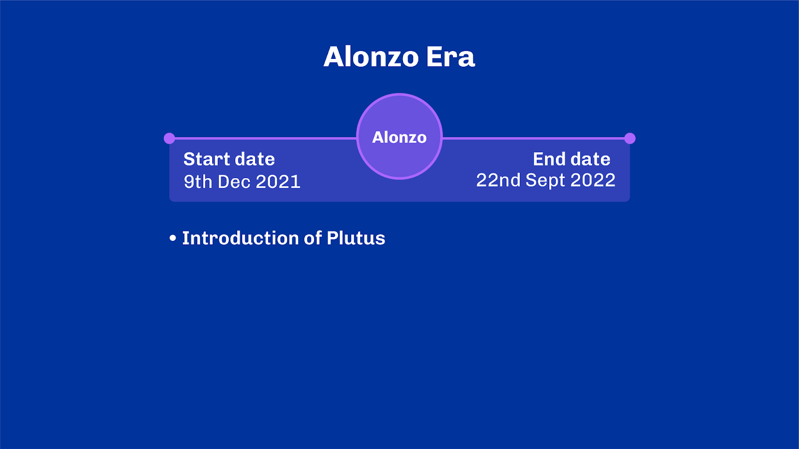  
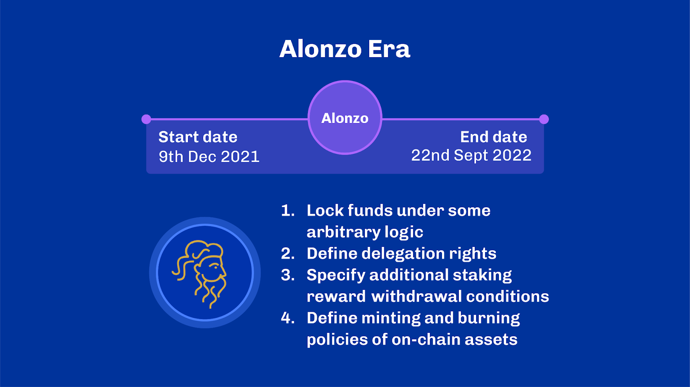  

### Babbage (22nd Sep 2022 → to date)
At the moment of recording this, Babbage is in the last era of the Cardano blockchain. It is at the crossroads of programmability, scalability and governance. In fact, more than half of the features present in Babbage were discussed and designed with the help of the broader community of Cardano builders through the CIP process – we’ll learn about what that is soon enough. Babbage addressed a few shortcomings of Plutus and how eUTXO works. Some were ideas envisioned early on and refined later with the community's help.

In particular, Babbage introduced a way to reference transaction inputs without spending them. Remember that script execution in Cardano is deterministic and local, meaning that scripts only have access to the information readily available in the transaction. Being able to bring specific inputs in scope (possibly carrying metadata) without spending them makes it easier to build more concurrent applications that can all utilize the same data source. Otherwise, a UTxO can only be spent, by definition, once.

Babbage also extended transaction outputs to carry arbitrary scripts and datums in addition to assets and datum references. Coupled with reference inputs, this enabled applications to utilize the chain as a reliable data source. More importantly, it drastically reduced the size of transactions.

How does it do that? In the eUTxO model, transactions must carry all the details needed for their validation. This also means that they have to carry scripts for validation. Scripts can be as large as a dozen kilobytes, and including them in each transaction seems counterproductive. With Babbage, one could now publish scripts ahead of time and only put a reference to a script later. Neat.

On top of these Plutus changes, Babbage brought two massive upgrades to the networking layer. Firstly, it paved the way for proper peer-to-peer network communication between nodes. Before that point, network nodes needed to rely on some trusted sources to connect and bootstrap the chain when joining for the first time.

Secondly, it improved block propagation by using pipelining, which optimistically sends multiple requests without waiting for the response immediately. For example, consider a case where you send someone to fetch you some objects from the room next door; you could either:
Ask them to fetch a new object every time they return and wait between each inquiry or;
You can tell them all the objects you need upfront, thus reducing their combined travel time, bringing everything back at once.

This is what pipelining is about but with blocks and transactions.

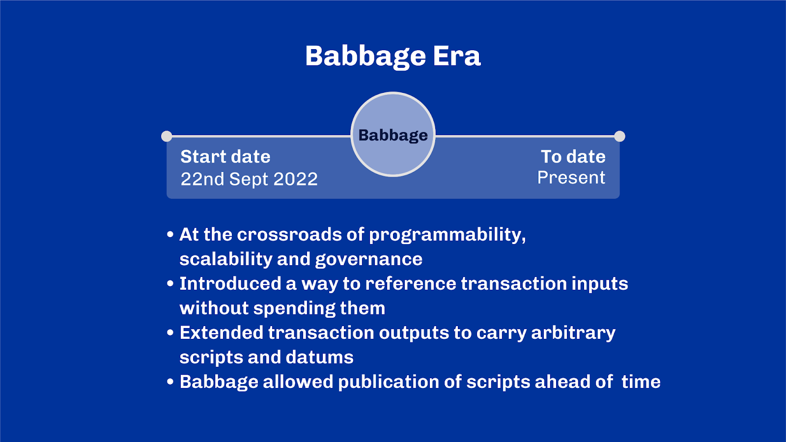  

### Conway (not started yet)
Finally, the Conway era focuses on reworking the on-chain governance capabilities of the protocol. Until Conway, only the genesis entities could tweak protocol parameters, initiate a hard fork, or withdraw funds from the treasury. And it required a quorum amongst those entities.

Conway is the first attempt at giving this power away to ada holders. Hence Conway removes any notion of genesis keys and introduces two new governance bodies: the delegate representatives, a.k.a. DReps, and the Constitutional committee. In addition, the role of stake pool operators has been formalized to make it more explicit.

This new chain governance system's core idea piggybacks on the existing stake pool model. Hence, it’s often called “one Lovelace, one vote”. The role of DReps is analogous to stake pools, and they offer an intermediary who can fulfill governance duties (in contrast with consensus duties) on behalf of other ada holders. The role is also permissionless, meaning any Ada holder can become its own DRep.

The constitutional committee stands as the guardian of the chain. They interpret and enforce the Cardano constitution, a human-readable document that states the core principles of Cardano. They ensure that DReps cannot commit to an unconstitutional change.

The Conway era, therefore, introduces mechanisms to administrate DReps and the constitutional committee. It revises how governance actions are submitted, ratified and enacted on-chain. Significantly, it also extends Plutus scripts to support new types of programmable governance-related actions.

With that, we have covered the 7 eras in the journey of Cardano.

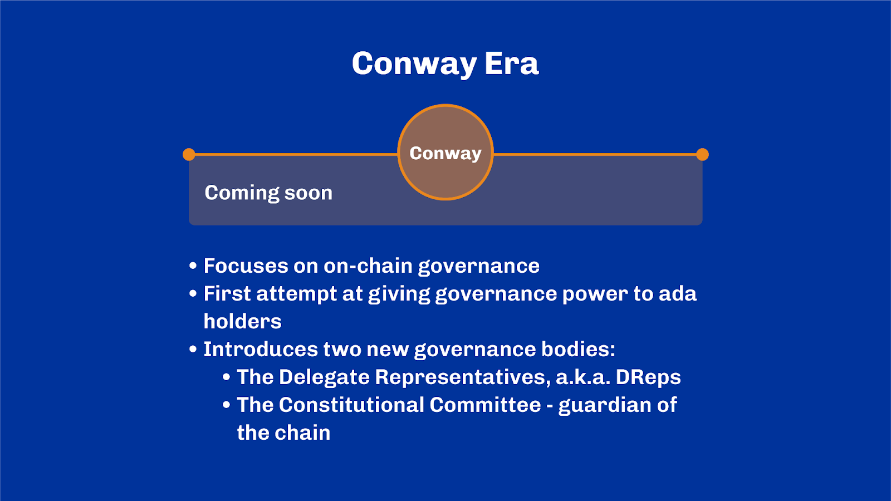  
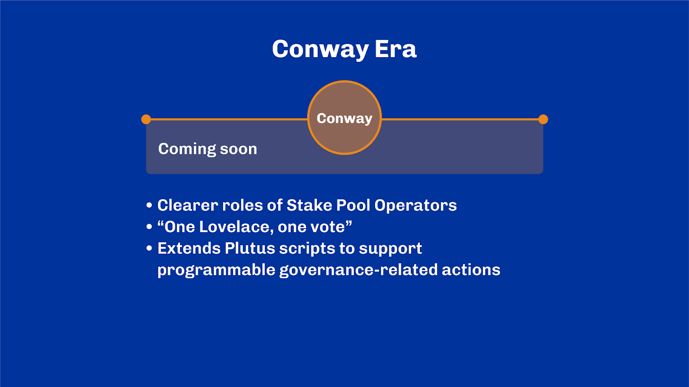  
## Networking
### Mini-Protocols
Let’s now look at Cardano-specific protocols. Cardano networking and client interfaces are unique and sophisticated. The nodes on the network communicate with each other using a framework created specifically for Cardano. This framework provides a structured approach for defining protocols so that the system behaves as intended with no unexpected or unintended execution paths. All communication protocols in Cardano are described as finite-state machines. They have a clear start, end, intermediate states, and transitions between them. At any point in the communication, the protocol is in one known state and can evolve into a finite set of possible paths.

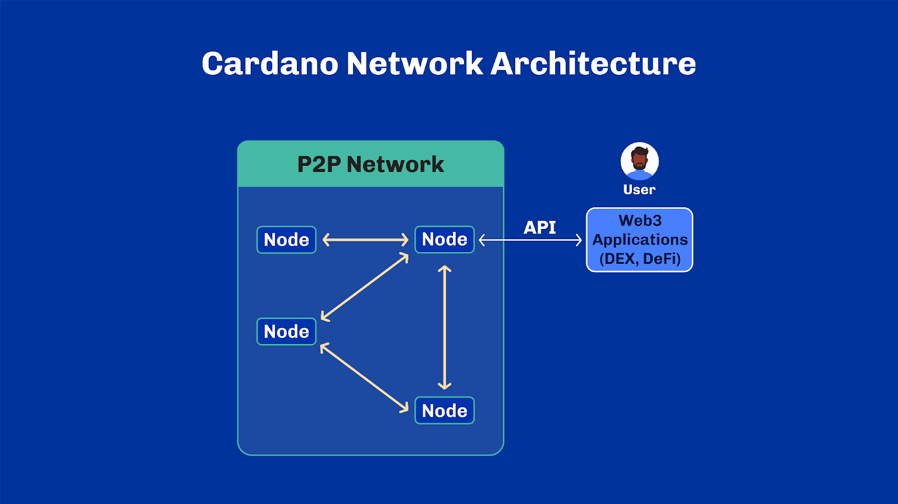  

Protocols designed in this fashion are said to be correct-by-construction. They cannot place applications in an undetermined state and always provide a way to move forward.

The protocols come with built-in security features. This is important in public blockchains. It is even important in proof-of-stake systems, where the cost of propagating false information is relatively low compared to proof-of-work. As there is no authentication between peers at all, the communication protocols must therefore ensure that adversarial peers can be isolated as they misbehave. Generally speaking, this means any peers are considered adversarial if they are found not following the protocols to the letter.

Additionally,  protocols must be safe by design. This is usually synonymous with favoring pull-based approaches. This is where nodes that engage with others are always in control of what information is sent to them. The receiving nodes always request to pull information from other nodes. Other nodes cannot push information onto them.

This approach is in stark contrast with more traditional networking protocols such as HTTP or gRPC, Google Remote Procedure Call, which are much more general networking protocols. They offer great flexibility but fall short to address some of the specific challenges found in distributed ledger technologies and the extra guarantees this domain requires.

Still, Cardano networking and client protocols are designed to be as flexible as possible. They are modular and made up of building blocks called the “Ouroboros mini-protocols”. Each mini-protocol has a specific purpose.

For example, nodes use the block-fetch mini-protocol to negotiate block headers and securely fetch blocks from their peers. A new node can use this protocol to retrieve the latest blocks from other nodes and ensure that it has a complete and up-to-date copy of the blockchain.

The local-tx-submission protocol offers a secure mechanism for client applications to submit transactions to the network. It comes with a safety net, warning clients if they attempt to submit an invalid transaction, for example.

You might have guessed it by now but the mini-protocols come in two forms: node-to-node and node-to-client.

Node-to-node protocols are for communication between nodes, while node-to-client protocols allow local client applications to connect to a node. Security for node-to-node protocols is far more defensive as they assume any other node may be an adversary.

Mini-protocols manage overall complexity while ensuring flexibility. New protocols can be added relatively easily as use cases evolve. They also work with the multi-era consensus layer of Cardano by design.

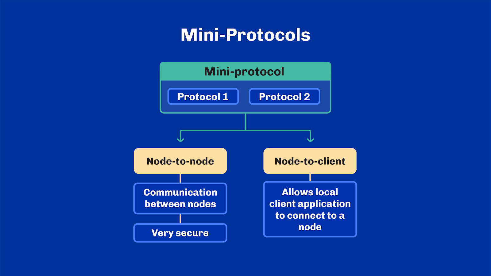  

## Developer Ecosystem
When it comes to creating apps for Cardano, developers can work directly with the mini-protocols, leverage high-level tools or use a combination of both. The approach depends on the level of skill and the project requirements.

The common approach is to use high-level tools – for simplicity and development speed. These are often open source and help reduce the complexity of getting information - to and from the blockchain. From querying transactions to writing smart contracts, there are many tools to help the developer go from idea to code.

For example, getting information from the blockchain directly, requires traversing the entire chain. This is slow and inefficient. Chain indexer tools solve this problem by creating a bespoke index of the blockchain data, which can be queried much faster. Tools like cardano-db-sync, Kupo, Scrolls, or Carp combine an API query layer with a database like SQLite or MongoDB to retrieve data quickly.

Of course, developers always have the option to integrate directly with a Cardano node by using the mini-protocols. This approach is best suited for those with a deep understanding of the underlying technology and in need of highly customized applications.

And with that, we have reached the end of the lecture. Let’s recap what we learned.

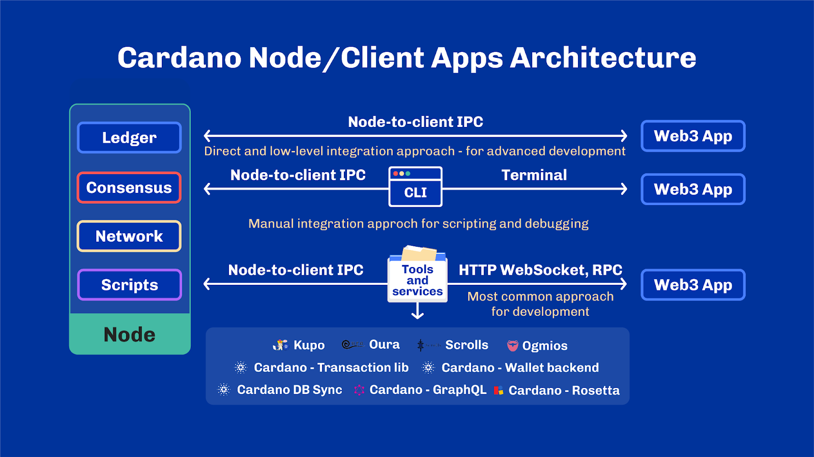  

## Review
We have seen how nodes in the Cardano blockchain are broken down into four main areas: settlement, consensus, networking and scripting. Each of these parts is able to work across multiple versions of the protocol that we call era. So far, Cardano has been through 6 different eras, each focused on bringing specific features to the ecosystem.

Last but not least, we covered Cardano networking and the so-called Ouroboros mini-protocols: a powerful framework to express communication protocols with extra security guarantees necessary for a public permissionless Proof-of-Stake blockchain such as Cardano.

Thank you so much for your time and I will see you in the next one.

## References
[Ref.8.2.1] Cardano Components,  Cardano Developer Portal, Available from: https://developers.cardano.org/docs/get-started/cardano-components , Accessed: 04 December 2023 
[Ref.8.2.2] Development phases and eras on Cardano, Cardano Docs, Available at: https://docs.cardano.org/explore-cardano/eras-and-phases/ , Accessed: 04 December 2023 
[Ref.8.2.3] Get started with the technical concepts, Cardano Developer Portal, Available at: https://developers.cardano.org/docs/get-started/technical-concepts , Accessed: 04 December 2023 

## Glossary

- *Ouroboros mini-protocols
Cardano networking and client protocols are designed to be flexible. A mini-protocol is a modular building block with its own specific purpose.
- *Cardano Node*: The Cardano node is the software capable of running as a core block producer, relay, or local entry point to the network.
- *Networking Layer*: A peer-to-peer networking stack geared towards Proof-of-Stake systems.
- *Consensus Layer*: An implementation of the Ouroboros family of consensus protocols.
- *Settlement Layer*: A financial distributed ledger derived from formal specifications.
- *Scripting Layer*: This is also known as Plutus, is a scripting language embedded in the Cardano ledger to provide smart-contract capabilities to the network.
- *Hard-fork combinator*: The transition mechanism which ties together the collection of sub-protocols that make Cardano.
- *Eras*: The sub-protocols that make up Cardano. They are named after prominent figures in history.
- *Native script*: This is a restricted set of primitives that allows expressing ways of combining requirements on public/private key pairs.

## Questions

**Sub-Unit 1**

*The Cardano node is divided into multiple layers.  Which of the following is NOT one of these layers?*
**The storage layer (CORRECT ANSWER)**
- The settlement layer
- The consensus layer
- The networking layer

*Select the correct statements about the Cardano Node.*
- The scripting layer is a peer-to-peer networking stack geared towards PoS systems
- The different layers of the node cannot develop without each other
- **The node is made out of several inter-connected parts (CORRECT ANSWER)**
- **The settlement layer is where the core Cardano objects and the rules for using them are defined (CORRECT ANSWER)**

*Analyze the image below and select the correct answer. (Image Question)*

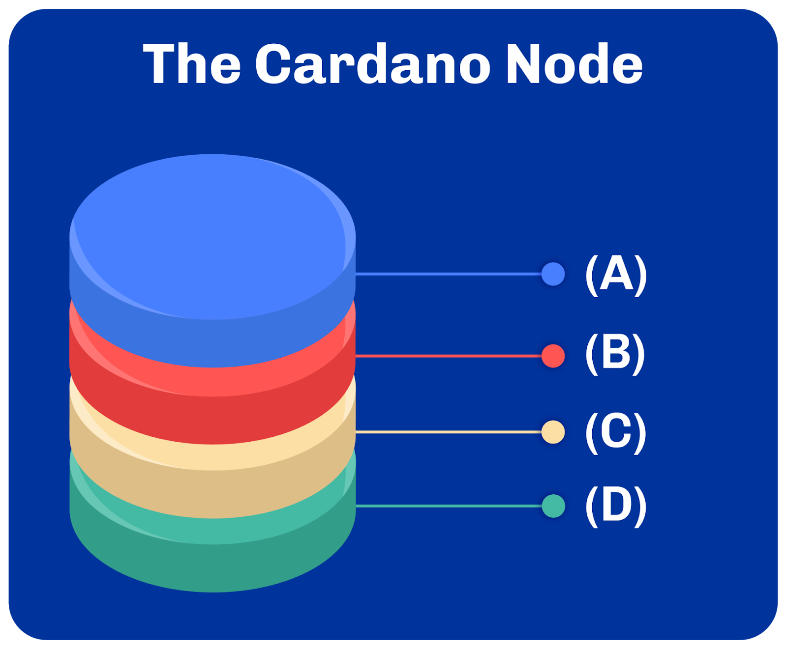  

- (A) Scripting Layer; (B) Consensus Layer; (C) Settlement Layer; (D) Networking Layer
- **(A) Networking Layer; (B) Consensus Layer; (C) Settlement Layer; (D) Scripting Layer (CORRECT ANSWER)**
- (A) Settlement Layer; (B) Networking Layer; (C) Consensus Layer; (D) Scripting Layer

**Sub-Unit 2**

*Select the correct statements about consensus, ledger and eras related to Cardano.*
- **Intra-era hard forks are hard forks that happen between two eras (CORRECT ANSWER)**
- The Cardano hard fork combinator splits the chain into two new blockchains
- Cardano only makes use of one ledger
- **The consensus layer dictates the protocol used by all nodes to find agreement (CORRECT ANSWER)**

*True or False: in Cardano, nodes exchange various types of consensus messages beside user transactions.*
- True
- **False (CORRECT ANSWER)**

*True or False: The ledger only includes successful transactions in the blockchain.*
- True
- **False (CORRECT ANSWER)**

**Sub-Unit 3**

*True or False: During the Byron era of Cardano, it was possible to attach metadata to transactions.*
- True
- **False (CORRECT ANSWER)**

*What significant feature was introduced during the Shelley era in the Cardano blockchain that advanced blockchain programmability?*
- Shelley enabled the creation of smart contracts
- **Shelley introduced a new type of address allowing for complex funds locking patterns (CORRECT ANSWER)**
- Shelley primarily focused on revoking relationships between user credentials

**Sub-Unit 4**

*What significant feature did the Allegra era introduce to transactions' native scripts in the Cardano system?*
- **Allegra added the ability for users to specify validity periods for funds spent from an address (CORRECT ANSWER)**
- Allegra's main focus was to make transactions non-deterministic
- Allegra removed the need for native scripts in transactions
- Allegra introduced a new way for users to lock and unlock funds without using time-related execution logic

*Select the correct statements based on the Mary era.*
- It ended the possibilities of new attacks
- It introduced an extra security mechanism to force any UTxO output to drop ADA
- **It allowed outputs to carry both ADA and user-minted assets (CORRECT ANSWER)**
- **It turned Cardano into a multi-asset ledger (CORRECT ANSWER)**

*Since which era is it possible to create NFTs on Cardano?*
- The Shelley Era
- The Allegra Era
- **The Mary Era (CORRECT ANSWER)**
- The Alonzo Era

*Which of the following actions can be controlled by a Plutus script?*
- Receiving tokens from another user
- Creating a stake pool
- **Delegating to a stake pool  (CORRECT ANSWER)**
- Sending money to a reward account

**Sub-Unit 5**

*Which of the following is NOT a functionality made possible by Plutus scripts as introduced in the Alonzo upgrade?*
- Locking funds in addresses based on specific logic
- Specifying staking reward withdrawal conditions
- **Defining complex validation rules for transaction fees (CORRECT ANSWER)**
- Defining minting and burning policies for on-chain assets

*In the Alonzo Era, what is referred to as the additional cost accounted for in every transaction spending from a script?*
- UTxO adjustment
- Transaction fee supplement
- Plutus validation cost
- **Execution budget (CORRECTION ANSWER)**

*In the context of the Alonzo upgrade, why is the collateral left untouched if the transaction fails during phase 1?*
- Phase-1 validations are computationally demanding
- Native scripts are executed during phase 1
- **Phase-1 validations are relatively cheap to perform (CORRECT ANSWER)**
- Phase 1 does not execute any Plutus scripts

*If a Plutus script fails during the second phase of validation, what is used to compensate block producers for their work?*
- The initial transaction fees
- An execution budget
- **The collateral value added to the transaction (CORRECT ANSWER)**
- A separate compensation fund

*Alonzo introduced transaction collaterals. What is their function?*
- They provide a mechanism to donate money to the Cardano treasury
- **They protect the network from being spammed with failing scripts (CORRECT ANSWER)**
- They allow users to participate in DeFi protocols on behalf of another user
- They prevent bloat of the ledger from millions of user-minted tokens

**Sub-Unit 6**

*How did the Babbage era affect the size of transactions on the Cardano blockchain?*
- It increased the size of transactions by including more data
- **It reduced the size by enabling transactions to carry only references to previously published scripts (CORRECT ANSWER)**
- It mandated the inclusion of all data in every transaction
- It didn't affect the size of transactions

*What was one of the major networking upgrades the Babbage era brought to Cardano?*
- It removed the need for network communication between nodes
- It established a trusted central node for all communications
- **It paved the way for peer-to-peer network communication between nodes (CORRECT ANSWER)**
- It stopped the propagation of blocks

*What is the primary function of network pipelining?*
- It improves transaction settlement time
- **It improves block propagation (CORRECT ANSWER)**
- It improves transaction cost
- It improves UTxO storage

*The new governance system introduced in the Conway era can best be described as:*
- One person, one vote
- One transaction, one vote
- One stake pool, one vote
- **One Lovelace, one vote (CORRECT ANSWER)**

*What is the main role of the delegate representatives (DReps) in the Conway era?*
- To interpret the Cardano constitution
- To tweak protocol parameters
- **To fulfill governance duties on behalf of other ada holders (CORRECT ANSWER)**
- To initiate hard forks

*How has the role of stake pool operators been altered in the Conway era?*
- It has been eliminated
- It has been merged with DReps
- It focuses more on consensus duties
- **It has been formalized to make it more explicit (CORRECT ANSWER)**

**Sub-Unit 7**

*Compared to Cardano's pull-based approach, which of the following statements are true regarding traditional networking protocols like HTTP or gRPC?*
- They provide less flexibility
- They address all challenges found in distributed ledger technologies
- **They offer flexibility but might not address specific challenges in distributed ledger technologies (CORRECT ANSWER)**
- They are always safer in the context of distributed ledger technologies

*Select the correct statements about mini protocols.*
- **The block-fetch mini-protocol is used to negotiate block headers and securely fetch blocks from peers (CORRECT ANSWER)**
- All mini-protocols have the same purpose
- **The local-tx-submission protocol offers a secure mechanism to submit transactions with a warning system for invalid transactions (CORRECT ANSWER)**
- The Ouroboros mini-protocols are designed to work with the multi-era consensus layer of Cardano
- **New protocols can be added easily as use cases evolve (CORRECT ANSWER)**

*Which of the following best describes the difference between node-to-node and node-to-client protocols?*
- Node-to-node protocols are for submitting transactions, while node-to-client protocols are for fetching blocks
- **Node-to-node protocols are for communication between nodes, while node-to-client protocols allow local client applications to connect to a node (CORRECT ANSWER)**
- Node-to-node protocols and node-to-client protocols serve the same purpose and have the same security measures

*Why do many developers prefer to use high-level tools for Cardano app development?*
- They offer the slower retrieval of data
- They restrict expressiveness in programming languages
- **They simplify the development process (CORRECT ANSWER)**
