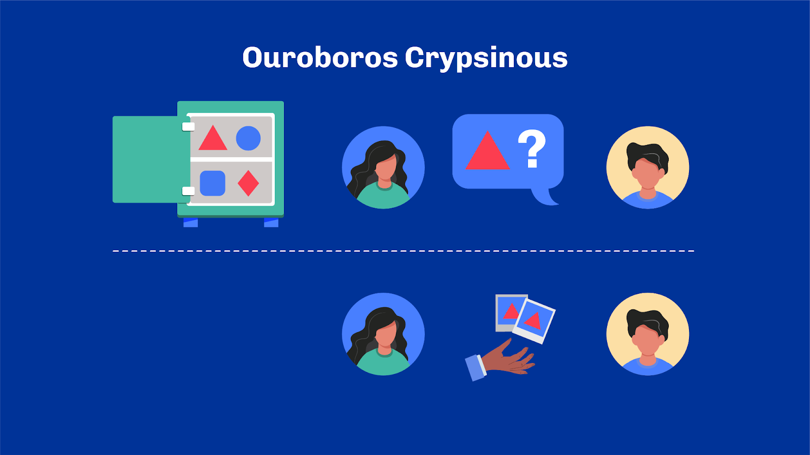

# Unit 3 - Ouroboros Consensus Algorithms

## Learning Objective
By the end of this unit, the learner should be able to:
- State the two fundamental features of distributed ledgers, and the three key properties they must have.
- Explain what is provable security.
- Enumerate the commonalities between Ouroboros protocols
- Give an overview of the different Ouroboros protocols

## Introduction
Hello everyone, and welcome. My name is (lecturer name) and I’ll be your host for this unit.

## Table of Contents
At the heart of any blockchain network lies its consensus algorithm, which gives a network its unique characteristics. In previous lectures, we explored the consensus algorithms most commonly used in blockchain, namely Proof-of-Work (PoW) and Proof-of-Stake (PoS). In the last unit,  we were introduced to Cardano and its genesis. Now we will be getting to know the heart of Cardano: the Ouroboros consensus algorithms.

But before we look at Ouroboros in more detail, let's quickly recap what we've learned about consensus and blockchain.

## Consensus in Public Permissionless Ledgers
We discussed consensus algorithms a while back. This may not be fresh on your mind so let’s do a quick recap by answering one fundamental question: why?

### Why Bitcoin?
In 2009, Bitcoin was introduced as a response to an unsolved problem: How can a distributed collection of parties agree -- that is, reach consensus – on a dynamic sequence of transactions?

Besides, any of those parties may be acting against the collective goal, similar to how the Byzantine generals' problem was formulated. We spoke about that in earlier units. Hence Bitcoin came into existence as a public permissionless distributed ledger. While it wasn't necessarily developed as clearly at the time, we now have a more scientific definition characterizing this kind of system. Public permissionless distributed ledgers are systems that share two fundamental properties: they achieve safety and liveness in a distributed and Byzantine setup.

Safety means that past transactions remain immutable -- with a certain degree of certainty which increases over time. And liveness means that new transactions are eventually added to the ledger. We also say that Bitcoin achieves 'eventual consensus': things become true and set in stone over time, with an increasing probability of immutability. A simplified way to look at those is to think of safety in terms of “nothing bad ever happens” and liveness in terms of “something good eventually happens”.

How does Bitcoin accomplish this tour-de-force? Using Proof-of-Work combined with a crucial hypothesis: that honest parties own the majority of the hashing power in the system. If this holds, the protocol is guaranteed to achieve persistence and liveness eventually.

### Why Ouroboros?
This is great, but it also means that the security of Bitcoin is inherently dependent on a race to increase hashing power. As any participant in the system gains more hashing power, others also need to keep up to ensure that one party cannot seize control of the network. This race is not sustainable, so scientists have been searching for alternatives.

In essence, Proof-of-Work is an election mechanism where participants are elected proportionally to their hashing power. A starting point for researchers to look at what other resources could be used instead of hashing power. Disk storage? Useful computation? Or simply the network's currency, or what we commonly call: stake.

A key milestone in this research effort has been the establishment of the Ouroboros consensus algorithm, and all its successors forming the Ouroboros family.

## Ouroboros: A Family of Consensus Protocols

### Ouroboros Classic: The First Provably Secure Proof-of-Stake Protocol
Ouroboros came to life in 2017. It is the first provably secure Proof-of-Stake protocol published at a peer-reviewed conference. It has comparable security assumptions and guarantees to Bitcoin. Ouroboros has evolved into a family of protocols we will cover shortly. And because of this, the original paper is now referred to as "Ouroboros Classic". It has laid down a foundational framework to reason about consensus protocols and their security properties in a mathematical way.

So, what exactly do we mean by "provably secure"?

### What Is Provable Security?
Provable security is a way to design protocols that enable explicit security guarantees to be formulated and mathematically proven. In substance, it is about defining a model to describe the protocol and the goals it should achieve. Then, one can give mathematical proof that the protocol achieves its goals (or not), considering arbitrary adversarial behaviors allowed within the model. In such a setup, how we model the protocol, and the adversary is as important as the proof itself, if not more. And this is where academic rigor and peer review play an essential role. It's easy to miss hypotheses or to capture potential attack vectors in the threat model incorrectly. Having more brains to think through helps minimize the chances of getting it (too) wrong.

And this hints as to why there isn't a single "Ouroboros" protocol today, but many. As the industry gains more and more understanding of the attack surface, it is possible to improve the model and the protocol to ensure it accounts for new classes of attacks. Each new version of Ouroboros is an iteration of a previous one, strengthening the model and finding new mechanisms to cope with it, thus making the overall algorithm more robust.

Without diving into too many details of the proof behind Ouroboros, it is interesting to look at three key properties used to prove the security arguments behind Ouroboros: common prefix, chain quality and chain growth. We covered these terms in an earlier unit.

First,  Common Prefix means between any two honest parties, there exists a common prefix of the chain (i.e. there exists a number k such that if we remove up to k blocks from both chains, they yield the same sub-chain).

Second, Chain Quality means there exists k such that, for any chain possessed by an honest party, at least one block in the last k blocks were honestly produced.

And finally, Chain Growth which means there exists t and k such that, for any chain possessed by an honest party, there are t ✕ k blocks over any sequence of k slots.

- *Common Prefix*: between any two honest parties, there exists a common prefix of the chain (i.e. there exists a number k such that if we remove up to k blocks from both chains, they yield the same sub-chain).

- *Chain Quality*: there exists k such that, for any chain possessed by an honest party, at least one block in the last k blocks were honestly produced.

- *Chain Growth*: there exists t and k such that, for any chain possessed by an honest party, there are t ✕ k blocks over any sequence of k slots.

Prior research shows that a blockchain system with these three properties can also achieve safety and liveness. Bitcoin, in particular, does have these three properties. Hence most of the proof behind Ouroboros boils down to showing that the protocol can maintain these three properties in a Byzantine-fault tolerant setup.

And it does!

### Commonalities
Equipped with this new knowledge, you should now understand what it means to be provably secure and why it's important. It's now time to go through a quick overview of how each Ouroboros protocol works. Of course, they are all called "Ouroboros" because they share some commonalities. Let's enumerate them.

Firstly, as we've already said, they're all proof-of-stake protocols, meaning they consider the network currency as the primary resource for consensus. Also, as already mentioned, they provide liveness and safety in a Byzantine setting with assumptions similar to Bitcoin. Namely, they assume that honest nodes own the majority of the resources: that is the stake. And they follow the longest-chain rule that we mentioned in previous units.

Secondly, all Ouroboros protocols are time-based and synchronous. Time is divided into discrete units of a fixed length called "slots''. Slots are grouped into bundles called "epochs'' and the protocol evolves mainly in phases from epoch to epoch. Incidentally, this is where the name 'Ouroboros' comes from! Previous epochs are fed into the subsequent epochs as a basis for calculations -- such as multi-party computations, like the Ouroboros is a serpent feeding onto itself. While Ouroboros is meant to run forever, it has a starting point and a bootstrapping phase from a so-called genesis configuration.

Finally, all Ouroboros protocols work based on the idea of leaders, known as  block producers. These block producers are elected for specific slots proportional to their stake. Moreover, stake delegation is a core part of Ouroboros, as it allows non-technical users to take part in the consensus by delegating their rights to more technical users. In the case of Ouroboros classic, this is also necessary for scalability.

## The Ouroboros Family

### Classic
Ouroboros Classic was the first one to be published. It laid down the foundational framework to reason about proof-of-stake protocols with provable security. Ouroboros Classic showed that it was possible to formulate a proof-of-stake protocol with the same security guarantees as Bitcoin. Moreover, it came with mathematical proofs and mitigations for common shortcomings of known proof-of-stake protocols.

However, Ouroboros Classic relied on a few limiting assumptions, such as the communication between peers being fully synchronous. That is, the time for each transaction to reach the rest of the network is finite. Moreover, it required some complex multi-party computation between the nodes to provide a good source of randomness. Indeed, one of the main challenges of proof-of-stake protocols is finding a good source of randomness and ensuring that leader election is done in an adequately unbiased fashion. This should remind you of a previous unit.

In fact, this is part of what makes Proof-of-Work so elegant and easy to grasp. The randomness naturally comes from the cryptographic difficulty to find suitable hash candidates for blocks. Hashing functions are designed to be primarily resistant to 'guessing'. Thus, there's no other way than trying over and over again, which naturally leads to a fair election process proportional to hashing power. Yet, that is a lot of work in a context where environmental concerns are of utmost importance.

Finding a good, unbiased source of randomness that attackers cannot manipulate for their own profit and one that can be more sustainable, is a complex problem. And it's one problem that Ouroboros classic nicely solves.

### Praos
Praos is an iteration of Ouroboros Classic with even more robust security guarantees. Praos hardened the protocol’s threat model by giving adversaries more power. Even with these added powers, Praos provided the mathematical proof to keep the system provably secure.

To date, it is the version of Ouroboros used in Cardano. One of the significant improvements in Praos is the ability to work in a semi-synchronous setting. Said differently, the protocol is more capable of tolerating slight variations in the message delivery. Moreover, nodes are now allowed to be offline for a short period of time without jeopardizing the entire network! This is achieved through verifiable random functions, known as VRF and forward-secure key-evolving signature schemes, known as KES, two interesting cryptographic constructs.

The VRF allows Praos to have a fully private leader schedule. This means that attackers can't know in advance what node will produce the next block. Only after a block has been created can other nodes verify that a node was indeed entitled to produce a block at that time. Consequently, there are also slots for which no leaders are elected, and some have more than one leader! This leads to small forks of the chain, which are rapidly resolved based on how quickly leaders can propagate their blocks.

### Genesis
Genesis is an iteration of Praos. It is currently in the process of being implemented for Cardano. The main improvement Genesis brings to the table is the ability for new nodes to join the network and bootstrap from the genesis configuration only -- with solid guarantees that they are following the right chain. This feature is known as dynamic availability.

In fact, in Praos and Classic, new nodes joining the network rely on getting initial data from honest nodes to adopt the chain of the honest majority from the start. If you bootstrap from a malicious node, then you risk propagating wrong information to the network for the sake of the adversary. From a different angle, one could say that Genesis aims for even more decentralization by reducing the need to rely on trusted infrastructure to connect to an existing blockchain network.

Without Ouroboros Genesis, nodes must connect to trusted relays in order to download the first, immutable, part of the chain (also known as the common prefix). The relays are said to be trusted because, from a new node’s point of view, there’s no way to tell whether a certain prefix comes from honest nodes or not. And dishonest nodes don’t usually advertise themselves as such. Hence a malicious node could forge a completely plausible chain and broadcast to any new peer in the hope of disrupting an established network: once everyone believes that a version is the right one then it becomes, de facto, the right one.

Genesis works by extending the chain selection rule so it is not only about picking the longest chain, but also chain growth. Hence, in Praos nodes will never adopt a chain that forks beyond a certain length. But in Genesis, they might if that chain looks ‘better’; where ‘better’ means, composed of more frequent blocks.

This problem is almost specific to proof-of-stake networks. It is computationally infeasible to produce a long-enough plausible chain on a proof-of-work consensus that has started a while back.

### Crypsinous
Crypsinous explores privacy-preserving mechanisms using zero-knowledge cryptography. Total privacy on blockchain systems brings another set of trade-offs in a protocol. One key challenge is how to ensure that no information is leaked through the consensus protocol itself. Think about this: how can one prove they are entitled to produce a block, without revealing anything about their identity or even something that could identify them.

Most privacy-preserving protocols to date such as ZCash or Monero tend to focus on privacy at the level of the transaction processing, that is the ledger. Ouroboros Crypsinous attempts to take privacy one step further and proposes a preservation of privacy at the protocol level.

### Chronos
One base assumption of all Ouroboros protocols is that nodes share a (somewhat) synchronized clock. Synchronizing clocks is a long-known problem in distributed computing, and mechanisms such as NTP (Network-Time-Protocol) exist today to achieve this. NTP is, however, an Internet protocol and relies on some infrastructure to operate. Ouroboros Chronos formulates a way to synchronize clocks within the protocol itself without depending on external services. Moreover, it can also serve as a new resilient source for time synchronization of other protocols.

### Leios
You might have heard about ‘input endorsers’ and how this could be the next big layer 1 scalability solution for Cardano. This is also known as ‘Leios’ and the idea behind it is surprisingly simple. So let's try to make sense of it.

Cardano is a distributed system, where nodes reach consensus by sharing blocks according to a schedule for which they're elected. The more stake they own, the higher the chances of being elected. Blocks are produced about every 20s, and are propagated to the rest of the network as fast as possible. If we zoom in a bit on a node and analyze what a node does, we see that most of the time, a node isn't doing much. It is actually idle for a large part of these 20s. This is partly due to how networking works. Sending data across the planet takes time, and while the data is being sent from one point to another, both ends aren't actually doing anything but waiting.  Transferring data to the network, and receiving data from it is actually quite fast. It’s carrying the data from one point to another that takes time.

Similarly, while a node is serializing data and sending out data to its peers, it is usually not actively validating blocks, because the block throughput isn't usually sufficiently high to keep the node busy at all times. The CPU usage only increases in short spikes. This means that resources are currently underutilized in the node.

This is mainly because the Cardano blockchain is constructed and validated sequentially -- like a chain. The idea behind Leios is about utilizing those idle resources, and making the construction of the chain more parallel. It is about harnessing the true power of UTxO.

Leios proposes to separate the construction of the chain into three new types of blocks, produced at different rates and with different purposes:

- Ranking blocks (true consensus)
- Endorsement blocks (high confidence agreements)
- Input blocks (most frequent)

Ranking blocks are similar to current consensus blocks. They are produced sequentially and serve as 'checkpoints' allowing everyone to regularly agree on some global state. Yet instead of containing plain transactions, they only contain references to endorsement blocks.

Endorsement blocks are ways for the chain to reach an agreement, with a relatively high degree of confidence. With them, Leios proposes to introduce endorsement certificates which inform nodes about how many peers (or even, stake) are approving certain events. For a block producer, it means that at a given point in time, they can know how much of the network stake has approved (or, endorsed) some given transactions without actually having to download them. This allows nodes to optimistically make consensus decisions at low cost.

Finally, Input blocks are bundles of transactions. They are the actual data payload containing information. They are meant to be produced at a fast rate and validated concurrently. When spread over multiple machines, it means validation happens with some degree of parallelism.

This approach works because of one key assumption and observation: most transactions are actually 'concurrent'. Or put simply, most transactions deal with different, non conflicting, parts of the ledger (known as UTxO entries). A UTxO model makes it relatively easy to assess the concurrent nature of two transactions; for there's no side effect. It suffices to look at transactions' respective inputs and outputs to know whether they are conflicting with one another. There are no hidden consequences.

This makes Ouroboros Leios a fundamentally optimistic consensus algorithm. And because this hypothesis is so important to the system, Leios also includes in its design a way to degrade into a more sequential (pessimistic) mode, which operates very much like Ouroboros Praos.

### BFT, Omega and Beyond
While this covers the main protocols in the Ouroboros family, we should also mention Ouroboros BFT, which was used in the early days of Cardano before it transitioned into Praos. Ouroboros BFT was mainly a federated protocol using a simple election process in a relatively controlled environment. More recently, in 2021, there were also mentions of Ouroboros Omega, a future iteration of Ouroboros providing self-healing capabilities to recover from certain classes of attacks and other interesting features.

Exciting, isn't it?

## Review
In this lecture, we have explored the heart of Cardano, the Ouroboros consensus protocols. First, we explored what is specific to Blockchain consensus and how Ouroboros Classic came to be. Next, we looked at provable security and how consensus protocols like Ouroboros are built using an academic peer-reviewed methodology. We then looked at how Ouroboros has evolved, the successive iterations of the protocols and what's yet to come. With that, we're at the end, so I shall see you in the next lecture!

## References
[Ref.8.3.1] A Provably Secure Proof-of-Stake Blockchain Protocol - IOHK, Available from: https://iohk.io/en/research/library/papers/ouroboros-a-provably-secure-proof-of-stake-blockchain-protocol/, Accessed: 01 October 2022 
[Ref.8.3.2] The Ouoroboros Protocol Family, acm.org, Available at: https://aft.acm.org/wp-content/uploads/2019/10/Ouroboros_AFT19_Tutorial.pdf, Accessed: 01 October 2022 
[Ref.8.3.3]  From Classic to Chronos, The Evolution of Ouroboros, IOHK Blog, Available from: https://iohk.io/blog/posts/2022/06/03/from-classic-to-chronos-the-implementations-of-ouroboros-explained/, Accessed: 01 October 2022 
[Ref.8.3.4] Ouoroboros Praos - IOHK, Available from: https://iohk.io/en/research/library/papers/ouroboros-praos-an-adaptively-secure-semi-synchronous-proof-of-stake-protocol/, Accessed: 01 Oct 2022 
[Ref.8.3.5] The Ouroboros Path to Decentralization, IOHK Blog, Available from: https://iohk.io/blog/posts/2020/06/23/the-ouroboros-path-to-decentralization/, Accessed: 01 Oct 2022 
[Ref.8.3.6] CIP-0079 - Implement Ouroboros Leios to increase Cardano throughput, CIPs, Accessed: 28 Nov 2022, Available from: https://iohk.io/research/library/leios 

### Glossary

- *Provable security*: Provable security is a way to design protocols that enable explicit security guarantees to be formulated and mathematically proven.
- *Ranking Blocks*: Ranking blocks are similar to current consensus blocks. They are produced sequentially and serve as 'checkpoints' allowing everyone to regularly agree on some global state. They only contain references to endorsement blocks.
- *Endorsement blocks*: Endorsement blocks are ways for the chain to reach an agreement, with a relatively high degree of confidence. There are endorsement certificates which inform nodes about how many peers (or even, stake) are approving certain events.
- *Input blocks*: Input blocks are bundles of transactions. They are the actual data payload containing information.

### Questions

**Sub-Unit 1**

*What are the two fundamental properties of public permissionless distributed ledgers?*
- Persistence and Liveness
- Safety and Persistence
- **Safety and Liveness (CORRECT ANSWER)**

*What consensus algorithm does Bitcoin use to achieve safety and liveness?*
- Proof of Stake
- Proof of Capacity
- Proof of Burn
- **Proof of Work (CORRECT ANSWER)**

*Proof of Work is an election mechanism where participants are selected based on:*
- The amount of stake they hold in the network
- Their reputation within the network
- **Their hashing power (CORRECT ANSWER)**

*True or False: consensus algorithms such as PoW or PoS can usually be thought of as a lottery.*
- **True (CORRECT ANSWER)**
- False

**Sub-Unit 2**

*What does Common Prefix, one of the key properties used to prove the security arguments behind Ouroboros, imply?*
- The chains of two honest parties are always identical
- **Any two honest parties share a common chain prefix after removing up to k blocks (CORRECT ANSWER)**
- Every honest party must have the same prefix as the main chain
- The prefix of the chain is common knowledge among all parties

*What are the three fundamental properties used to prove safety and liveness of distributed consensus protocols such as Bitcoin or Ouroboros?*
- **Chain growth, chain quality, common prefix (CORRECT ANSWER)**
- Common prefix, chain quality, chain resilience
- Chain growth, chain resilience, common prefix
- Chain resilience, chain growth, chain quality

*Generally speaking, what is chain quality?*
- A measure of the number of transactions that benefit the network
- A measure of how many blocks are produced within an agreed-upon short time frame
- A measure of the proportion of non-empty blocks in the chain
- **A measure of the proportion of blocks produced by honest nodes (CORRECT ANSWER)**

**Sub-Unit 3**

*What are the main characteristics of all Ouroboros protocols?*
- They are time-based and synchronous
- **They consider network currency as the main consensus resource (CORRECT ANSWER)**
- They focus on stake delegation for scalability

*Why is it called “Ouroboros”?*
- Scientists simply loved snakes
- It's a reference to how it's developed in an iterative process, improving upon itself
- It's a reference to how hashing works, transforming inputs into outputs over and over
- **It's a reference to how previous epochs’ data feed into the randomness of the next epochs (CORRECT ANSWER)**

*In the Ouroboros protocols, how are block producers selected?*
- They are randomly chosen from all users
- They are the most technical users of the system
- **They are elected proportionally to their stake (CORRECT ANSWER)**
- They are picked based on the longest-chain rule

*What accomplishment did Ouroboros Classic achieve?*
- It was the first to introduce the concept of proof-of-storage
- **It proved that a proof-of-stake protocol could have the same security as Bitcoin (CORRECT ANSWER)**
- It created a new method of hashing
- It was the first to consider environmental concerns in blockchain

**Sub-Unit 4**

- *How is Praos different from Ouroboros Classic in terms of the threat model?*
- Praos reduces the adversaries' power
- **Praos gives adversaries more power but remains provably secure (CORRECT ANSWER)**
- Praos uses a similar threat model as Ouroboros Classic
- Praos removes all threat models

*What major addition was brought by Ouroboros Praos?*
- **Private leader schedules (CORRECT ANSWER)**
- Pipelining
- Full privacy
- Input endorsers

*Why is the verifiable random function (VRF) crucial in Praos?*
- It allows all nodes to know in advance which node will produce the next block
- It ensures that every slot has one leader
- **The VRF allows Praos to have a fully private leader schedule(CORRECT ANSWER)**
- It removes the need for cryptographic proofs

**Sub-Unit 5**

*What main feature does Genesis introduce for new nodes joining the network?*
- The ability to trust any node they connect to
- The need to always connect through trusted relays
- **The ability to bootstrap only from the Genesis configuration with assurances of following the correct chain (CORRECT ANSWER)**
- The requirement to download the entire blockchain history

*Select the correct statements about Ouroboros Genesis.*
- **It enhances decentralization by not depending too much on trusted setups to connect to the blockchain (CORRECT ANSWER)**
- It enables nodes to download the entire blockchain history
- Without it, nodes must connect to trusted relays to obtain a list of active validators
- **When it comes to chain selection, it considers both the length of the chain and its growth (CORRECT ANSWER)**

*Which protocol solves the problem of bootstrapping from untrusted network peers?*
- Ouroboros Praos
- Ouroboros Leios
- **Ouroboros Genesis (CORRECT ANSWER)**
- Ouroboros Omega

**Sub-Unit 6**

*How is Ouroboros Crypsinous different from other privacy tools?*
- It reduces transaction processing time
- It ensures privacy only at the ledger level
- **It attempts to take privacy one step further and proposes a preservation of privacy at the protocol level (CORRECT ANSWER)**

**Sub-Unit 7**

*What distinguishes Ouroboros Chronos from other time synchronization mechanisms like Network-Time-Protocol (NTP)?*
- It operates based on a unique algorithm
- It requires the use of an external service
- **It synchronizes clocks within the protocol itself (CORRECT ANSWER)**
- It is an Internet protocol that needs infrastructure

**Sub-Unit 8**

*Select the correct statements about Ouroboros Leios.*
- It's a fundamentally pessimistic algorithm
- **Three block types are introduced to optimize UTxO by distinguishing roles and functions (CORRECT ANSWER)**
- **It's a fundamentally optimistic consensus algorithm (CORRECT ANSWER)**
- New blocks are introduced to ensure blocks are produced sequentially
- **The main aim is to make the construction of the Cardano blockchain more parallel (CORRECT ANSWER)**

*In the context of input endorsers, what’s the role of Input blocks?*
- They capture votes from block producers
- **Input blocks are bundles of transactions. They are the actual data payload containing information (CORRECT ANSWER)**
- They contain consensus proofs
- They pay out rewards to users

**Sub-Unit 9**

*What is not common to all protocols of the Ouroboros family?*
- They are all based on time
- **They all focus on privacy (CORRECT ANSWER)**
- They all use the network’s currency as a consensus resource
- They all elect leaders to produce blocks
