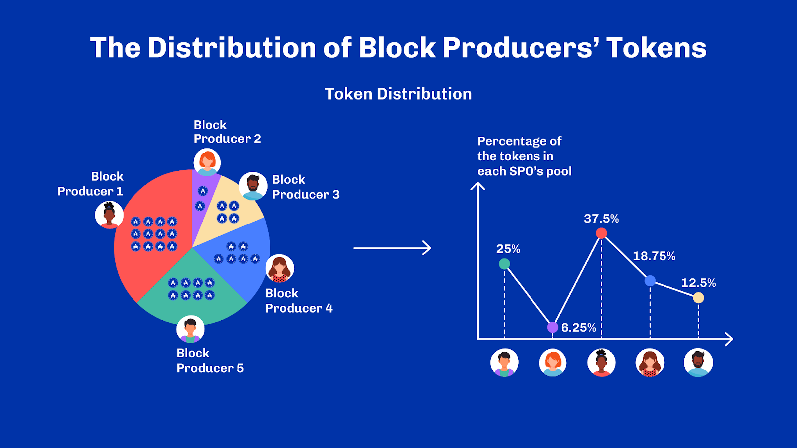
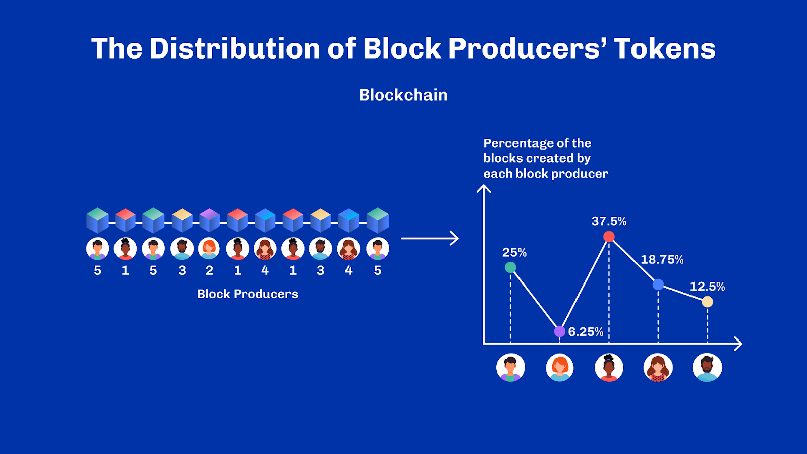
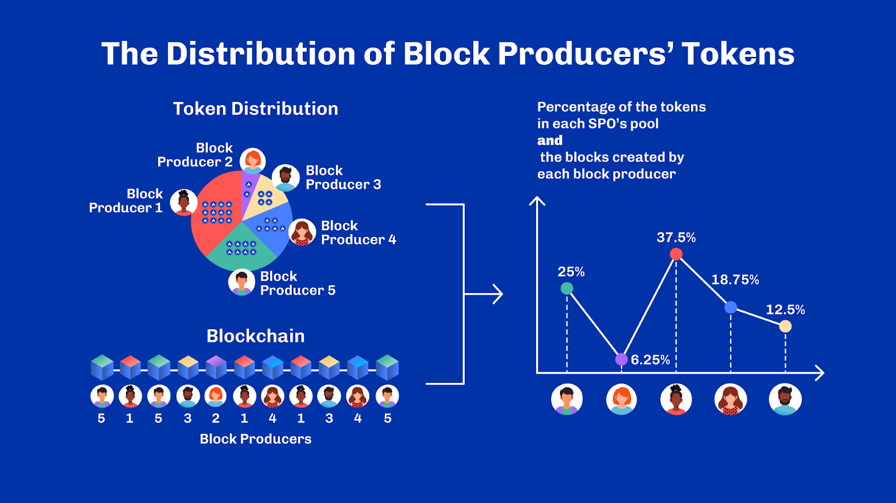
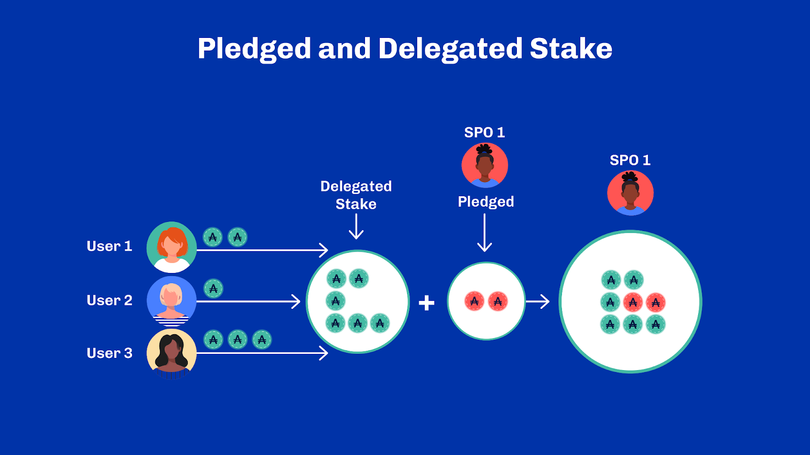
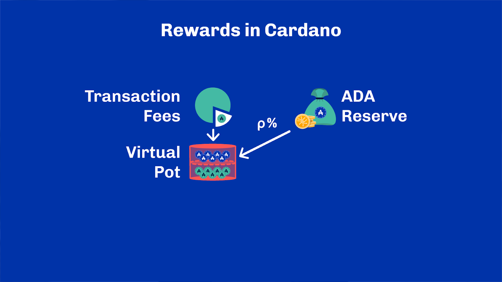
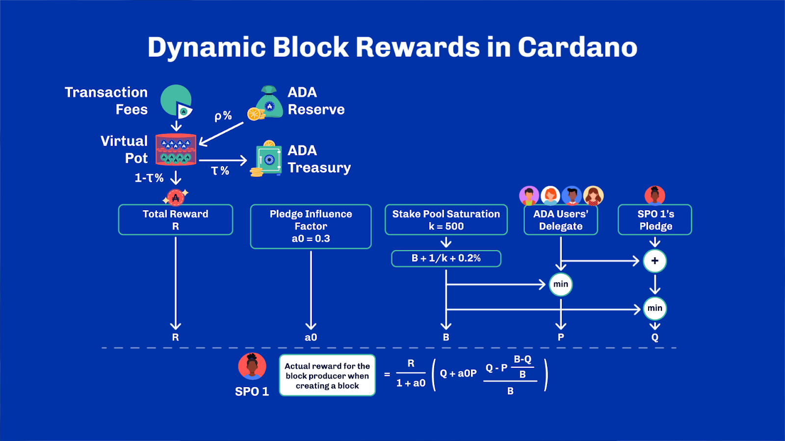
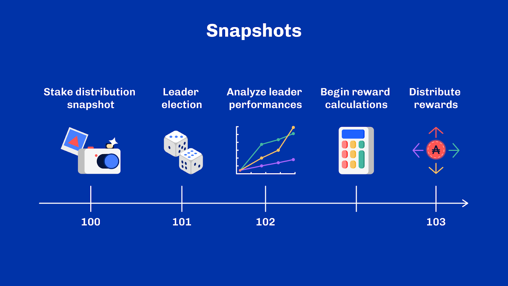
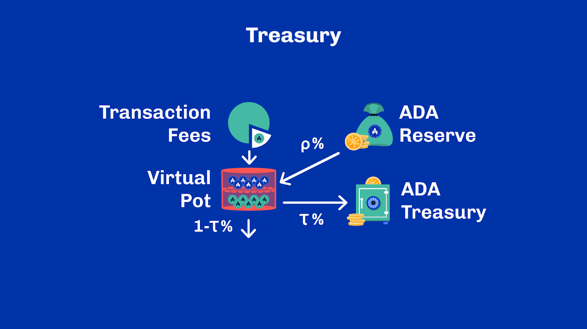

# Unit 4 - Rewards Mechanisms

## Learning Objectives
By the end of this unit, the learner should be able to:
- Enumerate the different sources of rewards in Cardano
- Make parallels between Cardano incentives and proof of work incentives
- Explain the role of k, a0, tau and rho
- Understand the difference between the treasury and the reserve
- Explain how rewards are distributed in Cardano

## Introduction
Hello everyone, and welcome back for another topic. My name is [speaker name] and thank you for joining me today.

## Table of Contents
In this unit, we are going to discuss Cardano’s reward mechanism in greater detail. We will also build upon the Cardano-specific knowledge base and foundation we have gathered over previous topics.

We’ll start with a quick overview of delegated proof-of-stake and look at the difference between pledged and delegated stake. Then, we will deep dive into the reward-sharing scheme of Cardano and how the system incentivizes good behavior. We’ll briefly discuss governance at the end to leave you with some interesting thoughts.

We have a lot to cover, as ever, so let’s get started.

## Delegated Proof-of-Stake

### Summary
In proof-of-stake blockchains, as with proof-of-work, nodes compete with one another to produce blocks. However, they do not compete with hashing power but by leveraging the number of blockchain tokens they control. In both proof of work and proof of stake, the chances of being selected as a block producer is like a lottery. In the former it is proportional to hashing power and, in the latter, to the number of tokens. The general idea is that In Cardano's proof of stake consensus algorithm, block producers are pseudo-randomly selected. The random function is based on the distribution of the tokens among all block producers. The more tokens a block producer holds compared to the other block producers, the higher their chances of being chosen as the block producer for a given block.

Let’s illustrate this random function. As you can see on the upper left, there are five block producers who have eight, two, twelve, six, and four tokens, respectively. In percentage terms of the total tokens in the network, block producers one to five own 25%, 6.25%, 37.5%, 18.75%, and 12.5%.

Now, what does this mean in terms of the likelihood of being selected as a block producer?

On the lower left is the blockchain created by the block producers. As you can see, the first block is created by block producer one; the second block is created by block producer three,  and so on. In percentage terms, block producers one to five created 25%, 6.25%, 37.5%, 18.75%, and 12.5% of the total number of blocks in the blockchain.

Now, if you look at the right side, you can see the percentage of blocks created by each block producer and the percentage of tokens they control in the network. They are roughly the same. This means that the probability of a potential block producer being chosen depends on the number of tokens that it owns compared to the tokens in the control of all other block producers. This should sound familiar by now.

### Pledged, Delegated and Active Stake
To increase their chance of being selected, block producers, also called Stake Pool Operators, or SPOs, work towards increasing their token ownership or 'stake'. The number of tokens a block producer personally owns and contributes to block production is referred to as their pledge. Other Cardano users who do not directly participate in block production can delegate their stake to a block producer using their wallets to increase the block producer’s chance of being elected. This is called delegated stake. Either way, when delegated to a registered stake pool, the stake is called active stake. SPOs are the entities that leverage the active stake for block production. The more tokens an SPO controls, the higher the chance of being selected to create and add a new block to the blockchain.

There is a natural dynamic between stake pool operators and delegators: not everyone is interested in explicitly participating in the consensus. Operating a stake pool involves a fair amount of technical knowledge and maintenance work. Delegation thus offers the ability for any users to entrust their rights to election as block producer to another declared actor of the system: a stake pool.

A delegation is, therefore, temporary access that a user grants another with its consensus rights. An essential trait of Cardano's delegation system is that the stake remains liquid during the entire process. That is, there is Said differently, there's no locking. Delegated funds can be transferred freely, and with them, their associated delegation rights.

### Stake Distribution Snapshots
This raises an interesting question: if the stake is fully liquid, then how can we pin down the exact amount of stake used for the lottery? The answer lies in the protocol and stake distribution snapshots.

Indeed, as we’ve seen in previous units, Ouroboros divides time into slots, which are grouped into epochs. Many protocol mechanisms actually rely on these epochs and you’ll often hear mentions of “epoch boundaries” in the context of Cardano. This refers to the moment where the system transitions from one epoch to the next. From a consensus perspective, we almost always look at a snapshot of the stake distribution across an epoch and the right question to ask is often: a snapshot of what?

In Cardano, a snapshot is taken at the beginning of every epoch which reflects the stake distribution of the previous epoch. This snapshot isn’t used right away because it isn’t considered stable yet. Remember how transactions are only probabilistically settled in the system? It means information only settles after a certain delay.

Let’s illustrate this with an example. If I delegate my stake in epoch 100. It will be part of the snapshot that occurs at the boundary between epochs 100 and 101, but it will only be used for the leader schedule of epoch 102. There’s always at least one entire epoch for the stake to really become really active.

### Rewards Sharing Scheme (RSS)
As we stated, actively taking part in the consensus requires some effort. Everyone who participates in the consensus draws at least one indirect, albeit paramount, benefit: they help secure the network. Yet, more is needed to ensure proper decentralization and resilience within the consensus. In a proof-of-stake protocol like Ouroboros, one must encourage as many stakes as possible to participate in the consensus. And that stake must be spread across sufficient entities to avoid collusion.

To cope with that, Cardano includes a reward-sharing scheme, or RSS in short, as an integral part of the consensus protocol. The reward-sharing scheme puts incentives in place so that the system encourages behaviors beneficial to its functioning. Let’s dive in.

### Consensus Rewards and Reserve
The first kind of incentives we find in the system are consensus rewards. If you recall in an earlier unit, we discussed how proof of work systems award miners through coinbase transactions. Each miner is entitled to a special transaction of a fixed amount paid to themselves, such that their reward is proportional to the number of blocks they produce. The protocol determines the amount of each coinbase transaction. This amount usually halves on predefined time cycles. Through this process, new tokens are put into circulation.

Well, Cardano works in a very similar fashion. Ouroboros awards stake pools for their work through consensus rewards proportional to the blocks they produce.

These rewards have two different sources: transaction fees and the reserve. Transaction fees are self-explanatory and correspond to the fees collected on all transactions in each block. The reserve is something we hinted at when we covered the Cardano genesis. It is a pot of unallocated Ada tokens that haven’t been issued yet. In every epoch, a certain percentage of the reserve is put into circulation through rewards.

That percentage is called the monetary expansion and is typically denoted ρ. It is a configurable protocol parameter whose value is currently set at 0.3%. Thus every epoch, a maximum of 0.3% of the unallocated Ada is put in circulation, and since the reserve does not replete, this amount gradually gets smaller. At this rate, the reserve is halved roughly every five years. Note that the exact amount put in circulation depends also on the blocks produced during that epoch. If the system only produces half the blocks it was expected to produce, then only half of the planned monetary expansion is put into circulation thus making the creation of new tokens entirely proportional to the actual block production.

### Stake Rewards and Pool Parameters
On the other hand, delegators are also incentivized. In exchange for their delegation, ada holders receive a proportion of the rewards earned by the stake pool according to parameters both fixed by the protocol and set by the stake pool itself.

A flat cost is taken from the total rewards granted to the pool with a minimum imposed by the protocol. This minimum is known as “min pool cost” and currently sits at 340 Ada and is meant to cover the cost of running a stake pool. Then, there’s a variable cost – or pool margin, as a percentage set by the pool. On Cardano, most pools oscillate between 1% and 3%. Once deducted from the pool rewards, the remainder is split across all delegates proportionally to the stake they contributed to the pool.

Another particularly interesting parameter is called the pledge. The pledge represents a minimum amount of stake that pool owners are committed to delegating to their own pool as a testimony of their seriousness and involvement. A high pledge means that the pool is more likely to produce blocks – and thus generate rewards – even if it hasn’t yet attracted many delegators. The pledge is declared by pools when registering, and must be met through delegation. Should a pool not meet its declared pledge, it would receive no rewards from the system at all.

Hence besides branding, rewards parameters are means that stake pools use to compete with one another. A higher pledge or a lower variable fee is usually good to attract delegators. With incentives for stake pools, delegators, and liquid staking, Cardano ensures that a high amount of the total available stake takes part in the consensus at all times, helping secure the network against malicious actors.

But, there’s more.

### Rewards Provenance
In Cardano, transaction fees and block rewards aren't directly awarded to block producers. Instead, they are collected into a temporary reward pot. Every block made over a fixed period contributes to that pot. At the end of this period, a portion of the total rewards is sent to the Cardano treasury, a special reserve of tokens in the network used to fund its ecosystem's development.

The remaining rewards are divided between all block producers and delegators proportionate to the blocks they minted in that period. Identification of stake pools is thus necessary, so block producers include their identifiers in the blocks they produce.

Then, as we just saw, block producers, or simply stake pools, are assigned rewards for themselves according to their parameters advertised in advance. And finally, the remaining rewards are divided proportionally among all the other delegators. So, how much reward does a block producer receive in total? Here's a brief explanation.

The image shows that the block producer receives a portion of the total reward pot R based on a complex formula. The total reward R comprises two main components: First, all transaction fees of the transactions that are part of the block. This component is similar to proof-of-work consensus. Second, the monetary expansion is calculated periodically as additional rewards to be distributed to block producers for their work.

The formula calculates the reward utilizing the number of pledged tokens and the number of delegated tokens, as well as two other parameters: the Pledge Influence Factor and the Stake Pool Saturation. These parameters are determined in the consensus algorithm and are commonly referred to as a0 and k. Specifically, k refers to the ideal number of stake pools in the system such that 1 / k represents the fraction of the maximum stake considered for a pool.

And this is why 1 / k is called the stake pool saturation. There’s no point accumulating more stakes beyond that limit for a pool, as it doesn’t generate more rewards. When this happens, a pool is said to be saturated, which means that delegators will likely earn fewer rewards: rewards won’t increase, but they’ll be split across more delegators. This mechanism helps to prevent pools from becoming too large and puts the decentralization and security of the system at risk.

Nevertheless, this mechanism alone isn’t sufficient. A single actor can run multiple stake pools. And this is where a0 enters the picture. As the pledge influence factor, a0 encourages stake pools to increase their pledge instead of splitting it over multiple pools by allocating more rewards to pools with high pledges. We could see that as a third incentive to limit centralization.

True to the design principles of Cardano, a0 and k are also updatable protocol parameters, so they can be adjusted to tune the system better.

### Rewards Delay
As a consequence of the stake only becoming active in the following epoch it is assigned, rewards are also delayed. All the more so since rewards also depend on the pool’s performances on the epoch. And to avoid overloading the node on each epoch boundary, the rewards calculation is actually spread across the entire following epoch. Let’s look at an example.

Alice delegates during epoch 99. A snapshot is taken at the epoch boundary between epoch 99 and 100. That snapshot is used for the leader schedule of epoch 101. This means that Alice’s stake effectively starts contributing to the protocol in epoch 101. During epoch 102, the calculation of the rewards for epoch 101 can occur. Note that it doesn’t start immediately at the beginning of epoch 102 to leave time for the previous epoch to settle. By the end of epoch 102, rewards have been calculated and are distributed to all delegates in the transition to epoch 103.

The whole reward schedule can be a little hard to grasp but the gist is that stake only becomes active after a delay and thus, starts generating rewards after that delay. Then, it is a cycle which repeats itself which means that rewards accrue every epoch.

Before we say goodbye, let’s cover one last topic: the treasury.

### Treasury
If you’ve been carefully following, we’ve briefly mentioned the treasury when looking at the reward formula. Fundamentally, the treasury is a protocol-level tax meant to create a self-sustaining ecosystem and to fund its development. The amount cut from the total rewards is a fixed percentage, yet another protocol parameter. I promise this is the last one we see in this unit. It’s called τ, and it is currently set at 20%.

As you can see, the treasury uses a straightforward yet highly efficient mechanism. With every epoch, it receives additional funding, which can then, in turn, be used to finance network activities or projects that benefit the overall ecosystem. Deciding upon how to use these funds best is the main focus of the Voltaire phase and a vital pillar of on-chain governance.

Prior to the Conway era, only the genesis entities would be entitled to move funds out of the treasury, out of a quorum. This has happened periodically through Project Catalyst, an innovation fund working on a side-chain to promote innovation in the Cardano ecosystem.

In the Conway era, the management of the treasury, amongst other governance topics, has been shifted to become a responsibility of every Ada holder, including stake pool operators. This new design has been outlined in the Cardano Improvement Proposal (CIP) 1694 and is a significant step towards full on-chain governance.

## Review
And this marks the end of this unit. We’ve talked about the rewards and incentives scheme on Cardano and covered many parameters that intervene in its design: min pool cost, ρ, a0, k, τ. We’ve seen how rewards are allocated in two steps, first, by being collected over an epoch and then by being paid through a complex formula which stitches everything together. Finally, we gave some perspectives on the treasury and on-chain governance, an exciting topic we’ll cover in more depth in future units.

## References
[Ref.8.4.1] Cardano Monetary Policy, Cardano.org, Available from: https://docs.cardano.org/explore-cardano/monetary-policy, Accessed: 31 Aug 2022 
[Ref 8.4.2] Phillip Kant, Lars Brünjes, Duncan Coutts “Design Specification for Delegation and Incentives in Cardano”, 2020 
[Ref.8.4.3] Corduan, Jared, Polina Vinogradova, and Matthias Gudemann. "A Formal Specification of the Cardano Ledger", 2019. 
[Ref.8.4.4] Zhang, Bingsheng, Roman Oliynykov, and Hamed Balogun. "A treasury system for cryptocurrencies: Enabling better collaborative intelligence." Cryptology ePrint Archive, 2018. 
[Ref.8.4.5] The Shelley Hard Fork, Cardano.org Forums, Available from:  https://forum.cardano.org/t/the-shelley-hard-fork-all-you-need-to-know/36553, Accessed: 31 Aug 2022 

## Glossary

- *Pledge*: The number of tokens a block producer personally owns and contributes to block production is referred to as their pledge.
- *Delegated Stake*: Delegated Stake is when Cardano users who do not directly participate in block production delegate their stake to a block producer using their wallets to increase the block producer’s chance of being elected
- *Reward Sharing Scheme*: This is an integral part of Cardano’s consensus protocol. The reward-sharing scheme puts incentives in place so that the system encourages behaviors beneficial to the functioning of the system.
- *Minimum Pool Cost*: A flat cost granted to the pool, taken from the total rewards with a minimum imposed by the protocol. This minimum is known as “min pool cost” to cover the cost of running a stake pool
- *Treasury*: The treasury is a protocol-level tax meant to create a self-sustaining ecosystem and to fund its development. The amount cut from the total rewards for the treasury is a fixed percentage.

### Questions

**Sub-Unit 1**

*Select the correct statement:*

- In a proof-of-stake blockchain, the more tokens a node controls …
- The less influence they have on block production
- **The greater its chances of being selected as a block producer (CORRECT ANSWER)**
- The less secure the system becomes
- The slower the block production rate is

**Sub-Unit 2**

*Select the correct statements on pledged and active stakes.*
- The fewer tokens an SPO controls, the higher the chance of being selected
- **A pledge is the number of tokens a block producer personally owns and contributes to block production(CORRECT ANSWER)**
- **When delegated to a registered stake pool, the stake is called active stake (CORRECT ANSWER)**
- Active stakes refers to stake locked up in transactions

*Select the correct statements on delegation.*
- Delegated funds and their delegation rights can never be transferred freely
- **With Cardano’s system, the stake remains liquid during the delegation process (CORRECT ANSWER)**
- **Delegated stake is when users delegate their ada to a stake pool to boost its chance of being elected as the next block producer (CORRECT ANSWER)**
- Delegation means users are participating in Project Catalyst

**Sub-Unit 3**

*What does "epoch boundaries" refer to in the context of Cardano?*
- The exact middle of an epoch
- **The point where the system shifts from one epoch to the next (CORRECT ANSWER)**
- The time when the most significant updates are made to the system

*Cardano takes a snapshot at the beginning of every epoch - what does this reflect?*
- The total number of tokens in circulation
- The moment of highest transaction volume within an epoch
- **The stake distribution of the previous epoch (CORRECT ANSWER)**

*How does Ouroboros divide time?*
Into blocks and chains
Into seconds and minutes
**Into slots and epochs (CORRECT ANSWER)**
Into days and nights

**Sub-Unit 4**

*What is the purpose of the reward-sharing scheme (RSS)?*
- To punish any adversaries that may be on the system
- To provide additional tokens for all stakeholders
- **To incentivize behaviors that are beneficial to the system’s operation (CORRECT ANSWER)**

What is the main reason for the protocol to issue rewards to delegators?
- To give away money that delegators can spend in the ecosystem
- To reimburse transaction fees
- **To encourage delegators to participate in the consensus thus securing the network (CORRECT ANSWER)**
- To reward delegators for participating in governance

**Sub-Unit 5**

*What is the term used for the percentage of the treasury put into circulation through rewards in every epoch?*
- Monetary consensus
- Treasury distribution
- **Monetary expansion (CORRECT ANSWER)**
- Epoch allocation

*Which two sources provide the rewards in Cardano?*
- Staking and transaction fees
- **Transaction fees and the reserve (CORRECT ANSWER)**
- Coinbase transactions and consensus rewards
- Block production and staking

*What is not common to both Bitcoin and Cardano?*
- **Block producers reward themselves through a special transaction in each block (CORRECT ANSWER)**
- Block production is incentivised through transaction fee and consensus rewards
- New tokens are issued through consensus rewards to block producers
- Block producers earn rewards proportional to the block they produce

**Sub-Unit 6**

*When it comes to stake rewards and pool parameters, what are the best ways to attract delegators?*
- A higher variable fee
- A lower pledge
- **A higher pledge (CORRECT ANSWER)**
- **A lower variable fee (CORRECT ANSWER)**

*True or False: once earned, rewards can’t be taken back or slashed by the protocol.*
- **True (CORRECT ANSWER)**
- False

*True or False: a high declared pledge always means more rewards for delegators.*
- True
- **False (CORRECT ANSWER)**

*True or false: rewards are paid to each stake pool and delegators as soon as a block is added to the chain.*
- True
- **False (CORRECT ANSWER)**

**Sub-Unit 7**

*What is the role of the a0 parameter?*
- It controls the maximum size of a stake pool
- It controls the maximum number of delegators that a pool can have
- It controls the influence of the pool performances on the rewards
- **It controls the influence of the pledge on the pool rewards (CORRECT ANSWER)**

*True or False: a fraction of all rewards is allocated to the Cardano treasury?*
- **True (CORRECT ANSWER)**
- False

**Sub-Unit 8**

*Which statement best describes the reward schedule in the Cardano protocol?*
- Rewards are given immediately in the same epoch the stake is delegated.
- Stake becomes active instantly and starts generating rewards without any delay.
- **Stake becomes active after a delay and then starts generating rewards, with the cycle repeating every epoch (CORRECT ANSWER)**
- The reward calculation always starts at the beginning of the next epoch

*When does a delegated stake become active in relation to the epoch it was assigned?*
- Immediately in the same epoch
- Two epochs later
- **In the following epoch (CORRECT ANSWER)**
- Three epochs later

**Sub-Unit 9**

*What is the main purpose of the treasury in Cardano?*
- To provide salaries for the developers
- **To fund its development (CORRECT ANSWER)**
- **To create a self-sustaining ecosystem (CORRECT ANSWER)**
- To hold funds for external investors

*Select the correct statements about treasury.*
- **The amount cut from the total rewards is a fixed percentage (CORRECT ANSWER)**
- The protocol parameter, τ, is currently set at 30%
- **Currently,  τ is set at 20% in relation to the total rewards (CORRECT ANSWER)**
- The amount cut from the total rewards fluctuates month to month
