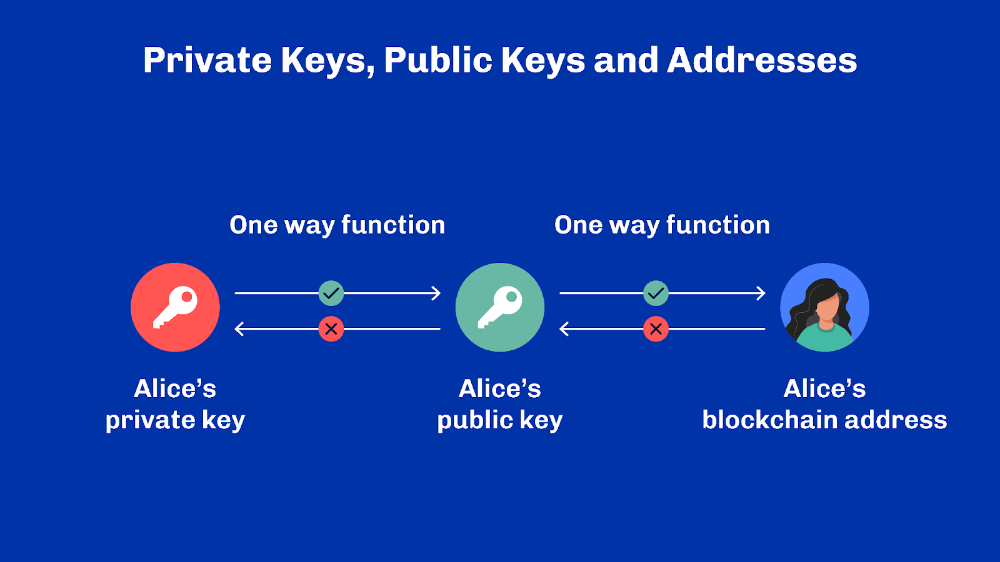
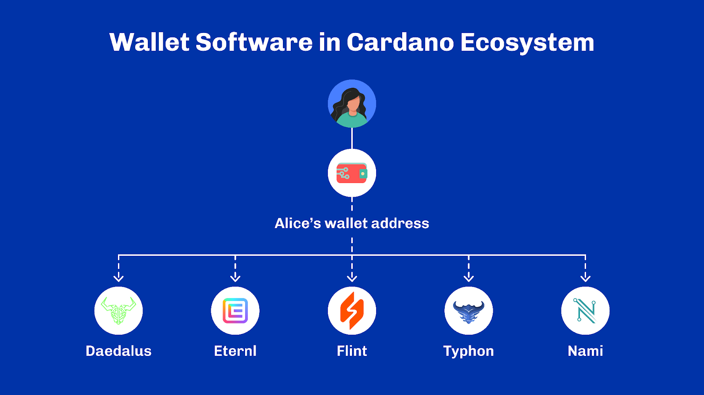
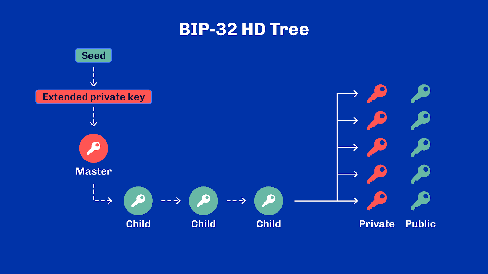
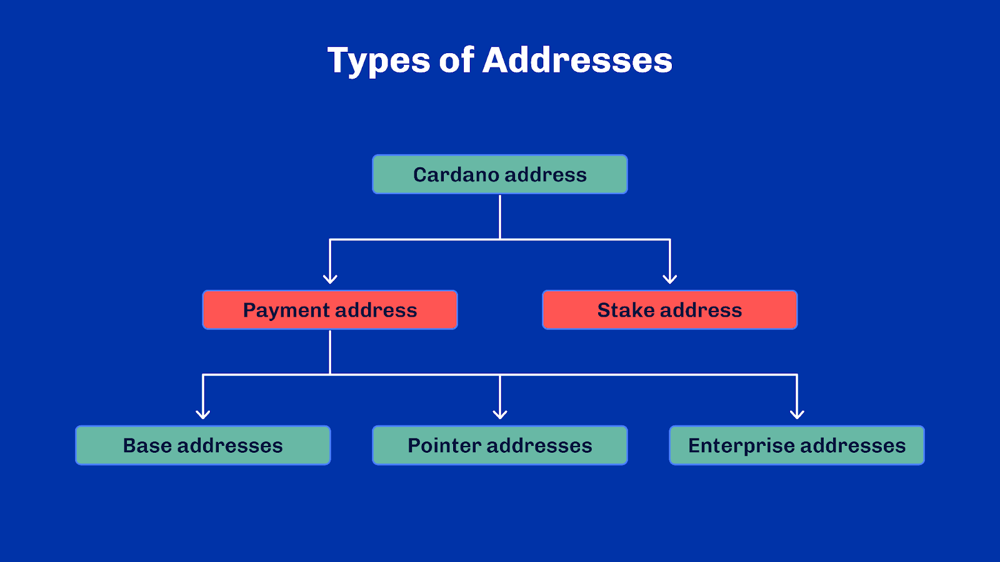
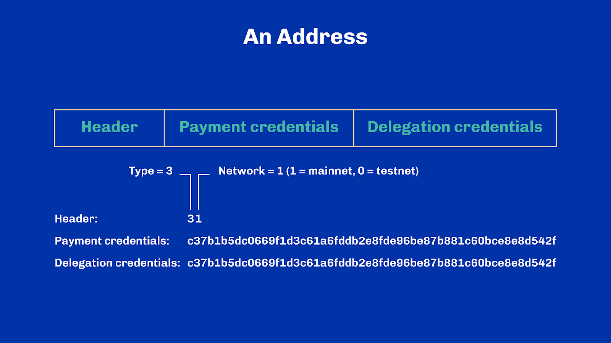
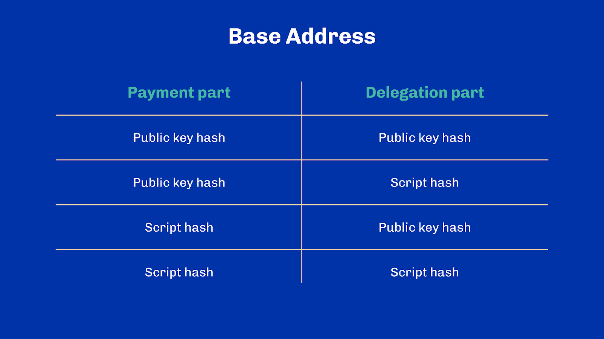
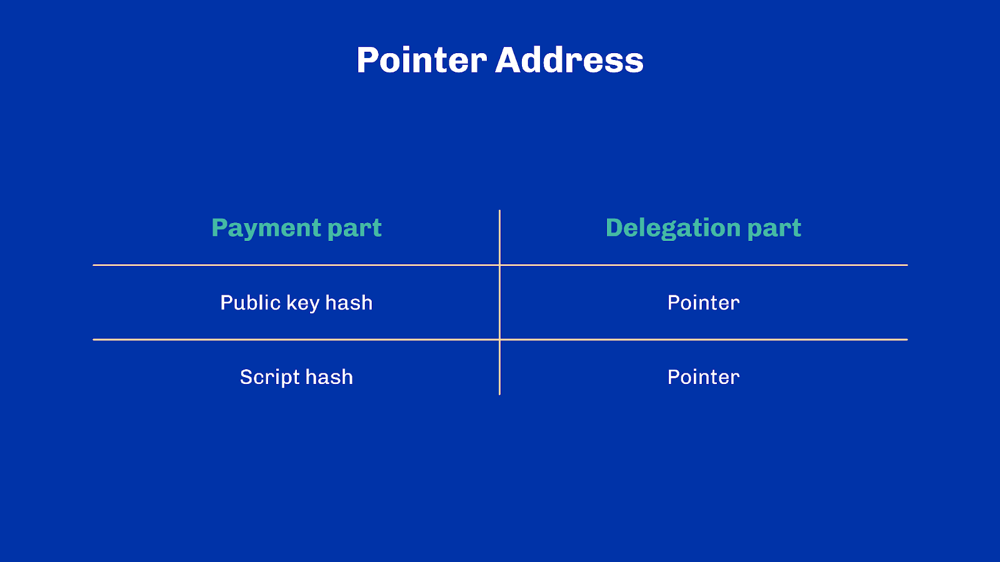
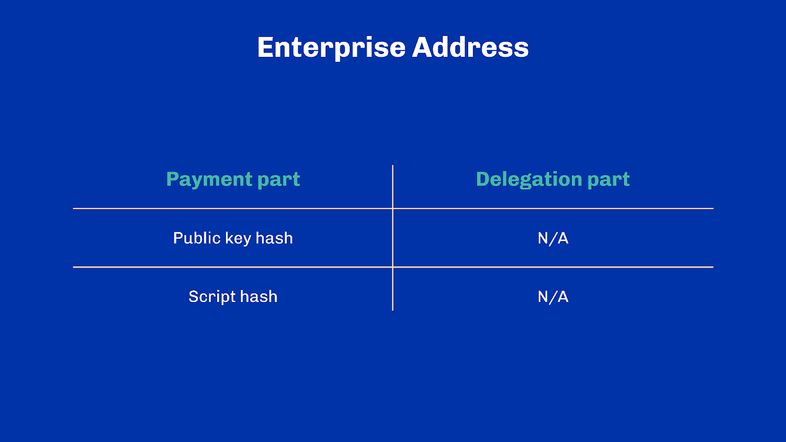

# Unit 5 - Addresses

## Learning Objectives

> [!NOTE]
>
> By the end of this unit, you should be able to:
>
> - [x] Explain the principles behind hierarchical deterministic wallets
> - [x] Explain roughly what is text encoding is and what mnemonic phrases represent
> - [x] Enumerate the different types of Cardano addresses and their roles
> - [x] Highlight the specifics of Cardano stake addresses

## Introduction
Hello everyone, and welcome back. I am your lecturer, [lecturer name], and many thanks for joining me today!

## Table of Contents
In this unit, we will talk about addresses, more specifically about Cardano addresses. We’ve already discussed what addresses fundamentally are in earlier units, but we have yet to see how they also play a role in delegation or even where they come from. This is the topic of today.

## Wallets
Wallets are generally thought of as where tokens are "stored". This is not quite accurate as tokens are in fact data stored on the blockchain ledger. A wallet merely stores the secret credentials needed to move these tokens around.

It provides users with an interface to access and utilize those credentials – for example, to authenticate transactions. Some wallets are also full-blown applications through which they can use the blockchain, keep track of their assets, and send and receive those assets. Thus, wallets often offer a primary – and trusted – means for users to view and interact with the blockchain.

In essence, a wallet can be seen as an interface around the management of a single private key. From a private key, one can obtain a corresponding public key and this forms the basis of asymmetric cryptography. Let’s look at a figure while you cast your mind back to the earlier units on cryptography and asymmetric encryption, and you’ll remember Alice and Bob. They are looking to make a transaction, where they both generate their own private key which they will never share with anyone.

### Private Keys, Public Keys and Wallet Addresses
Said differently, people own tokens. To maintain ownership of those tokens, they need a pair of keys: one private, one public. But to transact, the user also needs an address to send and receive tokens. This is called a user’s address or a wallet address. The wallet address is created from the public key.

In the diagram, you can see that Alice has a private key from which she can generate her public key. From that public key, she generates her wallet address. As we learned in earlier units, Alice’s private key cannot be derived from her public key. And generally, her public key cannot be derived from her wallet address.

### Accounting
Alice uses her wallet address to track her funds and to receive tokens from other users. When tokens are sent to Alice’s wallet address, they are locked to that address. They will stay locked until she transfers them to another address. Her private key is the only way that allows her tokens to be moved. That key grants Alice the right to unlock the tokens and transfer them to another user’s address.

Wallet software can show Alice’s account balances, monitor addresses, and store private keys. Transactions can also be created from wallet applications and submitted to block producers. Some examples of wallets for Cardano include Daedalus, Eternl, Flint, Typhoon or Nami.

https://daedaluswallet.io/
https://eternl.io/app/mainnet/welcome
https://flint-wallet.com/
https://typhonwallet.io/#/
https://namiwallet.io/

Wallets can be either full-node or light. For example, Daedalus is a wallet where the user runs a dedicated full Cardano node alongside it - getting its data directly from the network. The others are light wallets but rely on centralized services to access the Cardano blockchain, adding an intermediary.

### Improvement Proposals
Wallet applications are an important aspect of blockchain, as they provide users with a means to engage with the network. Improving the experience that a user has when using a wallet is therefore an important consideration to drive greater network adoption. Encouraging new users to adopt a new technology with a poor user experience is a challenging proposition. As such, this has been a significant driver of improvement proposals over the years, particularly for Bitcoin and Cardano.

If you recall, improvement proposals are a way for members of a blockchain community to make formal propositions on how the protocol can be improved. Some of these proposals have positively impacted user experience when using a wallet. Proposals often shine outside of their blockchain ecosystem. This has been particularly true of many Bitcoin improvement proposals (BIPs). In a similar fashion, key changes on wallets and addresses also came from Cardano improvement proposals (CIPs).

## BIP-32
Blockchain wallets have one important job: they must manage your secret credentials. Often, different credentials are used for different activities. Even a simple payment may involve different keys should you need to separate your spendings. Thus in general, there are more than one key to look after. Managing each key individually is tedious and time-consuming. Especially if you need to remember each of them. To address this shortcoming, BIP-32 added extended keys to Bitcoin. This enabled wallets to derive new child private keys from a single root private key. A child key, public or private, is nothing more than another key with a special relationship that links it to its parent. This means that a single piece of data could now be used to recover a whole wallet made of many keys thus increasing the ease of storage of wallets. There is no need to remember all the keys used in a wallet, it suffices to remember a single one. Such wallets are called “Hierarchical Deterministic” wallets – or HD wallets in short – since they manage a hierarchy of child and parent keys, all which can be deterministically obtained from a single initial seed.

Here we can see that a seed is a piece of data which can be used to create a HD wallet, and is the only data required to regenerate any private and public keys held in that wallet. This means a seed is effectively a backup. A given seed will also generate the exact same keys every time, and a single seed can generate a near-infinite number of public and private child keys.

Though BIP-32 was a significant improvement in the interoperability and recoverability of wallets, there were still challenges to be overcome. Remembering a seed was not a user-friendly experience, as seeds were nothing more than a relatively long random string of digits. Luckily a solution to this challenge was forthcoming with BIP-39.

## BIP-39
If you’ve been in crypto for long enough, you most probably had to write down mnemonic phrases (also known as recovery phrases) at some point or another. BIP-39 introduced them. This standard brought a consistent process for turning random seeds into a set of predefined words.

A wallet seed is in fact a sequence of bits (i.e. a sequence of 1s and 0s) and it is long enough that there exist an astronomically large number of possible seeds – more than there are atoms in the entire galaxy! However, if we break the seed down into multiple smaller groups of bits, we obtain several groups. For these groups the number of possible elements in each group is much less. In fact, with groups of 11 bits, we end up with 2048 possibilities for each group.

It is then possible to associate a word from the dictionary such that a different word is mapped to each of the 2048 possibilities. For example, 1 can be ‘apple’, 2 can be ‘banana’ and so forth until 2048.

From a high-level, this is how BIP-39 works. It turns a list of many 1s and 0s into a smaller list of words: the recovery phrase. However, not everyone has exactly the same dictionary at home, so BIP-39 also defines the list of words to use. Words have been chosen such that there’s no two words that are too similar.

BIP-32 and BIP-39 simplify the storage of private keys. All you need to access all the private keys from your wallet is the mnemonic phrase for that wallet. How neat!

If you’re thinking it’s just a list of words, I could easily guess another user's recovery phrase, that’s not the case! Let’s do the math. Recovery phrases typically contain about 24 words and each of them has 2048 possible values.

This means there are 204824 possible combinations. It would take you as many as 2.96 x 1079 guesses, which will result in 29.6 tredecillion possible guesses. That number looks like this:
29,600,000,000,000,000,000,000,000,000,000,000,000,000,000,000,000,000,000,000,000,000,000,000,000,000,000

 Your time would be better spent doing something else, but ultimately the choice is yours!

## BIP-44 and CIP-1852
We discussed earlier that BIP-32 was about creating a hierarchical structure of keys. This is neat, but it doesn’t allow different wallet software to be compatible with one another. What if this other wallet uses a different structure than your wallet? Consider delegation for example. Maybe a certain software uses the first child key as a delegation key, and next keys as payment keys. What if another software does something else? Wouldn’t it be better if you could just use the same recovery phrases in different wallets and it worked the same way?

This is where BIP-44 comes into play as it standardized the hierarchical structure to one canonical structure meant to be extensible, and to even work across multiple crypto-currencies!

BIP-32 introduced derivation of child keys but we did say very little about how this worked in practice. Without going into too much detail, let’s focus on two important dimensions.

First, each derivation of a child key from a parent key is associated with a whole number. This is typically called a derivation index. Second, there exists two types of derivations: hardened and soft.

Hardened derivations require a private key (and create a new child private key).  Soft derivations can be done from both a private key or a public key only. When done from a public key, it creates a new child public key

A derivation is described with two pieces of information - the derivation index and whether it is hardened or not. The derivation index is denoted with a number. A hardened derivation is denoted with the derivation index followed by a tilde or the letter ‘H’. If it is a soft derivation it does not have the tilde or ‘H’.

Multiple successive derivations are denoted with the individual derivations separated by slashes. This gives what’s commonly called: a derivation path. By convention, derivation paths also start with the letter a lowercase m to refer to the

For example, m/44’/0’/0’/1/42 designates a child key that is obtained after 5 derivations from the root private key, using three hardened derivations at index 44, 0 and 0, followed by two soft derivations at indexes 1 and 42.

This 5-level example may seem odd, but this is precisely what BIP-44 introduces with a precise semantic associated with each level. The first level is called the “purpose” and in the case of BIP-44 is always equal to 44’. In fact, this level indicates how the next 4 levels should be interpreted. The second level is called the “coin type” and is different for each crypto-currency. ADA for example is associated with 1815’ – Ada Lovelace’s birth year. This is meant to avoid clashes between applications which may re-use derivation indexes for keys across multiple blockchain systems. The other three levels are referred to as the “account”, “change” and “address'' indexes in the case of BIP-44. They have values that are decided by wallets internally.

Earlier versions of Cardano did adopt BIP-44. Later, however, wallets ended up working on a new standard: CIP-1852 to rework the meaning given to each derivation path and agree on something more suited for the Cardano ecosystem. In particular, CIP-1852 defines how to derive stake keys within the hierarchical structure. It has several extensions such as CIP-1853, CIP-1854 and CIP-1855.

This is why most cryptographic keys used today within the Cardano networks uses paths starting with: m/1852’/1815’/… but you may still find some using m/44’/1815’/… in old wallets such as Yoroi or Daedalus.

## BIP-173 and CIP-0005
Another interesting improvement proposal which concerns us in this unit is called BIP-173 and it pretty much defines a method to represent addresses as text. So far, we’ve been speaking about addresses as something that contains a public key and worry not, we’ll go more in-depth very soon about how this works exactly. But how exactly does one represent an address, or a public key? How do they materialize for us as users of the system?

We’ve seen how BIP-32 associates the wallet seed to a sequence of words. Though you’d certainly agree: this can be a mouthful. It is justified in the case of wallet root keys, but it isn’t quite suitable for any kind of tiny binary data we often encounter on the blockchain.

BIP-173 comes to the rescue and proposes to represent any kind of binary data as a sequence of common alphabet characters and digits with some interesting properties. The process of representing a piece of binary data as plain text is called “encoding”. By the way, in the case of BIP-173, this encoding even has a specific name: “bech32”

For example: abcdef1qpzry9x8gf2tvdw0s3jn54khce6mua7lmqqqxw

Interestingly, the alphabet used is a subset of the standard Latin alphabet where letters and numbers that look alike have been removed. For example, the alphabet contains the letter ‘l’ but not the letter ‘i’; it contains the digit ‘0’ but not the letter ‘o’. This is to prevent errors when writing down or spelling out such a sequence of characters.

Another interesting feature of BIP-173 is that it defines a “human readable part” that comes as a prefix to the whole data payload. The human-readable part is generally used to describe what kind of data is captured by the character sequence. For example ‘addr’ typically designates addresses on the main Cardano network, whereas “pool” refers to stake pool identifiers. In fact, CIP-0005 defines the complete list of such well-known prefixes for the Cardano ecosystem; and there are many, so we’ve put a link to it in the reference list.

Finally, and probably the most significant feature of BIP-173: the encoding sequence comes with an error detection mechanism, a bit like your credit card number. Specifically, the last few characters of the sequence are in fact added to the original payload and serve as control characters. They are calculated from the rest of the sequence (including the prefix) such that, if there are one or more characters that is omitted or changed to another, the final control sequence has a good chance to be different. Moreso, it is even possible to locate with a high probability which characters in the sequence are wrong! This adds up to the restricted alphabet to offer another layer of security to users to ensure that they haven’t mistyped an address – even though most of the time, we simply copy and paste addresses using the clipboard.

We handpicked a handful of BIPs and CIPs. While important steps in making the whole experience of using a blockchain more user-friendly, there are far from the only improvement proposals that have been implemented. If you’re curious to find out about what else has been changed over the years, or which BIPs have been written, I’ve added a link to the BIP and CIP GitHub repositories in the notes. They are active repositories, so make sure you have a look around to find out what the communities are working on today.

## Addresses
All these improvement proposals and concepts finally lead us to Cardano addresses. On Cardano there are two types of addresses:

Payment addresses
Stake addresses

Payment addresses themselves can be divided into 3 categories: base addresses, pointer addresses and enterprise addresses. Let’s go through them in more detail starting with what’s common to each. We will cover stake addresses shortly.

### General Structure
In Cardano, all payment addresses are made of three parts, the last part being optional (or empty) in some cases. The first part is called the header and contains information about the network the address is compatible with (e.g. main or test network) as well as the type of the address.

Second is the payment part, or the part that indicates the spending conditions associated with that address. In the simplest case, this is a hash of a public key but it can also designate a Plutus script or a combination of multiple public keys.

Finally, the last part – the delegation part – refers to the stake rights and thus indicates the conditions for delegating the funds associated with the address. The stake rights also state who owns the rewards coming from staking. Similar to the payment parts, the delegation part may be a hash of a public stake key or something more elaborate like a Plutus script.

### Base Addresses
A base address is an address that has both a payment part and a delegation part. There exist thus 4 sub-types of base addresses depending on how the payment and delegation part are defined:

We won't go into detail about the different types of scripts yet. For now, it is enough to understand that scripts here refer to either Plutus scripts or so-called native scripts (sometimes also called timelocks) which allow combining multiple public keys and time conditions together.

### Pointer addresses
A pointer address also has both a payment part and a delegation part but the delegation part indirectly refers to stake rights through the use of a pointer. The pointer encodes a location on-chain that points to a delegation certificate. To locate unambiguously any certificate on-chain, a pointer is made up of three coordinates:

An absolute slot number
A transaction index (within that slot)
A (delegation) certificate index (within that transaction)
Hence, there exist 2 sub-types of pointer addresses, depending on how the payment part is defined:

Pointer addresses were meant to be more compact than base addresses, however, they turned out to be more complicated to use for wallets. Indeed, in a distributed system like Cardano, information – such as the location of delegation certificates – takes time to settle. Pointer addresses could not be created upfront because they’d have nothing to point to. Thus they became impractical, with only a marginal benefit on the overall address length. Consequently, they have been heavily underused. They are now widely considered deprecated and possibly removed in future versions of the protocol.

### Enterprise addresses
Enterprise addresses carry no stake rights, so using these addresses means that a user is opting out of participation in the proof-of-stake protocol.

Exchanges or other organizations that control large amounts of tokens – but hold it on behalf of other users – may wish to follow a policy of not exercising stake rights. By using enterprise addresses, exchanges can demonstrate that they follow this policy. Since enterprise addresses do not have any delegation part, they are automatically excluded from the mechanisms that influence the slot leadership schedule. Note that using addresses with no stake rights effectively decreases the total amount of active stake, which plays into the hands of a potential adversary.

Incidentally, there are thus 2 sub-types of enterprise addresses:

### Stake Addresses
We said there were two types of addresses in Cardano - payment addresses, which we have covered and stake addresses.  A stake address is a special bucket used to receive rewards for participating in the proof-of-stake protocol.

They have the following properties:

They use account-style accounting, not UTXO-style.
They cannot receive funds via transactions. Instead, their balance is only increased when rewards are implicitly distributed.
Their balance is automatically delegated according to their associated stake rights.
They can be withdrawn, in full, to create UTXOs which can then be used like any other.

In a similar fashion to payment addresses, stake addresses can be made of a public key hash or a script hash. They do not carry any payment part since they cannot be used as payment inputs directly; they must first be turned into UTxO entries. This implies they are fully driven by their associated stake rights. And consequently, whoever owns the delegation part of any payment address owns the stake address (and the rewards) associated with that delegation part.

Stake addresses are quite fundamental in the design of Cardano. We covered rewards in the previous unit but didn’t delve into how rewards are actually distributed to delegators. From a traffic perspective, it would be extremely heavy on the network to distribute all rewards through normal transactions on each epoch boundary. Hence the use of accounts for rewards which are credited by the ledger implicitly.

## Review
And with that, we have made it to the end of the address topic! To review, we recapped improvement proposals and the rationale for their existence. We then looked at BIP 32, 39, 44, 173 and CIP 5 and 1852. Then we dove into addresses on Cardano. This is certainly more information that one needs on a daily basis but, with that, we have covered everything to know about addresses.

## References
[Ref.8.5.1] Appendix B, Bitcoin Improvement Proposals, Antonopoulos, Andreas M. Mastering Bitcoin: unlocking digital cryptocurrencies. " O'Reilly Media, Inc.", 2014. 
[Ref.8.5.2] Bitcoin Improvement Proposals, Bitcoin Github, Available from: https://github.com/bitcoin/bips, Accessed: 31 August 2022 
[Ref.8.5.3] BIP-32, Bitcoin Github, Available from: https://github.com/bitcoin/bips/tree/master/bip-0032, Accessed: 31 Aug 2022 
[Ref.8.5.4] BIP-39 Word List, Bitcoin Github, Available from: https://github.com/bitcoin/bips/blob/master/bip-0039/bip-0039-wordlists.md, Accessed: 31 Aug 2022 
[Ref.8.5.5] BIP-39, Bitcoin Github, Available from: https://github.com/bitcoin/bips/tree/master/bip-0039, Accessed: 31 Aug 2022 
[Ref.8.5.7] BIP-44, Bitcoin Github, Available from: https://github.com/bitcoin/bips/blob/master/bip-0044.mediawiki, Accessed: 31 Aug 2022 
[Ref.8.5.8] CIP-0019, Cardano Improvement Proposals, Cardano.org, Available from: CIP-0019: Cardano addresses, Accessed: 31 Aug 2022 
[Ref.8.5.6] CIP-0005, Cardano Improvement Proposals, Cardano.org, Available from:
CIP-0005: Common Bech32 Prefixes, Accessed: 14 Oct 2022 
[Ref.8.5.9] CIP-1852, Cardano Improvement Proposals, Cardano.org, Available from:
CIP-1852: Hierarchical Deterministic Wallets for Cardano, Accessed: 14 Oct 2022 
[Ref.8.5.?] EUTxO Crash Course 

## Glossary

- *Derivation Index*: This is when each derivation of a child key from a parent key is associated with a whole number.
- *Hardened Derivation*: Hardened derivations require a private key (and create a new child private key).
- *Soft Derivation*: Soft derivations can be done from both a private key and a public key only (to create a new child public key).
- *Stake Address*: A stake address is a special bucket used to receive rewards for participating in the proof-of-stake protocol.
- *Base Address*: A base address is an address that has both a payment part and a delegation part.
- *Pointer Address*: A pointer address also has both a payment part and a delegation part but the delegation part indirectly refers to stake rights through the use of a pointer. The pointer encodes a location on-chain that points to a delegation certificate.

## Questions

### What do wallets generally store?
1. Tokens from the blockchain ledger
1. Secret credentials needed to move tokens
1. A physical representation of cryptocurrency

See correct answer

2. Secret credentials needed to move tokens

### What statement best describes the main purpose of a wallet in blockchain?
1. A mechanism to produce new tokens
1. An interface for users to view/interact with the blockchain 
1. A backup system for the blockchain ledger

See correct answer

2. An interface for users to view/interact with the blockchain

### What is not actually stored in a wallet software?
1. Addresses
1. Tokens 
1. Private keys
1. Public keys

See correct answer

2. Tokens

### Select the correct statements about wallet addresses.
- [ ] They are needed for the user to send and receive tokens 
- [ ] They are used for KYC (know your customer) requirements with regulators
- [ ] They are created from the private key
- [ ] They are created from the public key 

See correct answer

- [x] They are needed for the user to send and receive tokens 
- [x] They are created from the public key

### Select the correct statements on what happens when receiving tokens from other users.
- [ ] The received tokens are locked to your address
- [ ] Your private key is the only way that received tokens can be moved again 
- [ ] Received tokens can be moved via your public key
- [ ] Tokens are only locked if you choose to lock them
- [ ] The received tokens will stay locked until transferred to another address 

See correct answer

- [x] The received tokens are locked to your address
- [x] Your private key is the only way that received tokens can be moved again
- [x] The received tokens will stay locked until transferred to another address

### What are some features of wallet software?
- [ ] Show account balances
- [ ] Create graphics for new tokens
- [ ] View other users’ private keys
- [ ] Monitor addresses 
- [ ] Store private keys 

See correct answer

- [x] Show account balances
- [x] Monitor addresses
- [x] Store private keys

### What are improvement proposals in blockchain communities?
1. Ideas to advertise the blockchain to a wider audience
1. Suggestions on changing the name of the blockchain
1. Community suggestions to improve the blockchain protocol 
1. Proposals to reduce the value of the cryptocurrency

See correct answer

3. Community suggestions to improve the blockchain protocol

### How can "Hierarchical Deterministic" (HD) wallets be described?
1. Wallets that use only one key
1. Wallets that randomly generate child keys
1. Wallets that manage a hierarchy of keys derived from a single seed 
1. Wallets that require multiple seeds for backup

See correct answer

3. Wallets that manage a hierarchy of keys derived from a single seed

### Why is a seed important in the context of HD wallets?
1. It allows for faster transaction speeds
1. It acts as a backup and can regenerate any keys in the wallet 
1. It can only be read by machines.
1. It changes after every transaction for added security

See correct answer

2. It acts as a backup and can regenerate any keys in the wallet 

### In the context of BIP-32, what does ‘HD’ stand for?
1. Hierarchical Decentralised
1. Hard Derivation
1. Highly Deterministic
1. Hierarchical Deterministic 

See correct answer

4. Hierarchical Deterministic

### What did Bitcoin Improvement Proposal BIP-39 introduce?
1. A process for turning random seeds into sets of predefined words 
1. A process for turning pre-known seeds into sets of random words
1. A process for turning random seeds into sets of random words

See correct answer

1. A process for turning random seeds into sets of predefined words 

### What does a wallet seed consist of?
1. A sequence of letters
1. A sequence of 1s and 0s 
1. A sequence of symbols

See correct answer

2. A sequence of 1s and 0s

### It is virtually impossible to guess someone else's recovery phrase?
1. True 
1. False

See correct answer

1. True

### What is a "hardened derivation" in the context of BIP-32?
1. A derivation that requires a public key and creates a new child public key
1. A derivation that requires a private key and creates a new child private key
1. A derivation that can be done from either a private key or a public key
1. A derivation that can only be done from a public key

See correct answer

2. A derivation that requires a private key and creates a new child private key

### A derivation is described with which two pieces of information?
- [ ] The derivation index
- [ ] The root master private key
- [ ] Whether it is hardened or not
- [ ] The number of successive derivations

See correct answer

- [x] The derivation index
- [x] Whether it is hardened or not

### What does “encoding” refer to with regard to BIP-173?
1. When binary data is represented as coded text
1. Block producers having to approve the binary data
1. The process of representing a piece of binary data as plain text

See correct answer

3. The process of representing a piece of binary data as plain text 

### What does the "human readable part" of BIP-173 serve as?
1. A suffix for the character sequence
1. A mechanism to detect errors in the sequence
1. The human-readable part, which comes as a prefix, is generally used to describe what kind of data is captured by the character sequence
1. An encoding sequence for data security

See correct answer

3. The human-readable part, which comes as a prefix, is generally used to describe what kind of data is captured by the character sequence

### What type of addresses are on Cardano?
- [ ] Stake addresses
- [ ] Public addresses
- [ ] Payment addresses
- [ ] Private addresses

See correct answer

- [x] Stake addresses
- [x] Payment addresses

### What are the three categories of payment addresses?
- [ ] Postal addresses
- [ ] Pointer addresses 
- [ ] Base addresses 
- [ ] Compatibility addresses
- [ ] Enterprise addresses 

See correct answer

- [x] Pointer addresses 
- [x] Base addresses
- [x] Enterprise addresses

### What does the payment part of an address indicate?
1. The stake rights of the address
1. The spending conditions associated with the address 
1. The delegation conditions of the funds

See correct answer

2. The spending conditions associated with the address

### What is the main purpose of the delegation part of an address?
1. To define the payment conditions
1. To show who owns the rewards from staking 
1. To state the encoding version

See correct answer

2. To show who owns the rewards from staking 

### Which of the following are true regarding base addresses?
- [ ] It consists of both a payment and delegation part 
- [ ] Scripts in base addresses combine private keys with public keys
- [ ] Base address only consists of delegation parts
- [ ] Scripts allow combining multiple public keys and time conditions together 

See correct answer

- [x] It consists of both a payment and delegation part
- [x] Scripts allow combining multiple public keys and time conditions together

### What does it mean if a user makes use of enterprise addresses?
1. They increase the total active stake
1. They have direct influence on the slot leadership schedule
1. They opt out of participation in the proof of stake protocol 

See correct answer

3. They opt out of participation in the proof of stake protocol

### What is a potential consequence of using addresses with no stake rights, like enterprise addresses, in the proof-of-stake protocol?
1. It strengthens the defense against potential adversaries
1. It guarantees the user more rewards
1. It effectively increases the total amount of active stake
1. It might give an advantage to potential adversaries by decreasing the active stake 

See correct answer

4. It might give an advantage to potential adversaries by decreasing the active stake

### What must happen to a stake address balance before it can be used as a payment input?
1. It must be verified with KYC (Know your customer)
1. It must be approved by the network
1. It must be turned into UTxO entries 
1. It must be confirmed by a stakeholder

See correct answer

3. It must be turned into UTxO entries

### *What is the main purpose of a stake address in Cardano?
1. To send funds to other addresses
1. To receive rewards for participating in the proof-of-stake protocol 
1. To serve as the main transaction address
1. To confirm transactions on the blockchain

See correct answer

2. To receive rewards for participating in the proof-of-stake protocol

### It is not possible to send funds to a stake address.
1. True
1. False

See correct answer

1. True

