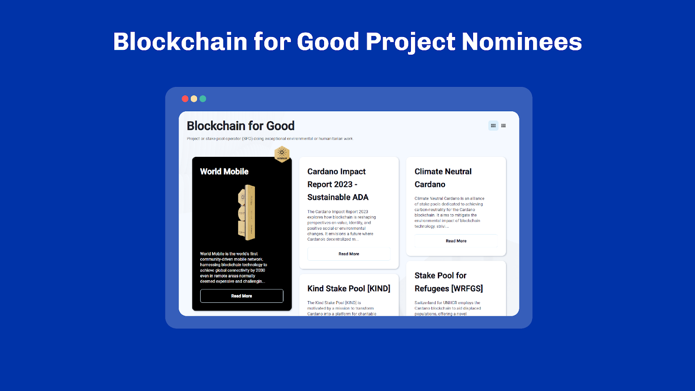

# Unit 7 - Cardano Community
## Learning Objectives

> [!NOTE]
>
> By the end of this unit, you should be able to:
>
> - [x] Understand why Community matters to a blockchain
> - [x] Define the different aspects of Decentralization
> - [x] Understand why 'Community Is Marketing From Within'
> - [x] Understand the role Community plays in Governance
> - [x] Understand what attracted people to Cardano in the early years
> - [x] Understand who the different Community Groups are

## Introduction
Hello everyone, and welcome back. I am your lecturer, [lecturer name], and many thanks for joining me today!

## Table of Contents
In this unit, we’re going to review the Community’s contribution to Cardano’s success.

## Why Does Community Matter?
A vibrant community following provides the oxygen for your project to breathe and grow. When you bring people together around a project, it creates a sense of belonging and maintains progress. When the community really gets behind the project, it's more likely to stay interesting, get ongoing support, and keep going for the long haul. The community's contributions, updates, and growth make sure the project stays relevant and keeps moving forward, even after it starts. By taking a look at aspects such as Decentralization, the Distribution of Power, Network Resilience, and Community Marketing, we can get a good understanding of why forming a community around a project matters.

### Decentralization
Decentralization simply means spreading power, decision-making, and control among multiple individuals or entities instead of having it concentrated in one central authority. It aims to distribute authority and autonomy, promoting a more inclusive and participatory approach to governance and decision-making. Decentralization can be applied in various contexts, such as technology, organizations, or governance systems, to enhance transparency, resilience, and promote a more balanced distribution of power.

### Distribution of Power
When we talk about the distribution of power in decentralization, it means that authority, decision-making, and control are shared among many people or groups instead of being held by one central authority. In a centralized system, one or just a handful of entities has all the power. This can lead to problems like lack of transparency and slow adaptation to change. Decentralization aims to solve these issues by giving power to different participants in a system. Often this is referred to as ‘pushing power to the edges.

Decentralization is founded on the idea of redistributing control among all network stakeholders, ensuring that global networks are defined collectively rather than from a central authority. This approach also strengthens system resilience. In the event of a failure in one part, the entire system can continue functioning due to the distribution of power among multiple participants.

### Network (Security) Block Production and Resilience
In a decentralized network, such as a blockchain, the process of producing blocks is not controlled by a single entity or authority. Instead, it is distributed among multiple community nodes that participate in the network. This decentralization of block production offers several benefits:

Security: In a centralized system, a single point of control can be targeted by malicious actors, making it easier to compromise the entire system. This is often referred to as a ‘single point of failure’. However, in a decentralized network, the distributed nature of block production makes it significantly more difficult for any individual or group to manipulate the process or tamper with the integrity of the blockchain. This increases security and helps to maintain the trustworthiness of the network.

Resilience: By having block production decentralized across multiple nodes, the network becomes more resilient. If one or a few nodes experience issues or go offline, other nodes can continue to produce blocks. This ensures the uninterrupted operation of the network. This level of resilience makes the system less vulnerable to failures.

In Cardano, decentralization is a paramount concern. This is why thousands of stake pool operators help secure the network by running nodes or why even more actors delegate their stake to responsible operators. The community is collectively responsible for the good functioning of the network.

### Community Is Marketing From Within
A strong community amplifies your voice and expands your audience.

Adoption: The community drives the adoption of a project by using it for transactions, advocating for its use, and creating businesses around it. The greater the adoption, the more valuable and useful the project becomes due to network effects.

Network Building: Being part of a community offers a chance to connect with others, expand your network, and potentially partner with projects. These partnerships can open up new opportunities, resources, and markets for you - and even lead to further adoption.

Education: Community plays an important role in educating new and existing users on how to use certain aspects of blockchain technology: wallets, purchases, benefits, risks, best practices, security, and scams. Having a strong community also comes with the benefit that they may also advocate for its use by explaining the value proposition and lobbying for friendly regulations.

Having a strong and engaged community can be a project's biggest supporters and promoters. It can be a real asset. When community members truly believe in the project's value, vision and mission, they'll spread the word and create awareness. Their positive testimonials, reviews, and contributions can give the project a big boost in visibility, reach, and credibility, inspiring others to join the ecosystem.

### Community Offers Collective-Intelligence
It has been said before that Community is an important pillar of each project. In many cases, that is true. This is especially true in a Web3 environment. It is the Community that not only drives the message forward but also helps to contribute to the project's development by offering their collective intelligence for improvements to the system.

In the event certain solutions are absent directly on the base layer, some Community members may even develop solutions of their own for others to utilize. Within the Web3 environment, these solutions can be in the form of tools, sidechains, layer 2 solutions or DApps.

### Community and Governance
Governance refers to the mechanism, processes and rules by which decisions are made. A genuinely decentralized governance model empowers every participant in the network. It grants them a voice and influence over the platform's future development, as well as the emerging applications and services it fosters. This underscores the importance of community involvement in the governance process.

At present, Cardano’s governance is divided along two major axes. The Cardano Improvement Process, known as CIP,  which we will cover in an upcoming unit, steers the boat from a technical standpoint. It is a forum where engineers and product designers debate and come up with reusable technical solutions to common problems.

The other axis is Project Catalyst, an initiative within the Cardano ecosystem aimed at fostering community-driven innovation and development. It serves as an experimental treasury system where Cardano holders can propose projects, vote on them, and allocate community funds to the most promising initiatives. In essence, Project Catalyst is designed to be a democratic governance model that empowers the community to direct the growth and future of Cardano.

Besides, the governance of Cardano is still in its infancy. Efforts such as CIP-1694 aims at introducing more robust and accessible mechanisms into the base protocol specifically for governance.

### Cascading Disruption
Cardano’s focus on a strong community aligns with its primary founding principle of 'cascading disruption'. This is the notion that most of the structures and institutions around us are inherently unstable and ripe for disruption. Emerging, decentralized technologies with community-driven roadmaps, ratified by inclusive on-chain voting, can cause a ripple effect that fundamentally reconfigures and enhances the entire system for everyone.

## Why Cardano?
Cardano, being a third-generation Blockchain, was developed specifically to address the limitations and challenges observed in earlier generations. Additionally, a strong emphasis on academic rigor through research-driven development, peer-reviewed methodologies, and the application of best practices, attracted many people to the project since 2015. In the following section let’s take a look at some of the other attributes of the project’s development that attracted many to Cardano:`

Characterizing Cardano’s bootstrapping earlier days, we can observe several key aspects:

Development and Research - This period was marked by extensive development and research efforts by IOHK (now IOG). The blockchain was being built from the ground up, with a strong emphasis on scientific principles and peer-reviewed research. The team worked diligently to establish a robust and secure blockchain platform.
Foundational Milestones - During this period, significant milestones were achieved in laying the foundation for Cardano. The launch of the Cardano mainnet in September 2017 marked an important step in making the blockchain operational. Additionally, Cardano's native cryptocurrency, ada, was introduced, providing a means of exchange within the ecosystem.

Roadmap with phased approach: Cardano adopted a phased development approach, consisting of distinct phases - Byron, Shelley, Goguen, Basho and Voltaire. This was covered in an earlier unit. Each phase introduced specific features and capabilities to enhance the functionality and usability of the blockchain. A notable milestone was the launch of the Shelley era in 2020, which gradually brought decentralized block production and delegation to the Cardano network.

Community Growth and Engagement: The Cardano Community expanded significantly during this period. We saw the emergence of Cardano YouTubers, content writers, the Ambassador Program, Meetups, the Cardano Summits, Twitter Spaces, and many more community-centered activities and contributions. It's also through many of these engagements that Cardano has solidified its position, amongst others, as a blockchain project with a strong social media presence.

Not Overhyped: During this period, Cardano stood out as a blockchain project that has avoided the pitfalls of overhyping its potential. Throughout its development phases, IOG steadfastly kept to fundamentals and meaningful community engagement. The consistent approach from the development teams had been centered on providing regular updates that primarily focus on education and development progress, rather than resorting to excessive marketing or overhype.

For those of you who have been involved in the Cardano community during its early developmental stages, this commitment to substance over hype is readily apparent. The project’s commitment to laying a solid foundation and fostering a genuine sense of community has helped it earn a reputation as a blockchain project that prioritizes sustainable, organic growth and long-term success over short-term hype.

Focus on Global Financial Inclusion: Cardano's mission to provide financial services to unbanked individuals in developing countries was one of several key motivators for many to become active members of the community. This mission, along with the project's strong emphasis on a research-first-driven approach and the vision of harnessing technology for positive societal transformation, were all factors that attracted people to Cardano.

It was also during this period that we saw the launch of the famous Charles Hoskinson Cardano Whiteboard Video. Inspired by the vision Charles Hoskinson painted in the video, many people decided to become active members of the Community. The whiteboard video is something that is still spoken of today, although some concepts have been implemented differently than originally presented. The strategy outlined is complemented by the original Why Cardano essay which dives deeper into the background, philosophy and inspiration behind Cardano.

 
 

## Community Groups
In this section, we take a look at several Community Groups that have notably helped to shape the course of our ecosystem and our user experience.

For example, in the early stages of Cardano's development, the community faced a challenge due to the limited availability of programming languages, with only Haskell on the Plutus Platform as options. However, driven by their passion for progress, the builder community took action and created alternative programming languages like Aiken and Helios. This expanded Cardano's capabilities and created more opportunities for developers and infrastructure providers to start building their own solutions of applications on the base layer.

### Stake Pool Operators
Another foundation block of the Cardano ecosystem is the Stake Pool Operators who act as infrastructure providers for the blockchain. Stake Pool Operators also provide tooling and support for fellow SPOs and newcomers. These are a group of validators who are responsible for processing transactions and creating new blocks on the Cardano blockchain.

Many have become stake pool operators for various reasons. Some engage in this activity as a hobby. Others pursue it as entrepreneurial ventures, aiming to generate sufficient income to sustain themselves. Still, others have chosen this to (partly) finance their development operations, or to finance a humanitarian cause.

Cardano has one of the industry's most efficient staking mechanisms, with no asset locking, no minimum staking requirements and no slashing penalties. An additional incentive for someone to establish their staking pool comes from the straightforward setup and maintenance process. There are numerous resources in the form of guides and user-friendly tools available, even for those who are less technical.

Within the community, Stake Pool Operators frequently compete to attract delegators and persuade them to delegate their ada to their respective pools. It is also these competitive dynamics among Stake Pool Operators that have contributed significantly to Cardano's reputation as one of the foremost staking platforms in the industry. This shows how Stake Pool Operators, and often also the people delegating to their respective pools, serve as an inherent marketing force for Cardano.

### Blockchain for Good
Cardano's reputation as a 'Blockchain for Good' is largely built on projects and staking pools that aim to make a positive impact. These projects include planting trees, helping with reforestation, providing social housing, offering banking services to those without access and offering internet services to those without. Additionally, there is a project supporting refugees through the United Nations High Commissioner for Refugees (UNHCR) staking initiative. These initiatives showcase how the Cardano community is dedicated to making a difference in various ways, and by doing so upholding the principle of being a ‘Blockchain for Good’.

### Cardano ‘Meetup.com’ Groups
Cardano boasts a vast geographic spread of events organized through ‘meetup.com’. For example, the annual Cardano Summit is watched live around the globe at community events. These community-led events are typically hosted by a community member with support from the Cardano Foundation at a location suggested by the host. For the 2023 Cardano Summit, events took place at diverse locations such as Kinshasa, Kumasi, Banglaore, Hanoi, Seoul, Taipei, Oslo, Vancouver, Ho Chi Minh City and Buenos Aires.

 
 
 
 

### NFTs
A significant portion of the Cardano Ecosystem consists of NFTs (Non-Fungible Tokens) or projects associated with NFTs. These NFT-related initiatives such as the NFT Guild have been able to effectively build a community of enthusiasts around their respective projects by providing supplementary services to NFT holders. Furthermore, some of these projects have taken proactive steps to create a sense of camaraderie among their community members. This is often achieved through regular gatherings on platforms like X (formerly Twitter) Spaces, where members of their respective communities come together to engage in discussions spanning a diverse range of topics.

 

Moreover, several of these projects have extended their commitment to community building by establishing dedicated communication channels on platforms like Telegram or Discord. These channels serve as mediums for community members to connect, share ideas or insights, and receive ongoing support. Collectively, these efforts exemplify how NFT-related projects within the Cardano Ecosystem have successfully harnessed the power of community engagement and interaction to amplify the impact and reach of their initiatives.

 

### Cardano Ambassador Program
The Cardano Ambassador Program, driven by the Cardano Foundation to date, is an initiative created to foster and support the global adoption and understanding of the Cardano blockchain and its associated projects.

 

Cardano Ambassadors are a globally situated network of Cardano aficionados. They drive forward growth, whilst providing various forms of education to their respective communities by hosting and attending events, providing content, managing and monitoring social media channels and more. Cardano Ambassadors work together with the Cardano Foundation, unified by their passion for Cardano and its overarching mission as they endeavor to uphold, represent, and drive the core ideals of the Cardano ecosystem.

## Review
And with that, we are at the end of this unit. We have only really scratched the surface of Cardano's ever-expanding ecosystem. There are other interest groups, and new projects emerge all the time. As it is ever-changing, it is best to check out the ‘showcase’ section of the Developer Portal. Ultimately, as part of the Voltaire era, these numerous groups will come together under guilds, alliances and member-based organizations.

## References
[Ref.10.1] IOHK (IOG) Research Library; IOG, https://iohk.io/en/research/library/ , Accessed: 18 Sep 2023 
[Ref.10.2] IOHK | Cardano whiteboard; overview with Charles Hoskinson, YouTube,   https://www.youtube.com/watch?v=Ja9D0kpksxw , Accessed: 18 Sep 2023 
[Ref.10.3] ‘Why Cardano’ essay from Charles Hoskinson (2017), cardano.org,   https://why.cardano.org/ , Accessed: 18 Sep 2023 
[Ref.10.4] Ecosystem (Programming) Overview, aiken-lang.org,   https://aiken-lang.org/ecosystem-overview , Accessed: 18 Sep 2023 
[Ref.10.5] How IOG’s research spans the academic world, IOG, https://iohk.io/en/blog/posts/2022/10/25/how-iog-s-research-spans-the-academic-world/ , Accessed: 18 Sep 2023 
[Ref.10.6] NFT Guild, https://www.nft-guild.io/ , Accessed: 18 Sep 2023 
[Ref.10.7] Cardano Ambassador Program, Cardano.org, https://cardano.org/ambassadors , Accessed: 18 Sep 2023 
[Ref.10.8] Cardano Developer Portal showcase, Cardano.org, https://developers.cardano.org/showcase , Accessed: 18 Sep 2023 

## Glossary

- *MBO*: A members based organization is a nonprofit organization where membership is made up of people from the same industry, or shared common interests and goals. Members usually (though not always) pay a membership fee in return for access to membership privileges, resources, events, and community support.

## Questions

### Put simply, what does decentralization mean?
1. Centralizing power and decision-making in one central authority
1. Spreading power, decision-making, and control among multiple individuals/groups
1. Keeping all authority restricted to a single person
1. Only focusing on enhancing transparency without distribution of power

See correct answer

2. Spreading power, decision-making, and control among multiple individuals/groups

### Why does decentralization want to distribute authority and autonomy?
1. To ensure that only one individual/group has the final say on decisions
1. To threaten users so that they are more active in the decision-making process
1. To encourage users to take part in making decisions and governing

See correct answer

3. To encourage users to take part in making decisions and governing

### In decentralization, how does spreading power in different parts make a system stronger?
1. By concentrating the power in one part of the system
1. By making sure only one main group decides everything
1. By allowing the system to function even if one part fails 
1. By making it harder for the system to change

See correct answer

3. By allowing the system to function even if one part fails

### What does "pushing power to the edges" mean?
1. Keeping all control in one place
1. Not sharing power but keeping it at the limits
1. Spreading power and decision-making to different parts
1. Making a system less powerful

See correct answer

3. Spreading power and decision-making to different parts

### What does the distribution of power in decentralization imply?
1. That power and control lie only with one central entity
1. That a handful of entities make all decisions
1. That power, decision-making, and control are shared among many participants

See correct answer

3. That power, decision-making, and control are shared among many participants

### Distribution of power is often referred to as ‘pushing power to the edges’.
1. True
1. False

See correct answer

1. True

### Which of the following are key aspects of Decentralization? Select all that apply
1. Block production
1. Development
1. Governance
1. All of the above

See correct answer

4. All of the above

### Analyze the images below and select the correct representation of a decentralized network. (Image Question)

 

1. A
1. B
1. C

See correct answer

2. B

### How does the Community contribute to a project's development in a Web3 environment?
1. By only promoting the project
1. By coming up with suggestions for system improvements
1. By just investing money into the project

See correct answer

2. By coming up with suggestions for system improvements

### If solutions are missing on the base layer in a Web3 environment, what can community members do?
1. Develop solutions like tools, sidechains, or DApps for others to use
1. Only rely on the project's core team for solutions
1. Discourage others from using the project

See correct answer

1. Develop solutions like tools, sidechains, or DApps for others to use

### Which of the following best describes Governance?
1. Getting people out to vote.
1. Enforcing rules on people by force so they comply with the law.
1. Reaching unanimous consensus.
1. The mechanism, processes and rules by which decisions are made

See correct answer

4. The mechanism, processes and rules by which decisions are made

### Select the correct statements about Cardano’s governance.
- [ ] The governance is divided into three axes
- [ ] Cardano’s governance is one of the oldest on blockchain
- [ ] Project Catalyst lets holders suggest, vote on, and fund top community projects through an experimental treasury system
- [ ] Cardano Improvement Proposals provide a forum where engineers and designers discuss and create solutions for common technical issues

See correct answer

- [x] Project Catalyst lets holders suggest, vote on, and fund top community projects through an experimental treasury system
- [x] Cardano Improvement Proposals provide a forum where engineers and designers discuss and create solutions for common technical issues

### What are the axes that Cardano’s governance is divided into?
- [ ] The Cardano Improvement Process (CIPs)
- [ ] The Bitcoin Improvement Process (BIPs)
- [ ] Project Catalyst
- [ ] Project Analyst

See correct answer

- [x] The Cardano Improvement Process (CIPs)
- [x] Project Catalyst

### How are new decentralized technologies with community-driven roadmaps expected to influence structures and institutions?
1. By solidifying the existing structures
1. By causing a ripple effect that reconfigures and improves the system
1. By reducing community involvement in voting
1. By only focusing on individual benefits rather than everyone's

See correct answer

2. By causing a ripple effect that reconfigures and improves the system

### Which aspect helped Cardano solidify its position as a significant blockchain project?
1. Its phased development approach
1. The launch of the Byron era
1. A strong social media presence through community engagements
1. Introduction of a centralized governance entity

See correct answer

3. A strong social media presence through community engagements

### Match the Era with the correct feature/capability used to enhance the functionality and usability of the blockchain. (Image Questions)

- Byron              A - Decentralization
- Shelley            B - Scaling
- Goguen             C - Governance
- Basho              D - Foundation
- Voltaire           E - Smart Contracts

The correct order of features are:
1. 1 = E; 2 = C; 3 = A; 4 = B; 5 = D
 

1. 1 = D; 2 = A; 3 = E; 4 = B; 5 = C
 

1. 1 = B; 2 = C; 3 = E; 4 = A; 5 = E
 

See correct answer

2. 1 = D; 2 = A; 3 = E; 4 = B; 5 = C

### When did the Shelley era launch?
1. 2015
1. 2017
1. 2020
1. 2021
1. 2009

See correct answer

3. 2020

### Which of the following reasons has attracted many people to Cardano? Select all that apply
1. The evidence-based, peer-reviewed approach to software development
1. The use of formal methods and property-based testing to deliver high-assurance software systems.
1. An easy access to consensus participation
1. All of the above

See correct answer

4. All of the above

### Cardano is a ___  generation blockchain. Choose the correct option to fill in the blank.
1. 2nd
1. 3rd 
1. 4th
1. 1st

See correct answer

2. 3rd

### What role do Stake Pool Operators play in the Cardano ecosystem?
- [ ] They provide infrastructure for the blockchain
- [ ] They support fellow SPOs and newcomers
- [ ] They set the price for the ADA currency
- [ ] They are responsible for maintaining the Cardano website

See correct answer

- [x] They provide infrastructure for the blockchain
- [x] They support fellow SPOs and newcomers

### What makes setting up a staking pool in Cardano enticing for newcomers?
1. Access to new resources, guides, and user-friendly tools
1. The guarantee of huge profits
1. A chance to meet with Cardano's founders
1. The offer of free ADA for new staking pools

See correct answer

1. Access to new resources, guides, and user-friendly tools

### How do NFT-related projects in the Cardano Ecosystem strengthen their community engagement?
1. By launching their cryptocurrency
1. By establishing communication channels on platforms like Telegram/Discord
1. By conducting weekly offline meetups
1. By promoting competitive dynamics among members

See correct answer

2. By establishing communication channels on platforms like Telegram/Discord

