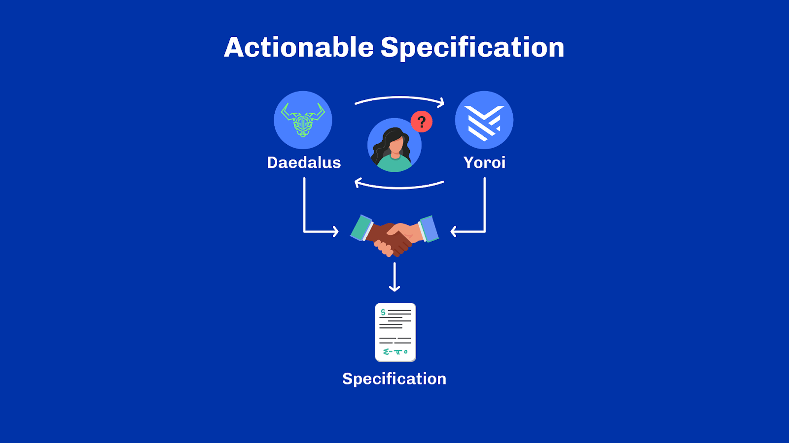
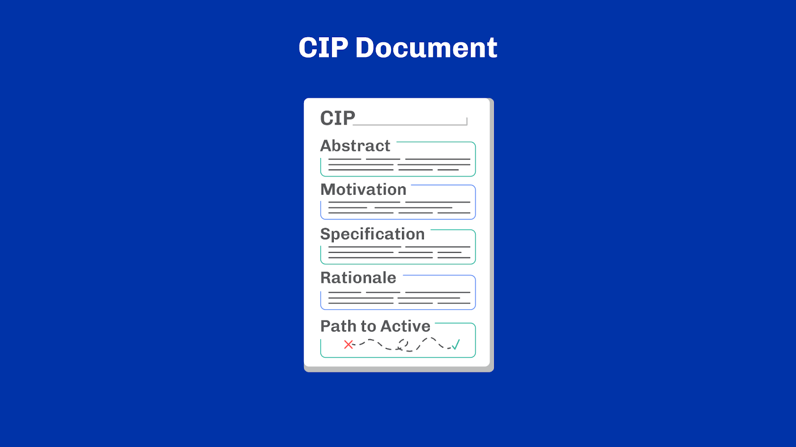
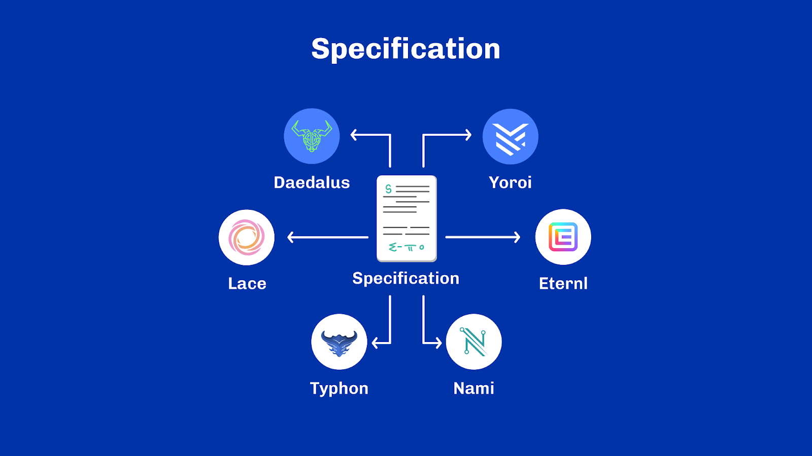
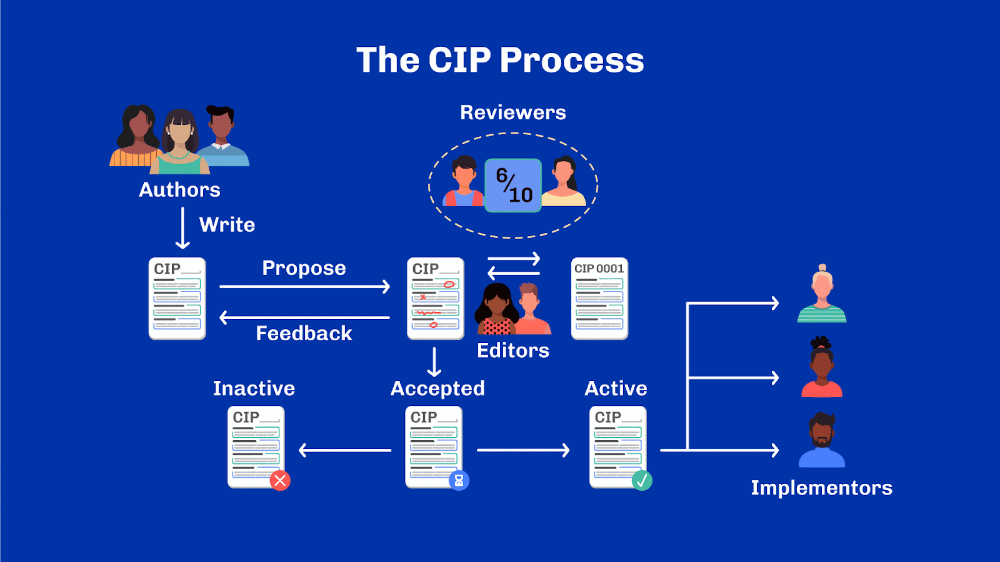
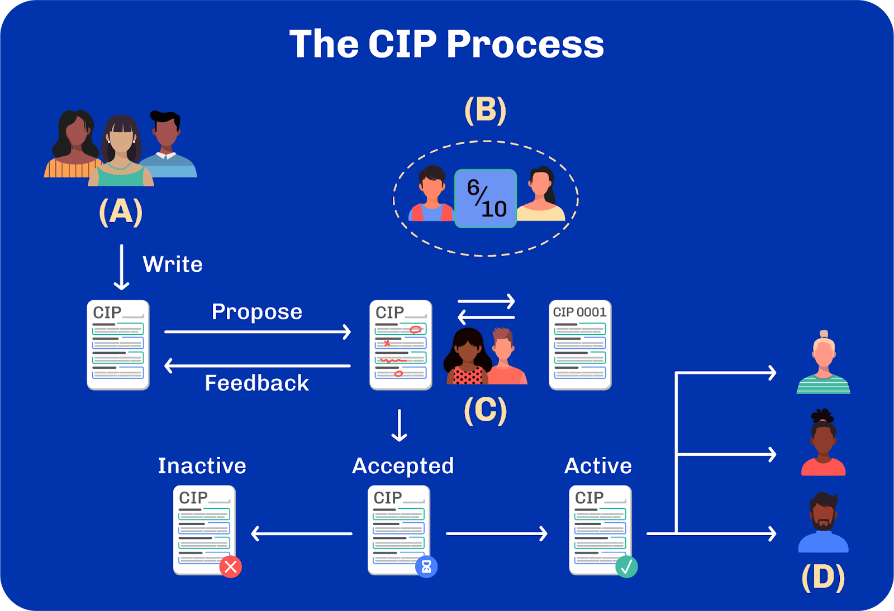

# Unit 8 - Cardano Community

## Learning Objectives

> [!NOTE]
>
> By the end of this unit, you should be able to:
>
> - [x] Enumerate the major sections of a CIP document
> - [x] Explain roughly how the CIP process works
> - [x] Understand the actors involved in the CIP process and their role
> - [x] List a few major CIPs with their impact on the Cardano ecosystem

## Introduction
Welcome, everyone. My name is [lecturer name], and I'll be your host for this new unit about Cardano Improvement Proposals, known as CIPs.

## Table of Contents
We've mentioned CIPs a few times during the course. By now, you should have figured they are an essential part of Cardano. But what are CIPs exactly, and how did they come to be? This is what we'll explore in this unit.

## History
To get started, let's go back in time to the early days of Cardano. Yoroi and Daedalus are the two only wallets available. The former is being developed by EMURGO and the latter by IOHK. Users want, rightfully, to use them interchangeably. If a transaction is made from Yoroi, it should be visible on Daedalus. If Daedalus generates a new address, it should also work and be discoverable on Yoroi. And vice-versa. After all, they're both connected to the same blockchain. The secret credentials that wallets use underneath are, however, not on the blockchain. They are securely stored in each wallet. So, how does one ensure that both wallets use them in a compatible manner?

The short answer is: we talk.

But talking only gets people so far. At the end of the day, we need an actionable specification that both wallets can follow. With actionable specification, we mean a formal document that can serve as clear instructions to develop a software component. Once a specification is available, it also means that a 3rd compatible wallet is now possible. When the specification is done right, there is no ambiguity in it. As a result, there isn't even any need for wallets to coordinate. Incidentally, when a specification is used by several tools, it is also called a standard.

### The First CIP
Therefore, the very first CIP was created to document everything regarding the management of keys and addresses between Cardano wallets. Today, this CIP is referred to as 'CIP-1852'. It specifies how wallets should go from a long recovery phrase to addresses. We talked about that in the unit about addresses. Technically, this document existed even before the CIP process was formalized. Nevertheless, it was the starting point of the entire discussion.

## The CIP Document
CIP stands for 'Cardano Improvement Proposals'. Similar concepts exist for other blockchains, such as the Bitcoin Improvement Proposals (BIPs) or the Ethereum Improvement Proposals (EIPs). While all these blockchain Improvement Proposals have similarities, they also work quite differently.

So what exactly is a CIP? A CIP is a formalized and structured document presenting a solution to a common problem. This is a broad definition, but it captures the idea well. It's a proposed solution to a problem. Note that a problem may have multiple solutions with different trade-offs. A CIP is a document meant to capture those subtleties.

It is structured in different sections which highlight different information. Let’s have a look at the content of a CIP.

### Abstract
Every CIP starts with an abstract. It summarizes what problem the CIP is trying to solve and how it achieves it. It's usually meant as a short description to capture the essence of the CIP.

### Motivation
The second section is perhaps the most important of a CIP. It explains why a solution is necessary to begin with. It frames the problem, provides use cases, and gives context. Often enough, humans tend to jump to conclusions and propose solutions to poorly defined problems. To mitigate against this and ensure that a conversation can happen on a sound basis, the motivation section of a CIP provides all hypotheses that help understand the problem being solved.

### Specification
Then comes the specification, which is the core of the CIP. It informs about how to solve the problem stated as motivation. It specifies interfaces, formats and steps required to adopt the solution. Interestingly, some CIP solutions can be stated in a single line, whereas their motivation is much longer to articulate. A CIP's specification must, however, be as precise as possible. Ideally, someone stumbling across a CIP should have all the necessary information to implement the described solution.

More importantly, two implementers should end up with compatible solutions should they follow the exact specification. Of course, this is quite a utopian view of reality. Specifications are often refined several times in practice, and precisions are added as questions arise. What is clear for one person isn't necessarily clear for another.

Using formalization helps to reduce ambiguity. Diagrams, schemas, type systems, formal languages and mathematical notations are, therefore, quite common in CIPs. Often, a diagram is far less ambiguous than any amount of words.

### Rationale
Following the specification, a CIP must explain some of the design choices made to address the problem and explain how these choices are pertinent to the use cases. This section is referred to as the 'Rationale' of a CIP, and it connects with the motivation and the specification. This section is also an excellent place to expand on security or scaling considerations and answer questions the reader may ask herself.

### Path to Active
The final section explains how a CIP becomes final. We'll learn about the CIP process shortly. For now, it's sufficient to know that a CIP goes through different states. The final state of a CIP is called 'Active'. What it means for a CIP to be 'Active' depends on the solution itself.

Sometimes, it means that the solution has been implemented in a particular piece of software and that software has been deployed to production. Other times, it means multiple actors in the ecosystem follow a particular standard. Or else, a CIP is just informational and provides guidelines about a particular topic. In that case, no further work is required. As such,  it is hard to come up with one global definition that applies to all CIPs. Instead, each CIP includes a set of criteria it must meet to become active. This way, the criteria are tailored to the context and use cases pertaining to that CIP. When relevant, the 'Path to Active' section also contains an implementation plan that gives further details on how the solution can be implemented -- rather than what the solution is.

## The CIP Process
We have covered the documentation for the CIP.  But, how do CIPs come to life? How are they initiated, reviewed and finally implemented? As we said, a CIP is a document, so one of the first steps is the creation of the document. Once drafted, even partially, it is submitted to the CIP repository, currently hosted on Github under the Cardano Foundation namespace. The CIP repository contains all CIPs in existence in various states. Submitting a CIP to the repository means opening a pull request, which is Github's term for submitting a change to an existing set of documents. At this point, the CIP is said to be a draft and is open for community reviews.

The review is a crucial part of the CIP process. This is where a proposed solution is challenged by the community. Though anyone can be a reviewer, due to the nature of CIPs, they are usually engineers, researchers or product owners working on technical solutions. People with similar problems may have more substantial incentives than others to participate in the discussion, adding use cases and shaping a solution to fit more use cases. Often, CIPs are co-authored by multiple people or a working group organized around a specific topic. In parallel with the community review, CIP editors also provide their feedback on the structure of the CIP itself. CIP editors are the guardians of the CIP process; they ensure that every CIP abides by the structure we just explained. They suggest how to present the content and help organize discussions around CIPs. Often, editors will contact people from the ecosystem who may be interested in joining the conversation and encourage them to contribute. They also assess the overall quality of the document and whether it contains sufficient detail.

Once a document is deemed ready and has undergone enough discussions, it is officially added to the repository as a 'proposed' CIP. If a CIP is abandoned, it is discarded and marked 'inactive'. To transition from proposed state to the final state, 'active', a CIP must demonstrate it satisfies its acceptance criteria defined in the path to active section. Note that the content of this section is part of the review, so the community collectively decides what is deemed sufficient for a solution to be considered 'active'. Henceforth the CIP remains in the catalog of available solutions indefinitely or until it is superseded by a new one.

## The CIP Actors
To ensure we fully understand how the CIP process works, let’s delve into the different actors involved.

### Authors
The first group are CIP authors. Those are people writing CIPs and proposing it as a potential solution. Authors can be individuals, working groups or companies interested in seeing something standardized or explained to a wider group.

### Implementers
Some CIPs will require action in the form of software implementation. Often, authors and implementers may be different groups. This is the case, for example, in some areas of Cardano like Plutus. The Plutus platform is maintained by a team of people employed mainly by Input Output Global. Yet, they welcome suggestions and ideas in the form of CIPs. Developers working on the Plutus Platform regularly formulate feature requests through CIPs. Similarly, the Plutus core team now publishes major changes to Plutus as CIP first. This way, most Plutus evolutions are discussed in the open and captured in well-structured documents.

### Reviewers
Reviewers are also key to the process. They read and assess proposals from authors. Reviewers come from various backgrounds, and the vast majority are ecosystem builders with their own applications and bias. This creates a healthy forum where different perspectives are captured in CIPs.

### Editors
Finally, editors are the guardians of the CIP process and ensure that the process is properly followed. Anyone can become an editor, provided they have been participating in the CIP process long enough. So editors are de-facto well-known community members who've been around for a while and help keep the process in place. Editors essentially keep the lights on! They cover everything from managing proposals, questions and mediating discussions between reviewers or authors, which can sometimes get quite heated.

One crucial detail to bear in mind is that none of those groups are mutually exclusive. People can and do wear multiple hats, switching from one week to another. For example, Alice may propose a CIP one day and review Bob's proposal on the next. Editors themselves are often CIP authors, implementers and/or reviewers. There's,  almost, no set rule about the role a person can assume in the CIP process.

## Notable CIPs
There are over a hundred CIPs today which cover various areas of the ecosystem. Some have generated more discussions than others and have substantially impacted the ecosystem as we know it today. Before we conclude our tour of Cardano, let's look at a few of these notable CIPs.

### CIP-0001
The first is CIP-0001. This CIP defines the CIP process itself. Yes, CIPs are recursively defined using CIPs! The process itself has even evolved over time and is entirely captured with great detail in CIP-0001. If we go into Github we can see CIP-0001 and the different sections in a CIP. At the top we have the abstract, followed by the motivation, specification, rationale and path to active. You can view all the CIPs we will cover in this section, and much more on GitHub.

### CIP-9999
An extension to CIP-0001 is CIP-9999 (reads CIP minus 1). This proposal defines a new type of document called CPS: Cardano Problem Statements. CPS is an extended and more detailed version of the 'Motivation' section of CIPs. They are typically used in one of two situations:

1. When someone has a well-defined problem and use cases but no solutions.
2. When a CIP's motivation is sufficiently complex, it deserves more structure offered by a CPS.

The first case is quite common, especially for problems spanning multiple parts of the ecosystem simultaneously. Sometimes, a solution only captures part of a bigger problem, so it is helpful to see the big picture in the form of a CPS.

### CIP-0025
Then comes one of the most discussed and used CIP: CIP-0025, outlining the first NFT standard for Cardano. CIP-0025 defines a structure and the rules for attaching metadata to an on-chain token. This is crucial to allow projects to be discoverable by other tools, such as wallets or explorers, without explicitly coordinating with every ecosystem actor. Today, millions of NFTs have been minted on Cardano following this standard.

### CIP-0030
Speaking about influential proposals, we cannot talk about CIPs without mentioning CIP-0030: the Wallet-DApp bridge. This CIP is at the heart of every single interaction between decentralized applications, DApps, on the network and Cardano wallets. In a way, you can think of it as a generalization of a wallet interface like Metamask. This allows DApps and wallets to communicate with one another, without requiring any integration work. For a DApp, it suffices to implement CIP-0030 to be instantly compatible with all wallets also implementing it. For wallets, it suffices to support CIP-0030 to be instantly compatible with all DApps of the ecosystem. How neat!

### CIP-0068
Let's go back to the lands of assets for a second, and talk about CIP-0068. To some extent, CIP-0068 is the descendant of CIP-0025. It is not just an iteration to define a better NFT standard, but a better one for any kind of asset altogether. Fungible tokens, non-fungible tokens and rich-fungible tokens are captured within the proposal. More importantly, CIP-0068 leverages features introduced later in Cardano to make token metadata programmable in a trustless setting -- which wasn’t possible with CIP-0025. While more complicated than CIP-0025, the flexibility and expressiveness of CIP-0068 has rapidly made it a well-established standard in the ecosystem.

### CIP-0057
The advent of alternative programming languages to Haskell for Cardano smart contracts needed more alignment. CIP-0057, also known as the Plutus blueprints, stemmed from the need to make smart contract languages more interoperable. The standard defines a schema language used to document the binary interface of on-chain validators. With this, it became possible to decouple on-chain and off-chain logic entirely. It also made smart contracts more easily discoverable and usable by external applications such as wallets.

### CIP-0031, CIP-0032, CIP-0033
It would be a shame to talk about CIPs without mentioning CIP-0031, CIP-0032 and CIP-0033. Those CIPs describe solutions to three different problems but are intrinsically linked. They were proposed and implemented around the same time. They refer to reference inputs, inline datums and reference scripts, respectively: three significant upgrades to Cardano shortly after the launch of smart contracts. Besides the importance of the changes themselves, those CIPs are also amongst the first to discuss design evolutions of the Cardano ledger and its smart contract system in the open. Before that, most design decisions would be taken unilaterally by Input Output, the leading software company behind developing the Haskell node. These three CIPs mark the beginning of a major step towards decentralizing the development and open-sourcing of the core Cardano components.

### CIP-1694
Finally, to conclude, we must speak about the most debated CIP ever. If you've been around the Cardano ecosystem in 2023, you will undoubtedly have heard of CIP-1694: Cardano's on-chain governance initial design. CIP-1694 defines the mechanisms to equip the protocol for governance. It is an essential milestone in the Cardano roadmap and has greatly expanded outside the CIP process. In the course of 2023, there have been multiple workshops around the world and countless work streams fueling feedback into the proposal. Hundreds of individuals have been involved in its design, and it is notably the most active CIP of the ecosystem. Rightfully so.

## Review
This concludes our exploration of the Cardano Improvement Proposals. We learned how CIPs are structured documents proposing solutions to common problems of the ecosystem, as well the peer-review process which matures them into existence. We looked at the different actors involved in the CIP process and finally, went on a little adventure through some of the most impactful CIPs. I hope you enjoyed this journey as much as I did.

## References
CIP-0001
CIP-9999
AdaPulse: Cardano Improvement Proposals, a closer look.

## Glossary
Term
Definition
Cardano Improvement Proposal (CIP)
A CIP is a formalized and structured document presenting a solution to a common problem

## Questions

**Sub-Unit 1**

- *In the context of actionable specification, what does a standard refer to?*
- When a specification is used by only one tool
- **When a specification is used by several tools (CORRECT ANSWER)**
- When a specification is used by no tools

*A CIP is, first and foremost:*
- A statement of work
- **A proposed solution to a common problem (CORRECT ANSWER)**
- An implementation plan
- A grant proposal

**Sub-Unit 2**

*What is the purpose of an abstract in a CIP?*
- It provides different use cases as examples of the same problem
- It recaps other recent CIPs.
- **It summarizes the problem and how it will be solved (CORRECT ANSWER)**

*Which of the following statements is NOT true regarding the motivation section in a CIP?*
- **It explains why a solution is necessary (CORRECT ANSWER)**
- **It provides all hypotheses that can solve the problem (CORRECT ANSWER)**
- It explains all the reasons why the possible solution won’t work
- **It provides use cases (CORRECT ANSWER)**

*Select the correct statements about specifications in a CIP.*
- Once a specification is created, it is never refined
- A specification can be seen as a rough draft and does not need to be precise
- **It specifies interfaces, formats and steps required to adopt the solution (CORRECT ANSWER)**

*How do formalisations such as diagrams and mathematical notations contribute to CIPs?*
- They ensure that the specification can be stated in a single-line
- **They help to reduce ambiguity and enhance clarity (CORRECT ANSWER)**
- They are optional and rarely used in CIPs

**Sub-Unit 3**

*What type of considerations can be expanded on in the Rationale section?*
- Economic and marketing considerations
- **Security and scaling considerations (CORRECT ANSWER)**
- Graphical and user interface design
- Background history and previous versions of the CIP

*What does the Active state signify for a CIP?*
- It has been discarded as irrelevant
- **It has reached its final and operative state (CORRECT ANSWER)**
- It is waiting for more feedback from the community

**Sub-Unit 4**

*What is the primary role of CIP editors?*
- They review CIPs and make sure that only good ideas are accepted
- They write CIPs
- **They ensure CIPs follow the CIP process and go under enough scrutiny from the community (CORRECT ANSWER)**
- They translate CIPs into various languages

*Analyze the CIP process below and select the correct missing labels (IMAGE QUESTION).*

- A: Reviewers; B: Implementers; C: Editors; D: Authors
- A: Editors; B: Authors; C: Reviewers; D: Implementers
- **A: Authors; B: Reviewers; C: Editors; D: Implementers (CORRECT ANSWER)**

*True or False: CIP are technical documents mainly discussed by software engineers, mathematicians and researchers?*
- **True (CORRECT ANSWER)**
- False

**Sub-Unit 5**

*True or False: CIPs are necessarily implemented by their authors?*
- True
- **False (CORRECT ANSWER)**

*What is the role of reviewers in the CIP process?*
- To write and submit new proposals
- To finance and fund CIP projects
**To read and assess proposals from authors (CORRECT ANSWER)**

*In a CIP, why is it beneficial to have reviewers from various backgrounds?*
- It ensures that the CIPs are financially viable
- It helps in the marketing of the CIPs to a broader audience
- **It creates a forum where different perspectives influence CIPs (CORRECT ANSWER)**
- It slows down the implementation of CIPs, making it a more exhaustive process

**Sub-Unit 6**

*What does CPS stand for?*
- Cardano Proposed Solution
- Cardano Possible Solution
- Cardano Problem Solved
- **Cardano Problem Statement (CORRECT ANSWER)**

*When is a CPS typically used?*
- Only when a problem cannot be defined clearly
- **When a problem is well-defined with clear use cases but lacks solutions (CORRECT ANSWER)**
- **When a CIP's motivation is sufficiently complex (CORRECT ANSWER)**
- For documenting the financial aspects of a CIP

*What is the purpose of CIP-0030 in the Cardano ecosystem?*
- It sets the rules for mining Cardano cryptocurrency
- **It serves as a bridge for communication between DApps and Cardano wallets (CORRECT ANSWER)**
- It defines the standards for Cardano's physical wallet production
- It is a guideline for the manual transaction process between users

*What is the advantage for DApps to implement CIP-0030?*
- They can bypass the Cardano network's transaction fees
- **They can automatically work with any wallet that also uses CIP-0030 (CORRECT ANSWER)**
- They receive special development funds from Cardano's treasury

**Sub-Unit 7**

*True or False: more than one proposal exists to standardize NFT on Cardano?*
- **True (CORRECT ANSWER)**
- False

*Why was CIP-0057, or the Plutus blueprints, introduced for Cardano?*
- **To align the development of alternative programming languages for smart contracts (CORRECT ANSWER)**
- To document the financial transactions within Cardano's blockchain
- To increase the transaction speed of smart contracts on Cardano

*Why are CIP-0031, CIP-0032, and CIP-0033 considered significant in the context of Cardano?*
- They were the first CIPs ever proposed for Cardano
- They represent the centralization of the Cardano development process
- **These three CIPs marked the beginning of a major step towards decentralizing the development and open-sourcing of the core Cardano components (CORRECT ANSWER)**
