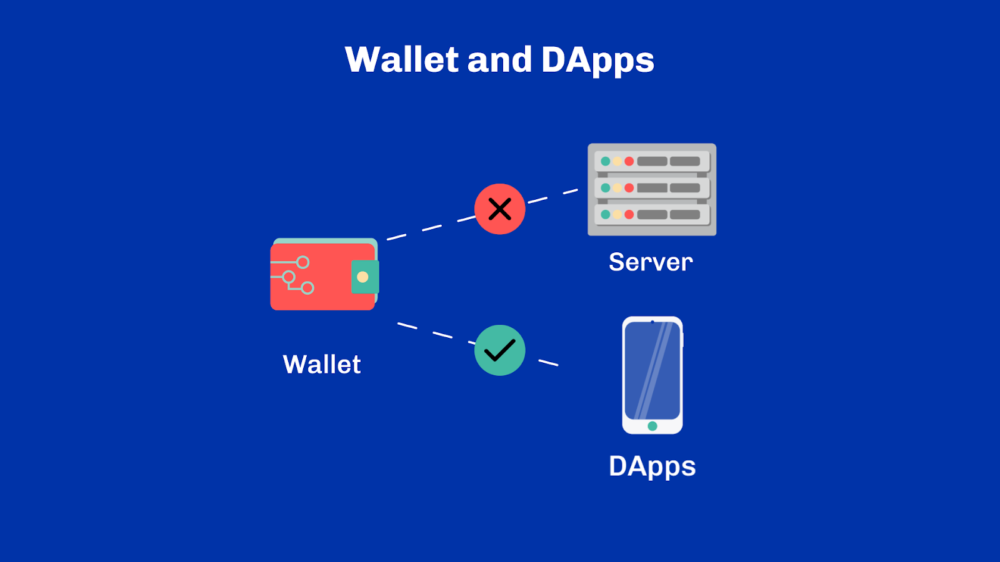
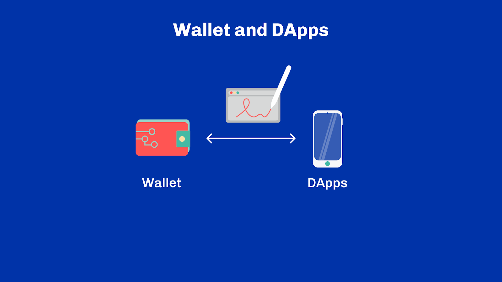
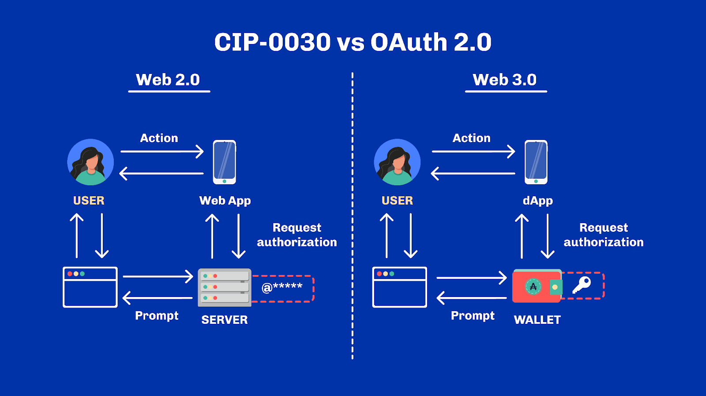
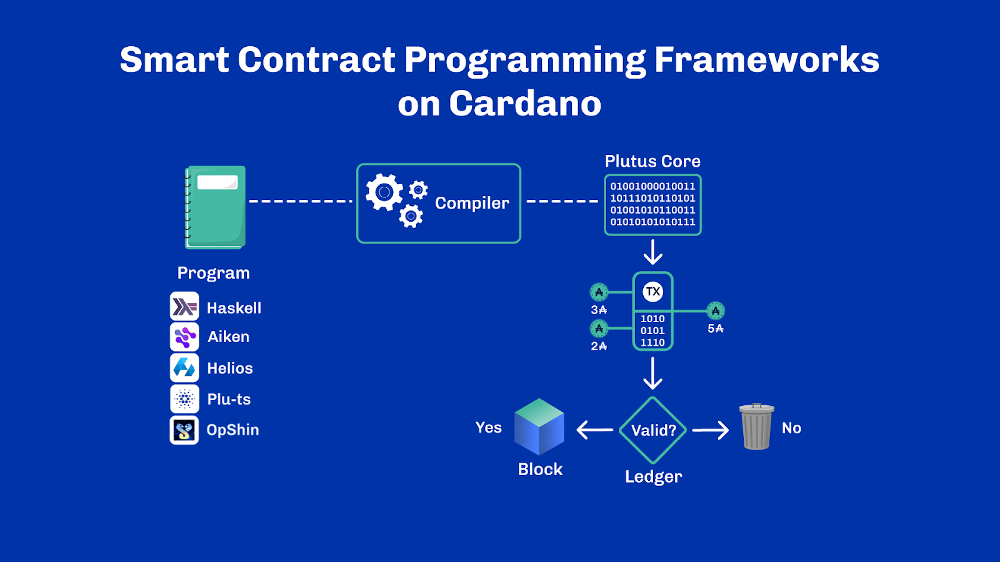
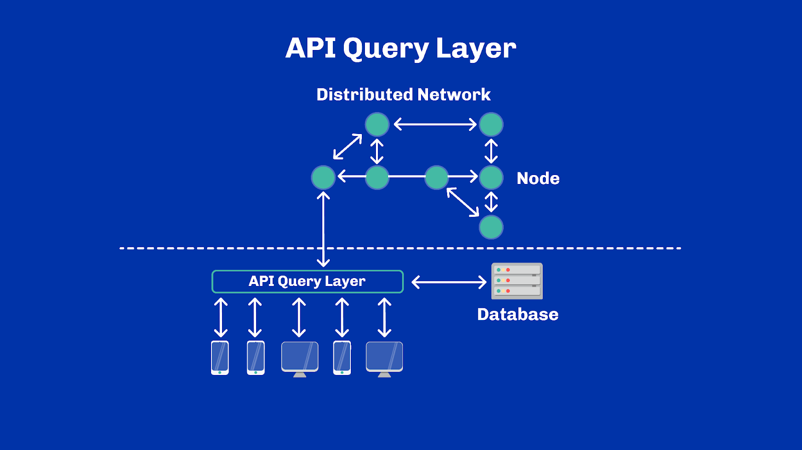
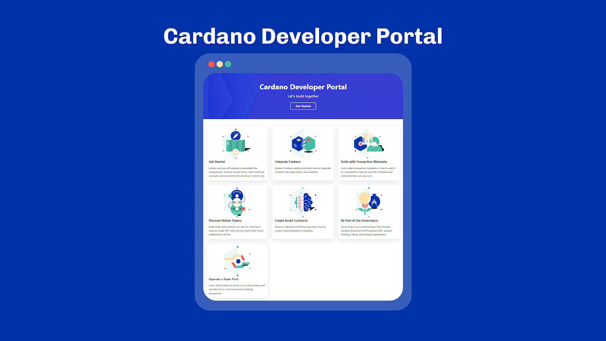
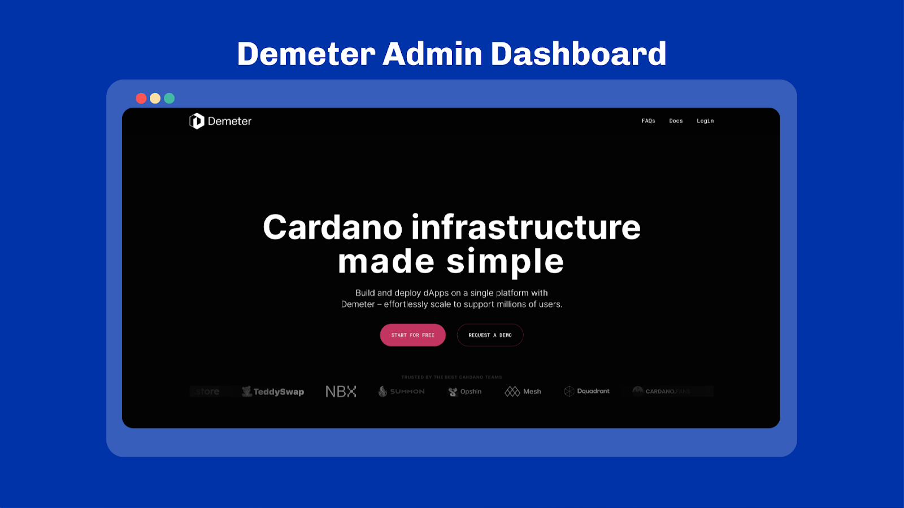
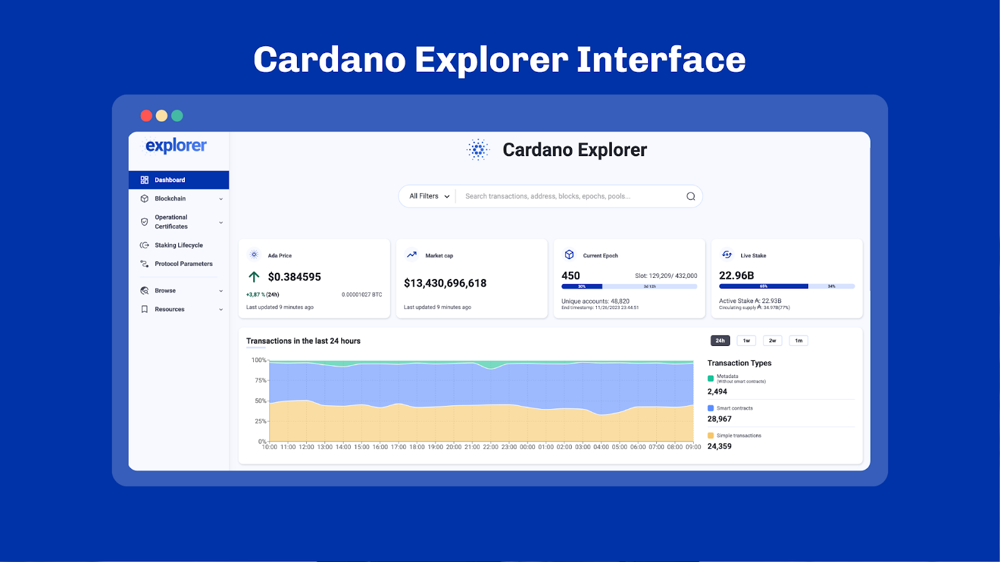
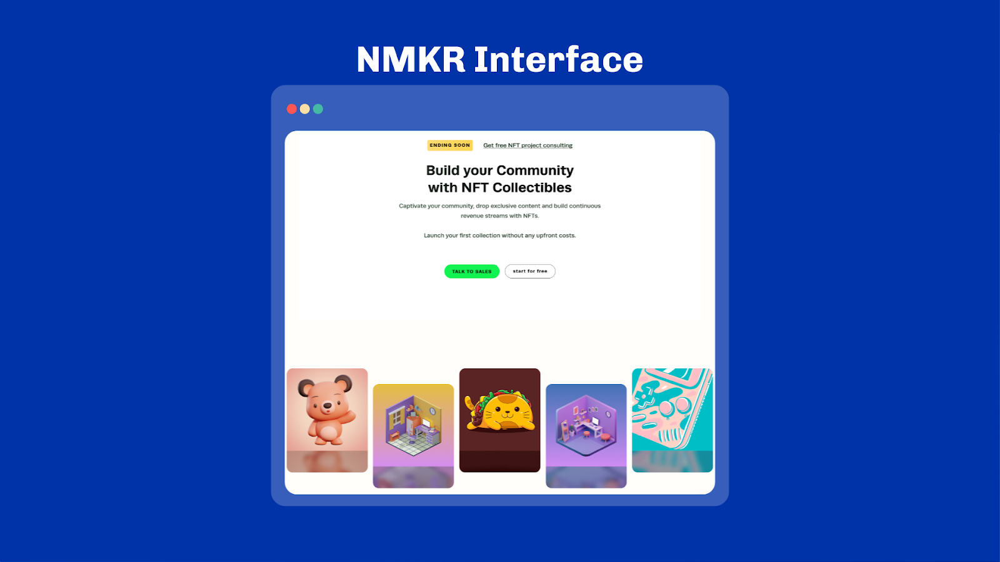

# Unit 1 - Builder Ecosystem Overview

## Learning Objectives

> [!NOTE]
>
> By the end of this unit, you should be able to:
>
> - [x] be able to understand how wallets and dApps interact
> - [x] have heard about Cardano Improvement Proposals (C.I.P.)
> - [x] know available programming frameworks in Cardano
> - [x] be able to understand what an API query layer does and know some of the popular options available in Cardano
> - [x] be able to explain what Demeter is and when it could be used
> - [x] know about popular explorers available in Cardano
> - [x] have heard of NMKR and what it is used for

## Introduction
Welcome everyone. My name is [lecturer name] and today, we’ll explore the Cardano builder ecosystem at large.

## Table of Contents
By the end of this unit, you should have a good understanding of how Cardano Web 3.0 is articulated behind the scenes and what is available to projects building on Cardano.

## Wallets and DApps Interactions
Let’s get started. In previous units, we’ve seen how wallets are like keyrings. They keep user credentials safe and they authorize transactions through digital signatures. We also said that in non-custodial wallets, credentials were never handed over to a remote service or some online server. They are kept on the user’s device. So, how does this work in practice? By what means can a dApp request a signature from a wallet or, be aware of how much funds a user owns? The answer is simple: through a standardized bridge.

 
 

In fact, this is a perfect moment to briefly introduce the Cardano Improvement Proposals, or C.I.P. in short. CIPs are formalized technical documents associated with a peer review process and identified by a number. They are a collection of agreed-upon solutions to common problems of the ecosystem. Many blockchain ecosystems have a similar process, such as the Bitcoin Improvement Proposals (BIPs) or the Ethereum Improvement Proposals (EIPs). While they may differ in the exact process and structure, they usually have the same goal: help standardization and interoperability within an ecosystem. Improvement proposals are a large enough topic to deserve their entire unit.

We will do this in due time, but for now, let’s - focus on a particular one: CIP-0030, the wallet / dApp bridge.

This proposal describes a browser interface that sits between wallet providers and dApps. For a wallet, it specifies what functionality must be made available and how it can be used. For example, the interface specifies a method for signing transactions. On the other hand, dApps can rely on this interface to make use of the necessary functionality. More importantly, wallets and dApps never have to directly integrate with one another. In fact, dApps can work with any wallet that implements the interface, and vice versa.

You may have heard of Metamask in the Ethereum ecosystem. If you haven’t, Metamask  is a popular solution for interacting with dApps. With Metamask you are restricted to a particular wallet – Metamask itself, while with CIP-0030 the ecosystem isn’t tied to one particular wallet. In fact, CIP-0030 can be seen as a generalization of Metamask: an interface that can be satisfied by many wallets.

To help the understanding, let’s take this one step further and compare CIP-0030 with Web2. It is similar to OAuth, the protocol used to “connect with” various service providers on websites in Web2.

 

CIP-0030 is one of the main reasons why Cardano has so many wallets available, which is great for decentralization. Users can rely on different providers. They have the flexibility to switch between multiple wallets depending on which one they prefer for a given activity. There exist several extensions on top of CIP-0030 that are supported by wallets at their own discretion. This allows extending the initial set of functionality to accommodate the ecosystem evolutions.

As a user, you probably won’t deal with CIP-0030 directly, as this will be completely transparent to you via user interfaces. As a builder, however, this is likely something you will encounter. Either way, it is good to understand how this works behind the scenes.

Let’s briefly recap to make sure the concept sinks in. DApps and wallets are programs that typically run on the same platform. For example, on your desktop machine, or in a browser. Platforms provide ways for programs to send messages to one another. On the browser, these messages have been standardized and described as CIP-0030. This standard permits the decoupling of dApps and wallet programs by forcing them to use well-defined communication patterns. While both wallets and dApps may be connected to some online servers for other functionality, the communication between dApps and wallets happens entirely on the user’s device through the means provided by the browser.

## Smart Contract Programming Frameworks
We’ve just seen how wallets and dApps interact. But what about dApps and the blockchain itself? Let’s explore this by dividing it in two: on-chain and off-chain interactions. Or said differently, how dApps can instrument the ledger to perform validations on their behalf as part of the consensus protocol (i.e. on-chain), and how dApps can construct transactions and react to events they observe on the network (i.e. off-chain).

Most blockchains, if not all, provide some form of programmability. For example, Bitcoin has a scripting language called ‘Script’. Script provides basic programming capabilities with specific and limited operations; though powerful enough to enable complex solutions to be built atop.

On Cardano, programming capabilities are provided via the eUTxO model, and more specifically, the Plutus framework. The Plutus platform encompasses multiple parts: an on-chain language called Plutus Core, an execution engine, a Haskell framework and a compiler plugin that turns Haskell code into Plutus Core. The Cardano ledger can thus execute smart contracts in the form of compiled code to perform extra validation on transactions.

Over time, different community-led efforts have given birth to alternative solutions to the Haskell framework. All will ultimately produce Plutus Core and make use of the underlying execution engine of the Cardano ledger. This is the case of Aiken, Helios, Plu-ts or OpShin which are frameworks that provide an alternative to Haskell for programming on Cardano. Frameworks have different trade-offs and goals. Yet once again, the Cardano community shines with its ingenuity and capability to provide many options to builders.

 

## API Query Layers
Ready for the next topic? Let’s have a quick look at some major API query layers on Cardano. But first, let me explain what an API query layer is. As we’ve previously seen, API stands for Application Programming Interface and it is a term that encompasses many concepts.  Usually, though, developers talk about API when referring to the interface of a backend service. Said differently, it describes the methods and data objects available that a client application can compose with. To give a real-life example, Spotify provides an API to list artists, their discography, and their relation to specific users. The API can answer questions such as whether a user liked an album, or if a user follows a particular artist.

Hence, an API query layer is an online service that provides some data access to a particular domain. In our context, that domain is the Cardano chain.

Such services can typically answer questions such as “What transactions were sent on May the 4th 2023?” or, “What tokens are owned by this address?” or “What are the current protocol parameters?” etc. On Cardano, Blockfrost is one of those major services that has helped hundreds of projects to launch. It comes with a variety of software development kits (a.k.a. SDKs) to facilitate integration.

Koios is another such service which provides an elastic layer. By elastic, we mean that it can automatically scale by adding more providers to it. Koios is entirely provided by community members and is akin to an open network. Queries from client applications are automatically routed to one of the service providers.

Last but not least, Maestro is the new kid on the block. It is an all-in-one Web 3 platform which offers a query layer and a transaction manager for dApps developers. Pretty neat.

 

## Demeter
Sometimes, an API query layer may not be suitable for your business. This may be because the usage cost is too high, or because it sits at an abstraction level that is too high. But all is not lost. There exists a multitude of tools and services at your disposal.

The majority of them are referenced on the Cardano Developer Portal which should rapidly become your go-to place if you’re a Cardano builder.

 

Such tools and services can then be self-hosted and deployed according to one’s business needs. But they can also be hosted on your behalf through cloud providers such as Demeter.run. Think of it as AWS or Google Cloud, but specialized to Cardano. Demeter provides commercial workspaces and everything needed to start coding or hosting services in only a few clicks. It offers a great developer environment, as well as an effective deployment solution. A must-know for any project launching on Cardano.

 

## Explorers
That’s a lot to digest, I know, but we’re almost there. Let’s leave the developer-specific ecosystem and look at less technical options for the least tech-savvy amongst us. We have already mentioned explorers in previous units, and they are an indispensable part of any blockchain ecosystem. Explorers provide user-friendly interfaces, usually web-based, to explore the data on-chain in real-time. Cardano features some great explorers such as the Cardano Foundation’s Explorer, CardanoScan, CExplorer and Pool.pm.

Explorers typically work across multiple networks. So even data from test networks are accessible. That’s neat! Explorers are usually built on top of tools that we presented earlier. They often come with synthetic views of the networks and dashboards to help make sense of the chain activity. While they overlap on a number of functionalities, they each specialize in some areas to offer deeper insights. Pick your favorite, or use them all interchangeably, there’s no rule.

 

## NMKR
Finally, we cannot do a review of the builder ecosystem without covering NMKR. NMKR is a high-level solution for creating and selling NFTs on Cardano. It features a user-friendly studio for those who prefer the comfort of a web UI, as well as a developer API for the more daring ones.

In summary, NMKR is a platform for anything around the creation and management of NFTs. It has a range of features from airdrops, payment checkouts, invoicing to decentralized identifiers and much more. If you are looking for a smooth onboarding and a long-term experience in the ecosystem regarding NFTs, NMKR is definitely a good place to start.

 

## Review
And we’ve reached the end of this unit. I hope you enjoyed learning a bit more about the builder ecosystem on Cardano, and understand how the different pieces fit together behind the scenes.

Tools and services evolve over time, so always check online for what’s available today. The community-maintained Cardano Developer Portal at https://developers.cardano.org lists all the major tools and libraries to get started with Cardano and provides extensive technical information for developing on Cardano.

Check it out! See you next time.

## References
- Cardano Improvement Proposals - https://cips.cardano.org/
- CIP 30 - Cardano dApp-Wallet Web Bridge - https://cips.cardano.org/cips/cip30/
- Bitcoin Script - https://en.bitcoin.it/wiki/Script
- Aiken - https://aiken-lang.org/
- Helios - https://www.hyperion-bt.org/helios-book/
- Plu-ts - https://www.harmoniclabs.tech/plu-ts-docs/index.html
- OpShin - https://opshin.dev/
- Blockfrost - https://blockfrost.io/
- Koios - https://www.koios.rest/
- Maestro - https://www.gomaestro.org/dapp-platform
- Cardano Developer Portal - https://developers.cardano.org/
- Demeter - https://demeter.run/
- Cardanoscan - https://cardanoscan.io/
- CExplorer - https://cexplorer.io/
- Poolpm - https://pool.pm/
- NMKR - https://www.nmkr.io/

## Glossary

- *Cardano Improvement Proposal (C.I.P.)*: Cardano Improvement Proposals are formalized technical documents of agreed-upon solutions to common problems of the ecosystem.
- *Application Programming Interface (API)*: API refers to the interface of a backend service. It describes the methods and data objects available that a client application can compose with.
- *API query layer*: API query layer is an online service that provides some data access to a particular domain, such as the Cardano chain.

## Questions

**Sub-Unit 1**

*What does C.I.P. stand for?*
- Cardano Iteration Plan
- Cardano Intellectual Property
- **Cardano Improvement Proposal (CORRECT ANSWER)**
- Cardano Innovation Program

*What CIP number identifies the wallet / dApp bridge?*
- **CIP-0030  (CORRECT ANSWER)**
- CIP-0035
- CIP-1694
- CIP-9999

*Which CIP is one of the main reasons why Cardano has so many wallets available, which is great for decentralization?*
- CIP-1694
- CIP-0095
- **CIP-0030 (CORRECT)**
- CIP-0068

**Sub-Unit 2**

*What language is executed by the Cardano ledger for evaluating smart contracts?*
- Haskell
- **Plutus Core  (CORRECT ANSWER)**
- Web Assembly
- Bytecode

*Most blockchains provide some form of programmability. For example, Bitcoin has a scripting language called?*
- Bitcoin Core
- Solidity
- Plutus
- **Script (Correct Answer)**

*On Cardano, programming capabilities are provided by which two from the following list?*
- **the eUTxO model (CORRECT)**
- The accounts model
- **the Plutus framework (CORRECT)**
- Solidity

**Sub-Unit 3**

*True or False, an API query layer provides a high-level interface for querying the blockchain?*
- **True  (CORRECT ANSWER)**
- False

*API stands for Application Programming Interface and it is a term that encompasses many concepts. Which of the following statements are true regarding APIs?*
- APIs are called ‘wallet addresses’ on Cardano
- **Developers usually talk about API when referring to the interface of a backend service (CORRECT ANSWER)**
- **APIs describe the methods and data objects available that a client application can compose with (CORRECT ANSWER)**
- You must create an API developer key before creating a wallet on Cardano
- **Cardano APIs are documented on the Cardano Developer Portal (CORRECT ANSWER)**

**Sub-Unit 4**

*What feature is NOT offered by Demeter.run?*
- Managed Cardano services
- dApps hosting
- Online workspace environments
- **NFT minting platform (CORRECT ANSWER)**

*Where can developers find tools and services in one place, hosted as a cloud service? This solution is similar to AWS or Google Cloud, but specialized to Cardano.*
- **Demeter.run (CORRECT ANSWER)**
- Cardano Explorer
- Cardano Developer Portal
- Daedalus
