# Unit 3 - Staking

## Learning Objectives

> [!NOTE]
>
> By the end of this unit, you should be able to:
>
> - [x] Recap of how staking works on Cardano
> - [x] Understand what a stake pool is, and the SPOs role.
> - [x] Know what to look for when choosing a SPO
> - [x] Run through the staking process with a light wallet, and the CLI

## Introduction
Hello everyone, and welcome back. I am your lecturer, [lecturer name], and many thanks for joining me today!

## Table of Contents
In this unit, we are going to discuss how staking works on Cardano, as well as some of its unique features. We’ll go through the steps involved in delegating your stake and participating in Cardano’s consensus protocol, Ouroboros, discussed previously.

## Staking on Cardano

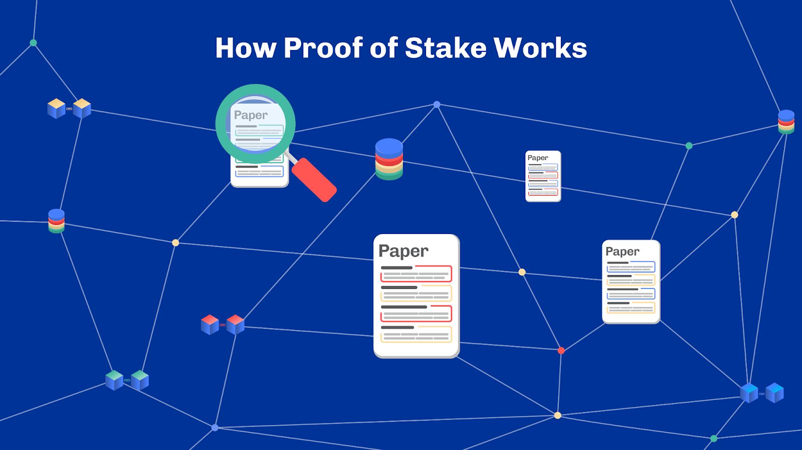

To recap, Cardano’s Ouroboros protocol was the first provably secure Proof of Stake consensus protocol. It has been cited in numerous papers across the entire crypto space. With Proof of Stake, ada holders delegate (like ‘giving their vote’) their ada to a stake pool run by a stake pool operator (SPO). The more people delegate to a stake pool, the greater its chance of being elected to create a block.

Remember a stake pool has only ‘won’ the right to create the next block. They still need to be online and capable of creating the block at that time. When the stake pool creates a block, both the operator and the delegators earn rewards as they both contribute to the decentralization and thus the security, of the blockchain.

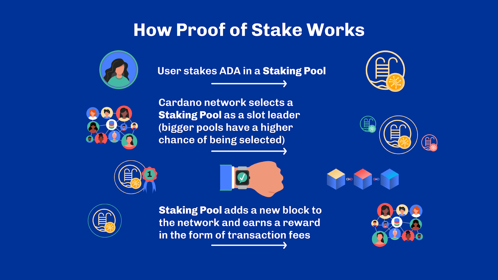

The staking model is the fruit of extensive research on incentives and game theory peer-reviewed at numerous high-profile cryptography conferences.

Key features of Cardano include:

- **Liquid Staking**: no requirement for ada to be locked. Funds remain fully liquid so they can be exchanged, traded, and used for dApps without any unlocking period.

- There is **no slashing**. Some chains employ punitive slashing of funds as a deterrent to malicious operators.

- When staked, ada is not exchanged or sent anywhere. You **maintain custody and control over your funds**.

- There is **no minimum required**, any ada amount can be staked.

- **Rewards are automatically distributed** by the protocol. As a delegator earns rewards, their overall balance is auto-compounded.

- Cardano has consistently ranked best in class in terms of **staking ratio and MAV (minimum attack vector)**. Staking ratio is a measure of participation by ada holders in delegating their funds. Cardano’s MAV is multiple times greater than rival POS chains, with over 3,000 stake pools ensuring a diverse decentralized network.

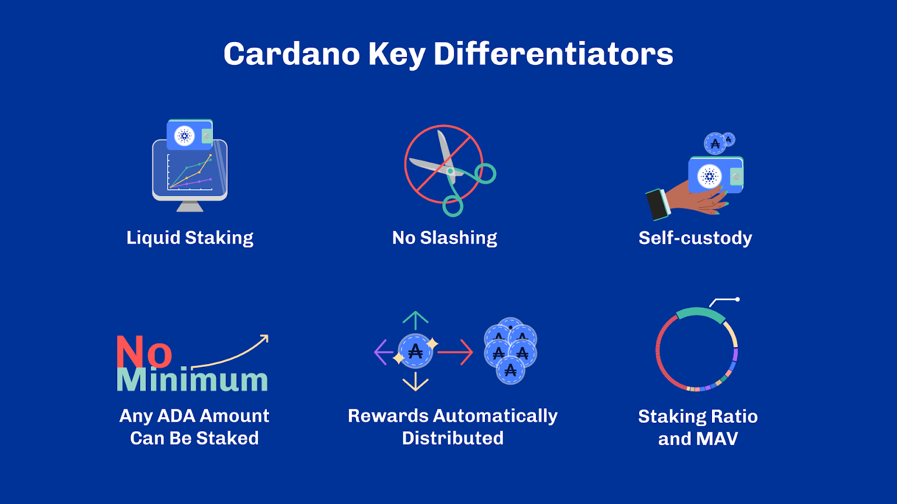

A key component of ensuring security in any blockchain is achieving a high degree of decentralization. Cardano focuses on three key aspects in order to achieve this: staking, networking and governance.

Cardano boasts a dynamic peer-to-peer (P2P) network which automates the peer selection process and eliminates the need for static configurations and manual stake pool operators’ (SPO) input. CIP-1694 is the proposed route to a fully on-chain decentralized governance for Cardano. This involves distributing decision-making rights across a large number of participants to maintain a robust network.

### What is a Stake Pool?
To recap, Cardano’s consensus protocol divides time into epochs (5 days). About 1.5 days before the start of a new epoch, a stake pool owner can query their ‘leader schedule’ which shows them at which time they have been elected to make a block. A stake pool’s VRF (Verifiable Random Function) key is used to ensure the process is unpredictable, and the schedule is unavailable to the broader public.

Just like with Bitcoin, transactions are broadcast across the network to every node. The stake pool which is eligible to create the next block takes all transactions in its mempool and includes them in the block.

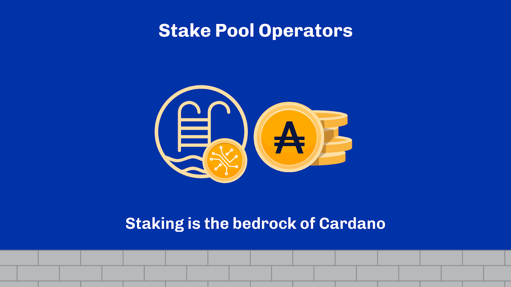

### How Does a Stake Pool Work?
As mentioned earlier, Ouroboros is not based on computational power. The leader election is based on stake – that is, the number of tokens owned by participants in the consensus.

Block producers, also called stake pools, will receive ada rewards, not solely for themselves but for all delegators of that stake pool. Unlike Bitcoin, where a miner is rewarded for mining a new block roughly every 10 minutes, Cardano rewards go into a pot and are then distributed at a time period. Delegators don’t need to lift a finger. The protocol auto-distributes rewards due for each eligible wallet. This is not always the case with other blockchains.

## Stake Pool Operators (SPOs)
As the name suggests, Stake Pool Operators are people that operate the stake pools, to which ada holders delegate their funds and earn staking rewards. SPOs are essentially the validators of transactions and contribute to the decentralization of the Cardano network.

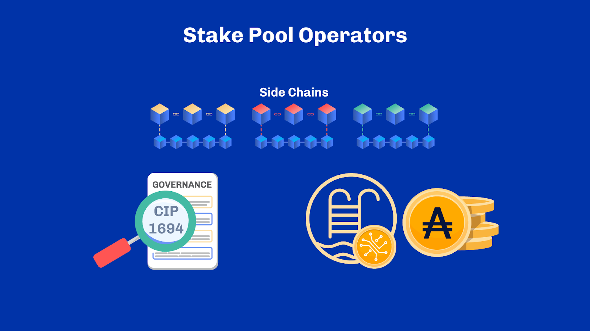

Who are they? Anyone can be a SPO but you should be familiar with using a command line interface (CLI) and have some technical experience in running and maintaining a server that runs a Cardano node. There are responsibilities around security also. For example, you need to be able to configure secure network settings and update your KES (Key Evolving Signature) keys every 90 days. There are many guides and blogs available from experienced SPOs. The Cardano Developer Portal goes into more detail on how to airgap an environment on a standalone computer, for example.

The SPOs are the heartbeat of the Cardano blockchain. The staking model has proved a huge success with high participation levels. Much of the strategy around CIP-1694 and the side chain model piggybacks on the existing SPO model. Operators are incentivized to act as infrastructure service providers for voting mechanisms while bootstrapping liquidity on emerging side chains. Stake pools will earn rewards in the side chain’s native token, as well as ada rewards on the mainchain.

## How to Choose a Stake Pool?
Choosing a stake pool is not an exact science. There are many factors and delegators have different opinions and priorities. Some are attracted superficially to the pool with the lowest fees, but on closer review, it is usually the least important consideration. If you are unsure about any of the parameters or want to scrutinize a specific stake pool, you can dive deep with some of the tools listed below:

- Cardano Foundation Explorer
- ADAStat
- CardanoScan
- CExplorer
- PoolPeek
- Pooltool
- Adapools.org
- Cardano.org staking calculator

In no particular order, or priority, here are some considerations:

### Operator Background
Who are they? Have they been running a pool for long? Are they running a single pool or multiple pools? Are they active on social media, or at least contactable? Have they outlined details about their configuration? Are they following best practice around security? Have they missed their slot(s) previously?

### Performance Data
You can review a pool’s history using its pool ID on any explorer, but some SPOs openly provide performance data. For example, PoolTool enables stake pools to self-report the slots they get elected for at the start of an epoch. These reports are then evaluated against the actual blocks the pool produces.

### Single vs Multi-Pool Operators (MPOs)
A contentious issue among the community is the issue of operators running multiple pools with low fees and low pledge. The protocol is designed not to incentivize MPOs, but it works on the presumption delegators will prefer single pool operators. If single pool operators flourish, the network becomes more decentralized and there is less threat to the protocol from adversaries conducting Sybil attacks, etc. If an SPO behaves in a manner that is not in Cardano’s interests, delegators can un-stake and redelegate their ada, favoring SPOs who align with their (and Cardano’s) values.

### Saturation Levels
A pool becomes saturated if it exceeds a certain level. This level is calculated as follows:

Saturation level =  Total ADA in circulation / K     …note K = 500 at present.

Opinions vary, but it’s best to aim for a pool with approx 80-90% saturation depending on the pool's liquidity and stability. You should know your staked ada is never at risk, but your potential rewards will be less if the pool exceeds 100%.

### Fees
While running a stake pool isn't really difficult technically, there is commitment involved in assuring security, availability, and maintaining a marketing presence. The protocol allows a pool to specify their fee as a ‘pool margin’ percentage, as well as a fixed minimum fee (‘minPoolCost’ 340 ada). Note these fees are deducted from the pool's rewards before delegators receive their ada rewards.

### Pool Pledge
Often described as the SPO’s ‘skin-in-the-game’. The greater the pledge, the more rewards. However, note this is another contentious issue as, under the current protocol settings, the overall impact on rewards is not hugely affected by a pool’s pledge. Pledged ada earns rewards for the SPO just like staked ada.

### Wallet Ranking
Different wallets have slightly different ranking criteria. While these ratings should not be followed blindly, they are a good barometer to gauge how well a pool is doing by the given wallet’s criteria.

Staking with a centralized exchange
It’s against the whole principle of crypto to allow a centralized entity to hold your ada, and stake it for you. Many CEXs will advertise generous returns and ‘yields’ but they often apply conditions such as minimum deposits and lock-up periods. If anything goes wrong, your funds are at risk. Note that regulatory requirements, and enforcement, can change suddenly and vary by jurisdiction so events beyond your control can impact access to your funds if they lie on a CEX.

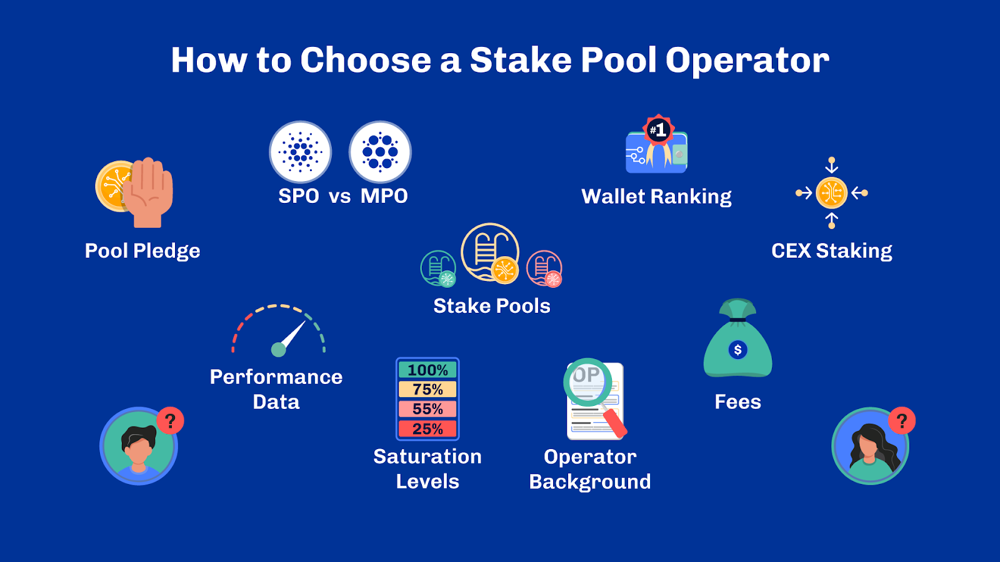

### Pool Size
A small pool is statistically less likely to be elected to mint a block, but over the longer term, its rewards should match that of a larger pool assuming neither is over-saturated. In the short term, either can have a lucky ‘winning streak’ and seem more attractive to the casual observer. The graphic below illustrates the effect of pool fees based on pool size and the negligible effect they have in the longer term.

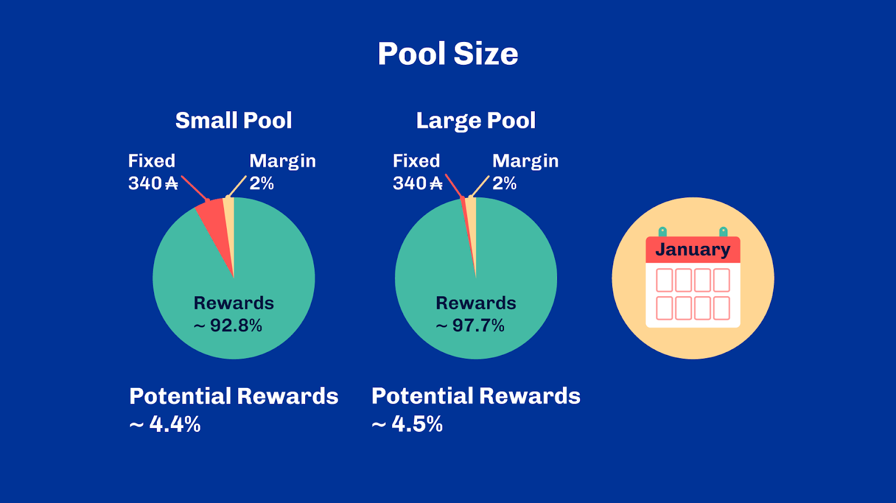

There have been heated debates and discussions about increasing the ‘k’ parameter and lowering, or abolishing the ‘minPoolCost’. There is even a CIP-74 written about it. As we are now in the Age of Voltaire, the Cardano Foundation invited SPOs to take part in an on-chain poll experiment in an effort to foster debate while simultaneously testing the stake pool model for future governance rounds.

The poll was an on-chain, transparent way to allow the community to voice their views on crucial decision-making around parameters and values. As a result and consequence of the SPO poll, the minPoolCost parameter was halved from 340 to 170 ada. This eagerly awaited change was especially important for smaller stakepools.

There will be more polls, which will ultimately be debated by DReps (delegated representatives) and other roles proposed in CIP-1694, before binding on-chain votes are cast. The poll mechanism itself is also formalized in its own CIP-94.

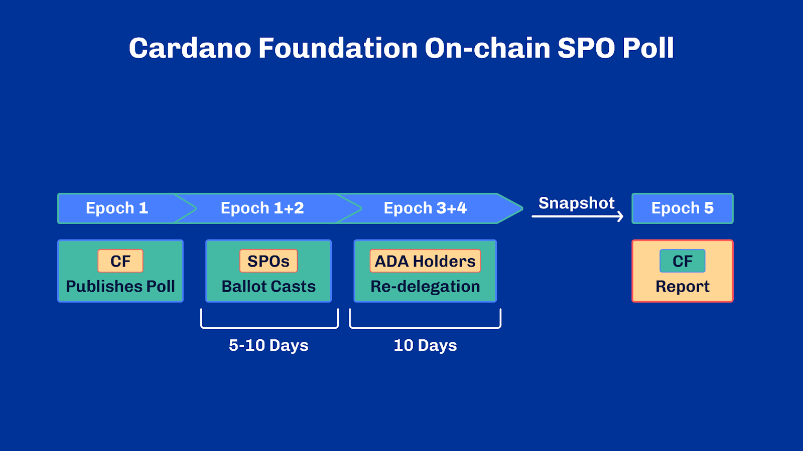

## Cardano Foundation Delegation Strategy
As per the Cardano Foundation’s mission to stimulate the global adoption of Cardano, the Cardano Foundation Delegation strategy is focused on supporting stake pools that are run by good actors who bring value to the wider ecosystem. The delegation rotates every 12 months and the stake pool has to align with several criteria.

There are many ways to contribute to the community. This could be through building open-source tools, updating libraries, adding repositories, maintaining the Cardano Developer Portal, writing CIPs, or just answering questions on the Cardano Stack Exchange (CSE).

There are many SPOs who contribute to the ecosystem but don’t market or advertise themselves so well. The CF runs features to shine a light and raise awareness of such SPOs on their website.

eg. Hazelpool. There is also a similar initiative from Hosky Rug Pools who endeavor to reward good actors by delegating to their stake pools. For example, ASPEN stake pool, run by prolific YouTube educator WoodLand Pools recently joined a list of over twenty Hosky Rug Pools.

## Alice and Bob Q & A
Alice has reviewed the staking process but still has some questions. She calls her friend Bob to get some clarification. Their conversation goes as follows:

**Alice**:  If I spend my ada, or add funds to my wallet after I delegate to a pool, does the staked amount auto-update?
**Bob**: Yes, because when you delegate to a pool, you are delegating your entire wallet, not just your balance at that time. If you send or receive ada, your staked amount will update accordingly.

**Alice**: Does k = 500 mean that only the top 500 pools will earn rewards? The wallet ‘ranking’ system seems to imply this?
**Bob**: No, the k parameter just means pools will saturate at a certain level (circulating supply / K). You can still delegate to over-saturated pools, and there is no limit to the number of unsaturated pools. It means, on paper, a maximum of 500 pools can function with the maximum amount of stake and not be saturated.

**Alice**: Can I delegate to multiple pools?
**Bob**: This feature is a common request from ada holders. It is supported in some wallets, such as Lace. If your wallet supports ‘accounts’ then you can create multiple accounts and delegate to a separate pool with each account.

**Alice**:  Can I stake from a hardware wallet?
**Bob**: Yes you can stake from a hardware wallet. The user experience is a little different but there are many walkthroughs and guides online. For example, you can use the Ledger Live UI along with your Ledger hardware wallet to set this up.

**Alice**: Do I need to keep my computer running with my wallet open to earn rewards?
**Bob**: No once you have delegated to a pool, you will earn rewards regardless if your wallet is open online or not. This is the whole idea of delegation. Most people are not able to commit to being online monitoring a Cardano node all day, so a stake pool is there 24/7 on your behalf.

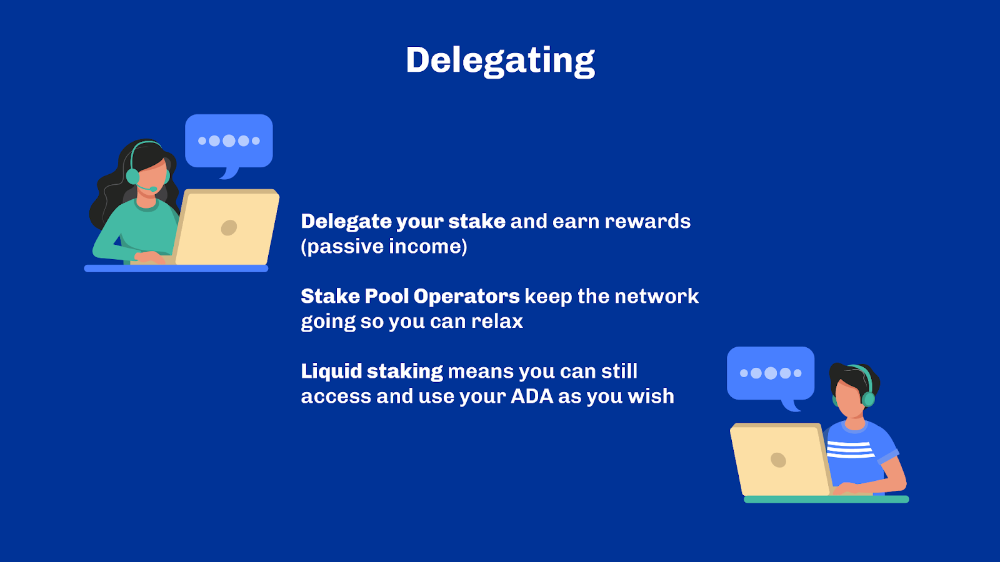

**Alice**: How does staking with a pool compare to staking on exchanges?
**Bob**: It’s the same underneath the hood. The difference with a centralized exchange is they automatically delegate your ada to their pool, removing your ability to choose. They may promise higher rewards in return for a lockup period or insist you have a minimum balance to use their staking-as-a-service offering.

**Alice**: When will I start seeing staking rewards trickle into my wallet?
**Bob**: It depends on when you stake, in relation to when the snapshot is taken. You usually will get your first rewards after 15 to 20 days, and then subsequently every 5 days after that. Think about the following stages or epochs…

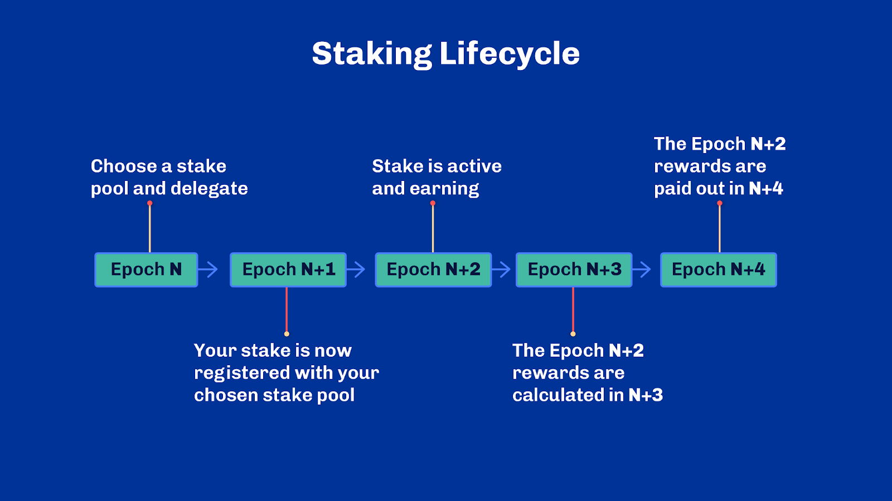

**Alice**: Do I have to claim my rewards every time?
**Bob**: No, there is no onus to withdraw your rewards every epoch, the protocol automatically distributes ada rewards to eligible wallets. Your stake is for the entire wallet, including your ‘rewards balance’ so your rewards are automatically staked on an ongoing basis. Note you do need to claim your rewards before they are “spendable”, ie. if you want to send them to a DEX or DApp. Some wallets will automatically withdraw/claim any eligible rewards when you are executing a “normal” transaction.

**Alice**:  Is staking safe? Can the pool steal my ada?
**Bob**: No, when you are staking, you are the only person that has access to your ada. By delegating your stake, you are signing a transaction (with your staking key) to confirm which pool you are delegating to. In the event of your staking pool being hacked or going offline, your ada is safe. Your rewards may dip temporarily until you can delegate to another pool.

**Alice**: What is the difference between ‘live stake’ and ‘active stake’?
**Bob**:  Live stake is what is in the pool right now at this moment, ie. the ada that is currently delegated to the pool. Active stake is the amount of delegated ada to the pool when the snapshot for that epoch took place. The snapshot happens at the end of every epoch. Obviously, live stake and active stake can vary at any other time in the epoch.

**Alice**: What happens to my staked ada, if I delegate to another pool?
**Bob**: It depends on when you un-delegate from your old pool, and re-delegate to the new pool in relation to the snapshot. There doesn’t necessarily need to be an interruption. You are still earning rewards, because the snapshots that are stored in the system still reflect your old delegation before the new delegation comes into effect. It is like two runners (stake pools) in a relay handing over the baton (your staked ada).

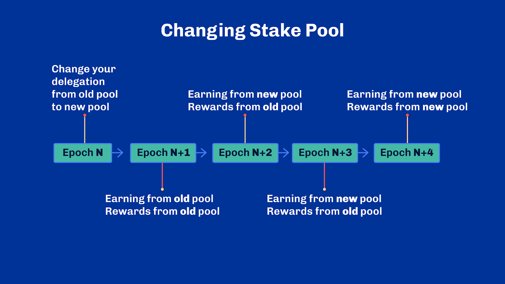

**Alice**: I’ve read through a few staking tutorials. What are these different balances I see? Why would I need to withdraw rewards to myself?!

**Bob**: Let me explain. A rewards account (rewards balance) is tied to each registered stake address. The rewards balance can only be increased when rewards are distributed by the protocol, or reduced to zero with a withdrawal. This can seem counter-intuitive, to withdraw to your own wallet. What is happening here is you are withdrawing from your rewards account to your main wallet balance.

## Chimeric Ledger
Cardano uses what is called a Chimeric Ledger, meaning it uses both account-based (like Ethereum) and UTxO-based (like Bitcoin) accounting systems. This was not a last-minute snap decision, but a carefully planned design grounded in rigorous research. Read the 2018 ‘Chimeric Ledger’ paper for more on this. This capability allows the ledger to take advantage of the UTxO system but at the same time be storage-efficient when it comes to specific aspects of the ledger, such as rewards.

So when you withdraw the ada from a reward balance, it is done through an on-chain transaction. Cardano staking was designed to be as automated as possible, i.e. not requiring stakers to perform repetitive tedious tasks every epoch. Stakers receive rewards regularly and these rewards are automatically delegated to the same pool. Many stakers delegate to the same pool for extended periods of time, allowing rewards to accrue every epoch as ‘passive income’. There is no requirement to withdraw rewards even if you want to delegate to another pool.

There are also significant efficiency gains for the protocol with the Chimeric ledger. Imagine if all rewards were distributed through on-chain transactions every epoch, there would be regular spikes resulting in unnecessary load on the system. It would also mean the creation of a large number of UTXOs each with a small amount of ada.

It makes more sense to allow them to accrue in an accounts-based rewards balance. The delegator can then withdraw the balance as a single UTXO input when it suits them. This withdrawal could be an annual withdrawal, if they want to vote in a particular Catalyst funding round. Reward balances do not currently count as voting power in Catalyst. Note that your voting rewards will also be sent to your rewards account, not to your payment (receiving) address.

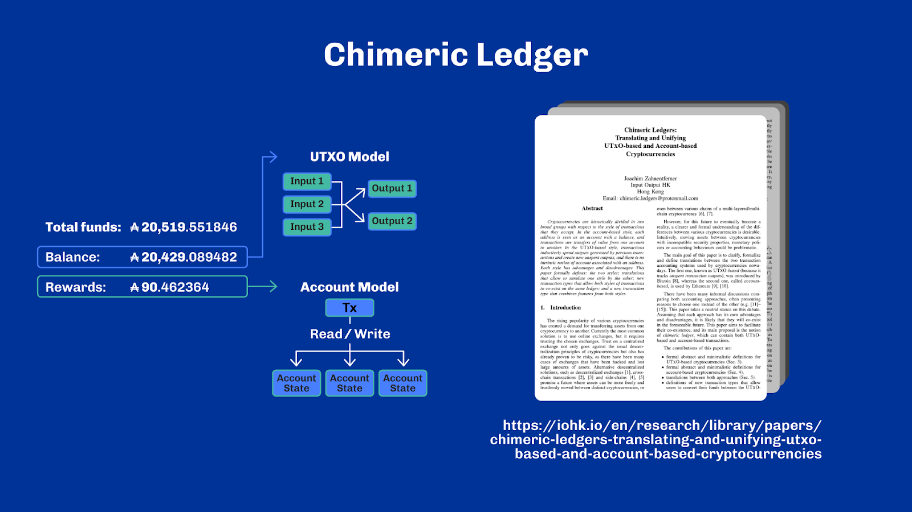
<br>
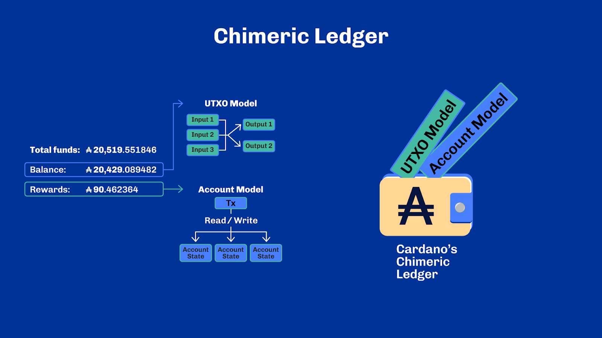

## Staking Lifecycle: GUI vs CLI
Alice is finally ready to stake her ada in her light wallet.

She opens her wallet and navigates to the ‘Staking’ section. She opens up the list of stake pools available. The light wallet displays a ranking of each stake pool based on metrics like saturation, live stake, pledge, cost, margin and interest. She knows the pool she wants, so does a search for its ticker. E.g.. ASPEN. This narrows down the search and allows her to ‘select’ her chosen pool. The GUI pop-up dialogue box asks her to confirm her delegation choice, fees, and 2 ada deposit, and finally the transaction is confirmed with her ‘spending password’ she entered when setting up the light wallet.

Like any Cardano transaction, she can retrieve details under ‘recent transactions’ and verify by using an explorer. After a few minutes the ‘confirmations’ on-chain increase to assure immutability. Alice is surprised at how seamless the staking process was using her light wallet. She is wondering what is actually going on underneath the hood.

To help reinforce her understanding, Bob suggests Alice should verify everything with the Cardano Foundation Explorer which features a section called [Staking Lifecycle](https://beta.explorer.cardano.org/en/staking-lifecycle/). For the technically curious, Bob also wants to walk through the staking process from the command line interface. The details of the commands Bob runs are in the course notes.

### Step 1: Registration

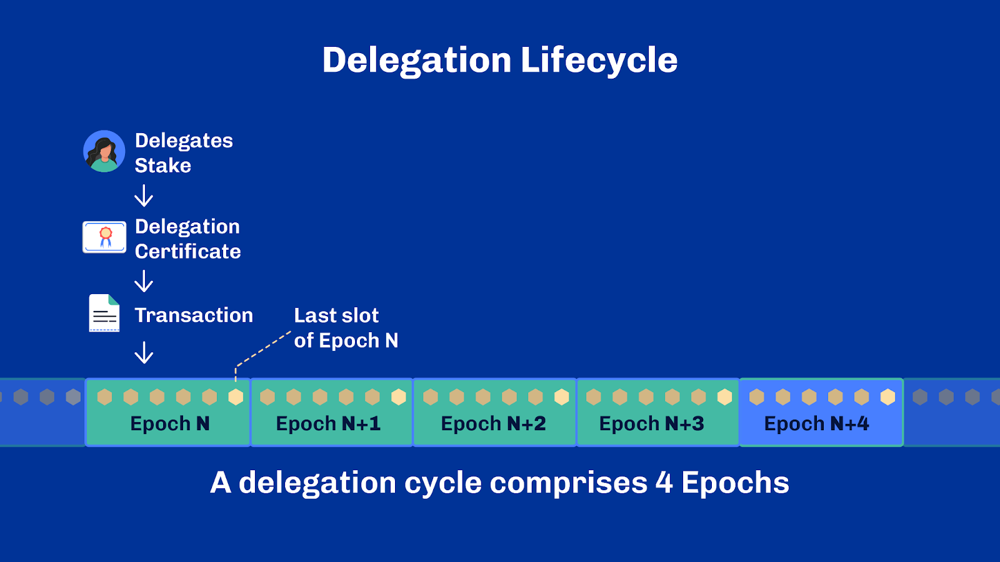

Before Bob can delegate his ada, he must go through a process that involves registering a stake address. This is done by posting a so-called “stake address registration certificate” to the Cardano blockchain. This registration allows Bob to delegate ada and automatically sets up a rewards address where the Cardano blockchain accrues the rewards from such delegation.

Technically such a registration is required because delegation on the Cardano blockchain involves distinguishing between the transaction of ada and the participation of the same ada in the consensus mechanism. This distinction is achieved by modelling it in the address structure and distinguishing between his payment address and stake address. Bob’s ada is always linked to his payment address but can optionally also be associated with his stake address. This allows him to participate in staking, by running his own pool, or delegating his ada to a stake pool.

To mitigate certain economic attacks, a refundable hold (2 ada) is imposed on Bob upon registration, which will be released when his stake address is deregistered. The hold covers the costs of tracking the stake address and maintaining the corresponding rewards account, and it incentivises deregistering unused stake addresses so that the corresponding Cardano blockchain resources can be released.

Picking up where he finished in the last unit, Bob runs the following command to inspect his payment address...

```cmd
$ cat bob_mainnet_addr.addr | cardano-address address inspect
{
    "stake_reference": "none",
    "Spending_key_hash_bech32": "addr_vkh1jnzzd8l…06wk0hnl23mzzmu",
    "address_style": "Shelley",
    "spending_key_hash": "94c4269fe027d1a…bf4349217e9d67de7f5",
    "network_tag": 1,
    "address_type": 6
}
```

The output confirms Bob created an address type ‘6’, but there are eight different types of Shelley addresses as outlined in CIP-19. A type 6 Shelley address can be used to send and receive ada, but whose associated stake can't be delegated.

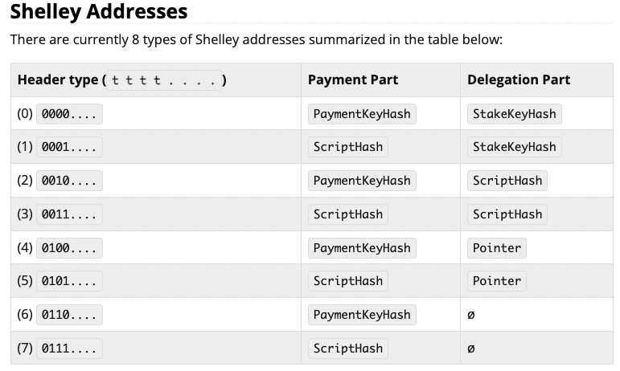

Bob now wants to create a ‘0’ address type as he intends to start staking his ada. A type 0 Shelley address is built from a payment part and a staking key part, so Bob needs to create a new ‘stake’ keypair first.

```cmd
cardano-cli stake-address key-gen \
		--verification-key-file bob_stake.vkey \
		--signing-key-file bob_stake.skey

$ cat bob_stake.vkey
{
    "type": "StakeVerificationKeyShelley_ed25519",
    "description": "Stake Verification Key",
    "cborHex": "5820fd9d828ff85294217b77….167114e2c99268906ed58289"
}
```

Bob ‘builds’ a stake type 0 address with his two verification keys: the initial ‘payment’ vkey from the previous unit and his newly created ‘stake’ vkey.

```cmd
cardano-cli address build \
		--payment-verification-key-file bob_payment.vkey \
		--stake-verification-key-file bob_stake.vkey \
		--out-file bob_staking.addr \
		--mainnet
cat bob_staking.addr | cardano-address address inspect
```

It should look something like this

```cmd
{
    "stake_reference": "by value",
    "stake_key_hash_bech32": "stake_vkh1kevs5lhejnxy3j6…..e6yn8atev5e3jy7asajygx8zx",
    "stake_key_hash": "b6590a7ef994….b3a24cfd5e594cc644f761d9"
    "spending_key_hash_bech32": "addr_vkh1tc0da5jwszr8f…fcuxxvexggufyvmnhg3r5p2x",
    "address_style": "Shelley",
    "spending_key_hash": "5e1eded24e8086749fd49602….9c70c6664c84712466e774",
    "network_tag": 0,
    "address_type": 0
}
$bob_staking_addr=$(cat bob_staking.addr)
```

This new ‘type 0’ gives Bob the ability to send and receive ada, but also to delegate his ada to a staking pool and receive ada rewards for contributing to the network.
Register stake address

To confirm some details, Bob checks the protocol parameters...

```cmd
cardano-cli query protocol-parameters \
		--mainnet \
		--out-file protocol_params.json
```

Before Bob can delegate his stake and earn rewards for participating in the protocol, he first needs to register his stake key to the blockchain. Bob inspects the protocol parameters to confirm that this requires a small deposit of 2 ada. The 'grep' command (global regular expression print) is used in searching and matching text files.

```cmd
cat protocol_params.json | grep stakeAddressDeposit
"stakeAddressDeposit": 2000000,
```

To register his stake key, Bob first needs to produce a registration certificate. He is not sure about his options so just types in the `cardano-cli stake-address` command first to review the menu options. Bob needs to leverage the `registration-certificate` sub-subcommand in this case:

```cmd
cardano-cli stake-address registration-certificate  \
	--stake-verification-key-file bob_stake.vkey \
	--out-file registration.cert
```

Bob wants to review the cert, so runs the ‘cat’ (concatenate) command:

```cmd
cat registration.cert
{
	"type": "CertificateShelley",
	"description": "Stake Address Registration Certificate",
	"cborHex":"82008200581cb6…5f56d6b3a24cfd5e594cc644f761d9"
}
```

Bob is not done yet, he now needs to submit his certificate to the blockchain. For this, he will again use the `address` command. This time he needs to use a few more options to build the transaction. He uses `--certificate-file` flag to include his registration certificate, and the `--witness-override` flag to specify that this will be signed by 2 witnesses: `bob_payment.skey` and `bob_stake.skey`

Bob uses the ‘jq’ command to process the resulting JSON output. ‘jq’ is a powerful linux command for extracting, manipulating, and transforming JSON data. The ‘-r’ flag here is to get raw output with no double quotes.

```cmd
cardano-cli transaction build --babbage-era \
	--mainnet \
	--witness-override 2 \
	--tx-in $(cardano-cli query utxo --address $bob_staking_addr
	--mainnet --out-file /dev/stdout | jq -r 'keys[1]') \
	--change-address $bob_staking_addr \
	--certificate-file registration.cert \
	--out-file tx.raw
```

Next, Bob signs it with both keys then submits it to the blockchain:

```cmd
cardano-cli transaction sign \
	--tx-body-file tx.raw \
	--signing-key-file bob_payment.skey \
	--signing-key-file bob_stake.skey \
	--mainnet \
	--out-file tx.signed


cardano-cli transaction submit \
	--mainnet \
	--tx-file tx.signed
```

## Step 2. Delegation

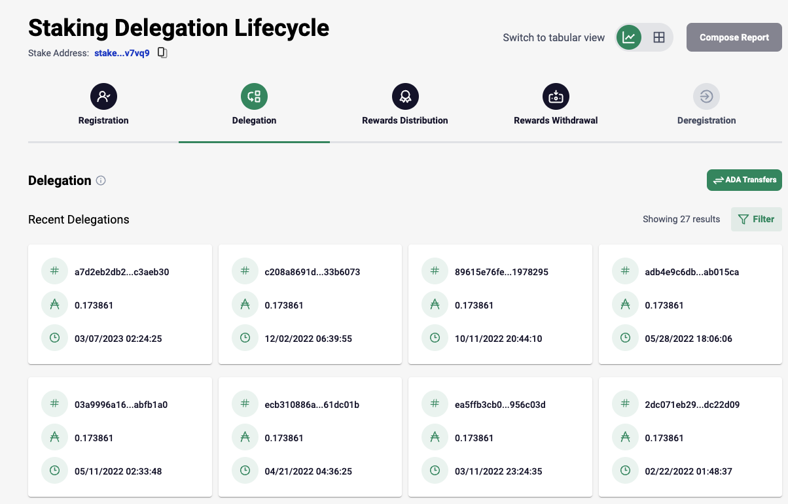


Bob can now delegate from his stake address to a stake pool by posting a so-called ‘delegation certificate’ to the Cardano blockchain. If Bob wants to change his choice of stake pool, he is free to post a new delegation certificate at any time.

Technically a delegation certificate contains the stake address delegating its stake rights and the stake pool verification key hash to which the stake is delegated. If a stake address is deregistered, the associated delegation certificate is automatically revoked. Newer delegation certificates supersede older delegation certificates.

Bob now wants to delegate his stake. For that, he needs to create a delegation certificate. He inspects the `cardano-cli stake-address` command by just running it as is at the command prompt. To produce the delegation certificate he needs to know the stake pool id of the pool that he wants to delegate to. Bob decides to delegate to the RATS pool run by Charles Hoskinson:

```cmd
cardano-cli transaction submit \
	--mainnet \


cardano-cli stake-address delegation-certificate \
	--stake-verification-key-file bob_stake.vkey \
	--stake-pool-id 5e376d756f6eec4599..5b13cf204a57c703dc251 \
	--out-file delegation.cert
```

Just like before, Bob builds, signs and submits this transaction with the certificate as follows:

```cmd
cardano-cli transaction build --babbage-era \
	--mainnet \
	--witness-override 2 \
	--tx-in $(cardano-cli query utxo --address $bob_staking_addr \
     --mainnet --out-file /dev/stdout | jq -r 'keys[1]') \
	--change-address $bob_staking_addr \
	--certificate-file delegation.cert \
	--out-file tx.raw
cardano-cli transaction sign \
	--tx-body-file tx.raw \
	--signing-key-file bob_payment.skey \
	--signing-key-file bob_stake.skey \
	--mainnet \
	--out-file tx.signed
cardano-cli transaction submit \
	--mainnet \
	--tx-file tx.signed
```

## Step 3. Rewards Distribution

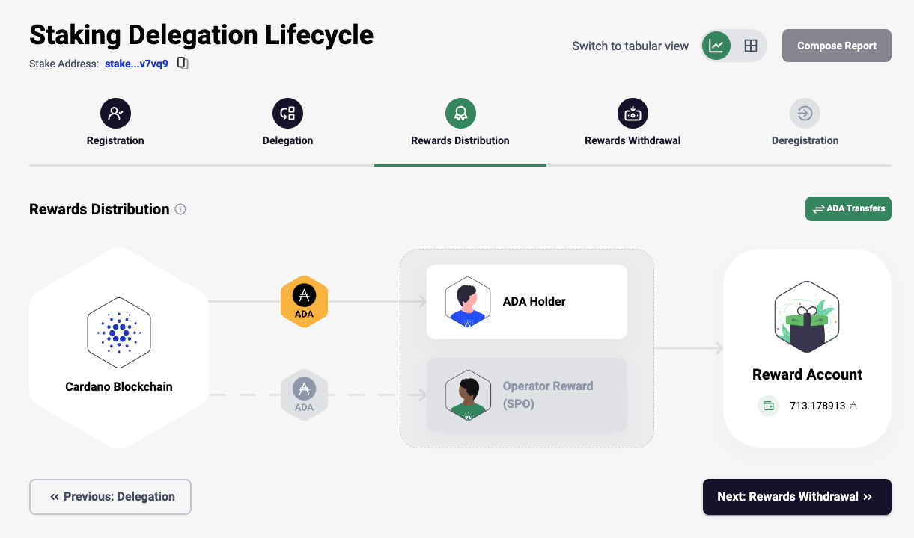

Bob’s reward account is used to receive rewards for participating in the Proof of Stake consensus mechanism. For each stake address, there is an associated reward account. The lifecycle of the reward account follows that of the associated stake address.

## Step 4. Rewards Withdrawal

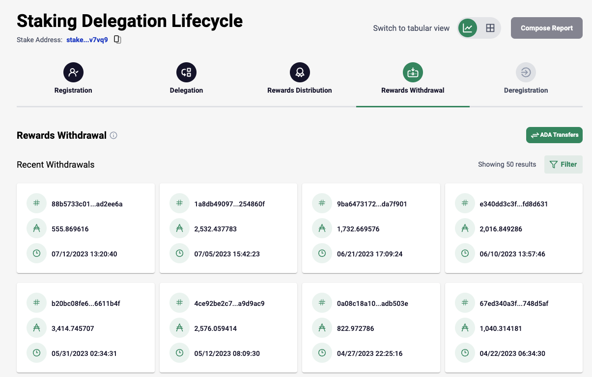

Bob’s rewards in his reward account can be withdrawn to his payment address at any time by using the rewards account balance as an input to a transaction. This transaction follows the Unspent-Transaction-Output (UTXO) architecture, taking the current balance of the reward account as the input amount.

## Step 5. Deregistration

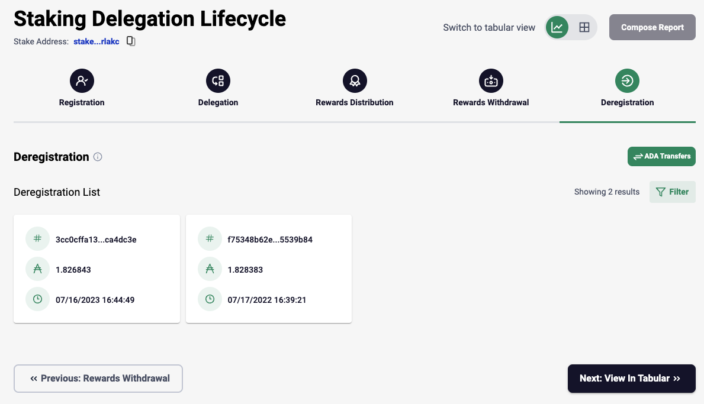

The stake address deregistration certificate contains the stake address that should be deregistered. Registering a stake address creates a corresponding reward account, which is deleted when the stake address is deregistered. The hold (2 ada) paid during registration is then released. It may take 1-2 epochs, but in this time, rewards are still earned.

## Review
Wow, we covered a lot of ground in this unit. We recapped the staking process, who SPOs are, and the role they play. We ran through some pointers to look at when choosing a stake pool to delegate to. We then went through the staking steps in a light wallet, and via the CLI. Before we move on to the next unit, take some time to review this animation which illustrates what we just went through.

## Reference
[Ref.4.2.1] Ouroboros: A Provably Secure Proof-of-Stake Blockchain Protocol, IOHK research library, Available from:  https://iohk.io/en/research/library/papers/ouroboros-a-provably-secure-proof-of-stake-blockchain-protocol/, Accessed: 24 Aug 2023<br>
[Ref.4.2.2] Edinburgh Decentralisation Index, Edinburgh University, Available from: https://www.ed.ac.uk/informatics/blockchain/edi, Accessed: 24 Aug 2023<br>
[Ref.4.2.3] Cardano Stack Exchange (CSE), Available from: https://cardano.stackexchange.com/ , Accessed: 24 Aug 2023<br>
[Ref.4.2.4] Cardano Foundation Delegation Strategy, Cardano Foundation, Available from: https://cardanofoundation.org/en/news/cardano-foundation-updates-delegation-strategy/ , Accessed: 17 Oct 2023<br>
[Ref.4.2.5] Hosky Rug Pools, Available from: https://adafolio.com/portfolio/f9a01dd0-8f3b-11ec-b375-0242ac190002, Accessed: 24 Aug 2023<br>
[Ref.4.2.6] Chimeric Ledgers: Translating and Unifying UTXO-based and Account-based Cryptocurrencies, IOHK research library, Available from: https://iohk.io/en/research/library/papers/chimeric-ledgers-translating-and-unifying-utxo-based-and-account-based-cryptocurrencies/, Accessed: 24 Aug 2023<br>
[Ref.4.2.7] Reward Sharing Schemes for Stake Pools, IOHK research library, Available from: https://iohk.io/en/research/library/papers/reward-sharing-schemes-for-stake-pools/ , Accessed: 24 Aug 2023<br>
[Ref.4.2.8] CIP 1694 - A First Step Towards On-Chain Decentralized Governance, Cardano.org, Available from: https://cips.cardano.org/cips/cip74/ , Accessed: 24 Aug 2023<br>
[Ref.4.2.9] CIP 94 - On-chain SPO polls, Cardano.org,  https://cips.cardano.org/cips/cip94/ , Accessed: 24 Aug 2023<br>

## Glossary

- *Liquid staking*: Liquid staking is a built-in feature of the Cardano blockchain. Your ada is never locked when staking, you can use your ada as you would normally to send, receive, use it as collateral, trade, and earn yields on a DEX (decentralized exchange).
- *Sybil attack*: A Sybil attack is where an attacker subverts the reputation system of a peer-to-peer network, usually by creating a large number of pseudonymous entities in order to gain a disproportionately large influence.
- *Slashing*: Slashing is a security mechanism employed on some PoS blockchains to penalize validators for what is deemed to be a breach of the protocol rules. It usually involves confiscating or reducing a validator's staked assets as punishment for misbehavior, and a deterrent to bad
- *Staking Ratio*: The staking ratio refers to the proportion of actively staked tokens in a proof-of-stake network. It indicates the level of participation and network security.
- *Minimum attack vector (MAV)*:
The minimum attack vector refers to the smallest group of participants required to gain control and manipulate the network. One can significantly disrupt the network by controlling more than 51% of the generated blocks.

## Questions

**Sub-Unit 1**

*Which of the following is NOT true of liquid staking? Select all that apply*
- Your funds are not locked up
- You can still send or receive ada when staking on Cardano
- **There is a waiting period before you can access your ada (CORRECT ANSWER)**
- **All proof of stake blockchains have liquid staking (CORRECT ANSWER)**

*True or False: Cardano uses slashing to punish stakers who break the rules.*
- True
- **False (CORRECT ANSWER)**

*Which protocol was the first provably secure Proof of Stake consensus protocol?*
- Ethereum
- **Cardano’s Ouroboros (CORRECT)**
- Avalanche
- Algorand

**Sub-Unit 2**

*SPO is short for?*
- Stake Pointer Offset
- **Stake Pool Operator (CORRECT ANSWER)**
- Stake Pool Officer
- Swimming Pool Official

*Which of the following wallets allow you to stake?*
- Daedalus
- MetaMask
- Yoroi
- Typhon
- **All of the above (correct answer)**

**Sub-Unit 3**

*Which of the following is NOT a consideration when selecting a stake pool?*
- Pool Size
- Saturation levels
- **The stake pool must be in the same country as you (CORRECT ANSWER)**
- Are they running a single stake pool or multiple stake pools
- SPO background

*If you delegate your stake in Epoch N, when will you get your first ada rewards?*
- **Epoch N+4 (CORRECT ANSWER)**
- Epoch N
- Epoch N+2
- Epoch N+1
- Epoch N+3

*True or False: If I change my stake pool, and delegate to a new stake pool, I will lose my rewards I earned with my old stake pool.*
- True
- **False (CORRECT ANSWER)**

*True or False: A stake pool can query their ‘leader schedule’ before the start of an epoch.*
- **True (CORRECT ANSWER)**
- False

*Which of the following is NOT an explorer on Cardano?*
- CExplorer
- **Etherscan (CORRECT)**
- PoolPeek
- Pooltool
- Adapools.org

**Sub-Unit 4**

*Cardano Foundation Delegations rotate how often?*
- Every month
- Every epoch
- Every hard fork
- **Every 12 months (CORRECT ANSWER)**
