# Unit 5 - DApps on Cardano

## Learning Objectives

> [!NOTE]
>
> By the end of this unit, you should be able to:
>
> - [x] Recap what a DApp is and  how its architecture is unique on Cardano
> - [x] Run through the user experience of connecting a wallet to a DApp
> - [x] Take a brief tour of some DApps on Cardano
> - [x] Preview the future of DApps on Cardano

## Introduction
Hello everyone, and welcome back. I am your lecturer, [lecturer name], and many thanks for joining me today!

## Table of Contents
In this unit, we are going to discuss DApp architecture on Cardano. We’ll recap some of the earlier units and explore how DApps on Cardano leverage eUTXO and the native asset standard. We’ll take a whistle-stop tour of just some of the DApps which make up a thriving ecosystem, and end by taking a look over the horizon to preview what’s coming down the tracks for DApps on Cardano. Let’s get cracking…

## What is a DApp?
A DApp (decentralized app) is an app that runs over a network of computers, instead of a single server. As a result, it is harder to control and hack. Although this is the desired architecture, many DApp front ends are still running on web servers hosted by a specific party. DApps use smart contracts to automate transactions and agreements. On most blockchains, a DApp is architected with all the smart contract(s) running on the blockchain.

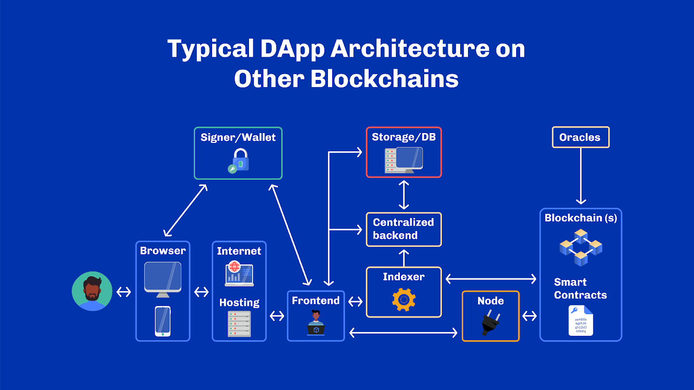

Cardano can also facilitate such a monolithic design, but DApps on Cardano are more typically built to run in two parts. An off-chain part, by whomever is interested in the result of the contract. The other part, which validates the off-chain result, is stored and executed on-chain, ie. authorization is implemented on the blockchain. Developers usually code up one part to validate the work, and another to do the actual work.

This architecture eases the load off of the layer 1 blockchain as every piece of code doesn’t need to be run by every Cardano node. Developers have flexibility in how they run off-chain code. They can use a cloud service provider, or run a bare metal server on-premise, etc. This was a bit of a paradigm shift initially for developers who also had to master eUTXO to write code for Cardano.

There are, however, great benefits in doing so like determinism and lower transaction fees. As we’ve seen in the previous unit, the eUTXO accounting model (cash-in cash-out) enables DApps to serve thousands of users in a single transaction.

## Wallets and DApps Interactions
We started this unit by talking about how wallets and DApps integrate seamlessly leveraging the communication bridge outlined in CIP-0030. For a casual Web 2.0 internet user, they should notice the ease at which they can ‘login’ to Web 3.0 DApps with a simple ‘Connect Wallet’ button. There is no personal identifiable info exchanged.

This is located in the top right of most UIs, and should auto-detect your wallet and connect, or sometimes prompt you with a pop-up to choose your wallet.

## Evolution of DApps on Cardano
Since the introduction of smart contracts and native asset capabilities in 2021, the Cardano DApp ecosystem has grown steadily. You can track progress in the weekly development updates while blockchain-agnostic sites like DefiLlama chart the consistent growth of Cardano’s TVL (total value locked) in spite of the current market slump. In terms of developer activity, the number of public Cardano GitHub repositories has continued to increase. Cardano consistently ranks highly in metrics like GitHub commits, on-chain transaction volume, new wallets, etc.

These projects range from DEXs to wallets, DeFi, identity solutions, marketplaces, cellular and broadband connectivity, NFTs, and many more. It is impossible to review every DApp, so we’ll take a quick tour of some of the more innovative additions to date.

## DApp Tour
We focussed on wallets in an earlier unit. There is an embarrassment of riches when it comes to Cardano wallets. There are new wallets cropping up all the time, raising the bar with innovations often coming from end-user requests. Users choose wallets for different reasons: some to support their favorite developer, some to get early access to new features in beta, UI preferences, creators track record (OG status)...etc. There are now over 20 wallet options, some honorable mentions include:

**Nami**: features a clean and simple UI, friendly to newcomers.

**GeroWallet**: has a focus on UX and allows users to buy ada directly from the wallet.

**Eternl**: popular with ‘power users’ and developers. The UI can seem intimidating to non-techies, however, the tooltips help with understanding advanced features like ‘token fragmentation’ and the accounts feature.

**Flint**: fans of dcSpark can access their growing portfolio of products and services such as the Milkomeda sidechain.

**Typhon wallet** has clever features such as Warp transactions which leverage multi-sig to eliminate the need for a sender fee.

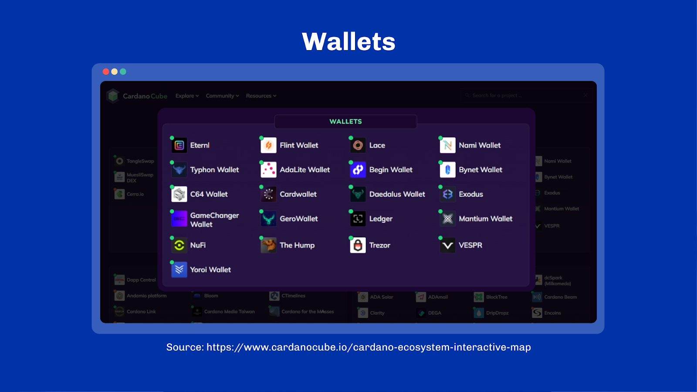

Before we go further, we need to acknowledge there is a lot of jargon in DeFi. We have listed most terms in the glossary below, but feel free to familiarize yourself with the different concepts in the more detailed ‘Essential Cardano’ glossary.

### DEX (Decentralized Exchanges)
When we talk about DApps, the first up on this list has to be DEXes. Every successful DeFi ecosystem is built on a competitive DEX rivalry. Ethereum has Uniswap, Binance chain has PancakeSwap, Polygon has QuickSwap, Avalanche has Trader Joe and Solana has  Serum. A solid DEX is the foundation of any reputable layer 1 protocol. Muesliswap, Sundaeswap, Minswap, and WingRiders are just some of the DEXs fighting it out on Cardano for liquidity. New entrants to the fray are DexHunter, Axo, and Genius Yield.

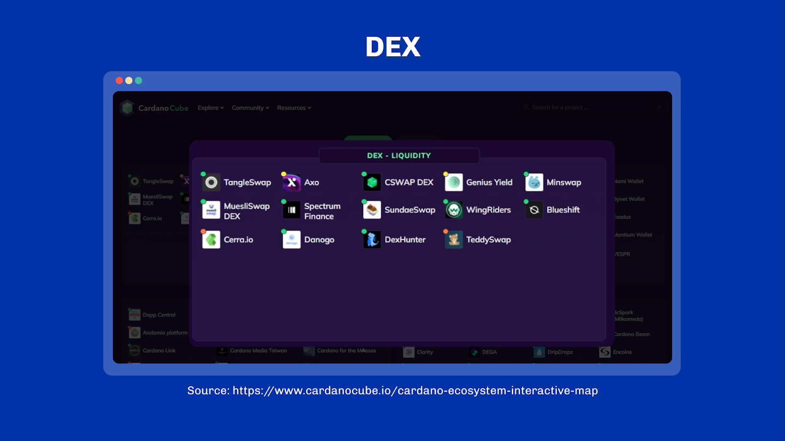

Unlike the Centralised Exchange (CEX) structure we described earlier, a decentralized exchange (DEX) is a crypto exchange with no intermediary. Any such middlemen like banks, clearing houses, and payment merchants are redundant. Users simply connect their wallets with one click and securely trade assets directly with other peers.

In traditional stock exchanges, market makers provide liquidity, so traders can buy or sell a stock at any time. Typical market makers tend to be centralized entities like the major brokerage houses operating under strict regulations. With DEXs, the role of market makers is taken by liquidity providers (LPs).

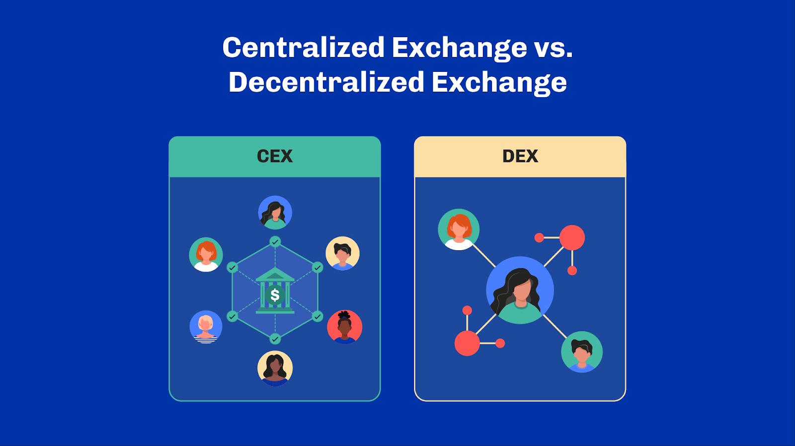

### Impermanent Loss
**Impermanent Loss (IL)** is a risk liquidity providers face when depositing their assets into a liquidity pool. It means that you could lose money if the price of the asset changes after you deposit it. However, the loss is theoretical and won’t be realized until you withdraw your asset from the pool. The price can also correct itself before you withdraw, hence the name 'impermanent loss'.

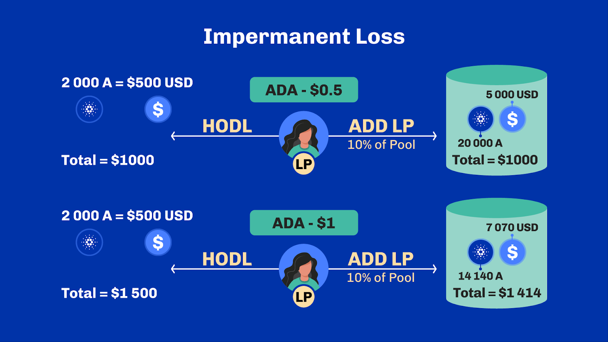

### Two Types of DEX
There are two main DEX types:

- An Automated market maker (AMM) model enables automatic, permissionless trading of digital assets. Unlike CEXes, no matching engines or counterparties are required. Most AMMs price assets using liquidity pools and formulas. One risk of using liquidity pools on an AMM is the potential for impermanent loss.

- An Order book model is closer to the currency exchange model found in traditional markets. An order book DEX lists open buy and sell orders made by users for a specific number of assets. An order matching system matches buy and sell orders on the order book.

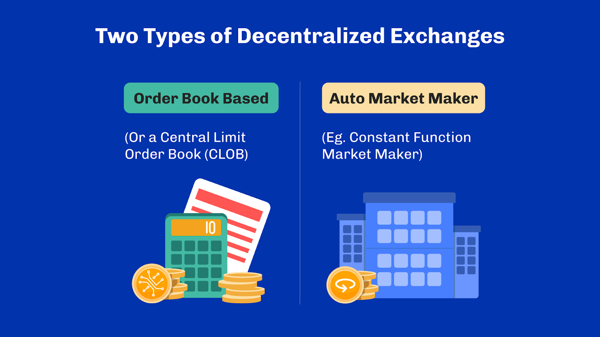

Along with impermanent loss, there is also a risk of **slippage** with AMM DEXes. With the AMM model, you never know in advance the final price you will get when your trade is executed. You can set the slippage margin (0.5 - 5% usually) you are willing to tolerate in the settings. This is not an issue with limit order book models, where you know your order will only be filled at the predefined price.

UTXO-based smart contracts on Cardano allow for DEXes based on the Order Book model. Genius Yield is just one such DEX that aims to leverage this model together with Cardano's eUTXO features to enable more sophisticated features matching those found in traditional exchanges like limit orders, stop loss, and algorithmic trading strategies. This approach mitigates the risk of impermanent loss and offers users a smoother trading experience.

Unlike DEXes on Ethereum, orders on a Cardano DEX can be run off-chain where they are batched together and processed. They are subsequently executed on-chain. This process helps with scaling and also ensures that orders are processed only if the conditions of the orders are met in the smart contract.

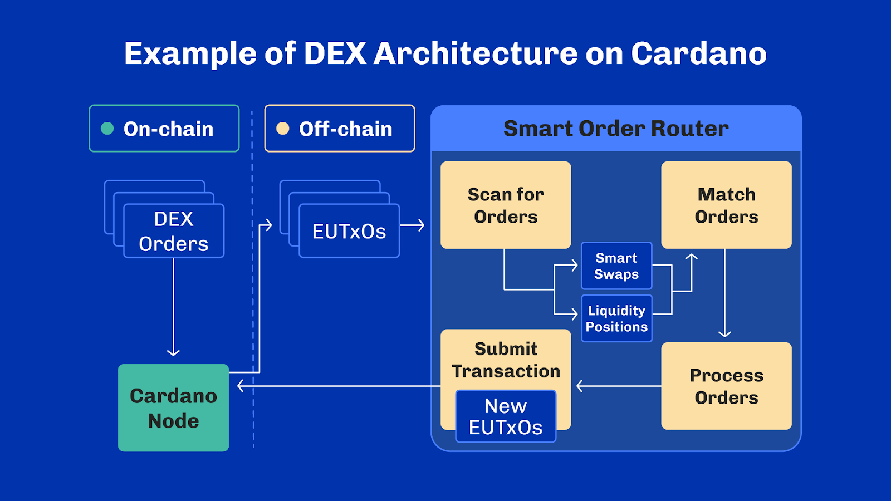

### MinSwap (MIN)
**MinSwap** is a community-centric DEX available in more than 30 languages. A winning proposal from Catalyst Fund5, MinSwap is 100% community-funded. It is the dominant DEX in terms of TVL according to stats from Defi Llama and is the most-used DApp in the Cardano DeFi ecosystem. MinSwap boasts a user-friendly interface, making it a favorite with both beginners and experienced traders.

MinSwap is an Automated Market Maker (AMM) DEX that allows users to trade and swap assets with low fees. One of the reasons for MinSwap’s success is its innovative strategy for token distribution and liquidity pools. MinSwap uses a multi-function liquidity pool that brings together the best features of other DeFi protocols.

MinSwap allows users the option to pay transaction fees in $MIN tokens, as well as with ada. Holders of $MIN can also avail of discounts once they meet certain requirements. Native tokens are treated as 'first-class citizens' on Cardano. This is a big differentiator not possible on Ethereum DEXes where users need to hold ETH to swap any two ERC20 tokens.

MinSwap also offers the following DeFi products:

- The FISO (Fair Initial Stake Offering) program allowed users to stake ada in MinSwap partners’ stake pools and receive MIN token rewards. FISO was Minswap's version of the ISPO (Initial Stake Pool Offering) model previously introduced on Cardano. FISO was regarded as one of the fairest models to distribute tokens to the community.

- Yield Farming - liquidity providers (LPs) who stake liquidity pool tokens earn rewards in the form of MIN tokens, as well as ada.

- The Minswap Launch Bowl enables projects to bootstrap liquidity by using DeFi primitives to launch successfully.

- Governance - MIN token holders can vote on future proposals and updates about the platform.

### Lenfi
**Lenfi** (formerly Aada Finance) is a decentralized liquidity protocol built on Cardano. The platform leverages the eUTXO model to enable peer-to-pool mechanics by introducing an innovative paradigm in DeFi lending.

Users can deposit and borrow assets from pools, as well as create and manage a pool themselves. There is also a marketplace where users can trade their positions by listing NFT bonds. This unique service enables debt trading as a commodity on a permissionless and trustless platform. Lenfi is one of a growing number of projects to utilize Aiken as a smart contract language, in this case for its peer-to-peer and pooled lending solutions.

Users become lenders by depositing native tokens into a smart contract, earning interest on these funds. Pooled lending leads to greater liquidity for the platform.

Borrowers take out a loan from the pool of funds, issued through a smart contract where the funds are transferred to the borrower’s wallet address. The borrower repays the loan with interest. If conditions are not met, their collateral can be liquidated. Unlike other liquidity protocols, Lenfi allows any user to liquidate loans.

Lenfi's fees can be changed through the Lenfi DAO Governance process. The community can propose and implement changes to the fee size, allowing for a flexible and agile system.
NFT bonds are an innovative way of using loan positions as transferable commodities. Each loan is tokenized, and borrowers redeem their collateral after depositing the NFT bond into the smart contract (including the loan and interest). They can also put them up for sale on the NFT bond marketplace.

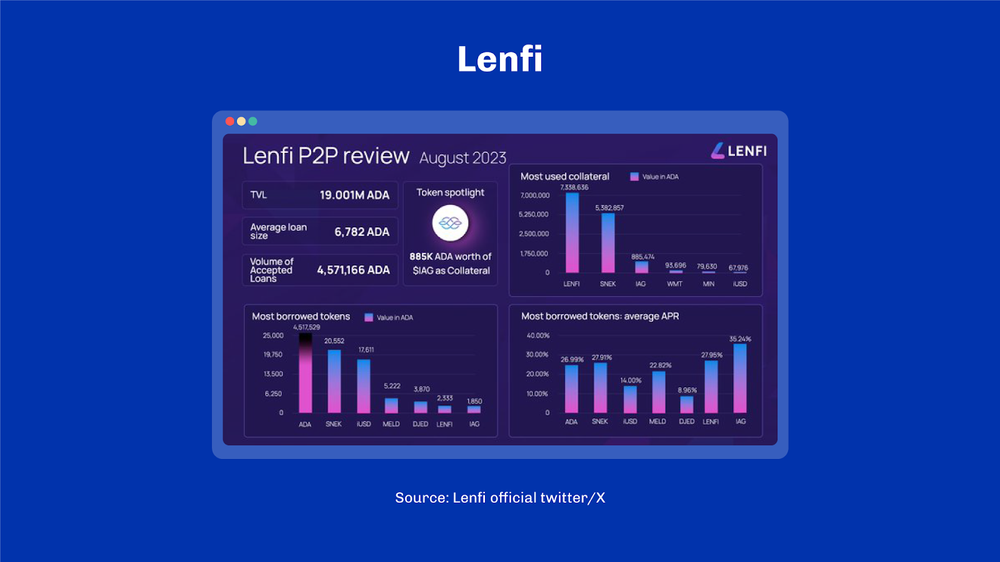

### Stablecoins
**Stablecoins** are cryptocurrencies pegged to an external asset and designed to maintain price stability. These assets are the oil that enables DeFi engines to run smoothly, acting as the base asset for protocols and sent peer-to-peer for instant on-chain payments.
Stablecoins face the risk of depegging if not properly managed. Depegging occurs when a stablecoin deviates from its intended peg.

Centralized stablecoins like Tether (USDT) are cryptocurrencies pegged to fiat currencies like the US Dollar, making them ideal when transacting for normal goods and services.
For many, however, centralized stablecoins are against the whole ethos of crypto. Transparency and accountability are often concerns when a centralized entity controls everything.

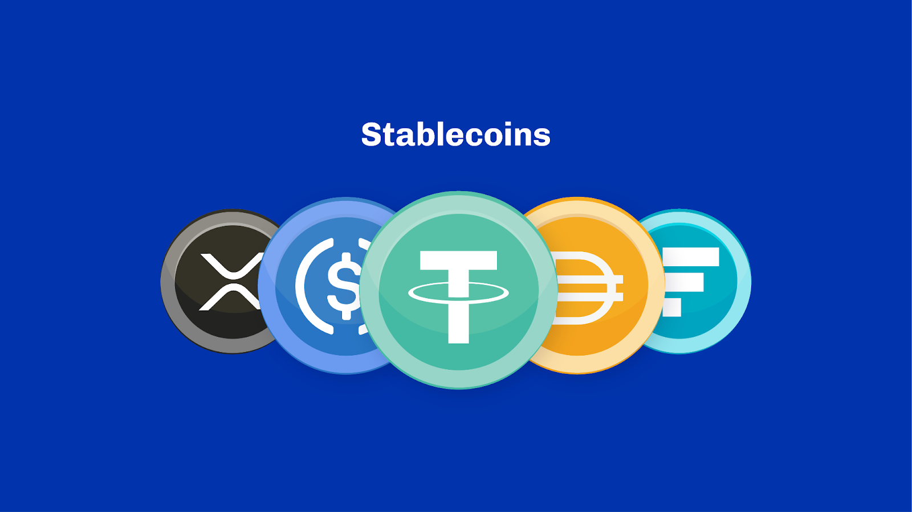

### DJED
**DJED** is the first native stablecoin on Cardano. It’s fully decentralized, transparent, community-governed and pegged to the US dollar. DJED uses an algorithm to ensure 1 DJED equals $1 USD, regardless of how volatile the crypto markets are.

The DJED stablecoin is algorithmically stabilized, leveraging smart contracts to adjust the supply in response to changes in demand. Unlike other stablecoins like Tether (USDT) and USD Coin (USDC), DJED is fully decentralized. There is no single entity pulling the strings, instead governed by the users of the protocol and the wider Cardano community.

While other stablecoins like USDT and BUSD are backed by fiat currency, DJED is backed by ada and its reserve currency Shen. DJED is supported by a smart contract that mints, burns, and exchanges DJED, ada, and Shen to ensure parity.

To visualize how this works, think of a central reserve pool of ada. Through the smart contract, users mint DJED by sending ada to the pool. The amount of DJED minted corresponds to the dollar value of the ada provided. So the DJED price is pegged to $1 using ada to maintain stability. Ada locked in the smart contract increases Cardano’s TVL.

Unlike the ill-fated Terra Luna algorithmic stablecoin, DJED is overcollateralized. This means the reserve pool always has more assets and greater value (400-800%) than the amount of DJED in circulation. So, even if all the DJED in circulation was redeemed for ada at once, the reserve pool and the 1 DJED to 1 dollar peg would hold.

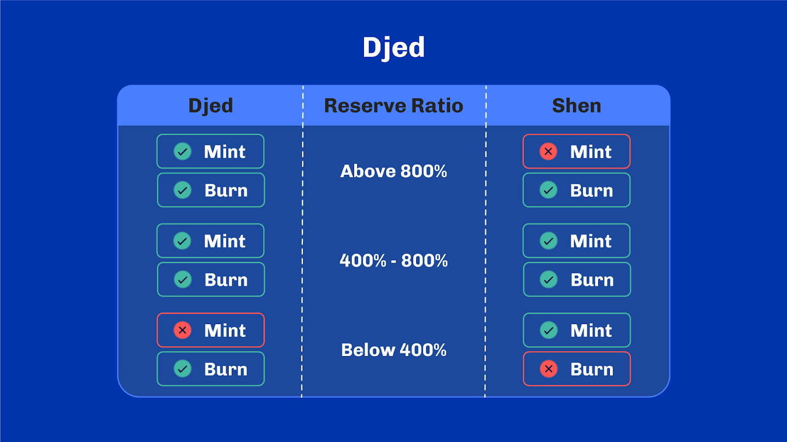

### Shen
**Shen** is the reserve coin of the DJED protocol and is incentivized to make the system overcollateralized. Shen is minted by users providing ada to the reserve pool, and they burn Shen to receive ada. Shen is a tradable asset and will increase in price based on the growth of the DJED protocol.

There are several incentives for holding Shen. Holders receive a cut of protocol fees when DJED or Shen is minted or burned. Shen holders also receive delegation rewards and can stake their tokens in Liquidity farms on Cardano DEXes.

Most blockchains have multiple stablecoins in circulation. Mehen is creating the USDM fiat-backed stablecoin for Cardano. The USDA stablecoin is another fiat-backed stablecoin in the works as part of EMURGO Fintech’s Anzens platform. It will operate by minting or burning USDA coins at a fixed exchange rate of 1 USDA to 1 USD based on user demand, ensuring that each USDA coin is backed by a corresponding US dollar held by a regulated US banking partner.

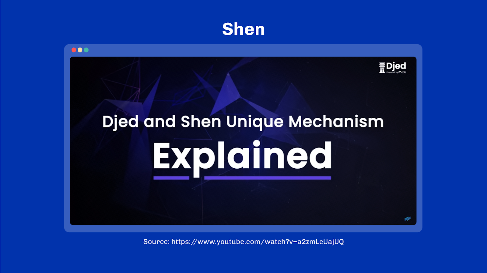

### Wanchain
As the crypto industry as a whole evolves, cross-chain infrastructure solutions like Wanchain bring greater shared liquidity across blockchains. Wanchain is made up of both its own Layer 1 PoS blockchain and a decentralized wide-area network of blockchains.

The **Wanchain** Layer 1 PoS blockchain is compatible with Ethereum but uses a proof-of-stake consensus algorithm called Galaxy Consensus, an extension of Cardano’s Ouroboros. Wanchain’s wide area network of blockchains is a decentralized system of non-custodial cross-chain bridges that interconnect EVM and non-EVM networks. No centralized intermediaries are required.

Wanchain’s bridges connect Cardano with Bitcoin, Ethereum, Avalanche, BNB Chain and Polygon among others. This opens up new trading paths, for example, users can use ada on Ethereum, and stablecoins like USDC and USDT on Cardano.

The Cardano policy id for these assets is:
**25c5de5f5b286073c593edfd77b48abc7a48e5a4f3d4cd9d428ff935**

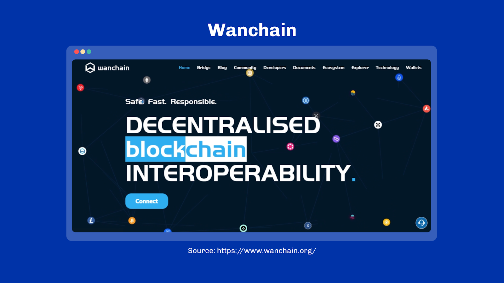

### Indigo Protocol
Indigo Protocol is a powerful Cardano DApp that brings real-world assets on-chain. It’s also a platform that offers decentralized synthetics trading on Cardano. Users can use Indigo to create synthetic assets called iAssets. A synthetic asset is a tokenized derivative that mimics the value of another asset. Synthetic assets give users exposure to a variety of assets without the need to own the underlying asset. This could be gold, silver or traditional stocks.

As we mentioned in the last unit, Cardano supports NFTs as native tokens so anyone can mint NFTs without needing a smart contract. A vibrant ecosystem quickly formed and continues to grow.

### JPG Store
JPG Store is the largest NFT marketplace on Cardano and the beating heart of its NFT culture. JPG Store has delivered several innovations including smart contracts, creator royalties, low fees, solutions for problems like contention along with trading features such as offers and bundles.

As with other prominent NFT marketplaces, users can mint, collect, and trade NFTs with a vast range of digital art and collectibles available for purchase. One of the differentiators for JPG Store is its commitment to supporting artists. The marketplace offers a fair and transparent fee structure, ensuring artists receive a significant chunk of the sales proceeds. This is the focus of CIP 27 - CNFT Community Royalties Standard.

JPG Store has gone through several smart contract upgrades, each coming with improvements to the user experience. The latest upgrade to Jpg Store v3 saw smart contracts rewritten in Aiken and resulted in significant performance improvements, such as buying up to 50 NFTs in one transaction.

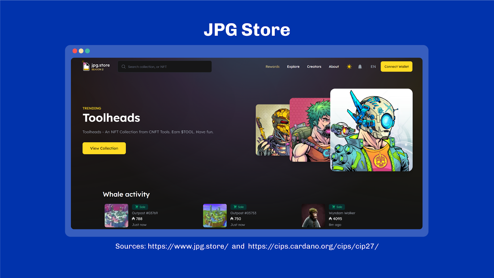

### Book.io
Book.io is an innovative project that invented the concept of a Decentralized Encrypted Asset (DEA) that allows all types of media to live perpetually, protected on the blockchain. This is a breakthrough for blockchain utility. Book.io is building an ebook and audiobook marketplace, mobile reading apps, and a publishing portal for independent authors. They chose Cardano because of their team's expertise in Haskell, as well as the eUTXO accounting model, unit economics, scalability and fanatical community.

Book.io features two distinct technologies;

- The $BOOK Token, the platform’s utility and loyalty token
- The Decentralized Encrypted Asset (DEA), the actual encrypted eBooks or Audiobooks

The Book.io DEAs are unlike previous attempts at storing books on-chain which all had critical drawbacks making them unviable for the publishing industry. Book.io DEAs extend NFT’s capabilities to enable true and verifiable ownership of a fully decentralized and encrypted asset. Book.io believes the path to adoption is not forcing people to master deep technical knowledge of blockchain but to bring blockchain benefits to the masses in the digital products they already buy and consume.

Digital books on book.io integrate encryption principles and DRM (Digital Rights Management) schema to protect the book's intellectual property and uniqueness. All Book.io books are completely encrypted and stored in decentralized storage. DEAs utilize a combination of Web3 tech to produce unique DRM-protected digital assets.

- Blockchains provide immutable and trustless recordkeeping. book.io started on Cardano but is now multi-chain running on Ethereum, Polygon and Algorand.
- Decentralized storage is used to stream content, so there is no single point of failure
- Smart Contracts define the rules regarding book sales, royalties, etc
- NFTs verify ownership and contain instructions to decrypt the asset so only the owner can read or listen to it
- DRM encryption
- Artificial Intelligence is used to produce the book covers, graphics, etc

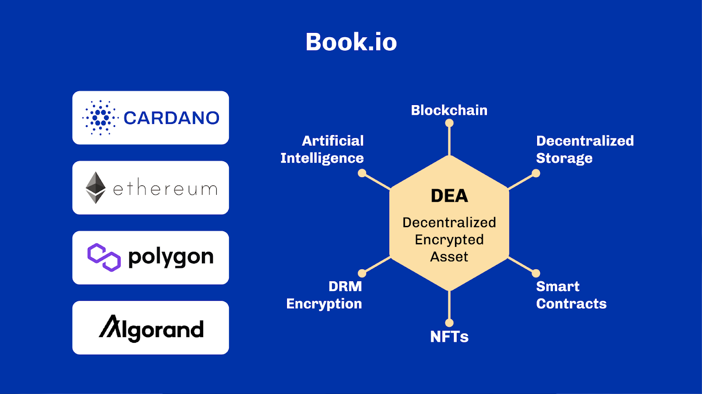

You can read more about book.io in their whitepaper.

### ​​Cornucopias (COPI)
One of the original projects founded on Cardano is Cornucopias. “The Island” is a Play-to-Earn, Build-to-Earn, and Learn-to-Earn platform where players can be rewarded with land, properties, and other NFT-based assets. Cornucopias combines gaming with opportunities for entrepreneurs. Users can earn in different ways:

Play-to-Earn: just by playing games, players can earn crypto
Build-to-Earn: Players can mint their own NFTs and sell them to other players.
Learn-to-Earn:  Cornucopias is partnering with educational centers globally to build learning into the metaverse. Players can earn rewards for learning.
Stake-to-Earn: Users can stake and earn passive income and NFTs.

Blockchain gaming to date has not threatened the lucrative mainstream gaming sector. The graphics, special effects and gaming mechanics have been no match for their Web2 counterparts built on centralized platforms, where game data, assets, and control are owned and managed by a central entity or game developer.

Cornucopias is disrupting this model and is aiming to become the first Triple-A game on Cardano. Cornucopias is built out on the Unreal 5 gaming engine, which is compatible with PC, mobile, and consoles. Some of the highest-quality and best-selling games of all time have been built on Unreal engines.

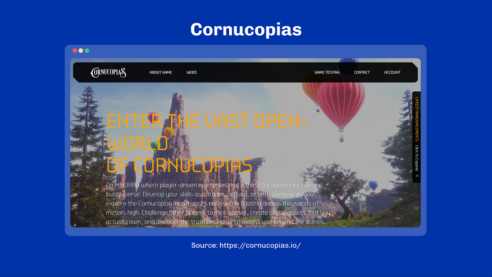

### RealFi
DApps on Cardano are not all about making money through DeFi or playing games. The term “RealFi” stands for “Real Finance” and was originally coined by John O’Connor, IOG’s Director of African Operations. RealFi refers to DApps that have a real-world impact. Let's look at some of the projects from the Cardano RealFi.

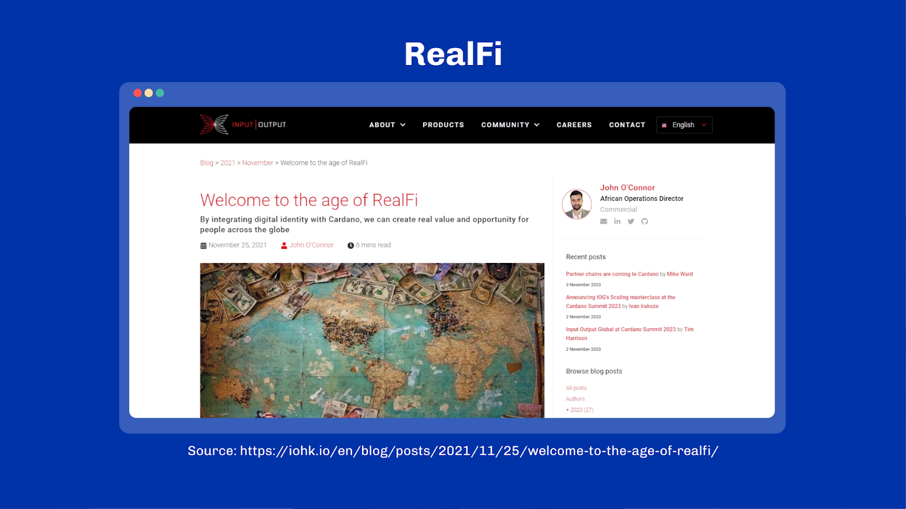

### Empowa
Empowa (EMP) is an example of how blockchain can potentially make the world exponentially a better place. Empowa is a property platform running on Cardano that combines sustainable building, blockchain and decentralized financial inclusion for the underbanked in Africa.

This is an ambitious vision as over 80% of Africans live without a roof over their heads. In target countries, Mozambique and Zimbabwe, only 1 in 50,000 of its residents have a mortgage, with extortionate rates as high as ~30 to 40%%.

Empowa’s utility token (EMP) enables individuals and organizations to participate in its ecosystem. Users can actively engage in initiatives focusing on sustainable projects in Africa while using a common store of value.

Empowa has the potential to unlock affordable, eco-friendly housing and basic banking services for those in dire need. Participants can also buy NFTs from the Empowa NFT range to showcase their contribution to the platform.

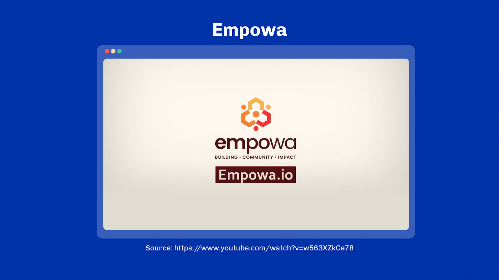

### World Mobile
Lack of internet connectivity is just one of the many challenges that have blocked progress in such regions historically. World Mobile is another project running on Cardano that aims to bring real-world utility to those who need it most.

Nobody living in the first world will be surprised to know mobile phone usage has been booming since the late 1990s. Given that, it’s hard to fathom how half of the world’s population remains unconnected. Most of these four billion people live in impoverished, remote areas.

World Mobile’s mission is to bring internet connectivity and telecom services to underserved and unconnected communities worldwide. Cardano provides many of the tools needed to enable users to connect online without bringing in centralized providers.

The World Mobile whitepaper outlines how the project will address the “key issues in the current business models of existing network operators.” One of these issues is energy consumption, which is financially expensive and environmentally unsustainable. World Mobile aims to be inclusive and accessible offering “a lower power intensive architecture combined with a solar battery solution to significantly reduce these costs”

The website and whitepaper outline the Network Architecture made up of Earth Nodes, Air Nodes, and Aether nodes in greater detail but the key is to make connectivity available to the masses through low-cost mobile devices. The network will be maintained by a community of entrepreneurs who will be incentivized to provide reliable connectivity locally.

The **World Mobile Token (WMT)** is a Cardano native asset used to reward and motivate “the token holders that want to support the operation of the network as well as node operators…” The WMT staking mechanism piggybacks off the Ouroboros protocol.

World Mobile embodies one of Cardano’s core tenets of pushing power to the edges, while simultaneously bringing cascading disruption to the dysfunctional telecoms sector.

The World Mobile project is a long-term effort and remains a work in progress. The unique technical requirements for such a massive undertaking make World Mobile an ideal candidate for a custom sidechain while leveraging the security and SPO network of the Cardano mainnet.

So far, we have taken a whirlwind tour of just some of the DApps built on Cardano. As we draw the course to a close, it’s perhaps fitting to peer onto the horizon and see what the future holds for building DApps on Cardano.

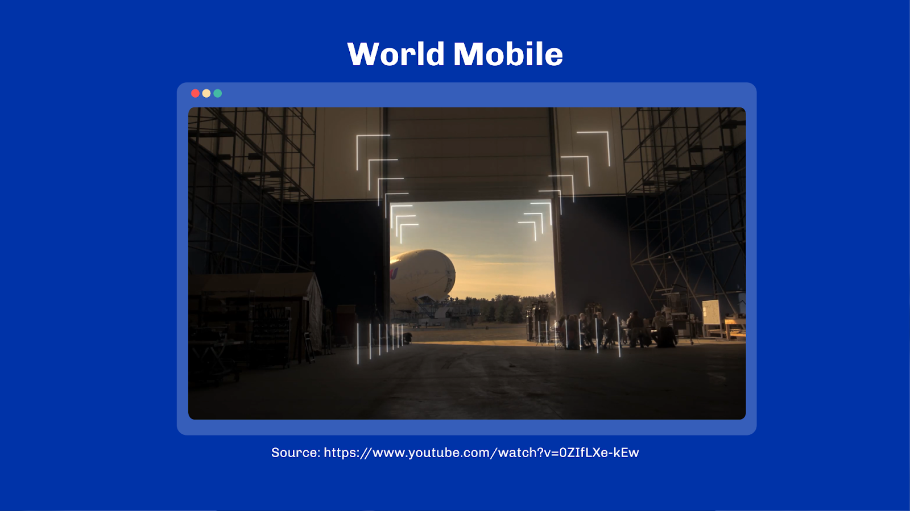

## Future of DApps on Cardano
### Iagon
Many DApps built today are still reliant on Web2 components, but a project called Iagon is looking to break the market stranglehold of centralized cloud providers such as AWS and Azure. Iagon is developing decentralized Cloud services on Cardano. They predict extensive use of the platform by data processing and AI companies initially due to the platform’s lower costs and capabilities.

Iagon is building a marketplace for decentralized storage and computing resources. Storage providers can earn rewards by trading their storage to consumers on a marketplace at a transparent price while ensuring data privacy, security, and accessibility associated with something like AWS S3.

Iagon expects their service will be attractive to all sorts of companies, such as corporations storing important documents, businesses looking to mitigate the risk of data loss in ransomware attacks, or organizations operating in regulatory environments requiring secure control over who accesses content.

The IAG token was launched initially as an ERC token. Due to Ethereum’s well-documented scaling issues, they instead deployed the protocol on Cardano.

Iagon hit a milestone when they hosted and served the first static website on Cardano. This mirrors one of AWS S3’s early use cases, going back decades, when it was also used to host websites. “History never repeats itself, but it does often rhyme.…”

### DApps Enabled by Sidechains and L2 progress
Cardano is also becoming more interoperable with other blockchains as it rolls out its sidechain strategy. The first EVM-compatible sidechain was Milkomeda which extended the ecosystem, enabling teams and businesses from other blockchains the chance to build on Cardano.

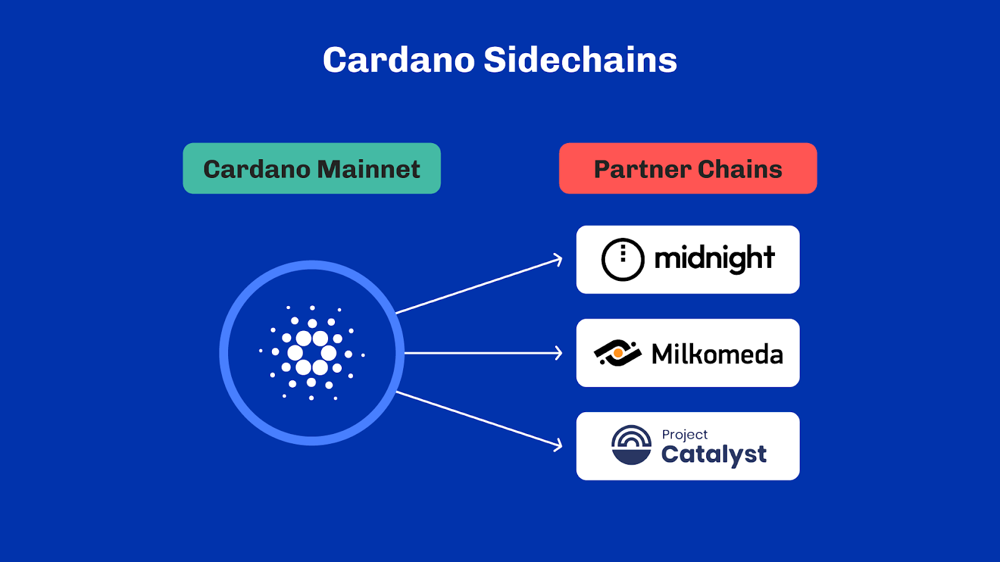

### dcSpark
dcSpark also introduced wrapped smart contracts (WSC), which enable interaction with smart contracts on side chains or Layer 2 (L2) solutions without requiring users to migrate to these new ecosystems. The result is a seamless user experience from your existing Cardano wallet, and the user doesn’t need to know how this is all working underneath the covers.

You can now run solidity smart contracts from your Cardano wallet, with no new token required. This opens up new possibilities like playing games on a partner chain, or trading more freely on a DEX running on another chain.

Prior to the WSC, it was non-trivial to transfer assets between a Layer 1 blockchain like Cardano and a Layer 2 solution like Milkomeda. It typically involved wrapping or bridging assets, using multiple wallets, and several other tedious steps. Partner chain staking rewards are planned for the future, so users can also keep earning their staking rewards when using Milkomeda.

While not everyone is a diehard gamer, the gaming industry is a white-hot competitive space where DApps are very resource-hungry and architectures are constantly refined for efficiency and performance. dcSpark’s innovations for its gaming engine, Paima, can be reused to overcome technical blockers across other use cases and verticals.

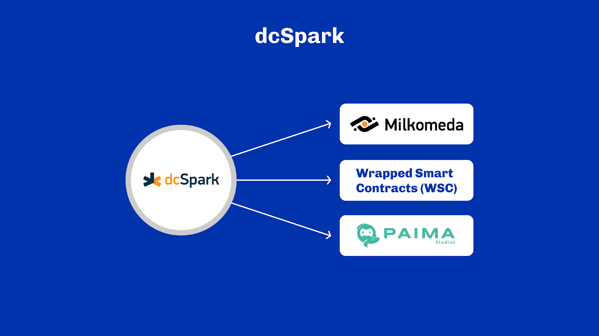

### Zero Knowledge (ZK)
Zero Knowledge (ZK) is a fertile research area with a lot of investment across the space. dcSpark is working on a solution called Zeko. Another ZK project is the Midnight sidechain coming to Cardano. Midnight is a privacy-based blockchain based on zero-knowledge proofs (ZK-Proof). IOG’s goal for Midnight is to find a balance between privacy and transparency, empowering safer and more efficient DApps. Midnight is written in Typescript, which should be attractive to developers building DApps with these new capabilities.

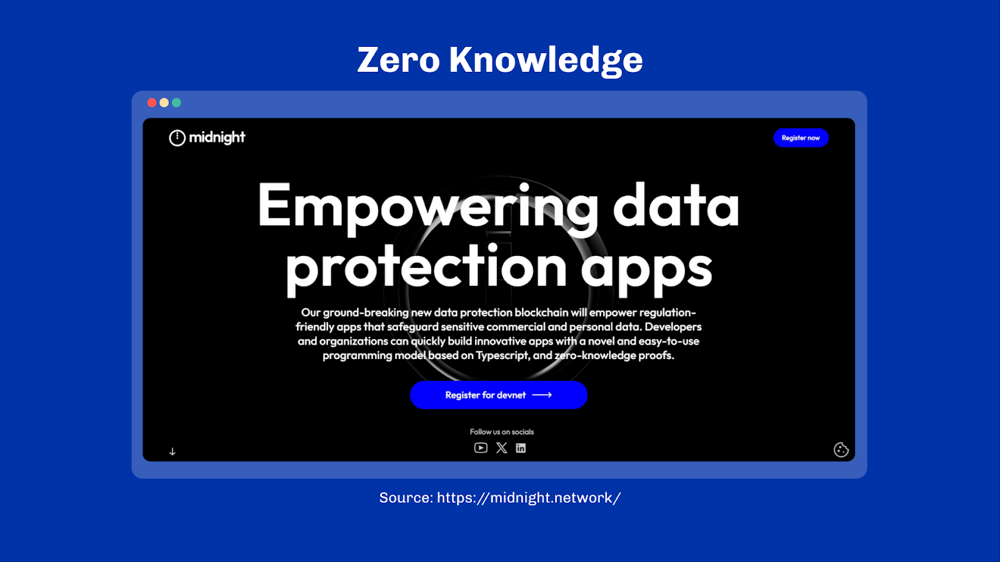

### Programming Options
One of the biggest challenges Cardano has faced to date has been its perceived over-reliance on Haskell. As we mentioned earlier, there are now more options for Web 2.0 developers with a preference for imperative programming languages.

It’s important to understand Cardano’s unique architecture. The cardano-node is written in Haskell, and so is the virtual machine that executes smart contracts on the Cardano blockchain. However, this does not mean that smart contracts themselves are executed in Haskell. In fact, there is a working version of the Cardano virtual machine (Aiken) written in Rust.

The choice of programming language for the Cardano node and its virtual machine does not dictate the programming language that smart contracts must be written in. There are now several options when choosing a programming language for your smart contracts.

For the more technically minded, visit aiken-lang.org for a detailed analysis of the growing ecosystem.

Aiken, in particular, has received positive feedback and many prominent projects are in the process of migrating their codebase. Established projects, such as SudaeSwap, have performed benchmark testing and reported significant performance gains with a smooth development experience. It is still early days for Aiken, but it has already demonstrated its potential to attract a more diverse developer community to the Cardano DApp ecosystem.

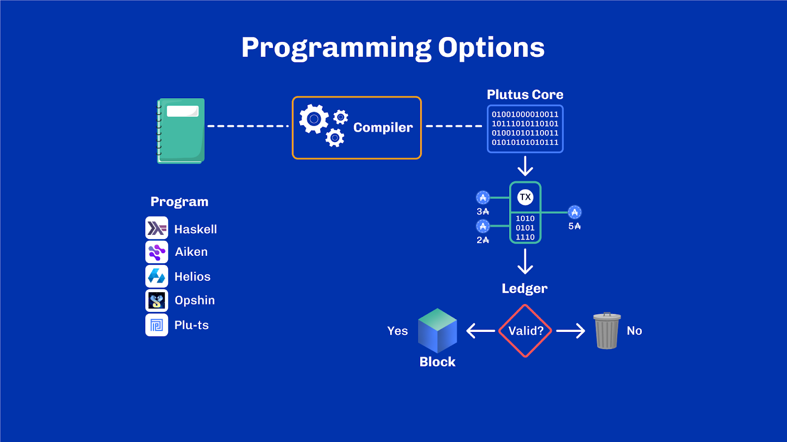

### Security and Standards

### Xerberus
With more programming languages supported, each with varying degrees of expressiveness, security and due diligence will be more important than ever. Xerberus is a ‘watchdog’ service that provides risk ratings and conducts investigative research into projects running on Cardano, among other chains.

The ratings are based on on-chain analytics and transaction patterns. They are currently looking to scale up and provide real-time alerts so they can give advance warning to unsuspecting users, as opposed to conducting post-mortems of fiascos like the Ardana capitulation.

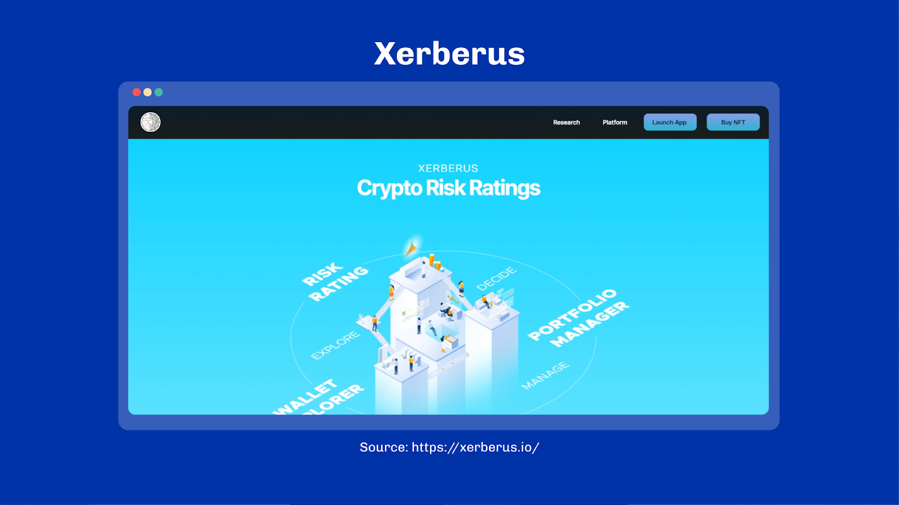

To date, best practices and standards related to DApp development have been driven by several entities such as the UTXO Alliance, the Cardano DeFi Alliance (CDA) and the NFT Guild. Coordination and cooperation between such alliances, the founding entities and services like Xerberus will be pivotal if prospective Members Based Organizations (MBOs) are to be a success in the ‘age of Voltaire’.

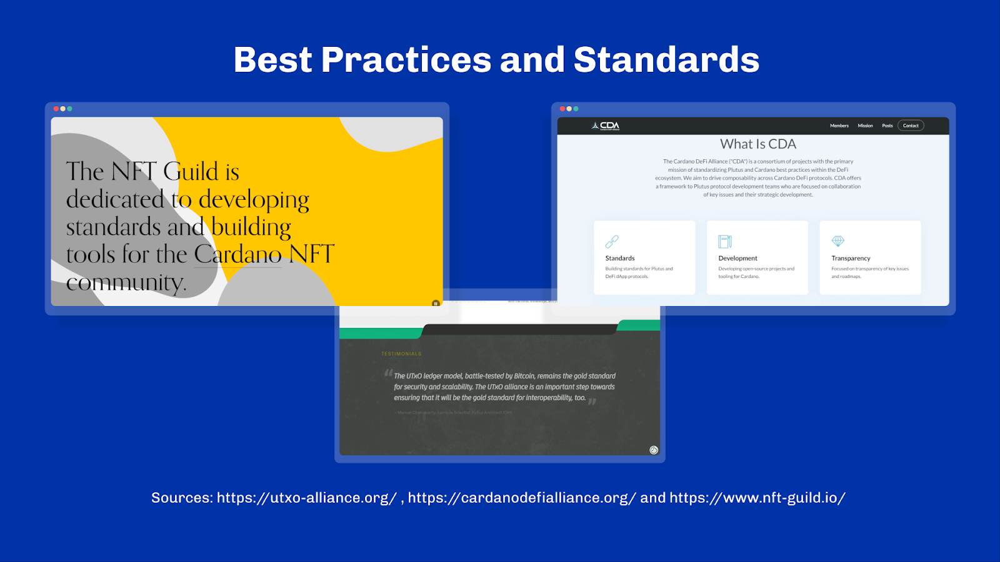

## Review
In this unit, we recapped what a DApp is, and how it is architected differently on Cardano. We reviewed just a small sample of the DApps making up an expansive Cardano ecosystem. We looked at some of the key factors that you should consider when building DApps on Cardano in the future.

And with that, we have reached the end of the course! We hope we have whet your appetite for Cardano and look forward to speaking to you again in future courses on Cardano Academy.

## References
[Ref.4.4.1] CIP 30 - Cardano dApp-Wallet Web Bridge, Available from:  https://cips.cardano.org/cips/cip30/ , Accessed: 18 Sep 2023 
[Ref.4.4.2] Development Updates, IOG Essential Cardano, Available from: https://www.essentialcardano.io/development-update , Accessed: 18 Sep 2023 
[Ref.4.4.3] DefiLlam Caradno TVL, Available from: https://defillama.com/chain/Cardano , Accessed: 18 Sep 2023 
[Ref.4.4.4] Everything you always wanted to know about impermanent loss and were afraid to ask, IOG blog, Available from: https://iohk.io/en/blog/posts/2022/05/27/everything-you-always-wanted-to-know-about-impermanent-loss-and-were-afraid-to-ask/ , Accessed: 18 Sep 2023 
[Ref.4.4.5] FISO frequently asked questions, Available from: https://docs.minswap.org/faq/fiso , Accessed: 18 Sep 2023 
[Ref.4.4.6] Aiken - A Modern Smart Contract Platform for Cardano homepage, Available from: https://aiken-lang.org/ , Accessed: 18 Sep 2023 
[Ref.4.4.7] Aiken: Revolutionizing Smart Contract Development on Cardano, by TapTools, Available from: https://medium.com/tap-in-with-taptools/aiken-revolutionizing-smart-contract-development-on-cardano-eec5899d1a6 , Accessed: 18 Sep 2023 
[Ref.4.4.8] Aiken ecosystem overview, Available from: https://aiken-lang.org/ecosystem-overview , Accessed: 18 Sep 2023 
[Ref.4.4.9] The Life and Death of Ardana, by Xerberus, Available from: https://xerberus.io/blog/the-life-and-death-of-ardana , Accessed: 18 Sep 2023 
[Ref.4.3.10] CIP 27 - CNFT Community Royalties Standard,  Available from: https://cips.cardano.org/cips/cip27/ , Accessed: 18 Sep 2023 

## Glossary

- *Total Value Locked (TVL)*: In DeFi, total value locked (TVL) is the total amount of cryptocurrency locked in a project.
- *Liquidity*: Liquidity refers to the ease with which a digital asset can be traded without having a material effect on price.
- *Liquidity provider (LP)*: A liquidity provider (LP) stakes cryptocurrency in a liquidity pool, usually lending their digital assets to a DEX in return for LP token rewards.
- *Liquidity pools*: Liquidity pools are critical for DEXes as they enable the buying and selling of cryptocurrency. Typically anyone can join a liquidity pool and become a ‘market marker’ by depositing at least two cryptocurrencies into a liquidity pool. As traders buy and sell from these pools, liquidity providers get a cut of the fees as rewards.
- *Initial Stake Pool Offering (ISPO)*: An ISPO (Initial Stake Pool Offering) enables projects building on Cardano to distribute their tokens to stake pool delegators. These tokens usually have some utility or are used in governance processes. Like any native asset on Cardano, they can also be listed and traded on exchanges. ISPOs are used to build a project's following, as SPOs can partner with them to amplify their marketing and awareness drives. ISPOs are also used to fundraise, where a project would typically run its own stake pool with delegators receiving rewards in the project token instead of, or in addition to, normal ada staking rewards.
- *Flash loans*: Flash loans are multi-step transactions where a user takes out an uncollateralized loan and repays the same loan immediately. Flash loans are often used to exploit arbitrage opportunities.
- *Flash swap*: A flash swap is a transaction where traders borrow crypto for a short duration.Flash swaps are attractive to borrowers as they do not require any collateral.
- *Triple-A game*: The term "AAA Games" is a gaming industry classification to rate games as high-budget, high-profile games that are typically produced and distributed by large, well-known publishers.
- *Virtual Machine (VM)*: A computer resource that uses software in place of a physical computer to run programs. Typically, multiple virtual “guest” machines run on a physical “host” machine

## Questions
**Sub-Unit 1**

*Orders on a Cardano DEX can be run ____.*
- on-chain only
- **off-chain (correct answer)**
- on a CEX
- on the moon

*Which of these is NOT a Cardano Wallet? Select all that apply.*
- Nami
- Eternl
- **Metamask (correct answer)**
- Yoroi
- Lace

*Which of the following is closer to the currency exchange model found in traditional markets? Select all that apply.**
- AMM
- DEX
- Hardware wallet
- **An order book model (correct answer)**

*A tokenized derivative that mimics the value of another asset is called a _____ .*
- **Synthetic asset (correct answer)**
- Stablecoin
- NFT
- Digital twin
- None of the above

**Sub-Unit 2**

*Which of the following statements are true regarding Impermanent Loss (IL)?*
- **It is a risk liquidity providers face when depositing their assets into a liquidity pool (CORRECT)**
- If you fall victim to IL, you are required to provide KYC documents
- **It means that you could lose money if the price of the asset changes after you deposit it (CORRECT)**
- The loss is realized immediately and deducted from your balance

*Which of the following are the two main DEX (decentralized exchange) types?*
- **Automated market maker (AMM) (CORRECT)**
- **Order book model (CORRECT)**
- Double-entry book
- Coinbase

*True or False? An Automated market maker (AMM) model enables automatic, permissionless trading of digital assets.*
- **True (CORRECT)**
- False

*True or False: An Order Book model is completely different to the currency exchange model found in traditional markets.*
- True
- **False (CORRECT)**

*What enables Cardano DEXs to be based on the Order Book model?*
- Satoshi’s Vision
- **UTxO-based smart contracts on Cardano (CORRECT)**
- Account-based smart contracts on Cardano
- Marlowe

**Sub-Unit 3**

*Who introduced wrapped smart contracts (WSC) to Cardano?*
- IOG
- **dcSpark  (CORRECT)**
- EMURGO
- Cardano Foundation
